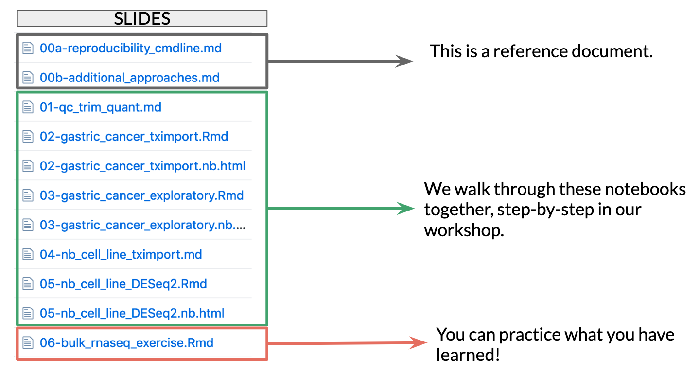

# CCDL Training Modules

This repository is a collection of modules that are combined into 1-5 day workshops on computational topics for the childhood cancer research community.

**If you are a childhood cancer researcher** and are interested attending a workshop go to the [CCDL's website](https://www.ccdatalab.org/projects-training)
to learn more about our upcoming workshop locations and dates.

Here is a sample schedule [for the RNA-seq workshop](https://github.com/AlexsLemonade/RNA-Seq-Exercises/blob/master/schedule.md) if you'd like to see the order in
which this material is presented.
The data files that we process in the course are too large to be stored on GitHub so you will not be able to follow the material *exactly* as written without attending a
workshop.

### Structure of each module:

### Background slides:

The accompanying slides for each module are linked below and briefly introduce
the concepts underlying each module.

- [intro-to-R-tidyverse](https://drive.google.com/a/ccdatalab.org/file/d/11GXEddKwUBan1Z-NF_UM2HecckpODLKM/view?usp=sharing)
- [RNA-seq](https://drive.google.com/a/ccdatalab.org/file/d/1A9gNDIuD_c3ppF2k6vY3b0VgSKZjchzp/view?usp=sharing)
- [scRNA-seq](https://drive.google.com/a/ccdatalab.org/file/d/186niFprBKICNsF53WpIhKbiIMLawu-ms/view?usp=sharing)
- [machine-learning](https://drive.google.com/a/ccdatalab.org/file/d/1tmX8sFDmnPpkRdkWQm-v3vtdGr6YWy-j/view?usp=sharing)

### Cheatsheets:

Cheatsheets for each module are named and linked below.  
Each cheatsheet consists of functions that are used in its corresponding module, along with links to documentation on the usage of these functions. 

These cheatsheets can also be found in the folder named [module-cheatsheets](https://github.com/AlexsLemonade/training-modules/tree/master/module-cheatsheets).

- [intro-to-R-tidyverse-cheatsheet](https://github.com/AlexsLemonade/training-modules/blob/master/module-cheatsheets/intro-to-R-tidyverse-cheatsheet.md)
- [RNA-seq-cheatsheet](https://github.com/AlexsLemonade/training-modules/blob/master/module-cheatsheets/RNA-seq-cheatsheet.md)
- [scRNA-seq-cheatsheet](https://github.com/AlexsLemonade/training-modules/blob/master/module-cheatsheets/scRNA-seq-cheatsheet.md)
- [pathway-analysis-cheatsheet](https://github.com/AlexsLemonade/training-modules/blob/master/module-cheatsheets/pathway-analysis-cheatsheet.md) 
- [machine-learning-cheatsheet](https://github.com/AlexsLemonade/training-modules/blob/master/module-cheatsheets/machine-learning-cheatsheet.md)  

  

            
