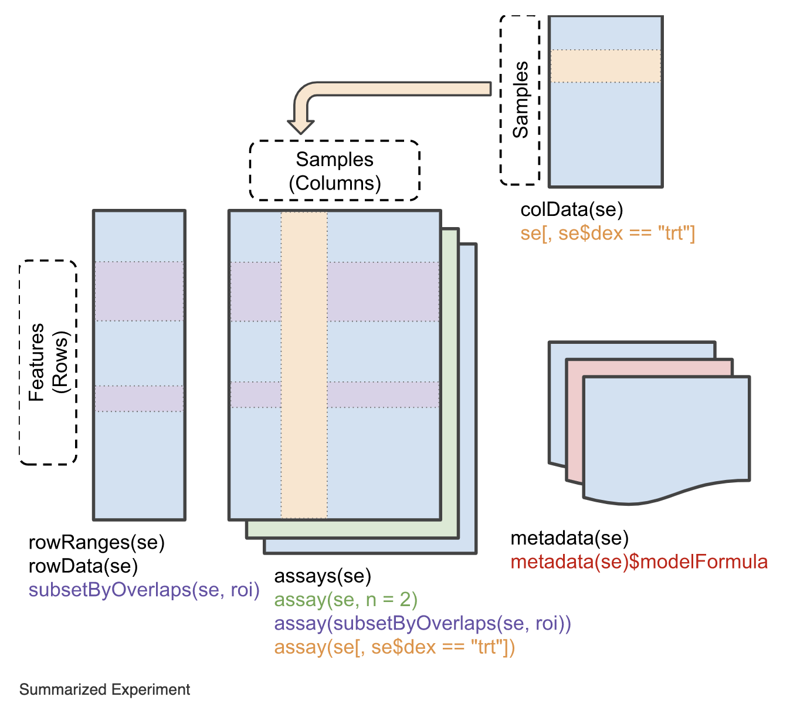

**CCDL 2021**

In this notebook, we'll import the transcript expression quantification output from `salmon quant` using the [`tximeta`](https://bioconductor.org/packages/release/bioc/html/tximeta.html) package but for a species not human or mouse. 

The steps for human and mouse are more straightforward and are covered in `02-gastric_cancer_tximeta-live.Rmd`. 
You will recognize the first few sections involve the same steps, but the main difference is that we need to set up the reference data before running `tximeta()` function. 


For more information about `tximeta`, see [this excellent vignette](https://www.bioconductor.org/packages/devel/bioc/vignettes/tximeta/inst/doc/tximeta.html) from Love _et al_.

## Libraries and functions

```{r library}
# Load magrittr for the pipe
library(magrittr)

# Load the tximeta package
library(tximeta)

# Load the SummarizedExperiment package
library(SummarizedExperiment)
```

## Directories and files

```{r directories}
# Set up file path to the species we are using
index_dir <- file.path("index", "Danio_rerio", "short_index")

# directory where the data are located
data_dir <- file.path("data", "zebrafish-cortisol")

# directory where the quant files are located, each sample is its own
# directory
quant_dir <- file.path(data_dir, "salmon_quant")

# create a directory to hold the tximport results if it doesn't exist yet
txi_dir <- file.path(data_dir, "tximport")
if (!dir.exists(txi_dir)) {
  dir.create(txi_dir, recursive = TRUE)
}
```

We'll need the `quant.sf` files for all the samples in an experiment which we have stored in `quant_dir`. 

```{r input-names}
# the quant files themselves
sf_files <- list.files(quant_dir, recursive = TRUE, full.names = TRUE,
                       pattern = "quant.sf")
```

```{r metadata-file}
# sample metadata file
meta_file <- file.path(data_dir, "zebrafish-cortisol_metadata.tsv")
```

**Output**

```{r output-names}
# Name the output zebrafish-cortisol_tximport.RDS and use the directory created 
# above as the rest of the path
txi_out_file <- file.path(txi_dir, "zebrafish-cortisol_tximeta.RDS")
```

## File names

All output files from `salmon quant` we'll use with `tximeta` are named `quant.sf`.
Unfortunately, this means that the file names themselves do not have any information about the sample they come from!

```{r sf_files}
# Let's look at the full path for the quant.sf files
sf_files
```

Let's extract the _sample_ names from the **file paths** using the `stringr` package.

```{r sample_names}
sample_names <- stringr::word(sf_files, -2, sep = "/")
sample_names
```

## Set up metadata

`tximeta` needs a data frame with at least these two columns: 
- a `files` column  with the file paths to the quant.sf files
- a `names` column with the sample names

```{r names_sf_files}
coldata <- data.frame(files = sf_files, 
                      names = sample_names)
```

We have more information about these samples stored in the metadata file that we will also want stored in `coldata`. 
Let's read in the sample metadata from the TSV file and do a bit of set up. 
We really only want two columns from this metadata file, so we will use a `dplyr::select()` to keep only those. 

```{r sample_meta_df}
# Read in the sample metadata TSV file and have a look
sample_meta_df <- readr::read_tsv(meta_file) %>% 
  # Select the two columns we need here
  dplyr::select(refinebio_accession_code, refinebio_title)

# Take a look at the preview
sample_meta_df
```

We'll want this information to be added to the `coldata`, which we can do by using a join function to match up the rows between the two data frames and combine them. 

```{r join-sample_meta_df}
coldata <- coldata %>%
  dplyr::inner_join(sample_meta_df, by = c("names" = "refinebio_accession_code"))

coldata
```

## Set up reference data for a non-human, non-mouse species 

You can go to Ensembl to see the full list of species: http://ftp.ensembl.org/pub/release-98/fasta/
Click through the file paths to find the file you want to use for annotation. 
Right click on the file and copy its link address
We will store the `base_url` where all the species FASTA files are located and then the second part of the url is species specific. 

```{r}
base_url <- "ftp://ftp.ensembl.org/pub/release-98/fasta/"

fasta_ftp <- c(
  paste0(base_url, "danio_rerio/cdna/Danio_rerio.GRCz11.cdna.all.fa.gz"),
  paste0(base_url, "danio_rerio/ncrna/Danio_rerio.GRCz11.ncrna.fa.gz")
)
```

Now you can follow a similar series of steps to obtain the Gene Transfer File (GTF) using this address: 
http://ftp.ensembl.org/pub/release-103/gtf/

```{r}
base_url <- "ftp://ftp.ensembl.org/pub/release-103/gtf/"

gtf_path <- paste0(base_url, "danio_rerio/Danio_rerio.GRCz11.103.gtf.gz")
```

Create a `linkedTxome` with the links to the fasta files, gtf file, and salmon index specific to our species. 

```{r}
makeLinkedTxome(indexDir = "../../../../../shared/data/reference/refgenie/z11_cdna/salmon_index/short",
                source = "Ensembl",
                organism = "Danio rerio", # Replace this with the species name
                release = "98",
                genome = "GRCz11.103",
                fasta = fasta_ftp,
                gtf = gtf_path,
                write = FALSE)
```

## Import expression data with `tximeta`

Using the `coldata` data frame and the `linkedTxome` we set up, now run the `tximeta()` per usual.

```{r tximeta}
txi_data <- tximeta(coldata)
```

Now the rest of these steps mirror what we did in `02-gastric-cancer_tximeta`. 

## Summarize to gene

We'll summarize to the gene level using the `summarizeToGene()` function.

```{r summarize-gene}
# Summarize to the gene level
gene_summarized <- summarizeToGene(txi_data) 
```



This figure is from this handy vignette about [`SummarizedExperiment` objects](https://www.bioconductor.org/packages/devel/bioc/vignettes/SummarizedExperiment/inst/doc/SummarizedExperiment.html).

## Save to file

Now we can save our `tximeta` to a RDS object. 

```{r write-txi}
# Write `gene_summarized` to RDS object
readr::write_rds(gene_summarized, file = txi_out_file)
```

## Session Info

Record session info for reproducibility & provenance purposes.

```{r sessioninfo}
sessionInfo()
```
