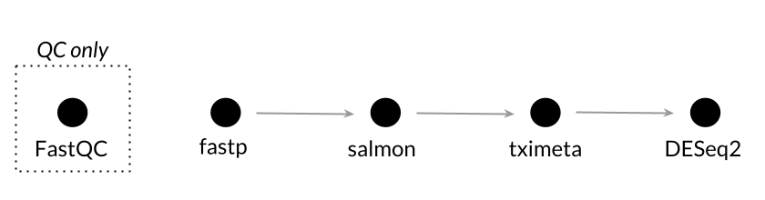
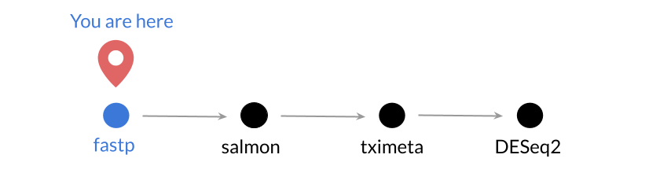
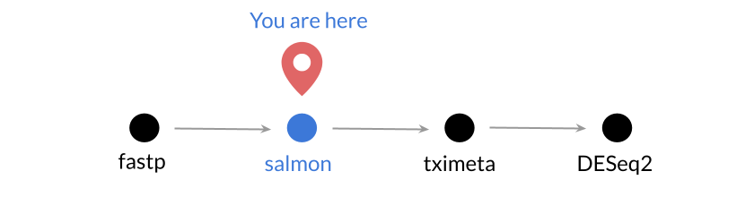

# Introduction to bulk RNA-seq data processing

We will first learn how to process RNA-seq data at the command line using two samples that were assayed with paired-end sequencing.

These samples come from a project ([`PRJNA178120`](https://www.ebi.ac.uk/ena/data/view/PRJNA178120)) that includes 8 samples from normal gastric tissue, gastric cancer cell lines and primary gastric tumor cell cultures.

Here we will perform quality control checks, trimming, and estimate the transcript abundances for a single sample, SRR585570.



**Our objectives:**

* Get comfortable with the command line
* Learn about project organization
* Become familiar with [FastQC](https://www.bioinformatics.babraham.ac.uk/projects/fastqc/), preprocessing with [fastp](https://github.com/OpenGene/fastp) and quantification with [Salmon](https://combine-lab.github.io/salmon/)

Later, we will use the full dataset (n = 8) to explore how to summarize estimates to the gene level and do some exploratory data analyses with data the course directors have processed ahead of time.

---

We'll first want to set our working directory to the top-level of the RNA-seq folder.

Copy and paste the text in the code blocks below into your `Terminal` window in RStudio.
It should be in the lower left hand corner as a tab next to `Console`.

**Set current directory to the top-level of the RNA-seq module:**

```bash
cd ~/training-modules/RNA-seq
```

Here `~/` refers to your _home directory_ on the RStudio Server, which is the base folder in which your files live, including most of the materials for training.
This is also the default working directory when you open a new RStudio session.
A home directory is specific to you as a user on the RStudio Server; each user has their own folder to store their files.

**Because these steps are computationally time intensive, we've prepared a script to start running things.**
Once we start running the script, we will give a short lecture to introduce this module and then walk through and explain each of the individual steps that the script is executing.

**Enter the following in the Terminal to start running the script:**

```bash
./scripts/run_SRR585570.sh
```

_Note: Don't worry if the Salmon step does not complete by the time we move on to the next notebook.
This is a time and resource intensive step, so we have prepared the required output in case we need it._

### Input files

The raw data FASTQ files (`fastq.gz`) for this sample, SRR585570, are in `data/fastq/gastric_cancer/SRR585570`.
The first two directories, `data/fastq`, tell us that these files are data and the type of files (FASTQ). 
The third directory `gastric_cancer` tells us which experiment or dataset these data are from. 
We'll be working with an additional dataset later in the module, so this distinction will become more important.

The use of the `SRR585570` folder might seem unnecessary because we are only processing a single sample here, but keeping files for individual samples in their own folder keeps things organized for multi-sample workflows.
(You can peek ahead and look at the `data/quant/NB_cell_line` folder for such an example.)

There is no "one size fits all" approach for project organization. 
It's most important that it's consistent, easy for you and others to find the files you need quickly, and minimizes the likelihood for errors (e.g., writing over files accidentally).

## 1. Quality control with FastQC


The first thing our script does is use [FastQC](https://www.bioinformatics.babraham.ac.uk/projects/fastqc/) for quality control in command line mode.
Here's a link to the FastQC documentation: https://www.bioinformatics.babraham.ac.uk/projects/fastqc/Help/

**Let's take a look at some example reports from the authors of FastQC:**

* [Good Illumina data example report](https://www.bioinformatics.babraham.ac.uk/projects/fastqc/good_sequence_short_fastqc.html) from FastQC
* [Bad Illumina data example report](https://www.bioinformatics.babraham.ac.uk/projects/fastqc/bad_sequence_fastqc.html) from FastQC

FastQC runs a series of quality checks on sequencing data and provides an HTML report. As the authors point out in the [docs](https://www.bioinformatics.babraham.ac.uk/projects/fastqc/Help/2%20Basic%20Operations/2.2%20Evaluating%20Results.html):

> It is important to stress that although the analysis results appear to give a pass/fail result, these evaluations must be taken in the context of what you expect from your library.

The [documentation for individual modules/analyses](https://www.bioinformatics.babraham.ac.uk/projects/fastqc/Help/3%20Analysis%20Modules/) in FastQC is a great resource!

To save time, our script only runs one FASTQ file for SRR585570 with the following command:

```bash
# In the interest of time, we'll run one of the fastq files through FastQC
fastqc data/fastq/gastric_cancer/SRR585570/SRR585570_1.fastq.gz \
	-o QC/gastric_cancer/fastqc_output
```

#### `-o`

The `-o` flag allows us to specify where the output of FastQC is saved. 
Note that this is saved in a separate place than the raw data files and in a directory specifically for quality control information.

For comparison to the report for `SRR585570_1.fastq.gz` we generate with our script, we've prepared a FastQC report for one of the sets of reads for another sample in the experiment.
It can be found at `QC/gastric_cancer/fastqc_output/SRR585574_1_fastqc.html`.

**Let's look at the reports for both samples.**

## 2. Preprocessing with fastp



We use [fastp](https://github.com/OpenGene/fastp) to preprocess the FASTQ files ([Chen et al. _Bioinformatics._ 2018.](https://doi.org/10.1093/bioinformatics/bty560)). 
Note that fastp has quality control functionality and many different options for preprocessing (see [all options on Github](https://github.com/OpenGene/fastp/blob/master/README.md#all-options)), most of which we will not cover.
Here, we focus on adapter trimming, quality filtering, and length filtering.

Below, we discuss the two commands we used in the script.

### Create a directory

```bash
# Create a directory to hold the JSON and HTML output from Fastp
mkdir QC/gastric_cancer/fastp_output/
```

`mkdir` allows us to create a new folder in the `QC/gastric_cancer/` directory specifically to hold the _report_ information from fastp.
As we'll cover below, fastp essentially has two kinds of output: filtered FASTQ files (data) and reports (quality control).

### fastp

```bash
# Run the adapter and quality trimming step -- also produces QC report
fastp -i data/fastq/gastric_cancer/SRR585570/SRR585570_1.fastq.gz \
	-I data/fastq/gastric_cancer/SRR585570/SRR585570_2.fastq.gz \
	-o data/fastq/gastric_cancer/SRR585570/SRR585570_fastp_1.fastq.gz \
	-O data/fastq/gastric_cancer/SRR585570/SRR585570_fastp_2.fastq.gz \
	--qualified_quality_phred 15 \
	--length_required 20 \
	--report_title "SRR585570" \
	--json QC/gastric_cancer/fastp_output/SRR585570_fastp.json \
	--html QC/gastric_cancer/fastp_output/SRR585570_fastp.html
```

Below, we'll walk through the arguments/options we used to run `fastp`.
By default, fastp performs adapter trimming, which you can read more about [here](https://github.com/OpenGene/fastp#adapters). 
For paired-end data like SRR585570, adapters can be detected automatically without specifying an adapter sequence.

#### Input: `-i` and `-I`

These arguments specify the read1 input and read2 (sometimes called left and right) input, respectively.

#### fastq output: `-o` and `-O`

These arguments specify the read1 output and read2 output, respectively.
Note that the output is being placed in `data/fastq/gastric_cancer/SRR585570/`, so the preprocessed FASTQ files will be in the same place as the FASTQ files that have not been filtered.

#### `--qualified_quality_phred`

[Phred scores](https://en.wikipedia.org/wiki/Phred_quality_score) are the quality information included in a FASTQ file and the values indicate the chances that a base is called incorrectly. Let's look at a screenshot of the Per Base Sequence Quality module from [FastQC bad illumina example](https://www.bioinformatics.babraham.ac.uk/projects/fastqc/bad_sequence_fastqc.html) we linked to above.


Anything below 20, where a phred score of 20 represents a 1 in 100 chance that the call is incorrect, is considered poor quality by FastQC.
Using `--qualified_quality_phred 15` (which is the default), means scores >= 15 are considered "qualified." 
Using the default parameters as we do here, reads will be filtered out if >40% of the bases are unqualified.
You can read more about the **quality filtering** functionality of fastp [here](https://github.com/OpenGene/fastp/blob/master/README.md#quality-filter).

The Salmon documentation notes that, given the way we run `salmon quant`, quantification may be more sensitive to calls that are likely to be erroneous (of low quality) and, therefore, quality trimming may be important.
Trimming, in contrast to filtering, refers to removing low quality base calls from the (typically 3') end of reads.
A recent preprint from the Salmon authors ([Srivastava et al. _bioRxiv._ 2019.](https://doi.org/10.1101/657874)) notes that trimming did not affect mapping rates from random publicly available human bulk (paired-end) RNA-seq samples (they used [TrimGalore](https://github.com/FelixKrueger/TrimGalore)). 
fastp does have [the functionality](https://github.com/OpenGene/fastp#per-read-cutting-by-quality-score) to perform trimming using a sliding window, which must be enabled. 
We are not using it here.

_Note that there are two kinds of encoding for phred scores, phred33 and phred64. 
FastQC guessed that the file for SRR585570 uses Sanger/Illumina 1.9 encoding (phred33). 
If we had phred64 data, we'd use the `--phred64` flag. 
You can read a little bit more about the encoding [here](http://resources.qiagenbioinformatics.com/manuals/clcgenomicsworkbench/700/Quality_scores_in_Illumina_platform.html)._

#### `--length_required`

Trimming reads may result in short reads, which may affect gene expression estimates ([Williams et al. _BMC Bioinformatics._ 2016.](https://doi.org/10.1186/s12859-016-0956-2)).
Using `--length_required 20` means that reads shorter than 20bp will be discarded (similar to what was used in Srivastava et al. above).

#### `--report_title`

When we look at the HTML report, it's helpful to quickly identify what sample the report is for. Using `--report title "SRR585570"` means that the report will be titled "SRR585570" rather than the default ("fastp report").

#### `--json` and `--html`

With these options, we're specifying where the [JSON](https://en.wikipedia.org/wiki/JSON) and HTML reports will be saved (in the `QC/gastric_cancer/fastp_output/` we created) and what the filenames will be. 
Including the sample name in the filenames again may help us with project organization.

**If we look at** `QC/gastric_cancer/fastp_output/SRR585570_fastp.json` **or the top of the HTML report, we can see that fastp reports certain metrics before and after filtering, which can be very useful in making analysis decisions.**

## 3. Quantification with Salmon



We'll use [Salmon](https://combine-lab.github.io/salmon/) for quantifying transcript expression ([documentation](http://salmon.readthedocs.io/en/latest/)).
Salmon ([Patro, et al. _Nature Methods._ 2017.](https://doi.org/10.1038/nmeth.4197)) is fast and requires very little memory, which makes it a great choice for running on your laptop during training.
We can use the output for downstream analyses like differential expression analysis and clustering.
We use Salmon in mapping mode, with mapping validation enabled, using the following command:

```bash
# We perform quantification on the files that have been trimmed
# and use the index generated with -k 23, as this may "improve sensitivity"
# per the Salmon documentation
salmon quant -i index/Homo_sapiens/short_index \
	-l A \
	-1 data/fastq/gastric_cancer/SRR585570/SRR585570_fastp_1.fastq.gz \
	-2 data/fastq/gastric_cancer/SRR585570/SRR585570_fastp_2.fastq.gz \
	-o data/quant/gastric_cancer/SRR585570 \
	--validateMappings --rangeFactorizationBins 4 \
	--gcBias --seqBias \
	--threads 4
```

Below, we'll walk through the arguments/options we used to run `salmon quant`.

#### Transcriptome index: `-i`

Salmon requires a set of transcripts (what we want to quantify) in the form of a transcriptome index built with `salmon index`.
Building an index can take a while (but you only have to do it once!), so we've built the one we use today ahead of time.
Before we use it, we'll take a moment to give a bit of background.

You can see how we obtained this index and others [on GitHub](https://github.com/AlexsLemonade/training-txome-prep).
Note that we used Homo sapiens GRCh38, Ensembl release 95.
It is important to keep track of what build, resource, and files were used and putting our shell scripts on GitHub allows us to do that.  

The `salmon index` command has a parameter `-k` which sets the k-mer length.
The index we used was built with `-k 23` and can be found here:

```
index/Homo_sapiens/short_index
```

Using a smaller value for _k_ than the default (_k_ = 31) is appropriate for shorter reads and may improve sensitivity when using `--validateMappings` according to the [Salmon documentation](https://salmon.readthedocs.io/en/latest/salmon.html#preparing-transcriptome-indices-mapping-based-mode).

#### `-l`

We use `-l A` to allow Salmon to automatically infer the library type based on a subset of reads, but you can also provide the [library type](http://salmon.readthedocs.io/en/latest/salmon.html#what-s-this-libtype) to Salmon with this argument.

#### Input: `-1` and `-2`

These data are paired-end, we use `-1` and `-2` to specify read1 and read2, respectively.

#### `-o`

Output directory, `salmon quant` should create this for us if it doesn't exist yet.

#### `--validateMappings` and `--rangeFactorizationBins`

Using `--validateMappings` enables mapping validation, where Salmon checks its mappings using traditional alignment. 
This helps prevent "spurious mappings" where a read maps to a target but does not arise from it (see [documentation for flag](https://salmon.readthedocs.io/en/latest/salmon.html#validatemappings) and the [release notes for `v0.10.0`](https://github.com/COMBINE-lab/salmon/releases/tag/v0.10.0) where this was introduced).

When enabling mapping validation with `--validateMappings`, setting `--rangeFactorizationBins 4` can improve quantification for certain classes of transcripts ([docs](https://salmon.readthedocs.io/en/latest/salmon.html#rangefactorizationbins)). 

#### `--gcBias`

With this option enabled, Salmon will attempt to correct for fragment GC-bias.
Regions with high or low GC content tend to be underrepresented in sequencing data.

It should be noted that this is only appropriate for use with paired-end reads, as fragment length can not be inferred from single-end reads (see [this Github issue](https://github.com/COMBINE-lab/salmon/issues/83)).

#### `--seqBias`

With this option enabled, Salmon will attempt to correct for the bias that occurs when using random hexamer priming (preferential sequencing of reads when certain motifs appear at the beginning).

#### `--threads` 

The `--threads` argument controls the number of threads that are available to Salmon during quantification.
This in essence controls how much of the mapping can occur in parallel.
If you had access to a computer with many cores, you could increase the number of threads to make quantification go faster.

**Navigate to** `data/quant/gastric_cancer/SRR585571/aux_info` **and open** `meta_info.json`**.
Look for a field called** `percent_mapped` **-- what value does this sample have?**
