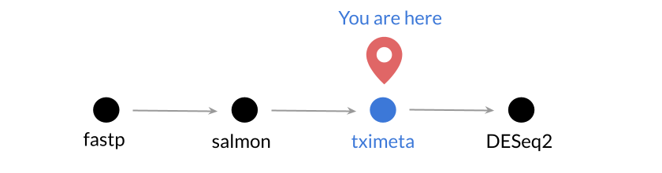
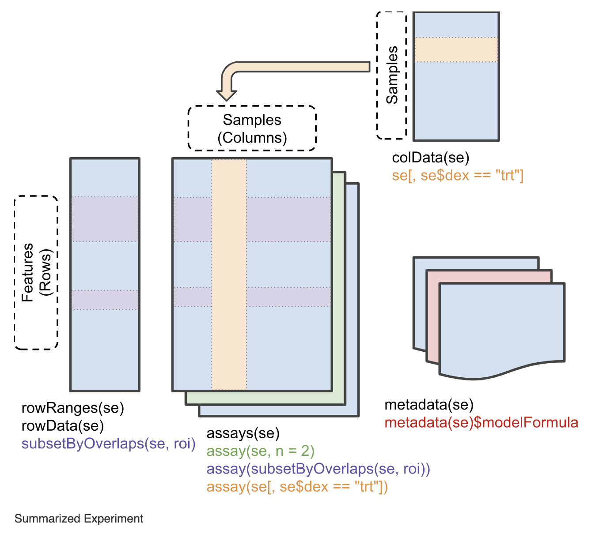

## Objectives

This notebook will demonstrate how to:

- Import RNA-seq expression quantification output using `tximeta`
- Summarize transcript-level expression to the gene level
- Interrogate and extract data from a `SummarizedExperiment` object

---

In this notebook, we'll import the transcript expression quantification output from `salmon quant` using the [`tximeta`](https://bioconductor.org/packages/release/bioc/html/tximeta.html) package.
`tximeta` is in part a wrapper around another package, [`tximport`](https://bioconductor.org/packages/release/bioc/html/tximport.html), which imports transcript expression data and summarizes it to the gene level.
Working at the gene rather than transcript level has a number of potential advantages for interpretability, efficiency, and reduction of false positives ([Soneson _et al._ 2016](https://doi.org/10.12688/f1000research.7563.2)).
`tximeta` eases some of the burden of import by automatically identifying the correct set of annotation data to append to many data sets ([Love _et al._ 2020](https://journals.plos.org/ploscompbiol/article?id=10.1371/journal.pcbi.1007664)).



For more information about `tximeta`, see [this excellent vignette](https://www.bioconductor.org/packages/devel/bioc/vignettes/tximeta/inst/doc/tximeta.html) from Love _et al_.

## Libraries and functions

```{r library}
# Load the tximeta package
library(tximeta)

# Load the SummarizedExperiment package
library(SummarizedExperiment)
```

## Directories and files

```{r directories, live = TRUE}
# directory where the data are located
data_dir <- file.path("data", "gastric-cancer")

# directory where the quant files are located, each sample is its own
# directory
quant_dir <- file.path(data_dir, "salmon_quant")

# create a directory to hold the tximeta results if it doesn't exist yet
txi_dir <- file.path(data_dir, "txi")
fs::dir_create(txi_dir)
```

We'll need the `quant.sf` files for all the samples in an experiment which we have stored in `quant_dir`.

```{r input-names}
# the quant files themselves
sf_files <- list.files(
  quant_dir, 
  recursive = TRUE, 
  full.names = TRUE,
  pattern = "quant.sf"
)
```

```{r metadata-file}
# sample metadata file
meta_file <- file.path(data_dir, "gastric-cancer_metadata.tsv")
```

**Output**

```{r output-names, live = TRUE}
# Name the output gastric-cancer_tximeta.rds and use the directory created
# above as the rest of the path
txi_out_file <- file.path(txi_dir, "gastric-cancer_tximeta.rds")
```

## File names

All output files from `salmon quant` we'll use with `tximeta` are named `quant.sf`.
Unfortunately, this means that the file names themselves do not have any information about the sample they come from!

```{r sf_files, live = TRUE}
# Let's look at the full path for the quant.sf files
sf_files
```

Let's extract the _sample_ names from the **file paths** using the `stringr` package.

Notice how the file path is separated by `/`.
If we were to split up this character string by `/`, the second to last item is the sample names (because we used them as directory names for the `salmon` output).
This is exactly what `stringr::word()` allows us to do: split up the file paths by `/` and extract the sample names.

```{r sample_names}
sample_names <- stringr::word(sf_files, -2, sep = "/")
sample_names
```

## Set up metadata

`tximeta` needs a data frame with at least these two columns:
- a `files` column  with the file paths to the quant.sf files
- a `names` column with the sample names

```{r names_sf_files}
coldata <- data.frame(
  files = sf_files,
  names = sample_names
)
```

We have more information about these samples stored in the metadata file that we will also want stored in `coldata`.
Let's read in the sample metadata from the TSV file.

```{r sample_meta_df, live = TRUE}
# Read in the sample metadata TSV file and have a look
sample_meta_df <- readr::read_tsv(meta_file)
sample_meta_df
```

We'll want this information to be added to the `coldata`, which we can do by using a join function to match up the rows between the two data frames and combine them to create a new data frame `coldata_joined`.

```{r join-sample_meta_df}
coldata_joined <- coldata |>
  dplyr::inner_join(sample_meta_df, by = c("names" = "srr_accession"))

coldata_joined
```

## Import expression data with `tximeta`

Using the `coldata_joined` data frame that we set up, we can now run the `tximeta()` to import our expression data while automatically finding and associating the transcript annotations that were used when we performed the quantification.

The first time you run `tximeta()` you may get a message about storing downloaded transcriptome data in a cache directory so that it can retrieve the data more quickly the next time.
We recommend you use the cache, and accept the default location.

```{r tximeta, live = TRUE}
txi_data <- tximeta(coldata_joined)
```

*tximeta currently works easily for most human and mouse datasets, but requires a [few more steps for other species](https://bioconductor.org/packages/release/bioc/vignettes/tximeta/inst/doc/tximeta.html#What_if_checksum_isn%E2%80%99t_known).

## Summarize to gene

We'll summarize to the gene level using the `summarizeToGene()` function.

```{r summarize-gene}
# Summarize to the gene level
gene_summarized <- summarizeToGene(txi_data)
```

We can use the `class` function to see what type of object `gene_summarized` is.

```{r class, live = TRUE}
# Check what type of object `gene_summarized` is
class(gene_summarized)
```

This tells us that `gene_summarized` is an object called a [`SummarizedExperiment`](https://www.rdocumentation.org/packages/SummarizedExperiment/versions/1.2.3/topics/SummarizedExperiment-class) which can be handled by functions from the package of the same name.
We more specifically have a `RangedSummarizedExperiment` which is a more specific type of `SummarizedExperiment`.

`SummarizedExperiment` objects have this general structure:



This figure is from this handy vignette about [`SummarizedExperiment` objects](https://www.bioconductor.org/packages/devel/bioc/vignettes/SummarizedExperiment/inst/doc/SummarizedExperiment.html).

As shown in the diagram, we can use some of the functions provided by the `SummarizedExperiment` package to extract data from our `gene_summarized` object.
For example, calling `rowData()` on our object shows all the gene information that `tximeta` set up!

```{r}
# rowData() shows us our gene annotation
rowData(gene_summarized)
```

The `assay` slot in `SummarizedExperiment`s holds data from the experiment.
In this case, it will include our gene-level expression information stored as a gene x sample matrix.

Multiple `assays` can be stored in an `SummarizedExperiment` and we can use the `assayNames()` function to see what assays are included in `gene_summarized`.

```{r assay-names, live = TRUE}
assayNames(gene_summarized)
```

If we want to extract an `assay`'s data, we can use `assay()` function and specify the name of the assay we want to extract.

```{r assay-counts, live = TRUE}
counts_mat <- assay(gene_summarized, "counts")
```

We can use the `class` function to see what type of object the `assay()` function returns.

```{r class-counts, live = TRUE}
# Check what type of object `counts_mat` is
class(counts_mat)
```

Alternatively, we could extract the TPM data -- called `abundance` from `gene_summarized`.

```{r assay-abundance, live = TRUE}
# Let's look at the first few rows of the gene-level TPM
head(assay(gene_summarized, "abundance"))
```

## Save to file

We could use `readr::write_tsv` to save `counts_mat` only but `gene_summarized` has a lot of information stored here beyond the counts, so we may want to save all of this to a RDS object.

```{r write-txi, live = TRUE}
# Write `gene_summarized` to RDS object
readr::write_rds(gene_summarized, file = txi_out_file)
```

We'll import this with the `DESeq2` package in the next notebook.

## Session Info

Record session info for reproducibility & provenance purposes.

```{r sessioninfo}
sessionInfo()
```
