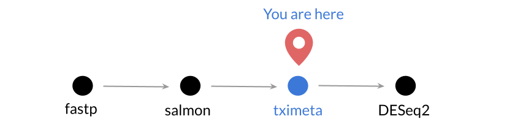

**CCDL 2018**

In this notebook, we'll import transcript level output from `salmon quant` and
summarize it to the gene level using [`tximport`](https://bioconductor.org/packages/release/bioc/html/tximport.html).



For more information about `tximport`, see [this excellent vignette](https://bioconductor.org/packages/release/bioc/vignettes/tximport/inst/doc/tximport.html) from Love, Soneson, and Robinson.

We'll need the `quant.sf` files for all the samples in an experiment and a file
that maps between Ensembl transcript ids and Ensembl gene ids.
In refine.bio, we generate these along side the transcriptome indices for an
organism.

## Libraries and functions

```{r}
library(tximport)
```

## Directories and files

```{r}
# directory where the quant files are located, each sample is its own
# directory
quant_dir <- file.path("data", "quant", "gastric_cancer")
# tximport directory
txi_dir <- file.path("data", "tximport", "gastric_cancer")
if (!dir.exists(txi_dir)) {
  dir.create(txi_dir, recursive = TRUE)
}
# the quant files themselves
sf_files <- list.files(quant_dir, recursive = TRUE, full.names = TRUE,
                       pattern = "quant.sf")
# file that contains the gene to transcript mapping from refine.bio
tx2gene_file <- file.path("index", "Homo_sapiens",
                          "Homo_sapiens.GRCh38.95_tx2gene.tsv")
```

**Output**

```{r}
txi_out_file <- file.path(txi_dir, "gastric_cancer_tximport.RDS")
```

### Naming

```{r}
sf_files
```

Let's extract the _sample_ names from the file paths using the `stringr` 
package.

```{r}
sample_names <- stringr::word(sf_files, 4, sep = "/")
sample_names
```

We'll add these names to the file paths vector, that way they are reflected in
what we do next with `tximport`.

```{r}
names(sf_files) <- sample_names
```

## tximport

### Read in tx to gene mapping

```{r}
tx2gene_df <- readr::read_tsv(tx2gene_file)
```

Let's take a look at the top of this file with `head`.

```{r}
head(tx2gene_df)
```

### tximport main function

We'll summarize to the gene level.
Notice that `tx2gene_df` uses identifiers that don't include [Ensembl version information](https://useast.ensembl.org/Help/Faq?id=488).
Version numbers follow a period (`.`) at the end of the identifier. 
For example, the second version of a human Ensembl transcript ID follows this pattern: `ENSTXXXXXXXXXX.2`.

We need to use the `ignoreTxVersion = TRUE` argument to `tximport` here or else we'll get an error.

```{r}
txi <- tximport::tximport(sf_files, type = "salmon", tx2gene = tx2gene_df,
                          countsFromAbundance = "no", ignoreTxVersion = TRUE)
```

Let's look at the structure of `txi`.

```{r}
str(txi)
```

Now, here's a breakdown of the `txi` object.


Save to file -- we'll import this with the `DESeq2` package.

```{r}
readr::write_rds(txi, path = txi_out_file)
```

## Session Info

Record session info for reproducibility & provenence purposes.

```{r}
sessionInfo()
```