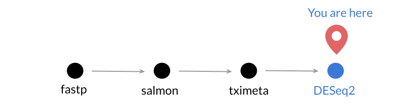

**CCDL 2021**

In this notebook, we'll perform an analysis to identify the genes that are differentially expressed in _MYCN_ amplified vs. nonamplified neuroblastoma cell lines. 

These RNA-seq data are from [Harenza, _et al._ (2017)](https://doi.org/10.1038/sdata.2017.33).

More information about DESeq2 can be found in the [excellent vignette](https://bioconductor.org/packages/release/bioc/vignettes/DESeq2/inst/doc/DESeq2.html) from Love, Anders, and Huber from which this is adapted (see also: [Love, _et al._ (2014)](https://doi.org/10.1186/s13059-014-0550-8)).

DESeq2 takes unnormalized counts or estimated counts and does the following:

* [Estimates size factors](https://www.rdocumentation.org/packages/DESeq2/versions/1.12.3/topics/estimateSizeFactors)
* [Estimates dispersion](https://www.rdocumentation.org/packages/DESeq2/versions/1.12.3/topics/estimateDispersions) 
* Negative binomial generalized linear model fitting and [Wald statistics](https://www.rdocumentation.org/packages/DESeq2/versions/1.12.3/topics/nbinomWaldTest)



## Libraries and functions

```{r library}
# magrittr pipe
library(magrittr)

# Load the DESeq2 library
library(DESeq2)

# We will be making fancy volcano plots
library(EnhancedVolcano)
```

## Directories and files

```{r input-files}
# directory with the tximeta processed data
txi_dir <- file.path("data", "NB-cell", "txi")
txi_file <- file.path(txi_dir, "NB-cell_tximeta.RDS")
```

We'll create a results directory to hold our results.

```{r results-dir}
# Create a results directory if it doesn't already exist
results_dir <- file.path("results", "NB-cell")
if (!dir.exists(results_dir)) {
  dir.create(results_dir, recursive = TRUE)
}
```

```{r plots-dir, live = TRUE}
# Create a plots directory if it doesn't already exist
plots_dir <- file.path("plots", "NB-cell")
if (!dir.exists(plots_dir)) {
  dir.create(plots_dir, recursive = TRUE)
}
```

```{r meta-files}
# sample metadata path and  file
data_dir <- file.path("data", "NB-cell")
```

**Output**

```{r output-files}
# RDS for the output of DESeq analysis
deseq_file <- file.path(results_dir, 
                        "NB-cell_DESeq_amplified_v_nonamplified.RDS")

# DESeq2 results data.frame
deseq_df_file <- 
  file.path(results_dir,
            "NB-cell_DESeq_amplified_v_nonamplified_results.tsv")

# PNG of the volcano plot
volcano_file <- file.path(plots_dir, "NB-cell_volcano.png")
```

## DESeq2

### Creating a DESeq2 dataset from tximeta object

First, let's read in the data we processed with `tximeta`.

#### Preparation

```{r read-rds, live = TRUE}
# Read in the RDS file we created in the last notebook
gene_summarized <- readr::read_rds(txi_file)
```

We're most interested in _MYCN_ amplification, which we had stored in the `status` column of the sample metadata of `gene_summarized`.
While the sample metadata is stored internally in the `colData` slot, the `SummarizedExperiment` object makes it easy for us to access it as if it were just a column of a data frame, using the familiar `$` syntax.


```{r Status, live = TRUE}
gene_summarized$status
```

This is stored as a `character` type, but to give a bit more information to `DESeq`, we will convert this to a `factor`.

```{r status_factor, live = TRUE}
gene_summarized$status <- as.factor(gene_summarized$status)
```

We'll want to use the "Nonamplified" samples as our _reference_.
Let's look at the `levels` of `status`.

```{r levels}
levels(gene_summarized$status)
```

We can see that these are in alphabetical order, so "Amplified" samples would be the reference. 
We can use the `relevel` function to remedy this.

```{r relevel}
gene_summarized$status <- relevel(gene_summarized$status, ref = "Nonamplified")
```

```{r check-levels, live = TRUE}
# Check what the levels are now
levels(gene_summarized$status)
```


#### DESeq Dataset creation

```{r ddset, live = TRUE}
# Create a DESeq2 dataset from gene_summarized 
# remember that `status` is the variable of interest here
ddset <- DESeqDataSet(gene_summarized,
                      design = ~ status)
```

### Differential expression

#### Filtering low-expressed genes

Genes that have very low counts are not likely be differentially expressed, so we should do some [pre-filtering](http://bioconductor.org/packages/devel/bioc/vignettes/DESeq2/inst/doc/DESeq2.html#pre-filtering). 
We will keep only genes with total counts of at least 10 across all samples.

```{r rowSums}
genes_to_keep <- which(rowSums(counts(ddset)) >= 10)
ddset <- ddset[genes_to_keep, ]
```


#### Differential expression analysis

We'll now use the wrapper function `DESeq` to do our differential expression analysis.

```{r DESeq}
deseq_object <- DESeq(ddset)
```

Let's save this to our results file.

```{r write_rds, live = TRUE}
# Save the results as an RDS
readr::write_rds(deseq_object, file = deseq_file)
```

Let's take a look at the results table.

```{r deseq_results}
deseq_results <- results(deseq_object)
deseq_results
```

```{r arrange-deseq_results}
# this is of class DESeqResults -- we want a data frame
deseq_df <- deseq_results %>%
  # convert to a data frame
  as.data.frame() %>%
  # the gene names are rownames -- let's them a column for easy display
  tibble::rownames_to_column(var = "Gene")

deseq_df %>%
  # sort by statistic -- the highest values should be genes more expressed
  # in the MYCN amplified cell lines
  dplyr::arrange(dplyr::desc(stat))
```

Let's take a look at what the top gene is: [`ENSG00000134323`](http://useast.ensembl.org/Homo_sapiens/Gene/Summary?db=core;g=ENSG00000134323)

How many genes were differentially expressed (FDR < 0.05)?

```{r results_summary}
summary(deseq_results, alpha = 0.05)
```


#### Shrinking log2 fold change estimates

The estimates of log2 fold change calculated by `DESeq()` are not corrected for expression level.
This means that when counts are small, we are likely to end up with large fold change values that overestimate the true extent of the change between conditions.

We can correct this by applying a "shrinkage" procedure, which will adjust large values with small counts downward, while preserving values where we have larger counts, which are likely to be more accurate.


To do this, we will use the `lfcShrink()` function, but first we need to know the name of the "coefficient" that were calculated by `DESeq()`, which we can do with the `resultsNames()` function

```{r deseq_coef}
# get the deseq coefficient names:
resultsNames(deseq_object)
```


```{r lfc_shrink}
# calculate shrunken log2 fold change estimates
deseq_shrunken <- lfcShrink(deseq_object,
                            # the lfc coefficient we want to shrink
                            coef = 2, 
                            type = "ashr"
                            )
```

Let's compare the results from the two results tables:

First we will combine the results into a new data frame.
```{r compare_shrink}
comparison_df <- data.frame(
  lfc_original = deseq_results$log2FoldChange,
  lfc_shrunken = deseq_shrunken$log2FoldChange,
  padj_original = deseq_results$padj,
  padj_shrunken = deseq_shrunken$padj,
  total_count = rowSums(counts(deseq_object))
  )
```

Now we can plot the original and shrunken values to see what happened.

```{r}
ggplot(comparison_df, aes(x = lfc_original, y = lfc_shrunken, color = padj_original)) +
  geom_point(alpha = 0.1) 
```

```{r}
ggplot(comparison_df, aes(x = lfc_original, y = lfc_shrunken_ashr)) +
  geom_point(alpha = 0.1) 
```


**Write full data.frame to file**

```{r write_tsv}
readr::write_tsv(deseq_df, file = deseq_df_file)
```

#### Visualize differentially expressed genes with a heatmap

Let's get an overall picture of our results using a heatmap. 
Before we can do this, we will need to transform our data so that when we make the heatmap the genes are on a more similar scale and the heatmap is interpretable. 
We will use variance stabilizing transformation from DESeq2 to do this.
Refer to the help page or the DESeq2 docs for more information. 

```{r vst, live = TRUE}
# Use the vst function to transform the data
vst_data <- vst(ddset)
```

We need to extract the normalized gene matrix from the `vst_data` object. 

```{r vst-assay}
vst_data <- assay(vst_data)
```

We will make a heatmap of only the significant genes, so let's obtain the gene IDs that have an adjusted p-value less than 0.05.

```{r signif_genes, live = TRUE}
# Filter to padj < 0.05 and then only extract the Genes
signif_genes <- deseq_df %>%
  dplyr::filter(padj < 0.05) %>%
  dplyr::pull(Gene)
```

Now we will use `signif_genes` to filter `vst_data` to only have significant genes' data. 

```{r signif_vst_data}
signif_vst_data <- vst_data %>%
  as.data.frame() %>%
  dplyr::filter(rownames(vst_data) %in% signif_genes)
```

Let's make the results into a heatmap using the `pheatmap` package. 
We will use the `scale = "row"` argument so that the data is standardized by gene (i.e., will be made into [z-scores](https://www.statisticshowto.datasciencecentral.com/probability-and-statistics/z-score/)). 
Standardizing the data by gene makes it so our heatmap is more easily interpretable despite how different genes' distributions may be. 

```{r pheatmap}
pheatmap::pheatmap(signif_vst_data, 
                   show_rownames = FALSE,
                   scale = "row",
                   colorRampPalette(c("deepskyblue",
                                      "black",
                                      "yellow"))(25))
```

If we want to save this heatmap as a PNG, we have to use the `png` function that is part of base R, run `pheatmap::pheatmap` again, and then use `dev.off()`.

```{r png, live = TRUE}
png(filename = heatmap_file)
# Use the same command to create the heatmap
pheatmap::pheatmap(signif_vst_data, 
                   show_rownames = FALSE,
                   scale = "row",
                   colorRampPalette(c("deepskyblue",
                                      "black",
                                      "yellow"))(25))
# This shuts down the current graphics device (the PNG we are saving)
dev.off()
```

We can specify the dimensions and resolution of the PNG that is saved by supplying different arguments to the `png` function.

```{r png-adjust}
png(filename = heatmap_file, 
    width = 7, 
    height = 7, 
    units = "in", 
    res = 300)
# Heatmap time!
pheatmap::pheatmap(signif_vst_data, 
                   show_rownames = FALSE,
                   scale = "row",
                   colorRampPalette(c("deepskyblue",
                                      "black",
                                      "yellow"))(25))
# Shut down the current graphics device
dev.off()
```

## Session Info

Record session info for reproducibility & provenance purposes.

```{r sessioninfo}
sessionInfo()
```
