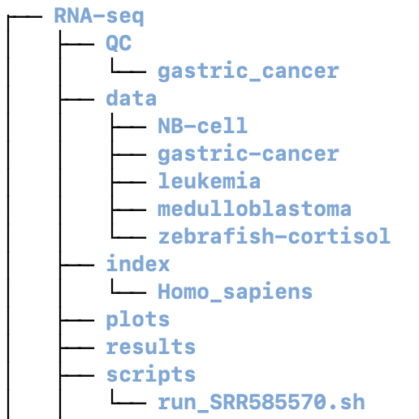

# RNA-Seq Training Module

This CCDL-designed module covers the analysis of RNA-seq data using Salmon.
It is designed to be taught in approximately 3.5 hours.
It depends on knowledge gained in the [intro to R](https://github.com/AlexsLemonade/training-modules/tree/master/intro-to-R-tidyverse) module and analyses are performed within a [Docker container](https://github.com/AlexsLemonade/training-modules/tree/master/docker-install).
It covers quality control steps, gene expression abundance estimation, and certain downstream analyses.

The notebooks that comprise this module are (estimated time to complete notebook):

* [Quality control, trim, and quantification with salmon](https://github.com/AlexsLemonade/training-modules/blob/master/RNA-seq/01-qc_trim_quant.md) (1 hr 10 minutes)
* [Gene-level summaries with tximport](https://alexslemonade.github.io/training-modules/RNA-seq/02-gastric_cancer_tximport.nb.html) (25 minutes)
* [Exploratory analyses](https://alexslemonade.github.io/training-modules/RNA-seq/03-gastric_cancer_exploratory.nb.html) (35 minutes)
* Differential expression analysis: [tximport](https://github.com/AlexsLemonade/training-modules/blob/master/RNA-seq/04-nb_cell_line_tximport.md) and [differential expression](https://alexslemonade.github.io/training-modules/RNA-seq/05-nb_cell_line_DESeq2.nb.html) (25 minutes and 40 minutes, respectively)
* [Additional exercises](https://github.com/AlexsLemonade/training-modules/blob/master/RNA-seq/06-bulk_rnaseq_exercise.Rmd)

_Total estimated time to complete instruction notebooks: 3 hours 15 minutes_

Beyond the notebooks mentioned above, this module has the following structure (note that some of these directories are created during the exercises):

With the format of each subdirectory in `data` being similar to:

