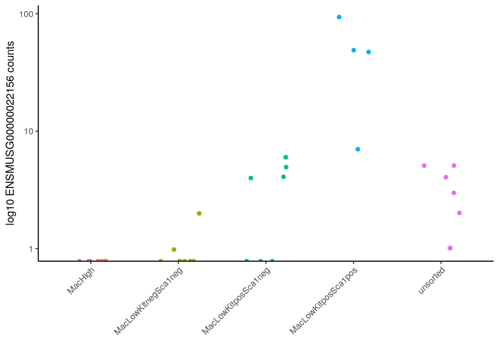

Here, we'll examine a mouse model of acute myeloid leukemia (AML).
We're using [`SRP049821`](https://www.ebi.ac.uk/ena/data/view/PRJNA267255).
Here's the description from the authors:

> Mutant RAS oncoproteins activate signaling molecules that drive oncogenesis in multiple human tumors including acute myelogenous leukemia (AML). However, the specific function of these pathways in AML is unclear. To elucidate the downstream functions of activated NRAS in AML, we employed a murine model of AML harboring Mll-AF9 and NRASG12V. We found that NRASG12V enforced leukemia self-renewal gene expression signatures and was required to maintain an MLL-AF9 and MYB-dependent gene expression program. In a multiplexed analysis of RAS-dependent signaling intermediates, the leukemia stem cell compartment was preferentially sensitive to RAS withdrawal. Use of RAS-pathway inhibitors showed that NRASG12V maintained leukemia self-renewal through mTOR and MEK pathway activation, implicating these pathways as potential targets for cancer stem cell-specific therapies. Overall design: Primary leukemia cells harvested from spleens were sorted into immunophenotypic subpopulations (Mac-1High, Mac-1LowKit–Sca-1–, Mac-1LowKit+Sca-1–, and Mac-1LowKit+Sca-1+). RNA was extracted from this subpopulations of cells and submitted for RNA sequencing.

These data were published as part of [Sachs _et al._ (2014)](https://doi.org/10.1182/blood-2013-08-521708).

### Setup

We've prepared the expression data all the way through the tximeta step.
This file can be found at: `data/leukemia/txi/leukemia_stem_cell_txi.RDS`


Using what we've learned so far, let's ask a series of questions about these data using DESeq2.

```{r library, solution = TRUE}
# Load in `DESeq2`

# Load in `ggplot2`

# Set a seed for reproducibility

```

### What does the relationship between the cell populations look like?

Read in the gene expression data and the metadata into variables called `txi` and `metadata_df`.
The cell population information is in a column called `cell_sorting` in the metadata file.

```{r input-files, solution = TRUE}
# name the file path for the txi_file leukemia_stem_cell_txi.RDS

# read in the RDS files and call it `txi`

```

Use DESeq2 functionality to create a dataset, transform, and visualize the data.
Recall that we are interested in the cell populations.

```{r ddset, solution = TRUE}
# use DESeq2::DESeqDataSet to create a ddset object

```

```{r vst, solution = TRUE}
# perform vst normalization

```

```{r plotPCA, solution = TRUE}
# use plotPCA to get a visualization of the `cell_sorting` groups

```

From [Sachs _et al._ (2014)](https://doi.org/10.1182/blood-2013-08-521708):

> ...these data identify the Mac-1LowKit+Sca-1+ group as enriched with [leukemia stem-cells] compared with the other groups, particularly the Mac1High group that accounts for the majority of the leukemia population.
...
Both of these modalities identify the Mac-1High group as the group with the least stem-cell capacity.

Do the gene expression profiles align with the results from the Sachs _et al._ experiments?

### What genes are highly expressed in cells with high stem-cell capacity?

Let's compare the `MacLowKitposSca1pos` (high capacity) to `MacHigh` (low capacity) cells using differential expression analysis.

Because we have more than 2 groups, DESeq will calculate differential expression for each group in comparison to a reference group.
In this case `MacHigh` is the chosen as the reference automatically because it is first alphabetically.
If had wanted to modify this, we would have had to convert the `cell_sorting` column to a factor and reorder it before creating the DESeq dataset.
After calculating the DESeq results, we will need to extract the comparison we are most interested in.

```{r deseq_object, solution = TRUE}
# call the resulting object deseq_object

```

We can use `resultsNames()` function on our `deseq_object` to take a look at the comparisons that DESeq calculated.

```{r result_names, solution = TRUE}

```

Given our research question, which comparison are we most interested in?
We will need to supply the index of this comparison to the `coef` argument in our next step.

We'll want to use `lfcShrink()` function on our `deseq_object` (remember that the estimates of log2 fold change calculated by `DESeq()` are not corrected for expression level).

For the `type` argument, you can `ashr` for the estimation method as we did in lecture, or feel free to try `apeglm` and see how it performs.
Use the index number you determined in the previous step for the `coef` argument.

```{r lfc_shrink, solution = TRUE}
# Calculate shrunken log2 fold change estimates
# Make sure to specify the type and coef arguments appropriately -- check the help page for lfcShrink()

```

Now let's get the results as a data frame.

```{r deseq_df, solution = TRUE}
# obtain the results of deseq_object with our desired comparison

  # use this line to make the results into data.frame

  # use this line to make the gene rownames to a column using tibble::rownames_to_column()

```

You might want to make a volcano plot of the full results table at this stage.

```{r volcano, solution = TRUE}
# If you'd like to make a volcano plot, set up `EnhancedVolcano()` here

  # You can add any other ggplot2 items to customize your plot

```

Use `dplyr::arrange()` to sort your results so that the genes more highly expressed in `MacLowKitposSca1pos` come first.

```{r arrange-deseq_df, solution = TRUE}

```

Now let's plot the results associated with a single gene to the check the directionality of the results.
We used the expression data associated with the gene `ENSMUSG00000022156` to produce the plot below.



We encourage you to try to replicate the plot we made, but also feel free to make adjustments to the plot as you please.

First, you will need to prepare a data frame for plotting with `ggplot2`.
Again, we used the expression data associated with `ENSMUSG00000022156` to produce the plot above but you should feel free to select a different gene's expression data (or more than one gene!) to prepare the data frame for plotting in the next chunk.

First we will need to extract the count data from `deseq_object` using the `counts()` function.

```{r counts_mat, solution = TRUE}
# Extract the counts from `deseq_object` using the `counts()` function and call this `counts_mat`

```

Now you can set up a new data frame for plotting by subsetting `counts_mat` to only your gene(s) of interest and adding in the `cell_sorting` vector as a new column.
You can extract the `cell_sorting` variable information from `deseq_object` with a `$`.
Call this new data frame, `gene_df`.
(You can subset your `counts_mat` by using brackets).

```{r setup-plotting-df, solution = TRUE}
# Set up a data frame called `gene_df` which contains a column or columns of expression data and a column of `cell_sorting` info

```

We are now ready to plot the expression data for our gene of interest using `ggplot2`!
We have provided hints for how to replicate the plot above, but it's okay to make adjustments and produce a somewhat different plot from the plot we previously displayed.

```{r jitterplot, solution = TRUE}
# Check directionality using a gene's data with a jitterplot

# Set up `ggplot2` plot basics which includes the `x`, `y`, and `color`
# aesthetics -- see `?aes` for more information

  # Make it a jitter plot but narrow the width of where the points will be using
  # the width argument -- see `?geom_jitter` for more information

  # Add a `ggplot2` theme to make it prettier -- see `?theme_classic` for more
  # information and examples

  # Make the x axis labels more legible by turning them --
  # see ?theme -> axis.text.x for more information

  # Use a log scale for the y axis

  # The x label isn't particularly helpful so let's use `labs()` to make the
  # x label blank, but we want to set the y label.

```

### Session Info

```{r sessioninfo}
sessionInfo()
```
