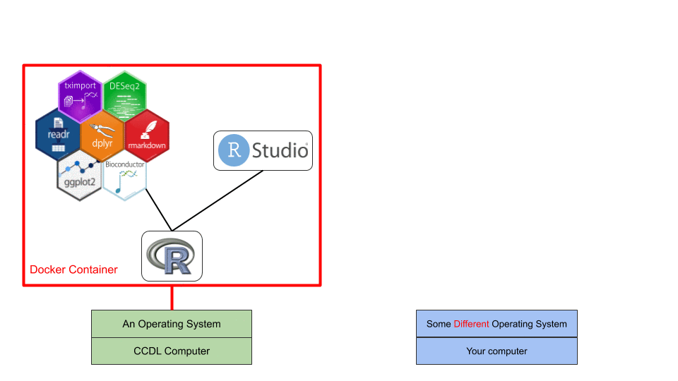

# Why Docker?
### A brief intro to Docker as a data analysis tool

For this workshop, we will be conducting all of our analyses in [Docker](https://www.docker.com/resources/what-container).
Here we will introduce you to the strategy of using Docker for data analysis.

To quote [this data science article](https://towardsdatascience.com/docker-for-data-scientists-5732501f0ba4) by Bobby Lindsey:
> Ever heard these comments from your coworkers?
- “Not sure why it’s not working on your computer, it’s working on mine.”
- “It’s a pain to install everything from scratch for Linux, Windows, and MacOS, and trying to build the same environment for each OS.”
- “Can’t install the package that you used, can you help me out?”

Package and software installation problems are frustrating and can easily snowball
into day(s) of troubleshooting.

For this workshop, we will require 40+ software packages (depending on how you count it)
that each have a various number of other packages they are dependent on.
Because of this, we've opted to have you install one potentially difficult
thing (Docker) rather than 40+ moderate to difficult things (every single package
we need for the course).

We can use Docker to transfer our software set up to you.

As is shown in this illustration, the software set up you will be using to run
your analyses is called a **container**.
In the Docker set up instructions, you build the container based on an **image**
which is a "snapshot" of a software set up. We can pull this image from the internet or
copy a hard file of it.  

## Docker for reproducibility

Docker also aides in the reproducibility of research results (and workshop answers)
by ensuring everyone is using the same versions of software.

Any given piece of software has had various different versions as developers
continue to work on it. This figure from [Beaulieu-Jones & Greene _Nature Biotechnology_ 2017](https://doi.org/10.1038/nbt.3780) illustrates how software versions can affect results of genomic analyses.

In the workshop, we will not be explaining the concepts of Docker or how
it works however, if you are interested in understanding more about the terms
and how they relate to data science, here are some recommended articles: 

**Further reading:**
- [Digging into Data Science Tools: Docker](https://towardsdatascience.com/digging-into-data-science-tools-docker-bbb9f3579c87)
- [A short guide to using Docker for your data science environment](https://towardsdatascience.com/a-short-guide-to-using-docker-for-your-data-science-environment-912617b3603e)
- [Docker's website](https://www.docker.com/)
