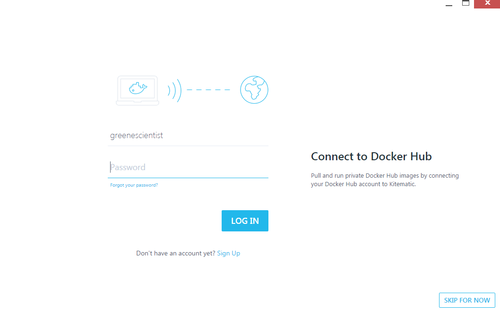

## Installing Docker

Follow the instructions below for Mac and Windows operating systems.
After you complete the operating system specific portions, scroll to the bottom to complete the post-install steps so that you'll be ready to run the software for the training exercise.

### Pre-install Steps

1. If you do not have an account with the Docker Store, visit the [Docker Store website](https://store.docker.com/). In the upper right corner, select Log In. Create an account.

### MacOS

1. Visit the [Docker Store](https://store.docker.com/search?type=edition&offering=community) and download Docker Community Edition for Mac.

2. Open the downloaded file and drag the Docker Whale icon to your Applications folder.

3. Open the Applications folder and find and open Docker.

4. Click the whale icon in the taskbar. Log in to the docker store.

5. Click the whale icon in the taskbar. Click the kitematic menu entry.

6. Follow the prompts to download kitematic.

7. Drag the kitematic icon to the Applications folder.

8. Open the new kitematic program. Accept the prompt.

### Windows 7

1. Visit the [Docker Toolbox Docker documentation page](https://docs.docker.com/toolbox/toolbox_install_windows/). Download Docker Toolbox.

2. After the download completes, follow the prompts to complete the Docker Toolbox installation.
3. After the installation, select the kitematic icon from the desktop.

4. Select the option to start in VirtualBox. Then you should see a loading image while the Virtualbox session starts.

### Windows 10

1. Visit the [Docker Store](https://store.docker.com/search?type=edition&offering=community) and select Docker Community Edition for Windows.

1. Download Docker Community Edition for Windows and follow the prompts.

### Post-install Steps

1. Open kitematic and log in to the Docker Store account from within kitematic.

### Now return to the workshop schedule for the link to the next steps.
