# Installing Docker

Follow the instructions below for Mac and Windows operating systems.
When you are finished, return to the schedule for your workshop for the link to the next steps.

## Pre-install Steps

1. If you do not have an account with the Docker Store, visit the [Docker Store website](https://store.docker.com/). In the upper right corner, select Log In. Create an account.

## Installation

* [Mac OS](#macos)
* [Windows 10 Pro](#windows-10-pro)
* [Windows 7](#windows-7)

### MacOS

1. Visit the [Docker Store](https://store.docker.com/search?type=edition&offering=community) and download Docker Community Edition for Mac.
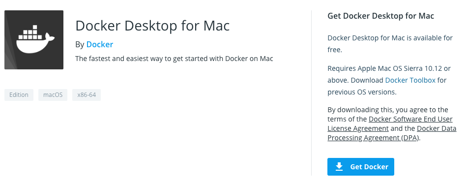
2. Open the downloaded file and drag the Docker Whale icon to your Applications folder.
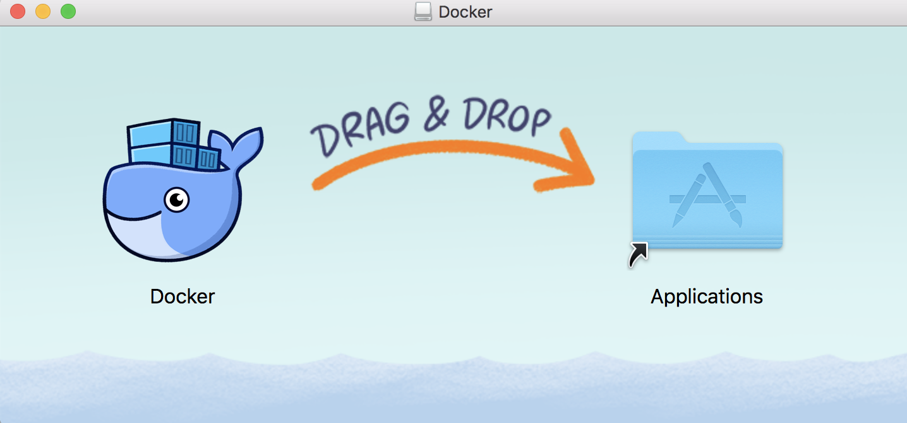
3. Open the Applications folder and find and open Docker.
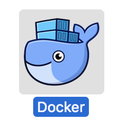
4. Click the whale icon in the taskbar. Log in to the Docker store.
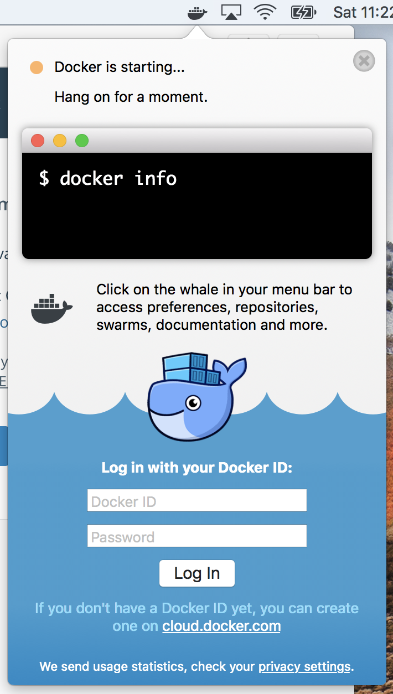
5. Click the whale icon in the taskbar and go to Preferences.

6. Increase the resources available to Docker. For reference, we've found that 2 CPUs and 6 GB of RAM on a quad-core with 8 GB of RAM total works for the workshop offerings. If you are able to provide more resources, do so.  
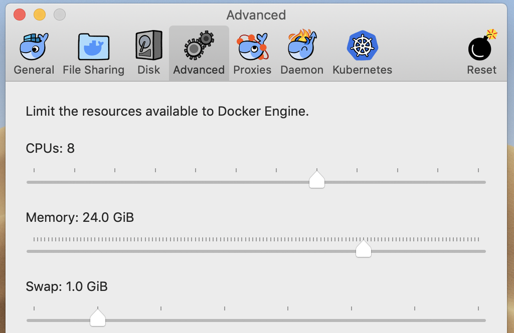
7. Click the whale icon in the taskbar. Click the Kitematic menu entry.  
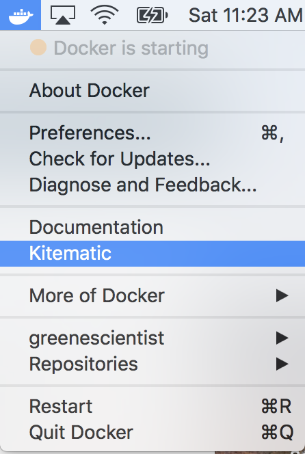
8. Follow the prompts to download Kitematic.  
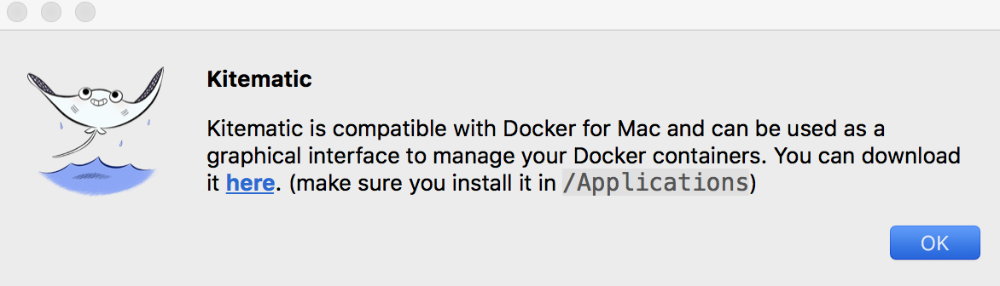
9. Drag the Kitematic icon to the Applications folder.  
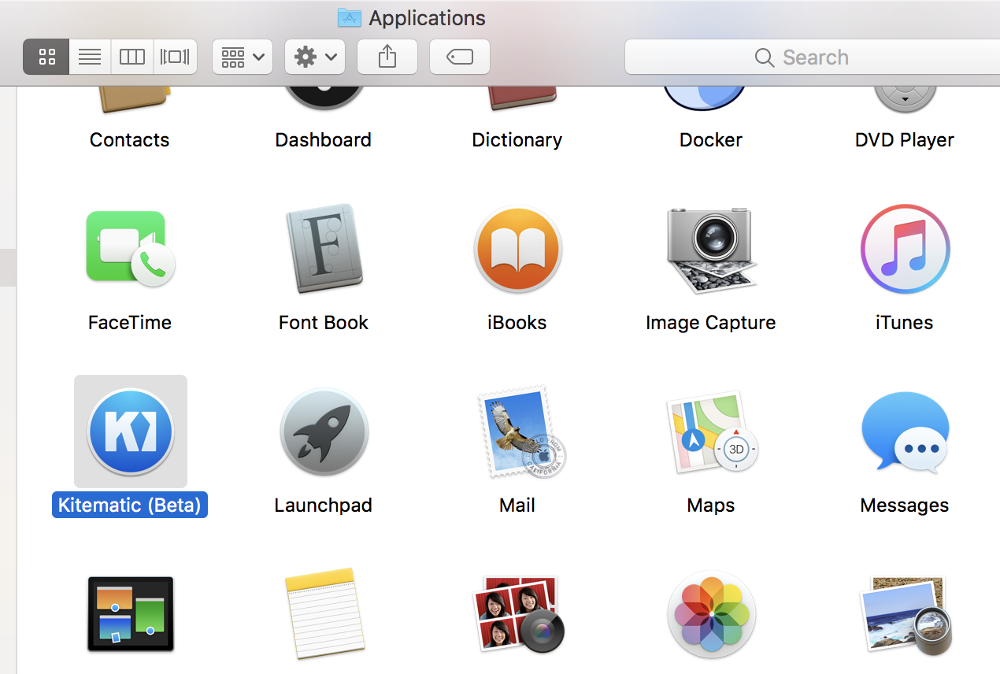
10. Open the new Kitematic program. Accept the prompt.  
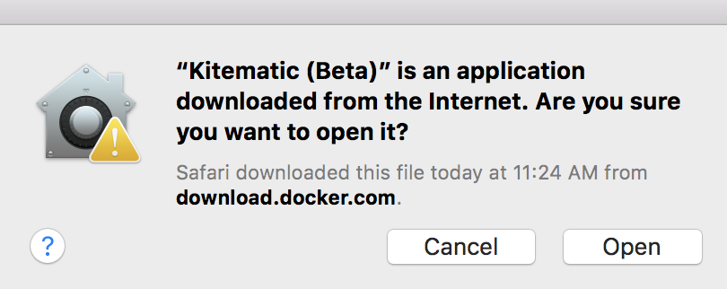

### Windows 10 Pro

Here are the [Windows install instructions](https://docs.docker.com/docker-for-windows/install/).
We summarize the most important steps below, but if you run into trouble you may need to consult the Docker documentation.

1. Visit the [Docker Store](https://store.docker.com/search?type=edition&offering=community) and select Docker Desktop for Windows.  
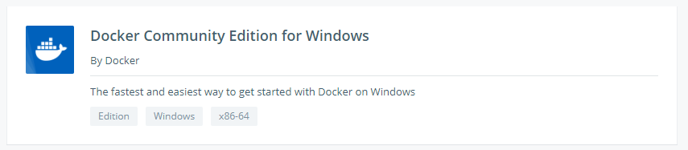
2. Download Docker Community Edition for Windows and follow the prompts.  
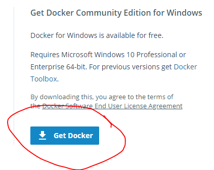
3. During installation, a configuration menu will come up. Do not select "Use Windows containers instead of Linux containers."  
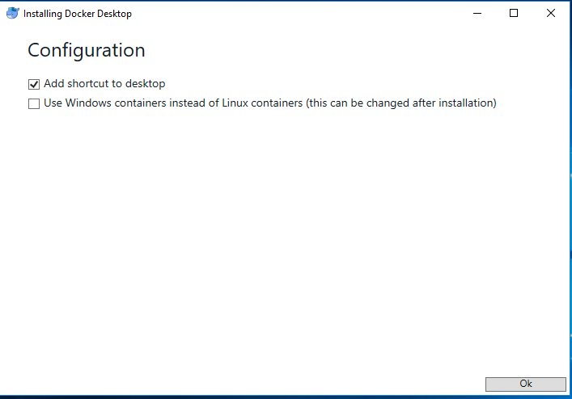
4. Log back in and click on the Docker Desktop icon to run Docker Desktop. Enter your Docker account credentials.    
5. Find the Docker whale in your taskbar and right click it to bring up the menu.  
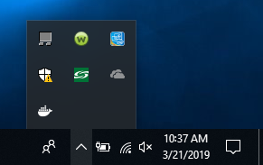
6. Go to Settings.  
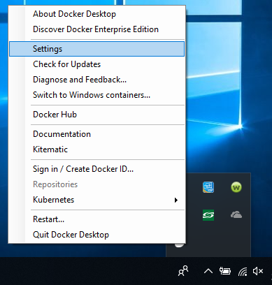
7. Go to the Advanced pane and increase the resources available to Docker.
For reference, we've found that 2 CPUs and 6 GB of RAM on a quad-core with 8 GB of RAM total works for the workshop offerings.  
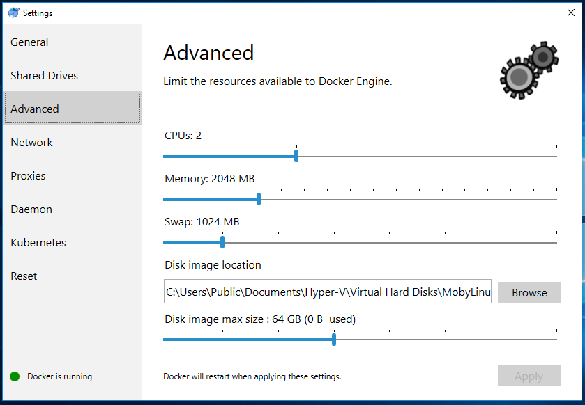
7. Select Kitematic in the Docker menu.  
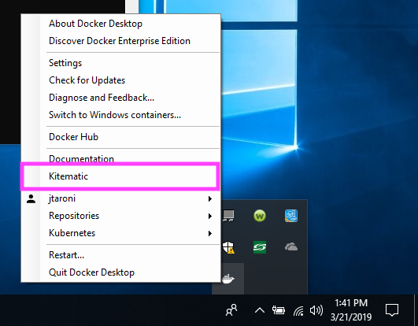
8. This will bring up a prompt to download Kitematic. Click download.  
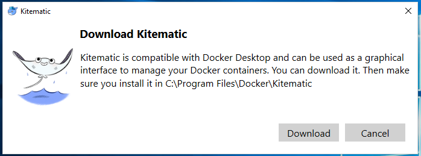
9. Extract all files from the `Kitematic-Windows.zip` into `C:\Program Files\Docker\Kitematic`. You may need to create a new `Kitematic` Folder.  
10. Navigate back to the Taskbar, Docker whale, and click on Kitematic. You should now see a prompt for your Docker credentials.  

#### Troubleshooting

When you first try to run Docker Desktop, you may see an error that Hyper-V is required or that virtualization must be enabled (see [documentation](https://docs.docker.com/docker-for-windows/troubleshoot/#virtualization)).  

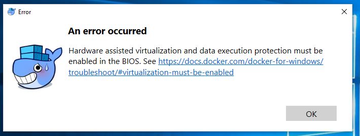

You can check if you have Hyper-V support in the Performance tab of Task Manager.  

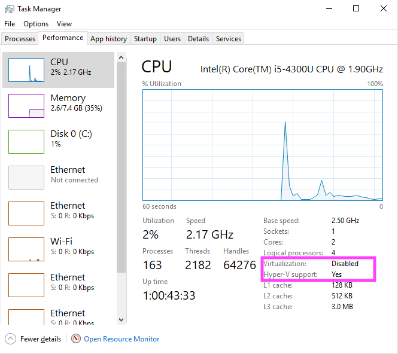

If you need to enable virtualization, you will need to enter the BIOS setup menu by restarting your computer and booting safe mode. You may find [this article](https://www.laptopmag.com/articles/access-bios-windows-10) helpful.
In the BIOS set up, you will need to enable virtualization.
Unfortunately, the steps for enabling virtualization are manufacturer- and sometimes model-specific.  

### Windows 7

1. Visit the [Docker Toolbox Docker documentation page](https://docs.docker.com/toolbox/toolbox_install_windows/). Download Docker Toolbox.  
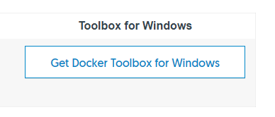
2. After the download completes, follow the prompts to complete the Docker Toolbox installation.  
3. After the installation, select the kitematic icon from the desktop.  
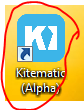
4. Select the option to start in VirtualBox. Then you should see a loading image while the Virtualbox session starts.  
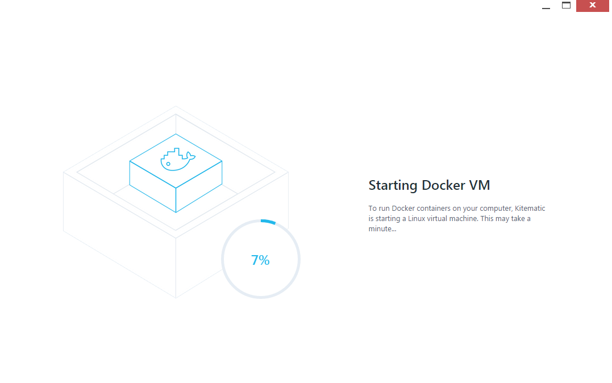

### Now return to the workshop schedule for the link to the next steps.
