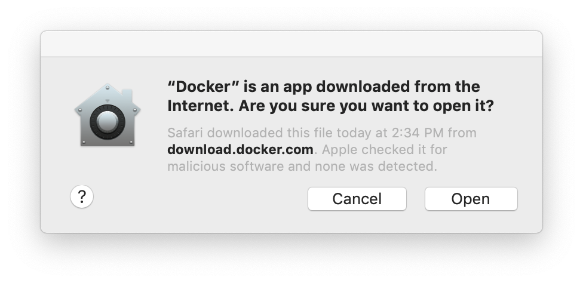
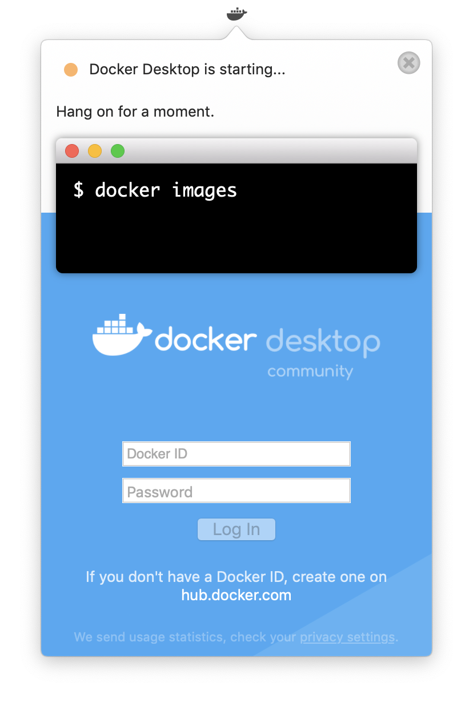
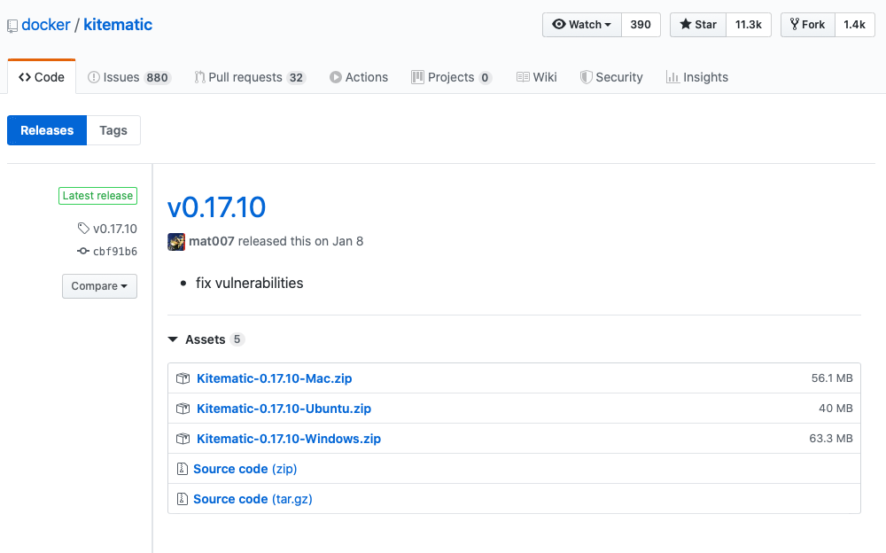
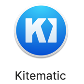
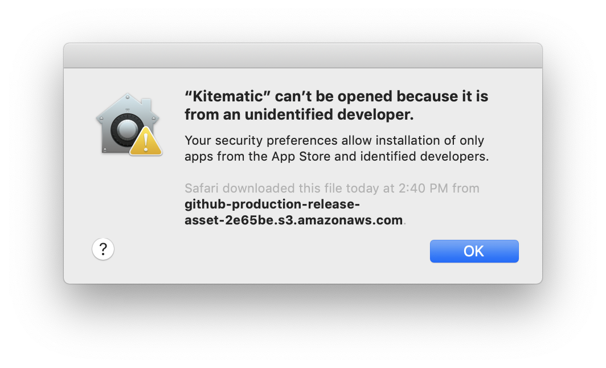
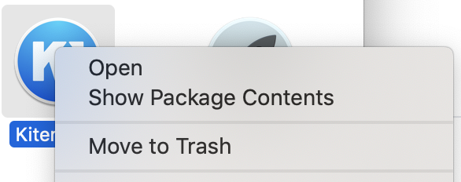
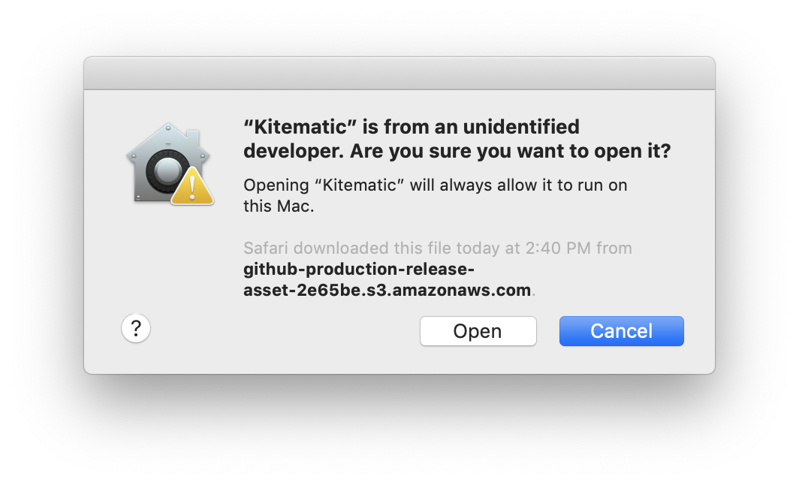
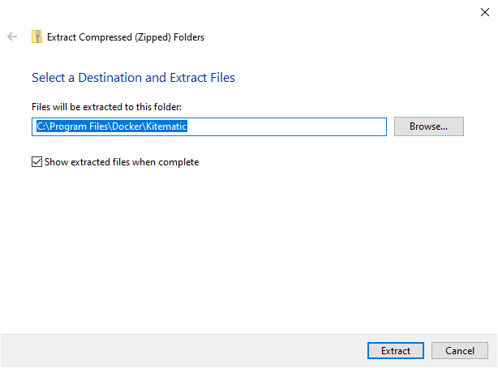
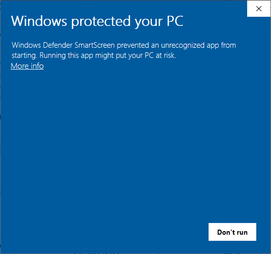
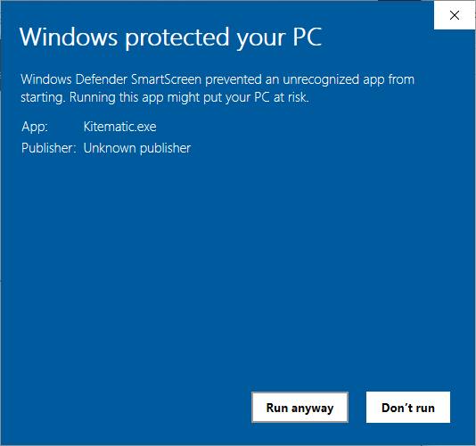

# Installing Docker

Follow the instructions below for Mac and Windows operating systems.
When you are finished, return to the schedule for your workshop for the link to the next steps.

## Pre-install Steps

1. If you do not have an account with  Docker Hub, you may find it convenient to create one, though this is optional. Do do this, visit the [Docker Hub website](https://hub.docker.com/). In the upper right corner, select "Get Started" to create an account.

## Installation

* [macOS](#macos)
* [Windows 10 Pro](#windows-10-pro)
* [Windows 7](#windows-7)

### MacOS

1. Visit [Docker Hub](https://hub.docker.com/editions/community/docker-ce-desktop-mac) and download Docker Desktop for Mac.

2. Open the downloaded file and drag the Docker App icon to your Applications folder.

3. Open the Applications folder and find and open Docker. You will likely encounter a warning message asking for permission to open the application. Click "Open".  

4. You will see a whale icon appear in the toolbar and start animating. If you have a Docker Hub account, you can click on the whale and login to Docker Hub (this is optional).

5. Once the menu bar icon stops animating, click the whale icon in the taskbar and go to Preferences.

6. Increase the resources available to Docker. For reference, we've found that 2 CPUs and 6 GB of RAM on a quad-core with 8 GB of RAM total works for the workshop offerings. If you are able to provide more than 8GB of RAM, do so. However, be careful not to allot your computer's maximum RAM capacity. 

7. For ease of managing your Docker images, we currently recommend Kitematic. Its functionality is *slowly* being incorporated into the main Docker Desktop application, but for now it is available as a separate download. Go to the [Kitematic Releases page on Github](https://github.com/docker/kitematic/releases) to download the latest release for macOS.

9. Locate the downloaded file and drag the Kitematic icon to the Applications folder.  

10. When you open Kitematic, you will likely see a warning that the application is from an unidentified developer, with no option to open the application.
  
Click "OK", then right click on the icon and select "Open" from the popup menu.  
  
The warning that pops up this time should give you the option to open the Kitematic application. Click "Open" and you should be all set. The next time you launch Kitematic it should open normally, with no warnings.

### Windows 10 Pro

Here are the [Windows install instructions](https://docs.docker.com/docker-for-windows/install/).
We summarize the most important steps below, but if you run into trouble you may need to consult the Docker documentation.

1. Visit [Docker Hub](https://hub.docker.com/editions/community/docker-ce-desktop-windows) and select Docker Desktop for Windows.  

2. In your Downloads folder (or wherever you have saved the downloader), open the Docker Desktop Installer.  
  

3. During installation, a configuration menu will come up. Do not select "Use Windows containers instead of Linux containers."  

4. Log back in and click on the Docker Desktop icon to run Docker Desktop. Enter your Docker account credentials.    
5. Find the Docker whale in your taskbar and right click it to bring up the menu.  

6. Go to Settings.  

7. Go to the Advanced pane and increase the resources available to Docker.
For reference, we've found that 2 CPUs and 6 GB of RAM on a quad-core with 8 GB of RAM total works for the workshop offerings.  

7. For ease of managing your Docker images, we currently recommend Kitematic. Its functionality is *slowly* being incorporated into the main Docker Desktop application, but for now it is available as a separate download. Go to the [Kitematic Releases page on Github](https://github.com/docker/kitematic/releases) to download the latest release for Windows.

9. Right click on the downloaded file and choose "Extract all..." to decompress all files from the downloaded zip file into `C:\Program Files\Docker\Kitematic` or the location of your choice. You may need to create a new `Kitematic` Folder (Click "Browse..."). Be sure to check the box to "Show extracted files when complete".

10. In the uncompressed folder, scroll down to the `Kitematic` application and open it. You will be probably be presented with a warning message informing you that "Windows protected your PC".
  
Click "More info" to reveal the "Run anyway" button and click that to launch Kitematic.  

11. If you want easier access to Kitematic, you can navigate back to the folder, right click on the `Kitematic` application, and choose either "Pin to Start" or "Send to > Desktop"

#### Troubleshooting

When you first try to run Docker Desktop, you may see an error that Hyper-V is required or that virtualization must be enabled (see [documentation](https://docs.docker.com/docker-for-windows/troubleshoot/#virtualization)).  

You can check if you have Hyper-V support in the Performance tab of Task Manager.  

If you need to enable virtualization, you will need to enter the BIOS setup menu by restarting your computer and booting safe mode. You may find [this article](https://www.laptopmag.com/articles/access-bios-windows-10) helpful.
In the BIOS set up, you will need to enable virtualization.
Unfortunately, the steps for enabling virtualization are manufacturer- and sometimes model-specific.  

### Now return to the workshop schedule for the link to the next steps.
