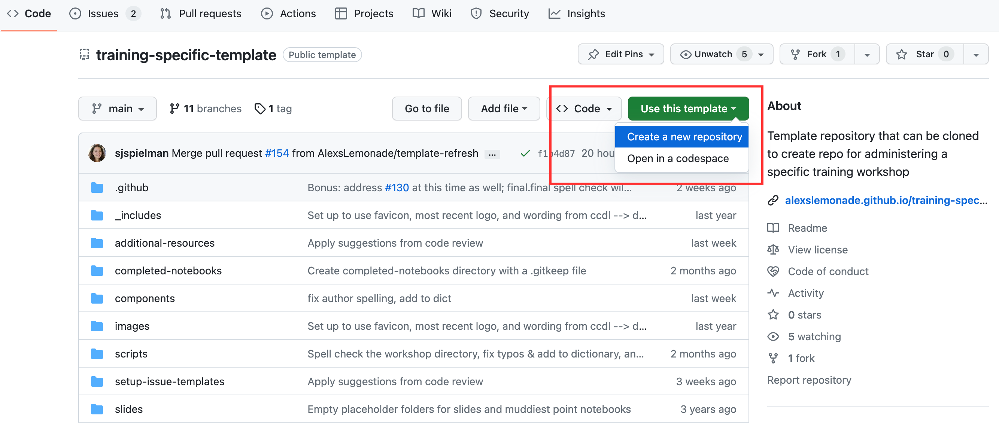

# Course website

At the Data Lab, we create a new repository and associated GitHub Pages course website for each individual workshop using our `training-specific-template` repository.
We strongly recommend creating a course website for your workshop as a centralized place for attendees to find information necessary for participating in the workshop. 

## Create a new repository

**1.)** To use our template to create your own repository and associated GitHub Pages website, navigate to [`training-specific-template`](https://github.com/AlexsLemonade/training-specific-template). Click `Use this template` > [`Create a new repository`](https://docs.github.com/en/repositories/creating-and-managing-repositories/creating-a-repository-from-a-template#creating-a-repository-from-a-template). 

**2.)** Refer to the instructions found in the [`training-specific-template` README](https://github.com/AlexsLemonade/training-specific-template#readme) to create and customize your website repository.

## Website Content 

Web content will vary depending on the topic, whether the workshop will be held in-person or virtually, among other factors. 
See an ([example](https://alexslemonade.github.io/2023-june-training/)) from a previous Data Lab workshop.

Some key information to consider including on your course website:

* Workshop description and structure
* A course schedule
* Overview of and instructions for installing the tools, materials, and software that will be used (ex. RStudio, Slack, video conferencing software) 
* Optional preparation materials (ex. Resources for getting familiar with R)
* Logistical information, such as the workshop location 
