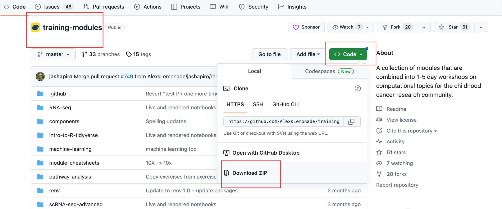

# Downloading or forking a repository

Downloading or forking this repository will provide you with the materials for every Data Lab workshop. 
You can remove the files that are not relevant to the workshop you are teaching. 

**Download a ZIP of the repository**

* Navigate to the [`training-modules` repository](https://github.com/AlexsLemonade/training-modules) and click the `<> Code` dropdown button.
* Click `Download ZIP` in the dropdown.

* Now you can open a file that contains all materials from this repository on your own computer.

**Or, if you are familiar with GitHub and would prefer to create your own copy of `training-modules`, you can fork the repository instead.**

* Navigate to the [`training-modules` repository](https://github.com/AlexsLemonade/training-modules) and click `Fork`.

* Make sure you are the owner of the new repository and click `Create Fork`.

You can now interact with the materials on your own GitHub account. 
We recommend that you also clone your new repository to your own computer.