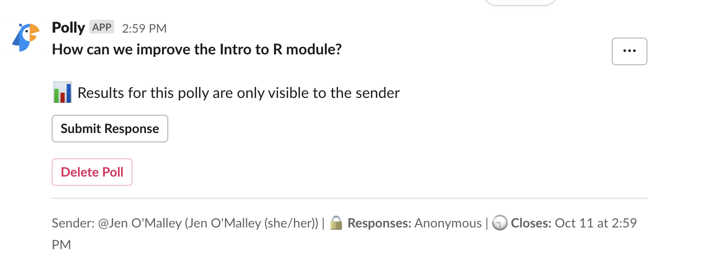

# Using Cancer Data Science Slack

We maintain a Slack community called Cancer Data Science Slack, which is used for communication purposes before, during, and after in-person and virtual workshops. 
The admin channel is required. 
The participant channel is optional, but recommended. 

<!-- START doctoc generated TOC please keep comment here to allow auto update -->
<!-- DON'T EDIT THIS SECTION, INSTEAD RE-RUN doctoc TO UPDATE -->
**Table of Contents**  *generated with [DocToc](https://github.com/thlorenz/doctoc)*

* [Admin channel](#admin-channel)
* [Participant channel](#participant-channel)

<!-- END doctoc generated TOC please keep comment here to allow auto update -->

## Admin channel

We require external instructors to [join our Slack community](https://cancer-data-science.slack.com/) so we can add you to an admin channel with our team. 
This channel will mainly be used to answer questions while you are getting set up and for troubleshooting during your workshop if you are using the Data Lab’s RStudio server. 

**This channel is meant for instructors and Data Lab team members. 
Please only add members who are acting as helpers during your workshop, and not participants.**

**Before your workshop**, use Slack to ask us questions as you get set up with tools and prepare for instruction. 
Someone from our team will always try to respond within 1 business day.

**During the workshop**, you can use this channel to ask us any troubleshooting questions. 

* If you are using the Data Lab’s RStudio server for instruction, there will be at least 1 Data Lab staff member on call to provide immediate assistance should you run into technical difficulties. Slack will be the fastest way to reach us if needed.

**After the workshop**, we will use this channel for any wrap-up communications and to send future reminders about revoking access to the Data Lab’s RStudio server, if applicable.

## Participant channel

**Before the workshop**, use Slack to introduce the instructors, share reminders about the schedule, and post logistical information.

**During the workshop**, participants can use Slack to communicate with you and fellow participants. 
This is a good place for attendees to post questions that don’t require an immediate response, so that instructors can address them when they have time. 

* **Tip:** We also use this channel to ask for feedback from the group at the conclusion of each module. (You can use [Slack’s Polly app](https://www.polly.ai/help/slack/creating-polls) to create polls to share within the channel!)

**After the workshop**, participants will have indefinite access to the training Slack channel. 
(Note: We utilize a free Slack account, which means messages and attachments posted in your channel will disappear after 90 days.)

### Create your own Slack channel

**1.)** First, you must [join the Cancer Data Science Slack community](https://cancer-data-science.slack.com/join/shared_invite/enQtNzc4NTI2Nzg0ODY5LWQyODI0NmJmZDgzMzhiMzE1NGUyMmFhYzAxMWE0NmFkMTVjNWRhZDNlNGZhZDY5NzZmZWFjNzViNmFlOWIwMzE#/shared-invite/email).

**2.)** Follow Slack’s instructions for [creating a channel](https://slack.com/help/articles/201402297-Create-a-channel). 

* **Note:** At the Data Lab, we usually name our training channels, `year-month-training`. We typically keep our training channels private.

**3.)** Follow Slack’s instructions for [adding participants to a channel](https://slack.com/help/articles/201980108-Add-people-to-a-channel). 

* **Note:** If you invite members using their email addresses, they will receive an email invitation from Slack. All invited participants will appear in the member list for your channel, even if they have not accepted the invitation. You can click on an invited member’s icon to see if they have joined yet.
