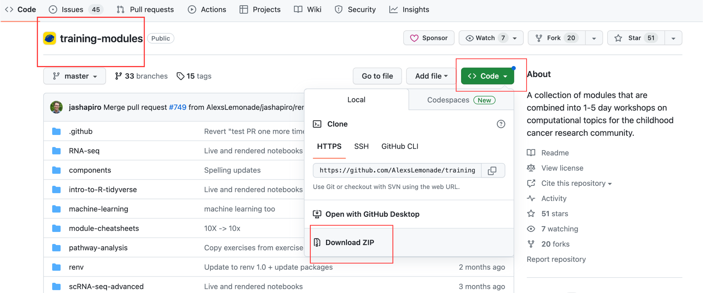
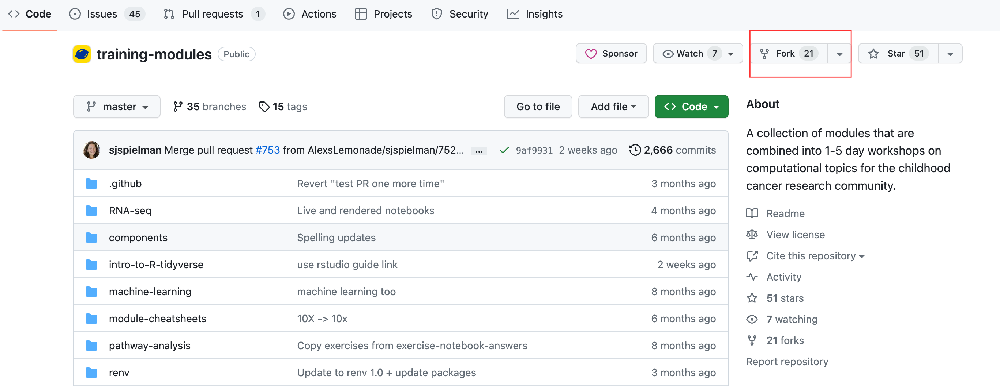
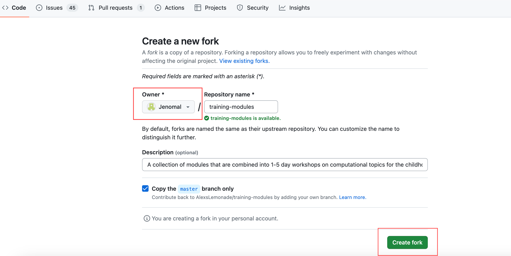

# Using Data Lab Training Materials

[All Data Lab training materials](https://github.com/AlexsLemonade/training-modules/tree/master), including lecture slides, reference documents, instruction notebooks, and exercise notebooks are [openly licensed](https://github.com/AlexsLemonade/training-modules/blob/master/LICENSE.md), modifiable, and freely available to download via GitHub. 
Whether you are instructing in-person or virtually, you will need access to all of the materials that apply to your workshop topic and infrastructure for hosting the materials. 

**All workshop participants must sign the Data Lab’s training waiver before participating in a workshop that uses our materials. 
[Participants can access and sign the waiver using this link](https://app.hellosign.com/s/2o2yghCj).**

<!-- START doctoc generated TOC please keep comment here to allow auto update -->
<!-- DON'T EDIT THIS SECTION, INSTEAD RE-RUN doctoc TO UPDATE -->
**Table of Contents**  *generated with [DocToc](https://github.com/thlorenz/doctoc)*

* [Data Lab RStudio Server](#data-lab-rstudio-server)
	* [How the Data Lab uses the RStudio server](#how-the-data-lab-uses-the-rstudio-server)
	* [Using the Data Lab RStudio server for your workshop](#using-the-data-lab-rstudio-server-for-your-workshop)
* [Using your own infrastructure](#using-your-own-infrastructure)

<!-- END doctoc generated TOC please keep comment here to allow auto update -->

## Data Lab RStudio Server

### How the Data Lab uses the RStudio Server

For both in-person and virtual workshops, we utilize [our RStudio server](https://rstudio.ccdatalab.org/auth-sign-in?appUri=%2F).
For each workshop, we set up accounts and home directories for participants and pre-install the tools (R packages, command line tools), data (raw and processed files), and notebook files that will be used during the workshop. 
Instructors can live code and walk participants through each notebook in real-time. 

Each participant will be able to log in to their account using their own web browser, which gives them full access to all pre-loaded materials. 
Once logged in, participants can code alongside instructors and complete their own copy of each exercise notebook.
The Data Lab allows training participants to have access to our RStudio server for 6 months after the workshop ends.

### Using the Data Lab RStudio server for your workshop

**Training materials** 

**1.) If you plan to modify any training materials, you must download our [`training-modules`](https://github.com/AlexsLemonade/training-modules/tree/master) repository or fork the repository on GitHub.** 
If you do not plan to make modifications, you can skip to step 3 and the Data Lab will upload the current version of the materials you are using to the RStudio server. 

Downloading or forking this repository will provide you with the materials for every Data Lab workshop. 
You can remove the files that are not relevant to the workshop you are teaching. 

**Download a ZIP of the repository**

* Navigate to the [`training-modules` repository](https://github.com/AlexsLemonade/training-modules) and click the `<>Code` button.
* Click `Download ZIP` in the dropdown.

* Now you can open a file that contains all materials from this repository on your own computer.

**Or, if you are familiar with GitHub and would prefer to create your own copy of `training-modules`, you can fork the repository instead.**

* Navigate to the [`training-modules` repository](https://github.com/AlexsLemonade/training-modules) and click `Fork`.

* Make sure you are the owner of the new repository and click `Create Fork`.

You can now interact with the materials on your own GitHub account. 
We recommend that you also clone your new repository to your own computer.

**2.) After you have made changes, our team will need a copy of the modified materials so we can install them on the server.** 

* If you downloaded a zip of the repository, send a zip file containing your version of the materials to `training@ccdatalab.org`. 
* If you forked the repository, please give the Data Lab full access to the repository you created.

**3.) The `training-modules` repository also contains the current version of the exercise notebooks that participants can use to practice what they learned during consultation periods and after the workshop.**

We will provide you with access to a repository that contains the answer key for the exercises. 
At the end of the workshop, download a zip file with the exercise notebook answers that apply to your workshop and distribute them to participants via email and Slack (if you are using it).

**RStudio**

**4.) You must create a `.csv` file with a list of training participants, so we can create usernames and passwords for logging into RStudio.**

* Please create two columns, one for `First name` and one for `Last name`. 
* Send this file to `training@ccdatalab.org` or post it on the admin Slack channel you have been added to. 
	
**5.) You will distribute individual RStudio credentials to each participant before your workshop begins and instruct them to log in and change their passwords.** 
[A set of instructions](https://github.com/AlexsLemonade/training-specific-template/blob/main/software-setup/rstudio-login.md) to help participants get set up on the server can be found in our `training-specific-template` repo. 

**6.) Please inform participants that their server access will be revoked after 6 months.** 
We suggest taking note of this time frame and planning to remind your participants when the time comes.

**7.) If participants plan to work with their own data during your workshop,** we have to ensure that it does not contain any personal health information (PHI) or personally identifiable information (PII), before they can upload it to the server.
Please see the instructions for pre-workshop set-up meetings to learn more.

## Use your own infrastructure

If you are *not* using the Data Lab's server and will install the training materials on your own infrastructure, follow these instructions for obtaining the files you need from GitHub and receiving data from Amazon S3. 

**1.) Download our [`training-modules`](https://github.com/AlexsLemonade/training-modules/tree/master) repository or [fork the repository](https://docs.github.com/en/get-started/quickstart/fork-a-repo) on GitHub to obtain the training materials and make any modifications.**
Downloading or forking this repository will provide you with the materials for every Data Lab workshop. 
You can remove the files that are not relevant to the workshop you are teaching. 

**Download a ZIP of the repository**

* Navigate to the [`training-modules` repository](https://github.com/AlexsLemonade/training-modules) and click the `<>Code` button.
* Click `Download ZIP` in the dropdown.

* Now you can open a file that contains all materials from this repository on your own computer.

**Or, if you are familiar with GitHub and would prefer to create your own copy of `training-modules`, you can fork the repository instead.**

* Navigate to the [`training-modules` repository](https://github.com/AlexsLemonade/training-modules) and click `Fork`.

* Make sure you are the owner of the new repository and click `Create Fork`.

You can now interact with the materials on your own GitHub account. 
We recommend that you also clone your new repository to your own computer.

**2.) Data that you need for the workshop lives on Amazon S3.**
The Data Lab will securely transfer the files to you ahead of the workshop. 
We will reach out to you with more information.

**3.) Once you have all the necessary materials and data, you will install everything on your own infrastructure.**  