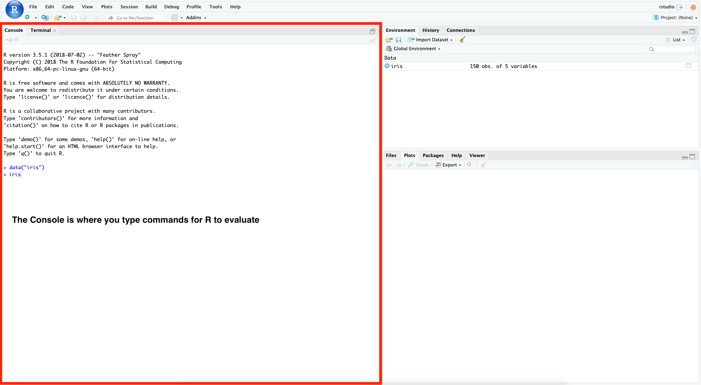

Our course material uses [R Markdown Notebooks](https://bookdown.org/yihui/rmarkdown/notebook.html).
Opening and running R Markdown (`.Rmd`) files requires [RStudio](https://posit.co/products/open-source/rstudio/).
RStudio is an [integrated development environment](https://en.wikipedia.org/wiki/Integrated_development_environment) or IDE that makes it easier to program in R.
**Here, our objective is to provide a brief guide to getting started with RStudio.**

You may find this [RStudio User Guide](https://docs.posit.co/ide/user/ide/get-started/) useful too!

## Anatomy of RStudio

1. When you open an RStudio session for the first time, it will look like this.

2. The **Console** is where you will type commands that will be carried out by `R`.

3. You can switch to a **Terminal** where commands will be carried out by clicking the `Terminal` tab to the right of the `Console` tab.
This is a [command-line interface](https://en.wikipedia.org/wiki/Command-line_interface).
Commands here are for programs on your system _other_ than R.

4. The **Environment** pane displays all of the objects and functions in our global environment.
Here we can see that we have a `data.frame` called `iris` in our global environment.

5. You can click on `iris` to see what the `data.frame` looks like.
This will open a `View` in the Source pane.

6. The **Plots** pane will display any plots you make during your session.
Here we've made a scatter plot with the `iris` data.

7. The **Help** pane gives you access to documentation about R packages and functions.
Typing `?plot` into the R **Console**  opens up the information about this function in the **Help** pane.

8. The **Packages** pane tells you what packages are installed and which version.
Clicking on a package name will bring up its documentation in the **Help** pane.

9. The **History** pane displays all the commands that have been executed in R.

10. The **Files** pane displays files for whatever directory or folder it is currently pointed at.
Whatever the **Files** pane is pointed at is not automatically set as your working directory.
Try typing `?setwd` and `?getwd` to learn more about working directories.

11. Clicking an R Markdown file (`.Rmd`) in the **Files** pane will open it up in the **Source** pane.
Note that the working directory for an R Notebook is automatically wherever that notebook is saved.

Rscript files (`.R`) will also open in the **Source** pane.

12. If you want to adjust what is displayed or the pane layout, you can do so by clicking `View` > `Panes` > `Pane Layout` which will bring up an Options menu.

