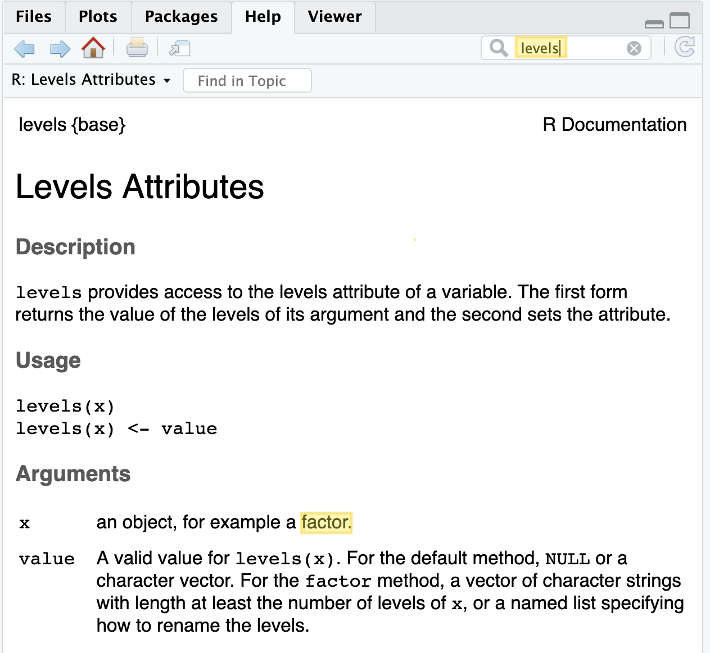

This guide gives you tips and approaches for fixing errors that will arise. We 
also go through some of the most common errors that you will encounter and what 
they mean. 

## Tips for approaching errors and bugs

### 1) Carefully read any and all error messages

This may seem like a silly thing to include as a tip, but it's very easy to
gloss over an error message without actually reading it. Often, R may be telling
you exactly what is wrong, but if you don't take the time to understand what the
error message means, you will have trouble fixing the error. Error messages 
often refer to R terms (e.g.. "argument", "directory") so if you need a refresher 
on what some terms mean, we recommend running through the [`01-intro_to_base_R.Rmd` notebook](https://github.com/AlexsLemonade/training-modules/blob/master/intro-to-R-tidyverse/01-intro_to_base_R.Rmd)
or going through Hadley Wickham's [R for Data Science](https://r4ds.hadley.nz/).

Secondly, realize that just because you don't receive an error message, doesn't 
mean that your code did what you intended it to. You also will need to carefully
review your code (and your results) to try to find "silent" bugs (situations 
where R did exactly what you asked, but you didn't get what you intended).

### 2) Identify which line and phrase of code is the source of the error. 

If you ran many lines of code, you may not know which part of your code is the 
origin of the error message. Isolating the source of the error and trying to 
better understand your problem should be your first course of action. 
The best way to determine this, is by running each line, and each phrase by 
itself, one at a time. 

Chunk-out your code and test the individual bits of code. Do you have a lot of 
lines of code, a lot of arguments, or multiple functions at once? Try each piece
by itself to narrow down what piece appears to be the origin of the problem. 

### 3) Be sure that the code you think you have run has all successfully run and in order. 

It could be that the problem with your code isn't that it doesn't work as it is written, 
but that you didn't run it or didn't run it in the correct order.
This should be one of the first things you check, while checking that the 
objects that you believe should be in your environment, are in your environment. 

It's also good practice to be periodically quitting your current R session and 
starting a new one, in addition to clearing your R notebook output. 
If you are encountering problems and haven't refreshed your
R session, you may want to do that before further troubleshooting. 

### 4) Google your error message

The main advantage to Googling your errors is that you are likely not the first 
person to encounter the problem. Certain phrases and terms in the error message
will yield more fruitful search results then others.  

When you do Google, a few common sources that will probably come up that we 
recommend looking at are:

#### a) [StackOverflow](https://stackoverflow.com/)
StackOverflow this is a forum where people post questions and problems they 
encounter in their code. 

#### b) [GitHub Issues](https://help.github.com/en/articles/about-issues)
People also will post their problems to GitHub issues. Often these are more
geared toward fixing problems with the package or software itself, but this is 
a way to potentially get direct help on an issue from the authors of the package
you are using.

#### c) [R-bloggers](https://www.r-bloggers.com/)
R-bloggers has examples of R code that you can use to figure out how to construct
various analyses. This is a good resource for example code, although it's format
isn't built for asking exact questions like StackOverflow.

### 5) Look at the documentation for a function to make sure you are using it correctly

Once you've better determined the origin of the problem, you should use whatever
documentation is available to you regarding the problematic code. When using 
a new function from a package you are unfamiliar with, it's worthwhile to skim
through the documentation so you know how to properly use the functions. For 
base R functions, Tidyverse functions, and *some* Bioconductor packages, the 
documentation will give you a lot of the information you need. However, you will 
also likely find that not all documentation is thorough or clear. 

As we discussed in 
[`01-intro_to_base_R.Rmd` notebook](https://github.com/AlexsLemonade/training-modules/blob/master/intro-to-R-tidyverse/01-intro_to_base_R.Rmd),
objects have *structures* and *types*. Having input that doesn't match the 
requirements that a function has can be a common source of errors. Pay special
attention to what the documentation says about what kind of input and output 
the function is designed to use. 

#### Use the RStudio help bar

Here's a screenshot from the help window in RStudio. Note that here we searched
for the `levels` function. R documentation includes information about what the
expected arguments are as well as examples of how to use a function. Note here 
that this documentation tells us that the input for `x` is probably a factor. 


#### For Bioconductor package functions, look at their page on bioconductor.org

Like other a lot of other packages we may be using for genomics analysis, [DESeq2](https://www.bioconductor.org/packages/release/bioc/html/DESeq2.html) is 
a Bioconductor package. We use DESeq2 in the bulk RNA-seq module. 

The documentation on Bioconductor pages have information that can be valuable 
for troubleshooting. [Vignettes](https://www.bioconductor.org/packages/devel/bioc/vignettes/DESeq2/inst/doc/DESeq2.html) can have good example workflows to get started with (can 
use the `browseVignettes` function for RStudio to open them). In addition, every 
Bioconductor package has a [PDF reference](https://bioconductor.org/packages/release/bioc/manuals/DESeq2/man/DESeq2.pdf) 
where all the functions and objects for that package are described. They can 
take some getting used to, but generally can have helpful information. 

### 6) Google it again

Because it's unlikely your first attempt at Googling will lead you straight
to an answer; this is something you should continue to try with different wordings. 
Through trial and error, and also Google algorithms learning about what you look
for, your search results can eventually lead you to helpful examples and forums.

### 7) Look at the source code for that function

This should rarely be your first approach to solving a problem, since this
approach is difficult and doesn't always pay off. 
This approach will require a a bit more practice at reading code, so it
may not be the most fruitful approach depending on the readability and 
complexity of the code. 

### 8) Post to an appropriate forum on StackOverflow or a GitHub Issue

After you've tediously mined the internet for solutions to your problem and 
still not resolved your problem, you can post your problem to the internet for
help. 

*Keys for asking for coding help are:*  
- Be *specific* with what the problem is.  
- Include the code for what you have already tried.
- Give a workable example. See this excellent [StackOverflow post](https://stackoverflow.com/questions/5963269/how-to-make-a-great-r-reproducible-example/5963610#5963610) 
on best practices for doing this for R.  
- Include your session info.  

For more on how to ask for programming help in general, [see this article](https://www.propublica.org/nerds/how-to-ask-programming-questions).
The better you are able to follow this advice in posting your question, the 
more likely you are to receive useful help and guidance in regards to your 
question. 

## A guide to the most common R errors

The following are common R errors, that you will almost certainly encounter if 
you use R. Many of these can be relatively simple to fix if you know what they 
mean, so we have explained what are the most likely origins of these errors and
we've also included helpful StackOverflow posts or other articles that go over 
the same or similar problems, where applicable. Also remember that when we use 
this notation: `<FILL_IN_THE_BLANK>`, these are placeholders for whatever 
specific object, filename, function name or what have you, might be reported. 

#### _Example Error 1:_ "No such file or directory"
```
Error in file(file, "rt") : cannot open the connection
In addition: Warning message:
In file(file, "rt") : cannot open file '<FILENAME>': No such file or directory
```
The most likely reason for this error is that the directory you are referencing
isn't the correct path. You should use `getwd()`, `dir()` to reorient yourself 
to where R is looking for the file that you are referencing, and double check 
that the file you are looking at is where you think it is. This 
[StackOverflow post](https://stackoverflow.com/questions/16798605/cannot-open-file-reason-no-such-file-or-directory) 
shows why using `file.path` function can help avoid this error in some situations.
RStudio also has a [blog post](https://support.posit.co/hc/en-us/articles/200711843-Working-Directories-and-Workspaces-in-the-RStudio-IDE) 
that touches on this subject.  

#### _Example Error 2:_ "could not find function"
```
Error in ... could not find function <FUNCTION_NAME>
```
Most common reason for this is that the function you are trying to use is from 
a package that hasn't been loaded yet. Remember that for you to use a function, 
that is not in base R, you must load the package that the function comes from 
using `library` or you need to precede the function's name with the package 
it comes from and `::`. This [StackOverflow post](https://stackoverflow.com/questions/7027288/error-could-not-find-function-in-r) 
covers what to look for if a function can't be found. 

#### _Example Error 3:_ "object not found"
```
Error in ... object '<OBJECT_NAME>' not found
```
Most likely reason for this error message is that the object you are referencing
doesn't exist in your global environment. Use `ls()` or check your environment 
panel in RStudio to check that the object you have referenced exists in the 
current environment.

#### _Example Error 4:_ "no package"
```
Error in library(<PACKAGE_NAME>) : there is no package called ‘<PACKAGE_NAME>’
```
Most likely reason for this message is that you are trying to use a package that
you have not installed (or the package never installed correctly). To fix this, 
you can try to re-install the package using `install.packages` function or if 
it's from Bioconductor `BiocManager::install` and then try again. If the package
fails to install, there can be a number of reasons it failed, so you will need
to troubleshoot that on your own, following the approaches we laid out in the
first part of this document. This [RStudio blog](https://support.posit.co/hc/en-us/articles/200554786-Problem-Installing-Packages-in-the-RStudio-IDE) 
covers some reasons installation may have failed. This [StackOverflow post](https://stackoverflow.com/questions/25721884/how-should-i-deal-with-package-xxx-is-not-available-for-r-version-x-y-z-wa)
also discusses how to attack problems with installing packages. 

#### _Example Error 5:_ "no method for ... object of class"
```
Error in ... no applicable method for <OBJECT_NAME> applied to an object of class <CLASS_OF_OBJECT>
```
Most likely reason for this error message is that you are attempting to apply 
a function to an object of the wrong object type. The best approach here is to 
reference the function's documentation by looking for it in the search bar, then
looking for what types of objects the function is built to use. After you 
determine what type of object the function is looking for, you can attempt to 
convert it by using `as.numeric` or the respective `as.<TYPE>` function.
If you are trouble with this error often, we recommend you take another look 
through the [`01-intro_to_base_R.Rmd` notebook](https://github.com/AlexsLemonade/training-modules/blob/master/intro-to-R-tidyverse/01-intro_to_base_R.Rmd)
or if you'd like a more advanced explanation, we recommend 
[Hadley Wickham's Advanced R chapter](http://adv-r.had.co.nz/S3.html) on the handling of
object types.

#### _Example Error 6:_ "subscript out of bounds"
```
Error in ... subscript out of bounds
```
This most likely means that you are attempting to subset data from an index that 
is larger than the data object is. For example, if you have a `vector` that is 5
entries long, and you attempt to subset an index that is larger than 5, this 
error will come back. So for vector like `alphabet <- c("a", "b")`
if you try to do a subset with anything larger than 2, this error will 
occur, e.g., `alphabet[3]` will come back with this error.

#### _Example Error 7:_ "unused argument"
```
Error in ... unused argument <AN_ARGUMENT_YOU_GAVE>
```
This generally means that you are using an argument that the function is not 
built to take. You should check the documentation for that function and look in 
the `Arguments` section of the help page for what argument(s) the function *does*
recognize. Remember that arguments and R in general are very sensitive to 
capitalization and punctuation so even the smallest typo can break your code. 
So for this error, it's particularly important to check the `Arguments` section 
of the function's documentation. 

## Some other resources about debugging
- [R's introduction to getting help](https://www.r-project.org/help.html)  
- [Tips for debugging code](https://blog.hartleybrody.com/debugging-code-beginner/)  

### Some recommended StackOverflow R posts
- [Sorting Dataframes](https://stackoverflow.com/questions/1296646/how-to-sort-a-dataframe-by-multiple-columns)
- [Difference between `<-` and `=`](https://stackoverflow.com/questions/1741820/what-are-the-differences-between-and-in-r)
- [How to merge data.frames](https://stackoverflow.com/questions/1299871/how-to-join-merge-data-frames-inner-outer-left-right)
