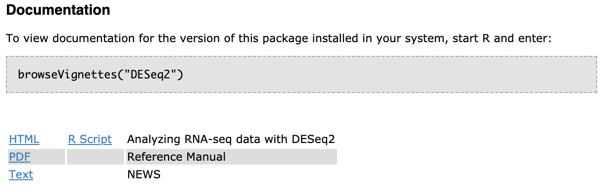

# An Introductory Guide to Troubleshooting Errors

This guide gives you tips and approaches for fixing errors that will arise. We also go through some of the most common errors that 
you will encounter and what they mean. 

## Tips for approaching error

### 1) Identify which line and phrase of code is the source of the error.
If you ran many lines of code, you may not know which part of your code is the 
origin of the error message. Isolating the source of the error and trying to 
better understand your problem, should be your first course of action. 

### 2) Look at the documentation for a function to make sure you are using it correctly
Once you've better determined the origin of the problem, you should use whatever
documentation is available to you regarding the problematic code. When using 
a new function from a package you are unfamiliar with, it's worthwhile to read 
the documentation so you know how to properly use the functions. For Base R 
functions, Tidyverse functions, and *some* Bioconductor packages, the documentation
will give you a lot of the information you need. However, you will likely find
documentation isn't always thorough or clear. 

As we discussed in 
[`intro_to_R` module](https://alexslemonade.github.io/training-modules/intro-to-R-tidyverse/01-intro_to_r.nb.html),
objects have *structures* and *types*. 

#### Use the RStudio help bar


#### For Bioconductor package functions, look at their documents

[DESeq2](https://www.bioconductor.org/packages/release/bioc/html/DESeq2.html) is 
a Bioconductor package we use in RNA-seq module. 




[PDF reference manuals](https://www.bioconductor.org/packages/release/bioc/manuals/DESeq2/man/DESeq2.pdf)

### 3) Google your error message

The main advantage to Googling your errors, is that you likely not the first 
person to encounter the problem. Certain phrases and terms in the error message
will yield more fruitful search results then others. Through trial and error, 
and also Google algorithms learning about what you look for, your search results
can eventually lead you to helpful examples and forums. 

When you do Google, two common sources that will probably come up that we 
recommend looking at are:

#### a) [StackOverflow](https://stackoverflow.com/)
StackOverflow this is a forum where people post

#### b) [GitHub Issues](https://help.github.com/en/articles/about-issues)
People also will post their problems to GitHub issues.

### 4) Google it again
### 
Because it's unlikely your first attempt at Googling will lead you straight
to an answer; this is something you should continue try again. 

### 5) Look at the source code for that function

This should rarely be your first approach to solving a problem, since this
approach is difficult and doesn't always pay off. 
This approach will require a a bit more practice at reading code, so it
may not be the most fruitful approach depending on the readability and 
complexity of the code. 

### 6) Post to an appropriate forum on StackOverflow or a GitHub Issue

After you've tediously mined the internet for solutions to your problem and 
still not resolved your problem, you can post your problem to the internet for
help. 

## A guide to the most common errors

_Example Error 1:_ "No such file or directory"
```
Error in file(file, "rt") : cannot open the connection
In addition: Warning message:
In file(file, "rt") : cannot open file '<FILENAME>': No such file or directory
```

_Example Error 2:_ "could not find function"
```
Error in ... could not find function <FUNCTION_NAME>
```

_Example Error 3:_ "object not found"
```
Error in ... object '<OBJECT_NAME>' not found
```

_Example Error 4:_ "no package"
```
Error in library(<PACKAGE_NAME>) : there is no package called ‘<PACKAGE_NAME>’
```

_Example Error 5:_ "no method for ... object of class"
```
Error in ... no applicable method for <OBJECT_NAME> applied to an object of class <CLASS_OF_OBJECT>
```

_Example Error 6:_ "subscript out of bounds"
```
Error in ... subscript out of bounds
```
