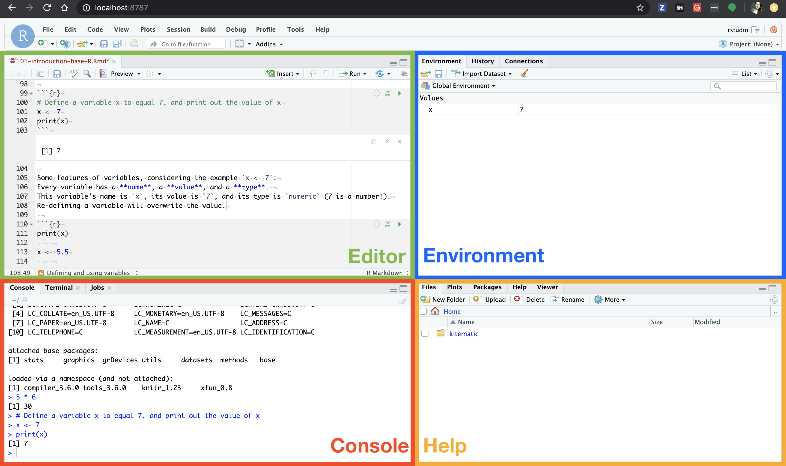
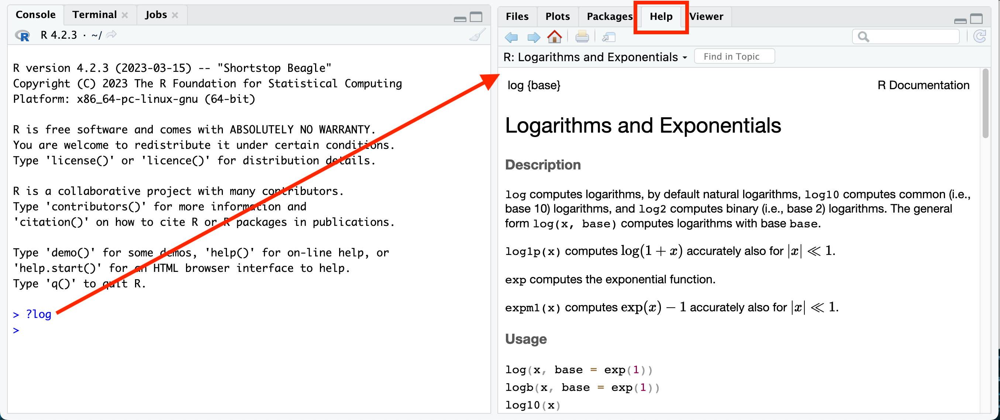

## Objectives

This notebook will demonstrate how to:  

- Navigate the RStudio environment  
- Use R for simple calculations, both mathematical and logical  
- Define and use variables in base R  
- Understand and apply base R functions   
- Understand, define, and use R data types, including vector manipulation and indexing  
- Understand the anatomy of a data frame  

---

#### *More resources for learning R* 

- [Swirl, an interactive tutorial](https://swirlstats.com/)  
- [_R for Data Science_ book](https://r4ds.hadley.nz/)  
- [Tutorial on R, RStudio and R Markdown](https://ismayc.github.io/rbasics-book/)  
- [Handy R cheatsheets](https://www.posit.co/resources/cheatsheets/)  
- [R Markdown website](https://rmarkdown.rstudio.com)  
- [_R Markdown: The Definitive Guide_](https://bookdown.org/yihui/rmarkdown/)  

## What is R?

**R** is a statistical computing language that is _open source_, meaning the underlying code for the language is freely available to anyone. 
You do not need a special license or set of permissions to use and develop code in R. 

R itself is an _interpreted computer language_ and comes with functionality that comes bundled with the language itself, known as **"base R"**.
But there is also rich additional functionality provided by **external packages**, or libraries of code that assist in accomplishing certain tasks and can be freely downloaded and loaded for use. 

In the next notebook and subsequent modules, we will be using a suite of packages collectively known as [**The Tidyverse**](https://tidyverse.org). 
The `tidyverse` is geared towards intuitive data science applications that follow a shared data philosophy.
But there are still many core features of base R which are important to be aware of, and we will be using concepts from both base R and the tidyverse in our analyses, as well as task specific packages for analyses such as gene expression. 

### What is RStudio?

RStudio is a _graphical environment_ ("integrated development environment" or IDE) for writing and developing R code. RStudio is NOT a separate programming language - it is an interface we use to facilitate R programming. 
In other words, you can program in R without RStudio, but you can't use the RStudio environment without R.

For more information about RStudio than you ever wanted to know, see this [RStudio IDE Cheatsheet (pdf)](https://github.com/rstudio/cheatsheets/raw/main/rstudio-ide.pdf).

## The RStudio Environment

The RStudio environment has four main **panes**, each of which may have a number of tabs that display different information or functionality. (their specific location can be changed under Tools -> Global Options -> Pane Layout).
 

1. The **Editor** pane is where you can write R scripts and other documents. Each tab here is its own document.
This is your _text editor_, which will allow you to save your R code for future use. 
Note that change code here will not run automatically until you run it. 

2. The **Console** pane is where you can _interactively_ run R code. 
  + There is also a **Terminal** tab here which can be used for running programs outside R on your computer
  
3. The **Environment** pane primarily displays the variables, sometimes known as _objects_ that are defined during a given R session, and what data or values they might hold.

4. The final pane, **Files, Plots, Help, ...**, has several pretty important tabs:
    + The **Files** tab shows the structure and contents of files and folders (also known as directories) on your computer.
    + The **Plots** tab will reveal plots when you make them
    + The **Packages** tab shows which installed packages have been loaded into your R session
    + The **Help** tab will show the help page when you look up a function
    + The **Viewer** tab will reveal compiled R Markdown documents

## Basic Calculations

### Mathematical operators

The most basic use of R is as a regular calculator:

| Operation | Symbol |
|-----------|--------|
| Add  | `+` | 
| Subtract  | `-` | 
| Multiply  | `*` | 
| Divide  | `/` | 
| Exponentiate | `^` or `**` | 

For example, we can do some simple multiplication like this. 
When you execute code within the notebook, the results appear beneath the code. 
Try executing this chunk by clicking the *Run* button within the chunk or by 
placing your cursor inside it and pressing *Cmd+Shift+Enter* on a Mac, or *Ctrl+Shift+Enter* on a PC.

```{r calculator}
5 * 6
```

Use the console to calculate other expressions. Standard order of operations applies (mostly), and  you can use parentheses `()` as you might expect (but not brackets `[]` or braces`{}`, which have special meanings). Note however, that you must **always** specify multiplication with `*`; implicit multiplication such as `10(3 + 4)` or `10x` will not work and will generate an error, or worse.

```{r expressions, live = TRUE}

```


### Defining and using variables 

To define a variable, we use the _assignment operator_ which looks like an arrow: `<-`, for example `x <- 7` takes the value on the right-hand side of the operator and assigns it to the variable name on the left-hand side. 

```{r var-define, live = TRUE}
# Define a variable x to equal 7, and print out the value of x

# We can have R repeat back to us what `x` is by just using `x`

```

Some features of variables, considering the example `x <- 7`:
Every variable has a **name**, a **value**, and a **type**. 
This variable's name is `x`, its value is `7`, and its type is `numeric` (7 is a number!).
Re-defining a variable will overwrite the value.

```{r var-redefine}
x <- 5.5

x
```

We can modify an existing variable by reassigning it to its same name. 
Here we'll add `2` to `x` and reassign the result back to `x`. 

```{r var-modify, live = TRUE}

```

### Variable naming note:
As best you can, it is a good idea to make your variable names informative (e.g. `x` doesn't mean anything, but `sandwich_price` is meaningful... if we're talking about the cost of sandwiches, that is..). 

### Comments

Arguably the __most important__ aspect of your coding is comments: Small pieces of explanatory text you leave in your code to explain what the code is doing and/or leave notes to yourself or others. 
Comments are invaluable for communicating your code to others, but they are most important for **Future You**. 
Future You comes into existence about one second after you write code, and has no idea what on earth Past You was thinking. 

Comments in R code are indicated with pound signs (*aka* hashtags, octothorps). R will _ignore_ any text in a line after the pound sign, so you can put whatever text you like there.

```{r comments}
22/7 # not quite pi

# If we need a better approximation of pi, we can use Euler's formula
# This uses atan(), which calculates arctangent.
20 * atan(1/7) + 8 * atan(3/79) 
```

Help out Future You by adding lots of comments! 
Future You next week thinks Today You is an idiot, and the only way you can convince Future You that Today You is reasonably competent is by adding comments in your code explaining why Today You is actually not so bad.

## Functions
We can use pre-built computation methods called "functions" for other operations. 
Functions have the following format, where the _argument_ is the information we are providing to the function for it to run. 
An example of this was the `atan()` function used above.

```r
function_name(argument)
```

To learn about functions, we'll examine one called `log()` first. 

To know what a function does and how to use it, use the question mark which will reveal documentation in the **help pane**: `?log`
 

The documentation tells us that `log()` is derived from `{base}`, meaning it is a function that is part of base R. 
It provides a brief description of what the function does and shows several examples of to how use it.

In particular, the documentation tells us about what argument(s) to provide:

+ The first _required_ argument is the value we'd like to take the log of, by default its _natural log_
+ The second _optional_ argument can specify a different base rather than the default `e`.

Functions also _return_ values for us to use. 
In the case of `log()`, the returned value is the log'd value the function computed.

```{r log}
log(73)
```

Here we can specify an _argument_ of `base` to calculate log base 3. 

```{r log3}
log(81, base = 3)
```

If we don't specify the _argument_ names, it assumes they are in the order that `log` defines them. 
See `?log` to see more about its arguments. 

```{r log2, live = TRUE}

```

We can switch the order if we specify the argument names. 

```{r log-order}
log(base = 10, x = 4342)
```

We can also provide variables as arguments in the same way as the raw values. 

```{r log-variable}
meaning <- 42
log(meaning)
```

## Working with variables

### Variable Types

Variable types in R can sometimes be _coerced_ (converted) from one type to another.

```{r}
# Define a variable with a number
x <- 15
```

The function `class()` will tell us the variable's type.

```{r}
class(x)
```

Let's coerce it to a character. 

```{r}
x <- as.character(x)
class(x)
```

See it now has quotes around it? It's now a character and will behave as such.

```{r}
x
```

Use this chunk to try to perform calculations with `x`, now that it is a character, what happens? 

```{r live = TRUE}
# Try to perform calculations on `x`
```

But we can't coerce everything:

```{r}
# Let's create a character variable
x <- "look at my character variable"
```

Let's try making this a numeric variable:

```{r coerce-char, error=TRUE}
x <- as.numeric(x)
```

Print out `x`.

```{r}
x
```

R is telling us it doesn't know how to convert this to a numeric variable, so it has returned `NA` instead.

For reference, here's a summary of some of the most important variable types. 

| Variable Type | Definition | Examples | Coercion |
|---------------|------------|----------| --------|
| `numeric`       | Any number value | `5`<br>`7.5` <br>`-1`| `as.numeric()`
| `integer`       | Any _whole_ number value (no decimals) | `5` <br> `-100` | `as.integer()`
|`character`      | Any collection of characters defined within _quotation marks_. Also known as a "string". | `"a"` (a single letter) <br>`"stringofletters"` (a whole bunch of characters put together as one) <br> `"string of letters and spaces"` <br> `"5"` <br> `'single quotes are also good'` | `as.character()`
|`logical`      | A value of `TRUE`, `FALSE`, or `NA` | `TRUE` <br> `FALSE` <br> `NA` (not defined) | `as.logical()` 
|`factor`       | A special type of variable that denotes specific categories of a categorical variable | (stay tuned..) | `as.factor()`

### Vectors

You will have noticed that all your computations tend to pop up with a `[1]` preceding them in R's output. 
This is because, in fact, all (ok mostly all) variables are _by default_  vectors, and our answers are the first (in these cases only) value in the vector. 
As vectors get longer, new index indicators will appear at the start of new lines. 

```{r}
# This is actually an vector that has one item in it.
x <- 7
```

```{r vector-length}
# The length() functions tells us how long an vector is:
length(x)
```

We can define vectors with the function `c()`, which stands for "combine". 
This function takes a comma-separated set of values to place in the vector, and returns the vector itself:

```{r make-vector}
my_numeric_vector <- c(1, 1, 2, 3, 5, 8, 13, 21)
my_numeric_vector
```

We can build on vectors in place by redefining them:

```{r fibbonacci, live = TRUE}
# add the next two Fibonacci numbers to the series.

```

We can pull out specific items from an vector using a process called _indexing_, which uses brackets `[]` to specify the position of an item. 

```{r subset1}
# Grab the fourth value from my_numeric_vector
# This gives us an vector of length 1 
my_numeric_vector[4]
```

Colons are also a nice way to quickly make ordered numeric vectors
Use a colon to specify an inclusive range of indices
This will return an vector with 2, 3, 4, and 5.

```{r subset-many}
my_numeric_vector[2:5]
```

One major benefit of vectors is the concept of **vectorization**, where R by default performs operations on the _entire vector at once_. 
For example, we can get the log of all numbers 1-20 with a single, simple call, and more!

```{r vectorize}
values_1_to_20 <- 1:20
```


```{r vectorize-log, live = TRUE}
# calculate the log of values_1_to_20

```

Finally, we can apply logical expressions to vectors, just as we can do for single values.
The output here is a logical vector telling us whether each value in example_vector is TRUE or FALSE

```{r vector-compare}
# Which values are <= 3?
values_1_to_20 <= 3
```

There are several key functions which can be used on vectors containing numeric values, some of which are below.

+ `mean()`: The average value in the vector
+ `min()`: The minimum value in the vector
+ `max()`: The maximum value in the vector
+ `sum()`: The sum of all values in the vector

We can try out these functions on the vector `values_1_to_20` we've created. 

```{r vector-funcs}
mean(values_1_to_20)

# Try out some of the other functions we've listed above 

```

### A note on variable naming

We have learned functions such as `c`, `length`, `sum`, and etc. 
Imagine defining a variable called `c`: This will work, but it will lead to a 
lot of unintended bugs, so it's best to avoid this. 

### The `%in%` logical operator 

`%in%` is useful for determining whether a given item(s) are in an vector.

```{r in-operator}
# is `7` in our vector? 
7 %in% values_1_to_20
```

```{r in2, live = TRUE}
# is `50` in our vector? 

```

We can test a vector of values being within another vector of values. 

```{r vector-in, live = TRUE}

# Are these values in our vector?

```

## Data frames

_Data frames are one of the most useful tools for data analysis in R._ 
They are tables which consist of rows and columns, much like a _spreadsheet_. 
Each column is a variable which behaves as a _vector_, and each row is an observation. 
We will begin our exploration with dataset of measurements from three penguin species measured, which we can find in the [`palmerpenguins` package](https://allisonhorst.github.io/palmerpenguins/). 
We'll talk more about packages soon!
To use this dataset, we will load it from the `palmerpenguins` package using a `::` (more on this later) and assign it to a variable named `penguins` in our current environment.

```{r penguin-library}
penguins <- palmerpenguins::penguins
```

 Artwork by [@allison_horst](https://twitter.com/allison_horst)

### Exploring data frames

The first step to using any data is to look at it!!! 
RStudio contains a special function `View()` which allows you to literally view a variable.
You can also click on the object in the environment pane to see its overall properties, or click the table icon on the object's row to automatically view the variable. 

Some useful functions for exploring our data frame include:

+ `head()` to see the first 6 rows of a data frame. Additional arguments supplied can change the number of rows.
+ `tail()` to see the last 6 rows of a data frame. Additional arguments supplied can change the number of rows.
+ `names()` to see the column names of the data frame.
+ `nrow()` to see how many rows are in the data frame
+ `ncol()` to see how many columns are in the data frame.

We can additionally explore _overall properties_ of the data frame with two different functions: `summary()` and `str()`.

This provides summary statistics for each column:

```{r penguins-summary}
summary(penguins)
```

This provides a short view of the **str**ucture and contents of the data frame.

```{r penguins-str}
str(penguins)
```

You'll notice that the column `species` is a _factor_: This is a special type of character variable that represents distinct categories known as "levels". 
We have learned here that there are three levels in the `species` column: Adelie, Chinstrap, and Gentoo.
We might want to explore individual columns of the data frame more in-depth. 
We can examine individual columns using the dollar sign `$` to select one by name:

```{r penguins-subset}
# Extract bill_length_mm as a vector
penguins$bill_length_mm

# indexing operators can be used on these vectors too
penguins$bill_length_mm[1:10]
```

We can perform our regular vector operations on columns directly.

```{r penguins-col-mean, live = TRUE}
# calculate the mean of the bill_length_mm column

```

We can also calculate the full summary statistics for a single column directly. 

```{r penguins-col-summary, live = TRUE}
# show a summary of the bill_length_mm column

```

Extract `species` as a vector and subset it to see a preview.

```{r penguins-col-subset, live = TRUE}
# get the first 10 values of the species column

```

And view its _levels_ with the `levels()` function.

```{r penguin-levels}
levels(penguins$species)
```

## Files and directories

In many situations, we will be reading in tabular data from a file and using it as a data frame. 
To practice, we will read in a file we will be using in the next notebook as well, `gene_results_GSE44971.tsv`, in the `data` folder. 
File paths are relative to the location where this notebook file (.Rmd) is saved.

Here we will use a function, `read_tsv()` from the `readr` package.
Before we are able to use the function, we have to load the package using `library()`. 

```{r readr}
library(readr)
```

`file.path()` creates a properly formatted file path by adding a path separator (`/` on Mac and Linux operating systems, the latter of which is the operating system that our RStudio Server runs on) between separate folders or directories.
Because file path separators can differ between your computer and the computer of someone who wants to use your code, we use `file.path()` instead of typing out `"data/gene_results_GSE44971.tsv"`.
Each _argument_ to `file.path()` is a directory or file name.
You'll notice each argument is in quotes, we specify `data` first because the file, `gene_results_GSE44971.tsv` is in the `data` folder. 

```{r file.path}
file.path("data", "gene_results_GSE44971.tsv")
```

As you can see above, the result of running `file.path()` is that it _creates a string_ with an accurately-formatted path for your file system.
This string can be used moving forward when you need to refer to the path to your file.
Let's go ahead and store this file path as a variable in our environment. 

```{r file.path-variable}
gene_file_path <- file.path("data", "gene_results_GSE44971.tsv")
```

Now we are ready to use `read_tsv()` to read the file into R.
The resulting data frame will be stored in a variable named `stats_df`.
Note the `<-` (assignment operator!) is responsible for saving this to our global environment. 

```{r read-stats}
# read in the file `gene_results_GSE44971.tsv` from the data directory
stats_df <- read_tsv(gene_file_path)
```

Take a look at your environment panel to see what `stats_df` looks like. 
We can also print out a preview of the `stats_df` data frame here. 

```{r show-stats, live = TRUE}
# display stats_df

```

### Session Info

At the end of every notebook, you will see us print out `sessionInfo`. 
This aids in the reproducibility of your code by showing exactly what packages 
and versions were being used the last time the notebook was run.

```{r}
sessionInfo()
```
