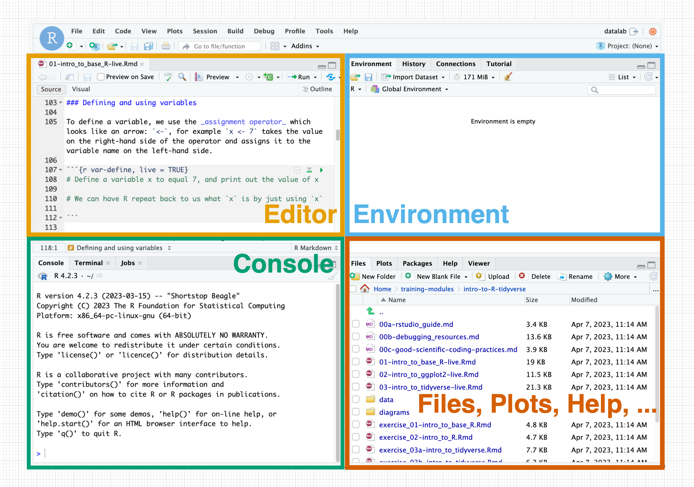

## Objectives
+ Navigate the RStudio environment
+ Use R for simple calculations, both mathematical and logical
+ Understand and apply base R functions
+ Understand, define, and use R datatypes, including vector manipulation and indexing
+ Understand the anatomy of a data frame

#### *More resources for learning R* 
+ [Swirl, an interactive tutorial](https://swirlstats.com/)  
+ [R Markdown](http://rmarkdown.rstudio.com)  
+ [R for Data Science](https://r4ds.had.co.nz/)  
+ [Tutorial on R, RStudio and R Markdown](https://ismayc.github.io/rbasics-book/)  
+ [Handy R cheatsheets](https://www.rstudio.com/resources/cheatsheets/)  
+ [R Notebooks tutorial](https://bookdown.org/yihui/rmarkdown/)  

## What is R?

**R** is a statistical computing language that is _open source_, meaning the underlying code for the language is freely available to anyone. 
You do not need a special license or set of permissions to use and develop code in R. 

R itself is an _interpreted computer language_ and comes with functionality that comes bundled with the language itself, known as **"base R"**.
But there is also rich additional functionality provided by **external packages**, or libraries of code that assist in accomplishing certain tasks and can be freely downloaded and loaded for use. 

In the next notebook and subsequent modules, we will be using a suite of packages collectively known as [**The Tidyverse**](http://tidyverse.org). 
The `tidyverse` is geared towards intuitive data science applications that follow a shared data philosophy.
But, there are still certain core features of base R which are important to be aware of.

### What is RStudio?

RStudio is a _graphical environment_ ("integrated development environment" or IDE) for writing and developing R code. RStudio is NOT a separate programming language - it is an interface we use to facilitate R programming. 
In other words, you can program in R without RStudio, but you can't use the RStudio environment without R.

For more information about RStudio than you ever wanted to know, see this [RStudio IDE Cheatsheet](https://d33wubrfki0l68.cloudfront.net/0dc0efccfaf638de8be4ce43e2bab8a91541d3d2/c4fdc/wp-content/uploads/2018/08/rstudio-ide.png).

## The RStudio Environment

The RStudio environment has four main **panes** (their specific location can be changed under Tools -> Global Options -> Pane Layout).
 

1. The **editor** pane is where you can write R scripts and other documents. 
This is your _text editor_, which will allow you to save your R code for future use. 
Note that change code here will not run automatically until you runu it. 

2. The **console** pane is where you can _interactively_ run R code. 

3. The **environment** pane primarily displays the variables, sometimes known as _objects_ you define during a given R session. 

4. The **help viewer** pane has several tabs all of which are pretty important:
    + The **files** tab shows the structure and contents of your _current directory_ (i.e. folder).
    + The **plots** tab will reveal plots when you make them
    + The **packages** tab shows which installed packages have been loaded into your R session
    + The **help** tab will show the help page when you look up a function
    + The **viewer** pane will reveal compiled RMarkdown documents 

### Comments

R will _ignore_ comments, which are indicated with hashtags. 
Arguably the __most important__ aspect of your coding is comments: Small pieces of explanatory text you leave in your code to explain what the code is doing and/or leave notes to yourself or others. 
Comments are invaluable for communicating your code to others, but they are most important for **Future You**. 
Future You comes into existence about one second after you write code, and has no idea what on earth Past You was thinking. 
Help out Future You by adding lots of comments! 
Future You next week thinks Today You is an idiot, and the only way you can convince Future You that Today You is reasonably competent is by adding comments in your code explaining why Today You is actually not so bad.

## Basic Calculations

### Mathematical operators

The most basic use of R is as a regular calculator:

| Operation | Symbol |
|-----------|--------|
| Add  | `+` | 
| Subtract  | `-` | 
| Multiply  | `*` | 
| Divide  | `/` | 
| Exponentiate | `^` or `**` | 

For example, we can do some simple multiplication like this. 
In this and following code chunks, the section with the gray background is R code, and the following white-background chunk is the code's output.

```{r}
5 * 6
```

### Defining and using variables 

To define a variable, we use the _assignment operator_ which looks like an arrow: `<-`, for example `x <- 7` takes the value on the right-hand side of the operator and assigns it to the variable name on the left-hand side. 
The opposite is also possible, e.g. ` 7 -> x`, as long as the arrow is pointing towards the variable name.

```{r}
# Define a variable x to equal 7, and print out the value of x
x <- 7
print(x)
```

Some features of variables, considering the example `x <- 7`:
Every variable has a **name**, a **value**, and a **type**. 
This variable's name is `x`, its value is `7`, and its type is `numeric` (7 is a number!).
Re-defining a variable will overwrite the value.
 
```{r}
print(x)
    
x <- 5.5
    
print(x)
    
```

### Variable naming note:
As best you can, it is a good idea to make your variable names informative (e.g. `x` doesn't mean anything, but `cost_of_sandwich` is meaningful... if we're talking about sandwich prices, that is..). 

## Functions
We can use pre-built computation methods called "functions" for other operations. 
In fact, we've already seen and used one - the `print()` function.
Functions have the following format, where the _argument_ is the information we are providing to the function for it to run.

```{r, example-function, eval=FALSE}
function_name(argument)
```

To learn about functions, we'll examine one called `log()` first. 

To know what a function does and how to use it, use the question mark which will reveal documentation in the **help pane**: `?log`
 

The documentation tells us that `log()` is derived from `{base}`, meaning it is a function that is part of base R. 
It provides a brief description of what the function does and shows several examples of to how use it.

In particular, documentation tells about how what argument(s) to provide:
+ The first _required_ argument is the value we'd like to take the log of, by default its _natural log_
+ The second _optional_ argument can specify a different base rather than the default `e`.

Functions also _return_ values for us to use. In the case of `log()`, the returned value is the log'd value the function computed.

## Working with variables

### Variable Types

Here are some of the most important types we'll need to know:

| Variable Type | Definition | Examples | Coersion |
|---------------|------------|----------| --------|
| `numeric`       | Any number value | `5`<br>`7.5` <br>`-1`| `as.numeric()`
| `integer`       | Any _whole_ number value (no decimals) | `5` <br> `-100` | `as.integer()`
|`character`      | Any collection of characters defined within _quotation marks_. Also known as a "string". | `"a"` (a single letter) <br>`"stringofletters"` (a whole bunch of characters put together as one) <br> `"string of letters and spaces"` <br> `"5"` <br> `'single quotes are also good'` | `as.character()`
|`logical`      | A value of `TRUE`, `FALSE`, or `NA` | `TRUE` <br> `FALSE` <br> `NA` (not defined) | `as.logical()` 
|`factor`       | A special type of variable that denotes specific categories of a categorical variable | (stay tuned..) | `as.factor()`

Variable types in R can sometimes be _coerced_ (converted) from one type to another.

```{r, error=TRUE}
# Define a variable with a number
x <- 15
```

The function `class()` will tell us the variable's type

```{r}
class(x)
```

Let's coerce it to a character. 

```{r}
x <- as.character(x)
class(x)
print(x) # See it now has quotes around it? It's now a character and will behave as such
```

Use this chunk to try to perform calculations with `x`, now that it is a character, what happens? 

```{r}
# Try to perform calculations on `x`
```

But we can't coerce everything:

```{r, error=TRUE}
# Let's create a character variable
x <- "look at my character variable"
```

Let's try making this a numeric variable:

```{r, error=TRUE}
x <- as.numeric(x)
```

Print out `x`.

```{r}
x
```

R is telling us it doesn't know how to convert this to a numeric variable, so it has returned `NA` instead.

### Logical variables and operators

One of the most important variable types are _logical variables_ (known as "boolean" in many other languages). 
They help us to compare different quantities and there is a special set of operators for performing comparisons that _return logical values_:

| Operator | What it does |
|----------|--------------|
 `==`           |  Tests if two quantities are equal |
  `>` and `<`   |  Tests if one quantity is greater than or less than another |
  `>=` and `<=` |  Tests if one quantity is _greater than or equal to_ or _less than or equal to_ another |
`!`             |  Negates an operation |  

Let's examine their usage:

```{r, error=TRUE}
5 == 5

7 >= 9

4 < 8

!(4 > 8)  ## 4 is not greater than 8. Parenthesis part is FALSE, but the `!` changes it to TRUE
```

While `==` is a question, a single `=` is a declaration. 

```{r, error=TRUE}
# R says you can't define a variable called 4 and make it equal 3. 
# 4 is already a thing. It's 4.
4 = 3
```

### Vectors

You will have noticed that all your computations tend to pop up with a `[1]` preceding them in R's output. 
This is because, in fact, all (ok mostly all) variables are _by default_  vectors, and our answers are the first (in these cases only) value in the vector. 
As vectors get longer, new index indicators will appear at the start of new lines. 

```{r}
# This is actually an vector that has one item in it.
x <- 7

# The length() functions tells us how long an vector is:
length(x)
```

We can define vectors with the function `c()`, which stands for "combine". 
This function takes a comma-separated set of values to place in the vector, and returns the vector itself:

```{r}
my_numeric_vector <- c(1, 1, 2, 3, 5, 8, 13, 21)
my_numeric_vector
```

We can build on vectors in place by redefining them
 
```{r}
my_numeric_vector <- c(my_numeric_vector, 10000)
my_numeric_vector
```

We can pull out specific items from an vector using a process called _indexing_, which uses brackets `[]` to specify the position of an item. 

```{r}
# Grab the FOURTH value from my_numeric_vector
# This gives us an vector of length 1 
my_numeric_vector[4]
```

Colons are also a nice way to quickly make ordered numeric vectors
Use a colon to specify an inclusive range of indices
This will return an vector with 2, 3, 4, and 5.

```{r}
my_numeric_vector[2:5]
```

One major benefit of vectors is the concept of **vectorization**, where R by default performs operations on the _entire vector at once_. 
For example, we can get the log of all numbers 1-2 with a single, simple call, and more!

```{r}
values_1_to_20 <- 1:20

log(values_1_to_20)
```

Finally, we can apply logical expressions to vectors, just we can do for single values.
The output here is a logical vector telling us whether each value in example_vector is TRUE or FALSE

```{r}
# Which values are <= 3?
values_1_to_20 <= 3
```

There are several key functions which can be used on vectors containing numeric values, some of which are below.

+ `mean()`: The average value in the vector
+ `min()`: The minumum value in the vector
+ `max()`: The maximum value in the vector
+ `sum()`: The sum of all values in the vector

We can try out these functions on the vector `values_1_to_20` we've created. 

```{r}
mean(values_1_to_20)

# Try out some of the other functions we've listed above 
```

### A note on variable naming
We have learned functions such as `c`, `length`, `sum`, and etc. 
Imagine defining a variable called `c`: This will work, but it will lead to a 
lot of unintended bugs, so its best to avoid this. 

### The `%in%` logical operator 

`%in%` is useful for determing whether a given item(s) are in an vector.

```{r}
# is `7` in our vector? 
7 %in% values_1_to_20

# is `50` in our vector? 
50 %in% values_1_to_20
```

We can test a vector of values being within another vector of values. 

```{r}
# Are these values in our vector? 
c(1:3, 7, 50) %in% values_1_to_20
```

## Data frames

_Data frames are the most fundamental unit of data analysis in R._ 
They are tables which consist of rows and columns, much like a _spreadsheet_. 
Each column is a variable which behaves as a _vector_, and each row is an observation. 
We will begin our exploration with the old trusted dataset `iris`, which comes with R. 
Learn about this dataset using the standard help approach of `?iris`.

### Exploring and indexing data frames

The first step to using any data is to look at it!!! 
RStudio contains a special function `View()` which allows you to literally view a variable.
You can click on the object in the environment pane. 

Some useful functions for exploring our data.frame include:

+ `head()` to see the first 6 rows of a data frame. Additional arguments supplied can change the number of rows.
+ `tail()` to see the last 6 rows of a data frame. Additional arguments supplied can change the number of rows.
+ `names()` to see the column names of the data frame.
+ `nrow()` to see how many rows are in the data frame
+ `ncol()` to see how many columns are in the data frame.

We can additionally explore _overall properties_ of the data frame with two different functions: `summary()` and `str()`.

```{r}
## This provides summary statistics for each column (we'll learn more about these quantities soon)
summary(iris)

## This provides a short view of the contents of the data frame
str(iris)
```

You'll notice that the column `Species` is a _factor_: This is a special type of character variable that represents distinct categories known as "levels". 
We have learned here that there are three levels in the `Species` column: setosa, versicolor, and virginica. 

<br>
We might want to explore individual columns of the data frame more in-depth. 
We can _index_ these columns using the dollar sign `$`:

```{r}
## Extract Sepal.Length as a vector
iris$Sepal.Length
```

We can perform our regular vector operations on columns directly.

```{r}
mean(iris$Sepal.Length)
```

We can also achieve summary statistics for a single column directly. 

```{r}
summary(iris$Sepal.Length)
```

Extract Species as a vector.

```{r}
iris$Species
```

And view its _levels_ with the levels() function.

```{r}
levels(iris$Species)
```

At the end of every notebook, you will see us print out Session info. 
This aids in the reproducibilty of your code by showing exactly what packages 
and versions were being used the last time the notebook was run.

### Session Info

```{r}
sessionInfo()
```

