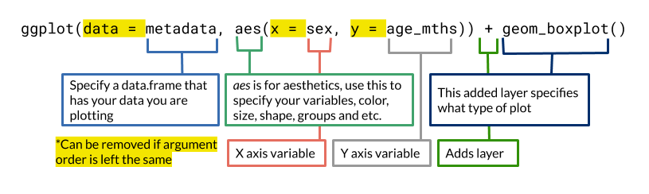

## Objectives

This notebook will demonstrate how to:

- Load and use R packages
- Read in and perform simple manipulations of data frames
- Use `ggplot2` to plot and visualize data
- Customize plots using features of `ggplot2`

---

We'll use a real gene expression dataset to get comfortable making visualizations using ggplot2.
We've [performed differential expression analyses](./scripts/00-setup-intro-to-R.R) on a pre-processed [astrocytoma microarray dataset](https://www.refine.bio/experiments/GSE44971/gene-expression-data-from-pilocytic-astrocytoma-tumour-samples-and-normal-cerebellum-controls).
We'll start by making a volcano plot of differential gene expression results from this experiment.
We performed three sets of contrasts:

1) `sex` category contrasting: `Male` vs `Female`
2) `tissue` category contrasting : `Pilocytic astrocytoma tumor` samples vs `normal cerebellum` samples
3) An interaction of both `sex` and `tissue`.

**More ggplot2 resources:**

- [ggplot2 website](https://ggplot2.tidyverse.org/)
- [Handy cheatsheet for ggplot2 (pdf)](https://github.com/rstudio/cheatsheets/raw/main/data-visualization.pdf)
- [_Data Visualization, A practical introduction_](https://socviz.co/)
- [Data visualization chapter of _R for Data Science_](https://r4ds.hadley.nz/data-visualize.html)
- [ggplot2 online tutorial](http://r-statistics.co/Complete-Ggplot2-Tutorial-Part1-With-R-Code.html)

## Set Up

We saved these results to a tab separated values (TSV) file called `gene_results_GSE44971.tsv`.
It's been saved to the `data` folder.
File paths are relative to where this notebook file (.Rmd) is saved.
So we can reference it later, let's make a variable with our data directory name.

```{r}
data_dir <- "data"
```

Let's declare our output folder name as its own variable.

```{r}
plots_dir <- "plots"
```

We can also create a directory if it doesn't already exist.

There's a couple ways that we can create that directory from within R.
One way is to use the base R function `dir.create()`, which (as the name suggests) will create a directory.
But this function assumes that the directory does not yet exist, and it will throw an error if you try to create a directory that already exists.
To avoid this error, we can place the directory creation inside an `if` statement, so the code will only run if the directory does not yet exist:

```{r createif}
# The if statement here tests whether the plot directory exists and
# only executes the expressions between the braces if it does not.
if (!dir.exists(plots_dir)) {
  dir.create(plots_dir)
}
```

In this notebook we will be using functions from the Tidyverse set of packages, so we need to load in those functions using `library()`.
We could load the individual packages we need one at a time, but it is convenient for now to load them all with the `tidyverse` "package," which groups many of them together as a shortcut.
Keep a look out for where we tell you which individual package different functions come from.

```{r tidyverse}
library(tidyverse)
```

## Read in the differential expression analysis results file

Here we are using a `tidyverse` function `read_tsv()` from the `readr` package.
Like we did in the previous notebook, we will store the resulting data frame as `stats_df`.

```{r read-stats}
# read in the file `gene_results_GSE44971.tsv` from the data directory
stats_df <- read_tsv(file.path(
  data_dir,
  "gene_results_GSE44971.tsv"
))
```

We can take a look at a column individually by using a `$`.
Note we are using `head()` so the whole thing doesn't print out.

```{r column}
head(stats_df$contrast)
```

If we want to see a specific set of values, we can use brackets with the indices of the values we'd like returned.

```{r}
stats_df$avg_expression[6:10]
```

Let's look at some basic statistics from the data set using `summary()`

```{r stats-summary, live = TRUE}
# summary of stats_df

```

The statistics for `contrast` are not very informative, so let's do that again with just the `contrast` column after converting it to a `factor`
```{r factor-summary, live = TRUE}
# summary of `stats_df$contrast` as a factor

```

## Set up the dataset

Before we make our plot, we want to calculate a set of new values for each row; transformations of the raw statistics in our table.
To do this we will use a function from the `dplyr` package called `mutate()` to make a new column of -log10 p values.

```{r mutate}
# add a `neg_log10_p` column to the data frame
stats_df <- mutate(stats_df, # data frame we'd like to add a variable to
  neg_log10_p = -log10(p_value) # column name and values
)
```

Let's filter to only `male_female` contrast data.
First let's try out a logical expression:

```{r eval = FALSE}
stats_df$contrast == "male_female"
```

Now we can try out the `filter()` function.
Notice that we are not assigning the results to a variable, so this filtered dataset will not be saved to the environment.

```{r filter, live = TRUE}
# filter stats_df to "male_female" only

```

Now we can assign the results to a new data frame: `male_female_df`.

```{r filter-save, live = TRUE}
# filter and save to male_female_df

```

## Plotting this data

Let's make a volcano plot with this data.
First let's take a look at only the tumor vs. normal comparison.
Let's save this as a separate data frame by assigning it a new name.

```{r filter-tumor}
tumor_normal_df <- filter(stats_df, contrast == "astrocytoma_normal")
```

To make this plot we will be using functions from the `ggplot2` package, the main plotting package of the tidyverse.
We use the first function, `ggplot()` to define the data that will be plotted.
Remember, the name of this package is `ggplot2`, but the function we use is called `ggplot()` without the `2`.
`ggplot()` takes two main arguments:

1. `data`, which is the data frame that contains the data we want to plot.
2. `mapping`, which is a special list made with the `aes()` function to describe which values will be used for each **aes**thetic component of the plot, such as the x and y coordinates of each point.
(If you find calling things like the x and y coordinates "aesthetics" confusing, don't worry, you are not alone.)
Specifically, the `aes()` function is used to specify that a given column (variable) in your data frame be mapped to a given aesthetic component of the plot.


```{r ggplot-base}
ggplot(
  tumor_normal_df, # This first argument is the data frame with the data we want to plot
  aes(
    x = log_fold_change, # This is the column name of the values we want to use
    # for the x coordinates
    y = neg_log10_p
  ) # This is the column name of the data we want for the y-axis
)
```

You'll notice this plot doesn't have anything on it because we haven't
specified a plot type yet.
To do that, we will add another ggplot layer with `+` which will specify exactly what we want to plot.
A volcano plot is a special kind of scatter plot, so to make that we will want to plot individual points, which we can do with `geom_point()`.

```{r ggplot-points, live = TRUE}
# This first part is the same as before

  # Now we are adding on a layer to specify what kind of plot we want

```

Here's a brief summary of ggplot2 structure.


### Adjust our ggplot

Now that we have a base plot that shows our data, we can add layers on to it and adjust it.
We can adjust the color of points using the `color` aesthetic.

```{r ggplot-color, live = TRUE}

```

Because we have so many points overlapping one another, we will want to adjust
the transparency, which we can do with an `alpha` argument.

```{r ggplot-alpha, live = TRUE}

```

Notice that we added the alpha within the `geom_point()` function, not to the `aes()`.
We did this because we want all of the points to have the same level of transparency, and it will not vary depending on any variable in the data.
We can also change the background and appearance of the plot as a whole by adding a `theme`.

```{r ggplot-theme}
ggplot(
  tumor_normal_df,
  aes(
    x = log_fold_change,
    y = neg_log10_p,
    color = avg_expression
  )
) +
  geom_point(alpha = 0.2) +
  # Add on this set of appearance presets to make it pretty
  theme_bw() 
```

We are not limited to a single plotting layer.
For example, if we want to add a horizontal line to indicate a significance cutoff, we can do that with `geom_hline()`.
For now, we will choose the value of 5.5 (that is close to a Bonferroni correction) and add that to the plot.

```{r ggplot-hline, live = TRUE}

```

We can change the x and y labels using a few different strategies.
One approach is to use functions `xlab()` and `ylab()` individually to set, respectively, the x-axis label and the the y-axis label.


```{r ggplot-label-1}
ggplot(
  tumor_normal_df,
  aes(
    x = log_fold_change,
    y = neg_log10_p,
    color = avg_expression
  )
) +
  geom_point(alpha = 0.2) +
  geom_hline(yintercept = 5.5, color = "darkgreen") +
  theme_bw() +
  # Add labels with separate functions:
  xlab("log2 Fold Change Tumor/Normal") +
  ylab("-log10 p value")
```


Alternatively, we can use the `ggplot2` function `labs()`, which takes individual arguments for each label we want want to set.
We can also include the argument `title` to add an overall plot title.

```{r ggplot-label-2, live = TRUE}

  # Add x and y labels and overall plot title with arguments to labs():

```

Something great about the `labs()` function is you can also use it to specify labels for your *legends* derived from certain aesthetics.
In this plot, our legend is derived from a *color aesthetic*, so we can specify the keyword "color" to update the legend title.

```{r ggplot-label-aes}
ggplot(
  tumor_normal_df,
  aes(
    x = log_fold_change,
    y = neg_log10_p,
    color = avg_expression
  )
) +
  geom_point(alpha = 0.2) +
  geom_hline(yintercept = 5.5, color = "darkgreen") +
  theme_bw() +
  # Add x and y labels and overall plot title (and more!) with arguments to labs():
  labs(
    x = "log2 Fold Change Tumor/Normal",
    y = "-log10 p value",
    title = "Astrocytoma Tumor vs Normal Cerebellum",
    # Use the color keyword to label the color legend
    color = "Average expression"
  )

```


Use this chunk to make the same kind of plot as the previous chunk but instead plot the male female contrast data, that is stored in `male_female_df`.

```{r mf-volcano, live = TRUE}
# Use this chunk to make the same kind of volcano plot, but with the male-female contrast data.

```


Turns out, we don't have to plot each contrast separately, instead, we can use the original data frame that contains all three contrasts' data, `stats_df`, and add a `facet_wrap` to make each contrast its own plot.

```{r ggplot-facets}
ggplot(
  stats_df, # Switch to the bigger data frame with all three contrasts' data
  aes(
    x = log_fold_change,
    y = neg_log10_p,
    color = avg_expression
  )
) +
  geom_point(alpha = 0.2) +
  geom_hline(yintercept = 5.5, color = "darkgreen") +
  theme_bw() +
  facet_wrap(vars(contrast)) +
  labs(
    # Now that this includes the other contrasts,
    # we'll make the x-axis label more general
    x  = "log2 Fold Change", 
    y = "-log10 p value",
    color = "Average expression"
  ) +
  coord_cartesian(xlim = c(-25, 25)) # zoom in on the x-axis
```

We can store the plot as an object in the global environment by using `<-` operator.
Here we will call this `volcano_plot`.

```{r ggplot-store-object}
# We are saving this plot to a variable named `volcano_plot`
volcano_plot <- ggplot(
  stats_df, 
  aes(
    x = log_fold_change,
    y = neg_log10_p,
    color = avg_expression
  )
) +
  geom_point(alpha = 0.2) +
  geom_hline(yintercept = 5.5, color = "darkgreen") +
  theme_bw() +
  facet_wrap(vars(contrast)) +
  labs(
    x = "log2 Fold Change",
    y = "-log10 p value",
    color = "Average expression"
  ) +
  coord_cartesian(xlim = c(-25, 25))
```

When we are happy with our plot, we can save the plot using `ggsave`.
It's a good idea to also specify `width` and `height` arguments (units in inches)
to ensure the saved plot is always the same size every time you run this code.
Here, we'll save a 6"x6" plot.


```{r ggsave}
ggsave(
  plot = volcano_plot,
  filename = file.path(plots_dir, "volcano_plot.png"),
  width = 6,
  height = 6
)
```

### Session Info

```{r}
# Print out the versions and packages we are using in this session
sessionInfo()
```
