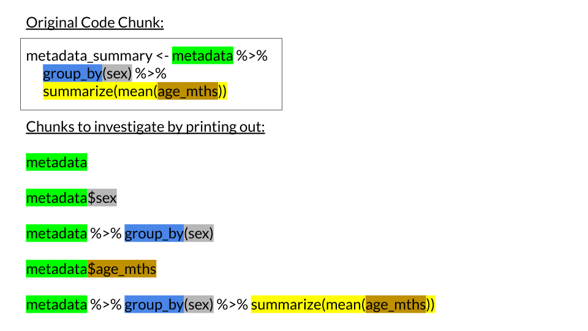

**CCDL 2019**

In this notebook, we will take you through the basics of the tidyverse: 
a collection of packages that make R easier to use and more convenient.  

We recommend using the free books Hadley Wickham and friends have on 
how to use the [tidyverse packages](https://r4ds.had.co.nz/index.html).

## Set Up

R packages are collections of functions. 
Installing R on your computer installs `base` functions like statistical tests 
and some plotting functionality.
The `tidyverse` is a collection of packages that are handy for general data 
wrangling, analysis, and visualization. 
Other packages that are specifically handy for different biological analyses are 
found on [Bioconductor](https://www.bioconductor.org/).
If we want to use a package's functions we first need to install them.
In our Docker container, we already have `tidyverse` and other packages we will
use in this workshop installed for you. 
But if you needed to install it or other packages available on CRAN, you 
do it using the `install.packages` function like this: `install.packages("tidyverse")`

```{r Load tidyverse}
library(tidyverse)
```

### Referencing a library's function with `::`

Note that if we had not imported the tidyverse set of packages using `library` 
like above, and we were using a tidyverse function like `read_tsv`, we would need to 
tell R what package to find this function in.
To do this, we would use `::` to tell R to load in this function from the 
`readr` package by using `readr::read_tsv`.
You will see this `::` method of referencing libraries throughout the course.  

## Managing directories

Before we can import the data we need, we should double check where R is 
looking for files aka our what our *working* directory currently is. 
We can do this by using the `getwd()` function, which will tell us what folder
we are in. 

```{r}
# Let's check what directory we are in:
getwd()
```

Note that for Rmd files, the working directory is always wherever the file is 
located. 

We will want to make a directory for our output and we will call this directory: 
`results`. 
But before we create the directory, we should check if it already exists. 
We will show two ways that we can do this. 

First, we can use the `dir()` function to have R list the files in our working 
directory. 

```{r}
# Let's check what files are here
dir()
```

This shows us there is no folder called "results" yet. 

If we want to more pointedly look for "results" in our working directory we can 
use the `dir.exists` function.

```{r}
# Check if the results directory exists
dir.exists("results")
```

If the above says `FALSE` that means we will need to create a `results` directory
using the function `dir.create`.

```{r}
# Make a directory within the working directory called 'results'
dir.create("results")
```

After creating the results directory above, let's re-run `dir.exists` to see if 
now it exists.

```{r}
# Re-check if the results directory exists
dir.exists("results")
```

We can use the output of `dir.exists` to automatically create or hold off on 
creating a directory by putting this together in an `if` statement like below. 
Note that we put an exclamation point to signify that we want a directory to be
created only *if* `dir.exists(results)` is NOT equal to `TRUE`.

```{r}
# If 'results' directory doesn't exist...
if (!dir.exists("results")) {
  # ... create a 'results' directory
  dir.create("results")
}
```

Note that the `dir.exists` function will not work on files themselves.
In this case, there is an analogous function called `file.exists`.

Try using the `file.exists` function to see if the file `metadata.tsv` file 
exists in the current directory.
Use the code chunk we set up for you below. 
Note that in our notebooks (and sometimes elsewhere), wherever you see a 
`<FILL_IN_THE_BLANK>` like in the chunk below, that is meant for you to replace 
with the correct phrase before you run the chunk (otherwise you will get an error).

```{r eval=FALSE}
# Replace the <PUT_FILE_NAME_HERE> with the name of the file you are looking for
# Remember to use quotes to make it a character string
file.exists(<PUT_FILE_NAME_HERE>)
```

Now that we've determined that `metadata.tsv` exists, we are ready to read it 
into our R environment.

#### Read a TSV file

This file `metadata.tsv` is from GSE30074 on [refine.bio](https://www.refine.bio/experiments/GSE30074/expression-data-from-30-medulloblastomas),
a gene expression dataset from medulloblastoma ([Park et al. _Neuro Oncol._ 2011.](https://www.ncbi.nlm.nih.gov/pubmed/22090452)).
  
If `metadata.tsv` was not in our working directory, remember we can tell R to 
look for `metadata.tsv` somewhere else using a relative directory path. 
In R, we will use `file.path()` for this (more on this later in this notebook).  
  
Let's read in the data from `metadata.tsv` using the tidyverse package: `readr`.
Although base R has read-in functions, the `readr` functions are faster and more
straightforward to use so we are going to use those here. 
Because the file we are reading in is a TSV (tab separated values) file we will 
be using the `read_tsv` function. 
But note that there are analogous functions for CSV (comma separated values) 
files (`read_csv`) and other files types.

```{r}
# The file we are reading in is our argument for read_tsv
metadata <- read_tsv("metadata.tsv")
```

## dplyr pipes

A nifty thing with the tidyverse is the pipes: `%>%`
This handy thing allows you to funnel the result of one expression to the next
making your code a little more streamlined.

For example, the output from this:  

```{r}
filter(metadata, sex == "F")
```  

...is the same as the output from this:  

```{r}
metadata %>% filter(sex == "F")
```  
  
This makes it so your code is cleaner and easier to read. 
Let's look at an example with our metadata of of how the same 
functions look with or without pipes:

*Example 1:* without pipes: 

```{r}
metadata_nopipe <- metadata
metadata_nopipe <- arrange(metadata_nopipe, histology)
metadata_nopipe <- filter(metadata_nopipe, follow_up_mths > 50)
metadata_nopipe <- select(metadata_nopipe, sample_id, sex, organism)
```
  
UGH, we have to repeat and assign `metadata_nopipe` so many times here! 
It's annoying and makes it harder for people to read. 
  
*Example 2:* Same result as 1 but with pipes!

```{r}
# Example of the same modifications as above but with pipes!
metadata_pipe <- metadata %>%
                 arrange(histology) %>%
                 filter(follow_up_mths > 50) %>%
                 select(sample_id, sex, organism)
```

Let's double check that these are the same by using the function, all.equal: 

```{r}
all.equal(metadata_nopipe, metadata_pipe)
```

`all.equal` is letting us know that these two objects are the same. 
(You can use all.equal in other instances and adjust the parameters depending on
how exact of a match you are looking for. )

Now that hopefully you are convinced that tidyverse helps your code to be neater 
and easier to use and read, let's go through some of the popular tidyverse 
functions and so we can create pipelines like this. 

## Common tidyverse functions

Let's say we wanted to filter this gene expression dataset to particular sample
groups.
In order to do this, we would use the function `filter` as well as a logic statement.

```{r}
# Here let's filter the data to have only females
metadata %>% filter(sex == "F")
```

We can use filter similarly for numeric statements.  

```{r}
# Here let's filter the data to have people only older than 
metadata %>% filter(age_mths > 100)
```

What if we wanted filter this dataset to females who are older than 100 months? 
Let's add another filtering argument to this filter.

```{r }
metadata %>% filter(age_mths > 100, sex == "F")
```

When we are filtering, the `%in%` operator can come in handy if we have multiple
items we would like to match.
Let's take a look at what using `%in%` does.

```{r}
metadata$histology %in% c("Anaplastic", "Desmoplastic")
```

`%in%` returns a logical vector that now we can use in `dplyr::filter`.

```{r }
metadata %>% filter(histology %in% c("Anaplastic", "Desmoplastic"))
```

Let's return to our first `filter` and build on to it. 
This time, let's keep only some of these variables with the `select` function. 
Let's also save this as a new data.frame called `metadata_filtered`.

```{r}
metadata_filtered <- metadata %>% 
  filter(age_mths > 100, sex == "F") %>%
  select(sample_id, histology, metastasis)
```

Let's say we wanted to arrange this dataset so that the patients were arranged
youngest to oldest.
In order to do this, we would use the function `arrange` as well as the variable
we would like to sort by (in this case `age_mths`).

```{r}
metadata %>% arrange(age_mths) 
```

What if we want the the oldest patients at the top of this dataset instead? 
We can use the same function, but instead use the `desc` function too. 

```{r}
metadata %>% arrange(desc(age_mths))
``` 

What if we would like to create new variables? 
For that we use `mutate` function. 
Let's convert the ages that are in months to years and make that into a new variable.
Here we are also using the `round` function from base R to limit the number of 
decimal points in our new variable to 2.

```{r}
metadata %>% 
  mutate(age_yrs = round(age_mths/12, 2))
```

What if we want to obtain summary statistics for a variable? 
The `summarize` function allows us to calculate summary statistics for a column. 
Here we will use summarize to obtain an overall mean age in months. 

```{r}
metadata %>% summarize(mean(age_mths))
```

What if we'd like to obtain a summary statistics but have them for various groups?
Conveniently named, there's a function called `group_by` that seamlessly 
allows us to do this. 
Also note that `group_by` allows us to group by multiple variables at a time if 
you want to.

```{r}
metadata_summary <- metadata %>%
      group_by(sex) %>% 
      summarize(mean(age_mths))
```

Let's use `head(metadata_summary)` so we can look at a preview of what we made:

```{r}
head(metadata_summary)
```

### Chunking out your code: a technique for figuring out what's happening

We did quite a few steps to get the object `metadata_summary`. 
If we needed to troubleshoot this step, or if we get confused on what's 
happening, it could be difficult to figure this out by looking at the chunk all 
at once. 

For these situations, we are going to introduce you to a technique called 
"Chunking".



Taking each unit of code at a time can help you learn the code as well as 
troubleshoot it. 
Use this empty code chunk to try this technique: 

```{r}
# Try to chunk out lines of code we used to get `metadata_summary`
```

## The dplyr::join functions

Let's say we have a scenario where we have two data.frames that we would like to 
combine. 
Recall that `metadata_pipe` and `metadata_filtered` are data.frames we've
made with information about some of the same samples.
The [`dplyr::join` family of functions](https://dplyr.tidyverse.org/reference/join.html) 
are useful for various scenarios of combining data.frames. 

For now, we will focus on `inner_join`, which will combine data.frames by only
keeping information about the samples that are in both data.frames. 
We need to use the `by` argument to designate what column(s) 
should be used as a key to match the data.frames (in this case our `sample_id`s). 

```{r}
metadata_filtered %>% inner_join(metadata_pipe, by = 'sample_id') 
```

Note that if there are columns of the same name in both data.frames, the default 
is to save both columns but a `x` or `y` is added to the name to note which 
data.frame it originated from.
In this case, `x` = `metadata_filtered` and `y` = `metadata_pipe`.

## A brief intro to `ggplot2` data visualization

`ggplot2` is a tidyverse package that is very useful for making publication ready 
plots. 
We will use `ggplot2` to create data visualization throughout our workshops. 
For now, we will introduce you to the very basic structure of `ggplot2`. 

The two basic arguments needed to start a ggplot are 1) `data` and 2) `aes` (short for
aesthetics).
Other aspects of the plot will be added after these two arguments are established. 

For the `data` argument, `ggplot` needs a data.frame that is ["tidy"](https://cran.r-project.org/web/packages/tidyr/vignettes/tidy-data.html)

For the `aes` argument, we need to specify our variables. 
The variables we specify should be named columns within the object we specified as 
our `data`. 
Here we will use `sex` and `age_mths` as our variables. 

```{r}
sex_by_age_plot <- ggplot(data = metadata, aes(x = sex, y = age_mths))

# Let's print out this default plot so we see what it looks like
sex_by_age_plot
```

Although we have the basic structure of our ggplot, we haven't yet added anything 
to specify what kind of plot we would like, so this default plot is rather boring 
and not sensible. 

To add more to our plot, we will use the `+` operator. 

```{r}
sex_by_age_plot + geom_boxplot()
```

In this case, we will add `geom_boxplot` so that our data is displayed in 
a way that tells us more information. 

There is a lot more we could do to further customize this plot, but for now
we've covered the basic structure. 

## A brief intro to the `apply` family of functions

Previously in this notebook, we used the `summarize` section to calculate summary
statistics for variables. 
However, in base R there the `apply` family of functions can be an alternative 
methods for performing transformations across a data.frame, matrix or for other 
object structures. 

We will practice using `apply` here. 
First, we are going to make a random matrix for us to practice `apply` functions 
on.
Question: What should we do before this step to make this *randomly* created 
matrix reproducible? 

```{r}
# Right! We should set the seed!
set.seed(12345)

# Make a matrix for apply practice
num_matrix <- matrix(rnorm(24), ncol = 4, nrow = 6)
```

The second argument in `apply` specifies whether we are applying something 
across rows or across columns (1 for rows, 2 for columns).

```{r}
# Calculate row means
row_means <- apply(num_matrix, 1, mean) # Notice we are using 1 here

# What dimensions will row_means have? 
str(row_means)
```

Now let's investigate the same set up, but use 2 to `apply` over the columns of
our matrix.

```{r}
# Calculate column means
col_means <- apply(num_matrix, 2, mean) # Notice we use 2 here

# What dimensions will col_means have? 
str(col_means)
```

Although the `apply` functions may not be as easy to use as the `tidyverse` 
functions, for some applications, `apply` methods can be better suited.
In this workshop, we will not delve too deeply into the various other apply 
functions (`tapply`, `lapply`, etc.) but you can read more examples 
about them [here](https://www.guru99.com/r-apply-sapply-tapply.html).

## Save data to files

#### Save to TSV files

Let's write this data we edited to a file.
To do this, we can use the `readr` library of `write` functions. 
Note that the second argument of `write_tsv` needs to be a character string that 
contains our `file.path` to the new file we would like to create.
Remember that we created a `results` directory to put our output in. 
But if we want to save our data to a directory other than our working directory, 
we need to specify this. 
This is what we will use the `file.path` function for. 
Let's look at what `file.path` does, by taking a look at the print out of it 
from examples below.

```{r}
# Which of these file paths is what we want to use to save our data to the
# results directory we created at the beginning of this notebook?
file.path("docker-install", "metadata.tsv")
file.path("results", "metadata_clean.tsv")
file.path("metadata_clean.tsv", "results")
```

Replace `<NEW_FILE_PATH>` below with the `file.path` from above that will 
successfully save our file to the `results` folder 

```{r eval=FALSE}
# Write our data.frame to a TSV file
write_tsv(metadata_summary, <NEW_FILE_PATH>)
```

Check in your `results` directory to see if your new file has successfully saved.

#### Save to RDS files

For this example we have been working with `data.frame`s, however, in other 
situations we may want to save more complicated structure objects or very large 
objects. 
RDS (R Data Serialized/Single) files may be a better option in these instances.
RDS is R's special file format for holding data exactly as you have it in your 
R environment. 
RDS files can also be compressed, meaning they will take up less space on your 
computer. 
Let's save our data to an RDS file in our `results` folder.
You will need to replace the `.tsv` with `.RDS`, but you can use what we 
determined as our `file.path` for the last chunk as your template. 

```{r eval=FALSE}
# Write your object to an RDS file
write_rds(metadata_summary, <PUT_CORRECT_FILE_PATH_HERE>)
```

#### Read an RDS file

Since now you have learned the `readr` functions: `read_tsv`, `write_tsv`, and 
now, `write_rds`, what do you suppose the function you will need to read your 
RDS file is called? 
Use that function here to re-import your data in the chunk we set up for you
below.

```{r eval=FALSE}
# Read in your RDS file
reimport_df <- <PUT_FUNCTION_NAME>(file.path("results", "metadata_clean.RDS"))
```

As is good practice, we will end this session by printing out our session info. 

#### Session Info: 

```{r}
sessionInfo()
```
