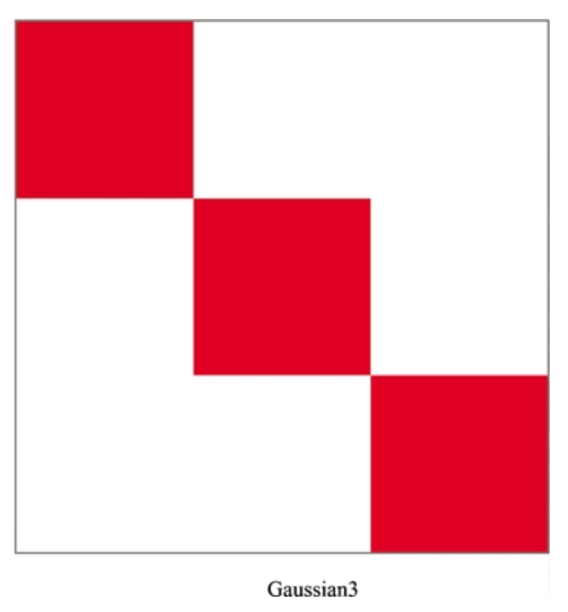
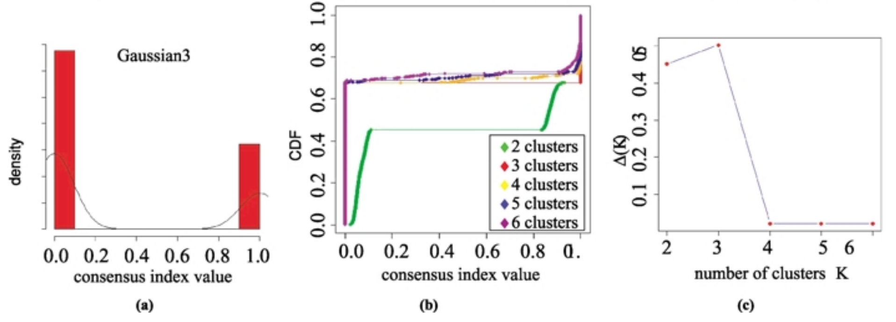
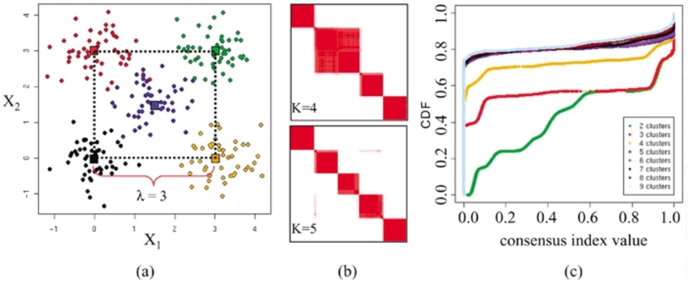

If we want to identify groups or clusters using expression data, we often want to **validate** those groups in some way, such as determining the "correct" number of groups or checking for agreement within clusters.

In this notebook, we'll use the medulloblastoma data from the OpenPBTA project to demonstrate a technique for cluster validation and look how clusters overlap with sample labels that are available in our metadata.

## Set up

### Libraries

```{r libraries}
# Bit o' data wranglin'
library(tidyverse)
# Consensus clustering library
library(ConsensusClusterPlus)
# We'll make a 3D plot with this library
library(plotly) 
```

### Directories and files

#### Directories

```{r directories, live = TRUE}
# Directory with the prepared/lightly cleaned OpenPBTA data
data_dir <- file.path("data", "open-pbta", "processed")

# Create a directory to hold our cluster validation results if it doesn't
# exist yet
results_dir <- "results"
if (!dir.exists(results_dir)) {
  dir.create(results_dir, recursive = TRUE)
}
```

#### Input files

```{r input_files}
histologies_file <- file.path(data_dir, "pbta-histologies-stranded-rnaseq.tsv")
rnaseq_file <- file.path(data_dir, "pbta-vst-stranded.tsv.gz")
```

#### Output files

```{r output_files, live = TRUE}
cc_results_file <- file.path(results_dir, "consensus_clustering_results.RDS")
```

## Read in and filter data

### Sample metadata

Let's read in the sample metadata and get the sample identifiers for medulloblastoma samples.

```{r read_in_metadata, live = TRUE}
# Read in metadata TSV
histologies_df <- read_tsv(histologies_file)

# Only pull out sample identifiers (KidsFirst biospecimen identifiers) that
# correspond to medulloblastoma samples
medulloblastoma_samples <- histologies_df %>%
  filter(short_histology == "Medulloblastoma") %>%
  pull(Kids_First_Biospecimen_ID)
```

### RNA-seq data

```{r read_in_rnaseq}
# Read in transformed RNA-seq data
rnaseq_df <- read_tsv(rnaseq_file)

# For our clustering validation analyses, we want a matrix of only 
# medulloblastoma samples where the gene identifiers are rownames rather than
# in the first column
rnaseq_mat <- rnaseq_df %>%
  # This makes sure we retain all of the columns with biospecimen IDs that 
  # correspond to medulloblastoma samples
  select(gene_id, all_of(medulloblastoma_samples)) %>%
  tibble::column_to_rownames("gene_id") %>%
  as.matrix()
```

## Cluster validation

### Consensus clustering

The method we'll use to examine the stability of clusters is called consensus clustering.
Consensus clustering aims to finds the "consensus" across multiple runs of the algorithm using a resampling procedure.

We'll use the package [`ConsensusClusterPlus`](https://bioconductor.org/packages/release/bioc/html/ConsensusClusterPlus.html) that we loaded up top ([vignette](https://bioconductor.org/packages/release/bioc/vignettes/ConsensusClusterPlus/inst/doc/ConsensusClusterPlus.pdf)).

The consensus clustering methodology was first introduced in [Monti *et al.* (2003)](https://doi.org/10.1023/A:1023949509487)
Let's look at some simulated data and results from this publication to see what consensus clustering results look like in an ideal case where we know how many clusters there are!

Consensus clustering outputs something called a _consensus index_ that tells us how often two samples are clustered together over multiple runs of the algorithm (0 = never, 1 = always).
The consensus index values can be visualized in a consensus matrix.
Here's a consensus matrix from simulated data with three groups. 
Because this shows the relationship between samples, rows _and_ columns correspond to samples.
A cell will be white if the consensus index = 0 and red if the consensus index = 1.



There are 3 groups or clusters, represented by the 3 red blocks on the diagonal, of samples that always cluster together and never cluster with samples outside of that cluster.



We can also look at the cumulative distribution function (CDF) of the consensus matrix to get an idea of at what number of clusters (_k_) the CDF is maximized.
The delta plot shoes use the relative increase in the CDF between _k_ and _k_ - 1. 
Notice how there's a drop at _k_ = 3 in this simulated example.

Next, let's look at a simulated example where there are 5 groups.



Notice how the consensus matrix at _k_ = 5 looks "cleaner" than the one for _k_ = 4 and there appears to be an increase in the area under the CDF between _k_ = 4 and _k_ = 5.

*All figures from [Monti et al. (2003)](https://doi.org/10.1023/A:1023949509487).*

Consensus clustering is one way to help you determine the number of clusters in your data, but it is not the only methodology available. 
Check out the Data Novia course [_Cluster Validation Essentials_ by Alboukadel Kassambara](https://www.datanovia.com/en/courses/cluster-validation-essentials/) for a deeper dive.

```{r consensus_clustering}
cc_results <- ConsensusClusterPlus(rnaseq_mat,
                                   maxK = 15,
                                   # Setting this seed is necessary for the 
                                   # results to be reproducible
                                   seed = 2020,
                                   innerLinkage = "average",
                                   finalLinkage = "average",
                                   distance = "pearson")
```

Our results are not as clean as the simulated data (surprise, surprise)!
We see an increase on the delta plot in several places: _k_ = 5, _k_ = 7, _k_ = 9, and _k_ = 12.

If we look at the tracking plot that tells us how the samples group together and the consensus index plots, we can see 3 main clusters that arise around _k_ = 9 but we could also make an argument for the two groups that show up at _k_ 5 through 8.

We'll move forward with the _k_ = 9 labels, but we hope you appreciate that determining the number clusters is not an easy problem!

Let's take a look at the class labels for _k_ = 9.

```{r cc_labels, live = TRUE}
# table() creates a contingency table of counts
table(cc_results[[9]]$consensusClass)
```

(Note: the numbering of the clusters is arbitrary here.)

A cluster of a few samples may not be that helpful in reaching our analysis goals!

Let's save the entirety of the consensus clustering results to file.

```{r save_cc_results, live = TRUE}
# Write consensus clustering results to file
write_rds(cc_results, path = cc_results_file)
```

And now to extract the samples in the clusters of interest.
What we used `table()` on before is actually a named vector.

```{r extract_cluster_labels}
cc_cluster_labels <- cc_results[[9]]$consensusClass
head(cc_cluster_labels)
```

### Compare clustering results to external metadata labels

There are multiple medulloblastoma molecular subtypes and this classification largely relies on gene expression data.
A [medulloblastoma subtype classifier](https://github.com/d3b-center/medullo-classifier-package), which is an example of _supervised machine learning_, has been applied to the medulloblastoma samples included in OpenPBTA.
How do the subtype labels from this classifier (in the `molecular_subtype` column of our sample metadata) stack up to the clusters we identified with unsupervised methods?

Let's first make a data frame that holds the subtype labels.
We can use this both to compare our unsupervised clustering results to the subtype labels and for some plotting downstream.

```{r subtype_df}
mb_molecular_subtype_df <- histologies_df %>%
  filter(short_histology == "Medulloblastoma") %>%
  select(Kids_First_Biospecimen_ID, molecular_subtype)
```

Add the consensus clustering labels.

```{r subtype_cc, live = TRUE}
# Create a data frame that contains the consensus cluster results and join
# it with the data frame of molecular subtype labels
cc_df <- data.frame(cc_cluster_labels) %>%
  tibble::rownames_to_column("Kids_First_Biospecimen_ID") %>%
  inner_join(mb_molecular_subtype_df)
```

Do the consensus clustering results agree with the molecular subtype labels?

```{r cc_subtype_table}
table(cc_df$cc_cluster_labels, cc_df$molecular_subtype)
```

Hm... there's some agreement with the subtype labels but it's not perfect. 
Why might that be?
Let's start by looking at the overview figure for the medulloblastoma classifier.


We used a different measure (VST values vs. FPKM) and used all features. 

## Low-dimensional representation

Let's see if low-dimensional representations agree with our other unsupervised results.
First, let's find the high variance genes; we'll perform dimension reduction on those genes only.

```{r gene_variance}
# Calculate variance
gene_variance <- matrixStats::rowVars(rnaseq_mat)
# Find the value that we'll use as a threshold to filter the top 5%
variance_threshold <- quantile(gene_variance, 0.95)
# Row indices of high variance genes
high_variance_index <- which(gene_variance > variance_threshold)
```

### UMAP

First, let's use UMAP.

```{r run_umap}
# Set seed for reproducible UMAP results
set.seed(2020)
# umap() expects features (genes) to be columns, so we have to use t()
umap_results <- umap::umap(t(rnaseq_mat[high_variance_index, ]))
```

The UMAP coordinates are in the `layout` element of the list returned by `umap::umap()`.

```{r make_umap_df, live = TRUE}
# Make a data frame of the layout results and join with molecular subtype 
# data frame
umap_plot_df <- data.frame(umap_results$layout) %>%
  tibble::rownames_to_column("Kids_First_Biospecimen_ID") %>%
  inner_join(mb_molecular_subtype_df)
```

Let's make a scatter plot and color our samples by the subtype labels.

```{r umap_scatter}
umap_plot_df %>%
  ggplot(aes(x = X1, 
             y = X2,
             color = molecular_subtype)) +
  geom_point() +
  scale_color_manual(values = palette.colors(palette = "Okabe-Ito")) +
  theme_bw() +
  xlab("UMAP1") +
  ylab("UMAP2")
```

### PCA 

Now, we'll briefly show you how to use built-in functions for PCA on any matrix that's not in a specialized object for some kind of genomic data.

```{r run_pca}
# Like umap(), prcomp() expects the features to be columns
pca_results <- prcomp(t(rnaseq_mat[high_variance_index, ]), 
                      scale = TRUE)
# The principal component representation is returned in x
pca_results$x[1:6, 1:6]
```

Let's get the first 10 PCs ready for plotting.

```{r pca_df, live = TRUE}
pca_plot_df <- data.frame(pca_results$x[, 1:10]) %>%
  tibble::rownames_to_column("Kids_First_Biospecimen_ID") %>%
  inner_join(mb_molecular_subtype_df)
```

And now make a scatterplot of PC1 and PC2.

```{r pca_scatter_1, live = TRUE}
pca_plot_df %>%
  ggplot(aes(x = PC1, 
             y = PC2,
             color = molecular_subtype)) +
  geom_point() +
  scale_color_manual(values = palette.colors(palette = "Okabe-Ito")) +
  theme_bw() +
  xlab("PC1") +
  ylab("PC2")
```

What about PC2 and PC3?

```{r pca_scatter_2, live = TRUE}
pca_plot_df %>%
  ggplot(aes(x = PC2, 
             y = PC3,
             color = molecular_subtype)) +
  geom_point() +
  scale_color_manual(values = palette.colors(palette = "Okabe-Ito")) +
  theme_bw() +
  xlab("PC2") +
  ylab("PC3")
```

It can be useful to understand the proportion of variance explained by each principal component when visualizing and interpreting the results.
For example, if PC1 explained 96% of the variance in your data and very clearly showed a difference between sample batches you would be very concerned!
On the other hand, if a separation of batches was apparent in a different principal component that explained a low proportion of variance and the first few PCs explained most of the variance and appeared to correspond to something like tissue type and treatment, you would be less concerned.

`summary()` will report the proportion of variance explained by each principal component.
By accessing the `importance` element with `<summary results>$importance`, we can use indexing to only look at the first 10 PCs.

```{r pca_summary}
# Save summary of the PCA results
pca_summary <- summary(pca_results)
# Importance information for the first 10 PCs
pca_importance <- pca_summary$importance[, 1:10]
pca_importance
```

You might consider adding these values to your axis labels to aid readers in interpretation.
(`DESeq2::plotPCA()`, which we used in the bulk RNA-seq module, does this for us!)

[`plotly`](https://plotly.com/r/) is a package that allows us to plot interactive 3D scatterplots.

```{r 3d_scatter}
# plot_ly is kind of like ggplot(), but it doesn't require us to specify the 
# aesthetics or types (e.g., geoms) separately in the same way
pca_3d_plot <- plot_ly(data = pca_plot_df,
                       x = ~ PC1,
                       y = ~ PC2,
                       z = ~ PC3,
                       type = "scatter3d",
                       color = ~ molecular_subtype)

# Add axis labels
pca_3d_plot <- pca_3d_plot %>% 
  layout(scene = list(
    xaxis = list(title = "PC1"),
    yaxis = list(title = "PC2"),
    zaxis = list(title = "PC3")
  ))

pca_3d_plot
```

## Session Info

```{r session_info}
sessionInfo()
```
