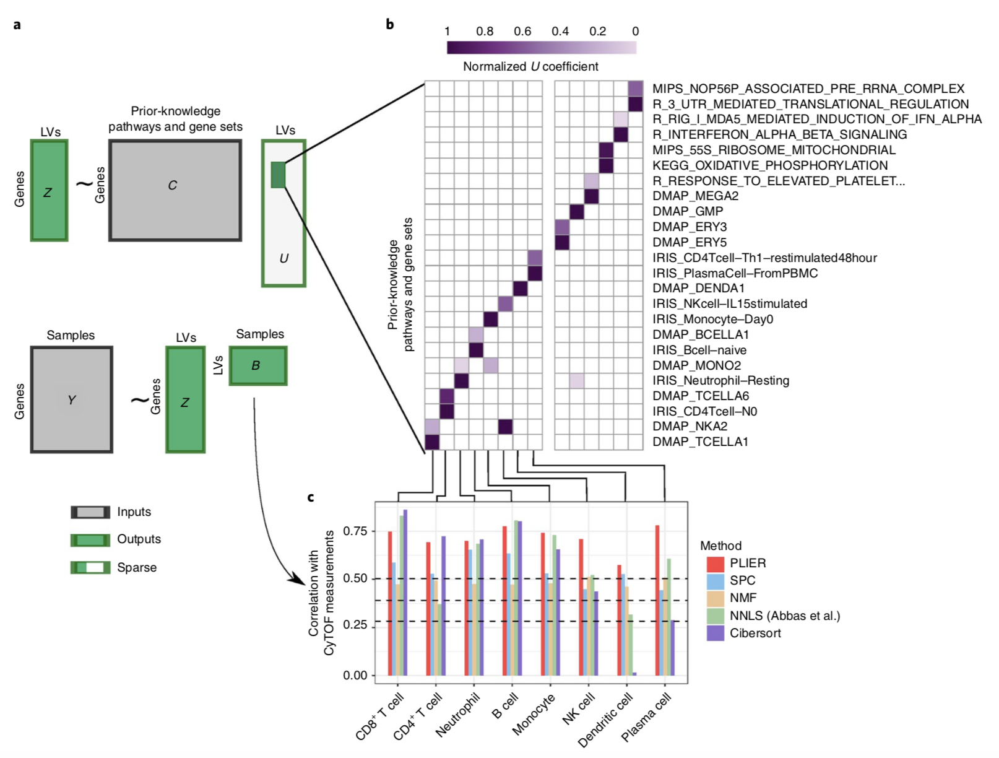

In this notebook, we'll use a method called Pathway-Level Information Extractor (PLIER) ([Mao *et al.* (2019)](https://doi.org/10.1038/s41592-019-0456-1)).

We like PLIER for a few reasons:

* It is a matrix factorization approach.
  That means we can get a low-dimensional representation of our data.
  Specifically, PLIER learns correlated patterns of expression in our data or latent variables (LVs).
  Here, a latent variable is an "eigengene-like" combination of genes' expression.
  (It's called _latent_ because it's not directly measured, but instead inferred from the individual gene measurements.)
* It includes penalties such that _some_ of the LVs will align with gene sets that we give it, so it's excellent for biological discovery.
* The authors demonstrated that it performs favorably with regard to estimating proportion of immune cells in a sample as compared to other methods.
* Because not _all_ LVs align with the gene sets we input, some of them capture unwanted technical variation.
  In our experience with the method, it does this quite well.

PLIER is similar to other pathway analysis methods that you may be familiar with in that it uses prior knowledge in the form of gene sets.
It produces output values that are on an individual sample level and does not require a two group comparison ahead of time like some pathway analysis methods.
However, PLIER is designed to align the LVs it constructs with the relevant input gene sets that the data supports, whereas other methods will use all gene sets you provide as input.

## Set up

```{r set_seed}
# We will need this for our dimension reduction to be reproducible and there is
# some sampling that goes into collapsing our RNA-seq matrix
seed <- 1234
set.seed(seed)
```

### Libraries

```{r libraries}
library(tidyverse)
# Pathway-Level Information ExtractoR
library(PLIER)
```

### Directories and files

#### Directories

```{r directories}
# Directory that holds the metadata and RNA-seq
data_dir <- file.path("data", "open-pbta", "processed")

# Create a directory to hold the PLIER results if it does not exist yet
models_dir <- "models"
if (!dir.exists(models_dir)) {
  dir.create(models_dir, recursive = TRUE)
}
```

#### Input files

```{r input_files}
# Metadata
histologies_file <- file.path(data_dir, "pbta-histologies-stranded-rnaseq.tsv")
# VST transformed RNA-seq data
rnaseq_file <- file.path(data_dir, "pbta-vst-stranded.tsv.gz")
```

#### Output file

```{r output_files}
# RNA-seq file with duplicate gene identifiers collapsed
collapsed_data_file <- file.path(data_dir, "pbta-vst-stranded-collapsed.tsv")
# PLIER output
plier_file <- file.path(models_dir, "pbta-medulloblastoma-plier.RDS")
```

## Read in and prepare data

### Read in sample metadata and identify medulloblastoma samples

In the interest of reducing runtime, we're going to subset the dataset to only the medulloblastoma samples we included in the previous notebook.

```{r read_in_metadata, live = TRUE}
# Read in metadata
histologies_df <- read_tsv(histologies_file)

# Get biospecimen identifiers for medulloblastoma samples
medulloblastoma_samples <- histologies_df |>
  filter(short_histology == "Medulloblastoma") |>
  pull(Kids_First_Biospecimen_ID)
```

### Read in expression data

Read in the VST transformed RNA-seq data.

```{r read_in_rnaseq, live = TRUE}
rnaseq_df <- read_tsv(rnaseq_file)
```

Let's take a look at this data frame.

```{r rnaseq_head, live = TRUE}
head(rnaseq_df)
```

The `gene_id` column concatenates two different gene identifiers: Ensembl gene IDs and gene symbols.
PLIER requires gene symbols as rownames, so we will need to take some steps to prepare this data for use with PLIER.

First, we need to separate the gene symbols from the Ensembl gene identifiers.
Luckily, there's a tidyverse function that can separate one column into multiple columns called `tidyr::separate()`.

```{r separate_gene_ids}
symbol_rnaseq_df <- rnaseq_df |>
  tidyr::separate(gene_id,  # Take the gene_id column
                  # Create two new columns called ensembl_id and gene_symbol
                  into = c("ensembl_id", "gene_symbol"),
                  # The values for these two columns are separated by _
                  sep = "_",
                  # Some gene symbols themselves contain _, so when that happens
                  # merge everything after the first _ into the gene_symbol
                  # column
                  extra = "merge")


# We no longer need the data frame we read in, so we'll remove it to save some
# memory
rm(rnaseq_df)
```

Alright, what does our new data frame look like?

```{r head_symbol_df, live = TRUE}
head(symbol_rnaseq_df)
```

We won't need the column with the Ensembl identifiers anymore, so let's remove it.

```{r remove_ensg, live = TRUE}
symbol_rnaseq_df <- symbol_rnaseq_df |>
  select(-ensembl_id)
```

### Collapsing duplicate gene symbols

```{r any_duplicated}
any(duplicated(symbol_rnaseq_df$gene_symbol))
```

How many duplicated gene symbols are there?

```{r how_many_duplicated}
sum(duplicated(symbol_rnaseq_df$gene_symbol))
```

Relative to the total number of genes, there are not too many genes that are duplicated.

```{r add_row_means}
# mean transformed value across the entire cohort
symbol_rnaseq_df$mean_value <- rowMeans(symbol_rnaseq_df[, -1])
```

We'll use a few gene symbols that we've arbitrarily selected to follow along with these processing steps!

```{r duplicated_examples}
# Genes we will use to illustrate what happens during the collapsing duplicate
# process
duplicated_symbols <- c("DGCR5", "RABGEF1")

# Let's take a look at the mean values prior to any filtering
symbol_rnaseq_df |>
  filter(gene_symbol %in% duplicated_symbols) |>
  select(gene_symbol, mean_value) |>
  arrange(gene_symbol)
```

For a given duplicated gene symbol, we want to select the row with the highest average expression value.

```{r collapsed_rnaseq}
collapsed_rnaseq_df <- symbol_rnaseq_df |>
  # For each set of rows that correspond to the same gene symbol
  group_by(gene_symbol) |>
  # Select the single row with the highest value in the mean_value column
  top_n(1, mean_value) |>
  # In the case of ties, where the mean values are the same, randomly pick one
  # row
  sample_n(1)
```

Check again to see if any duplicated gene symbols remain in the new collapsed data frame.

```{r any_duplicated_now, live = TRUE}
any(duplicated(collapsed_rnaseq_df$gene_symbol))
```

Which row for our gene symbols of interest was retained in the collapsed data frame?

```{r which_retained}
collapsed_rnaseq_df |>
  filter(gene_symbol %in% duplicated_symbols) |>
  select(gene_symbol, mean_value) |>
  arrange(gene_symbol)
```

Now we're ready to remove the extraneous column with our mean values and write this collapsed data to file.

```{r write_collapsed}
collapsed_rnaseq_df <- collapsed_rnaseq_df |>
  select(-mean_value) |>
  write_tsv(collapsed_data_file)
```

Make a matrix for samples that we're interested in studying here.

```{r get_medulloblastoma_mat, live = TRUE}
medulloblastoma_rnaseq_mat <- collapsed_rnaseq_df |>
  select(gene_symbol, tidyselect::all_of(medulloblastoma_samples)) |>
  tibble::column_to_rownames("gene_symbol") |>
  as.matrix()
```

And a bit of cleanup.

```{r remove_old_df}
rm(collapsed_rnaseq_df, symbol_rnaseq_df)
```

## Pathway-Level Information ExtractoR (PLIER)

Here's an overview of the PLIER method from [Mao _et al._ (2019)](https://doi.org/10.1038/s41592-019-0456-1) (Figure 1).



> **Fig. 1 | PLIER overview.**
PLIER is a matrix factorization approach that decomposes gene expression data into a product of a small number of LVs and their corresponding gene associations or loadings, while constraining the loadings to align with the most relevant automatically selected subset of prior knowledge. **a**, Given two inputs, the gene expression matrix _Y_ and the prior knowledge (represented as binary gene set membership in matrix _C_), the method returns the LVs (_B_), their loadings (_Z_), and an additional sparse matrix (_U_) that specifies which (if any) prior-information gene sets and pathways are used for each LV. The light gray area of _U_ indicates the large number of zero elements of the matrix. We apply our method to a whole-blood human gene expression dataset. **b**, The positive entries of the resulting _U_ matrix are visualized as a heat map, facilitating the identification of the correspondence between specific LVs and prior biological knowledge. As the absolute scale of the _U_ matrix is arbitrary, each column is normalized to a maximum of 1. **c**, We validate the LVs mapped to specific leukocyte cell types by comparing PLIER estimated relative cell-type proportions with direct measurements by mass cytometry. Dashed lines represent 0.05, 0.01, and 0.001 significance levels for Spearman rank correlation (one-tailed test). NK cell, natural killer cell.

### Pathway data

The `PLIER` package comes with different gene sets we can use as input during training.
The gene sets themselves are not really any different than other gene sets we might use for pathway analysis, but the data that comes in the package is in a format that is already compatible for use with PLIER.

```{r plier_data}
data("bloodCellMarkersIRISDMAP")
data("canonicalPathways")
data("svmMarkers")

# Combine the pathway data from PLIER
all_pathways <- PLIER::combinePaths(bloodCellMarkersIRISDMAP,
                                    canonicalPathways,
                                    svmMarkers)
```

### Row normalize

`PLIER` comes with a built-in function to row normalize the expression data.
This is z-scoring the expression values for each gene.

```{r row_normalize, live = TRUE}
# Row normalize -- z-scoring the genes
medulloblastoma_zscore <- PLIER::rowNorm(medulloblastoma_rnaseq_mat)
```

### Run PLIER

```{r common_genes}
# Identify genes that are common to the pathway data and the zscore mat
common_genes <- PLIER::commonRows(all_pathways, medulloblastoma_zscore)
```

Now for the main PLIER function.

```{r run_plier}
plier_results <- PLIER::PLIER(data = medulloblastoma_zscore[common_genes, ],
                              priorMat = all_pathways[common_genes, ],
                              rseed = seed)
```

### Explore the model

What does the output of `PLIER::PLIER()` look like?

```{r view_plier, live = TRUE, eval = FALSE}
View(plier_results)
```

The _U_ matrix tells us about how the latent variables learned by the model relate to the pathways we used as input.
`plotU()` is a special function to display the _U_ matrix.

```{r plot_u}
PLIER::plotU(plier_results)
```

`summary()` of a `PLIER` results object returns the FDR and AUC values for input pathway to latent variable relationships.
Let's look at the values of that data frame for the latent variable that corresponds to some macrophage-related gene sets.

```{r lv57_summary}
plier_results$summary |>
  filter(`LV index` == 57,
         FDR < 0.05) |>
  arrange(FDR)
```

The _B_ matrix contains the latent variable values for each sample.

```{r dim_b}
dim(plier_results$B)
```

Let's take a peek at the matrix itself.

```{r b_preview, live = TRUE}
plier_results$B[1:5, 1:5]
```

The _Z_ matrix contains the gene loadings (how genes combine to get _B_).

```{r dim_z}
dim(plier_results$Z)
```

We can use _Z_ to tell us which genes contribute to LV57.

```{r lv57_loadings}
head(sort(plier_results$Z[, 57],
          decreasing = TRUE),
     n = 25)
```

In the next notebook, we'll show you one way to use a PLIER model for biological discovery.
For now, let's save the PLIER results to file.

```{r write_plier}
write_rds(plier_results, file = plier_file)
```

## Session Info

```{r session_info}
sessionInfo()
```
