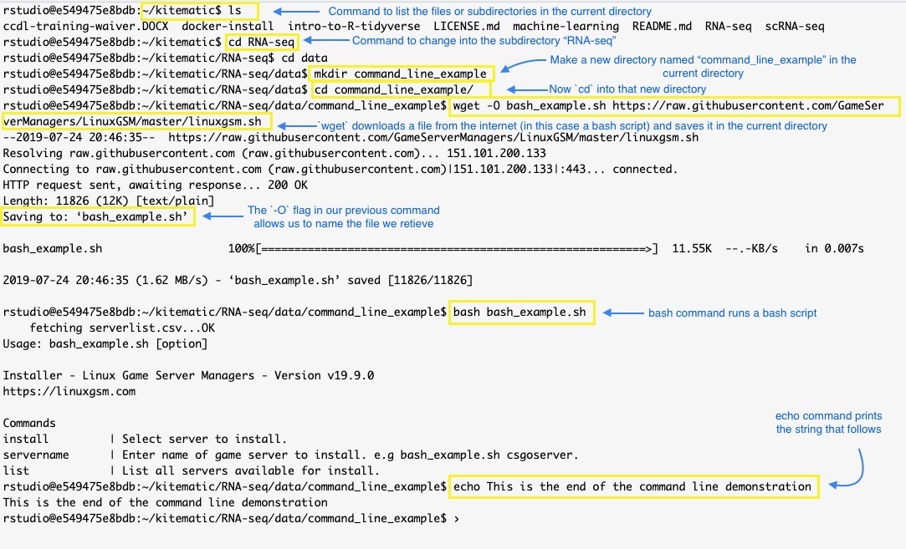

# Bulk RNA-seq Cheatsheet

#### The tables below consist of valuable functions or commands that will help you through this module. 
##### Each table represents a different library/tool and its corresponding commands. 
> Please note that these tables are not intended to tell you all the information you need to know about each command. 
> 
> The hyperlinks found in each piece of code will take you to the documentation for further information on the usage of each command. 

### Base `R`
Read the Base `R` package documentation [**here**](https://www.rdocumentation.org/packages/base/versions/3.5.1). 

| Library/Package               | Piece of Code                                                 | What it's called      | What it does                                                             |
|-------------------------------|--------------------------------------------------------------|--------------------------------|--------------------------------------------------------------------------|
| Base `R`                | [`list.files()`](https://www.rdocumentation.org/packages/base/versions/3.5.1/topics/list.files)             | List files                | Produces a character vector of files or directories in the specified directory |
| Base `R`                | [`names()`](https://www.rdocumentation.org/packages/base/versions/3.5.1/topics/names)                       | Names                     | Gets or sets the names of an object                                      |                        
| Base `R`                | [`colnames()`](https://www.rdocumentation.org/packages/base/versions/3.5.1/topics/row%2Bcolnames)           | Column names              | Gets or sets the column names of a matrix or data frame                  |                                                    
| Base `R`                | [`all.equal()`](https://www.rdocumentation.org/packages/base/versions/3.5.1/topics/all.equal)               | All equal                 | Checks if two R objects are nearly equal                                 |                 
| Base `R`                | [`attr()`](https://www.rdocumentation.org/packages/base/versions/3.5.1/topics/attr)                         | Object Attributes         | Gets or sets the attributes of an object                                 |       
| Base `R`                | [`rowSums()`](https://www.rdocumentation.org/packages/base/versions/3.5.1/topics/colSums)                   | Row Sums                  | Returns the sum of the rows in a numeric matrix-like object (i.e.. a matrix, data.frame, etc.) |
| Base `R`                | [`relevel()`](https://www.rdocumentation.org/packages/stats/versions/3.5.1/topics/relevel)                  | Relevel                   | Reorders the levels of a factor as specified                             |                                                                                         
| Base `R`                | [`summary()`](https://www.rdocumentation.org/packages/base/versions/3.5.1/topics/summary)                   | Object Summary            | Returns a result summary of an object                                    |         
| Base `R`                | [`as.data.frame()`](https://www.rdocumentation.org/packages/base/versions/3.5.1/topics/as.data.frame)       | Data Frame                | Checks if an object is a data.frame, and transforms the object into one, if possible |

### `DESeq2`
Read the `DESeq2` package documentation [**here**](https://bioc.ism.ac.jp/packages/3.8/bioc/manuals/DESeq2/man/DESeq2.pdf), and the package vignette by Love, Anders, and Huber [**here**](https://bioconductor.org/packages/release/bioc/vignettes/DESeq2/inst/doc/DESeq2.html).

| Library/Package               | Piece of Code                                                 | What it's called      | What it does                                                             |
|-------------------------------|--------------------------------------------------------------|--------------------------------|--------------------------------------------------------------------------|
| `DESeq2`                | [`vst()`](https://www.rdocumentation.org/packages/DESeq2/versions/1.12.3/topics/vst)                   | Variance Stabilizing Transformation                  | Applies variance stabilizing transformation to data (log2-like scale)                                      |                                                                                         
| `DESeq2`                | [`DESeqDataSetFromTximport()`](https://www.rdocumentation.org/packages/DESeq/versions/1.24.0/topics/DESeqDataSet-class)| DESeqDataSet constructor        | Creates a DESeqDataSet object                                            |                                                                                         
| `DESeq2`                | [`DESeq()`](https://www.rdocumentation.org/packages/DESeq/versions/1.24.0/topics/DESeq)                 | Differential Expression Analysis Based on the Negative Binomial Distribution | Estimates size factors, estimates dispersion, and performs negative binomial fitting and Wald statistics as steps in the default DESeq2 differential expression analysis |
| `DESeq2`                | [`plotPCA()`](https://www.rdocumentation.org/packages/DESeq/versions/1.24.0/topics/plotPCA)             | PCA plot                                        | Produces a principal component analysis plot for transformed data. It can be used to visually inspect the data, which might allow an analyst to identify batch effects.   |
| `DESeq2`                | [`counts()`](https://www.rdocumentation.org/packages/DESeq2/versions/1.12.3/topics/counts)              | Counts                                          | Saves the count data as a matrix                                         |                                                                                         
| `DESeq2`                | [`results()`](https://www.rdocumentation.org/packages/DESeq/versions/1.24.0/topics/results)             | Results                                         | Returns the results table from a DESeq2 analysis                         |                                                                                        
| `DESeq2`                | [`assay()`](https://www.bioconductor.org/packages/devel/bioc/manuals/DESeq2/man/DESeq2.pdf)             | Assay                                           | Returns matrix from the `assay` slot of `DESeqDataSet`                                         |        

### `FastQC` and `fastp`

Read the `FastQC` documentation [**here**](https://www.bioinformatics.babraham.ac.uk/projects/fastqc/) and the `fastp` documentation [**here**](https://github.com/OpenGene/fastp).

| Library/Package               | Piece of Code                                                 | What it's called      | What it does                                                             |
|-------------------------------|--------------------------------------------------------------|--------------------------------|--------------------------------------------------------------------------|
| `fastp`                 | [`fastp`](https://github.com/OpenGene/fastp)                    | FASTQ preprocessor                              | Preprocesses FASTQ files through adapter trimming, quality filtering, length filtering, and a number of additional options  |
| `FastQC`                | [`fastqc`](https://www.rdocumentation.org/packages/fastqcr/versions/0.1.2/topics/fastqc)                   | FASTQC (Quality Control)                        | Performs quality control checks on raw sequence data and outputs a QC(quality control) report   |

### `ggplot2`

Read the `ggplot2` package documentation [**here**](https://www.rdocumentation.org/packages/ggplot2/versions/3.1.0). A vignette on the usage of the `ggplot2` package can be found [**here**](https://cran.r-project.org/web/packages/ggplot2/vignettes/ggplot2-specs.html).

| Library/Package               | Piece of Code                                                 | What it's called      | What it does                                                             |
|-------------------------------|--------------------------------------------------------------|--------------------------------|--------------------------------------------------------------------------|
| `ggplot2`               | [`ggsave()`](https://www.rdocumentation.org/packages/ggplot2/versions/3.1.0/topics/ggsave)                 | GG Save                                         | Saves the last plot in working directory                                 |                                                                                         
| `ggplot2`               | [`last_plot()`](https://www.rdocumentation.org/packages/ggplot2/versions/3.1.0/topics/last_plot)           | Last plot                                       | Returns the last plot produced                                           |                                                                                         
| `ggplot2`               | [`geom_point()`](https://www.rdocumentation.org/packages/ggplot2/versions/3.1.0/topics/geom_point)         | Geom point                                      | Creates a scatterplot (when added to the `ggplot()` function)            |                                                                                         
| `ggplot2`               | [`xlab()`; `ylab()`](https://www.rdocumentation.org/packages/ggplot2/versions/3.1.0/topics/labs)           | X Axis Labels; Y Axis Labels                    | Modifies the labels on the x axis and on the y axis, respectively        |                                                                                        
| `ggplot2`               | [`coord_fixed()`](https://www.rdocumentation.org/packages/ggplot2/versions/3.1.0/topics/coord_fixed)       | Cartesian Coordinates with Fixed Aspect Ratio   | Coerces the coordinates on the plot to represent a fixed specified ratio |         

### `stringr`, `readr`, `tximport`, `dplyr`, `pheatmap`

Documentation for each of these packages can be accessed by clicking the package name in the table below. 

| Library/Package               | Piece of Code                                                 | What it's called      | What it does                                                             |
|-------------------------------|--------------------------------------------------------------|--------------------------------|--------------------------------------------------------------------------|
| [`stringr`](https://www.rdocumentation.org/packages/stringr/versions/1.3.1)            |[`word()`](https://www.rdocumentation.org/packages/stringr/versions/1.3.1/topics/word)       | Word                            | Extracts words from a character vector                         |                                                                                        
| [`readr`](https://www.rdocumentation.org/packages/readr/versions/1.3.0)                 |[`write_rds()`](https://www.rdocumentation.org/packages/readr/versions/1.3.0/topics/read_rds) | Write RDS                      | Writes data to a .RDS output file                                 |                                                                                         
| [`tximport`](https://bioconductor.org/packages/release/bioc/vignettes/tximport/inst/doc/tximport.html)              | [`tximport()`](https://www.rdocumentation.org/packages/tximport/versions/1.11.6/topics/tximport)           | Tximport           | Imports transcript-level estimates and summarizes abundances, counts, and transcript lengths to the gene-level by default   |
| [`dplyr`](https://www.rdocumentation.org/packages/dplyr/versions/0.7.8)                 | [`pull()`](https://www.rdocumentation.org/packages/dplyr/versions/0.7.8/topics/pull)                      | Pull                              | Extracts a variable (column) as a vector                                          |                                                                                       
| [`pheatmap`](https://www.rdocumentation.org/packages/pheatmap/versions/1.0.10)              | [`pheatmap()`](https://www.rdocumentation.org/packages/pheatmap/versions/1.0.10/topics/pheatmap)          | Pheatmap                          | Plots clustered heatmaps                                                 |                                                   

### Salmon

Read the Salmon tool documentation [**here**](https://salmon.readthedocs.io/en/latest/).

| Tool               | Piece of Code                                                 | What it's called      | What it does                                                             |
|-------------------------------|--------------------------------------------------------------|--------------------------------|--------------------------------------------------------------------------|
| Salmon                | [`salmon index`](https://salmon.readthedocs.io/en/latest/salmon.html)             | Salmon index                                    | Builds a transcriptome index which is required for Salmon quantification (from the command line) |                                                                                        
| Salmon                | [`salmon quant`](https://salmon.readthedocs.io/en/latest/salmon.html)             | Salmon quantification                           | Runs Salmon’s quantification of transcript expression (from the command line)                    |           

### Useful command line commands:  

Feel free to give these commands a try on your own! (Note that our example begins in the training-module directory.)

