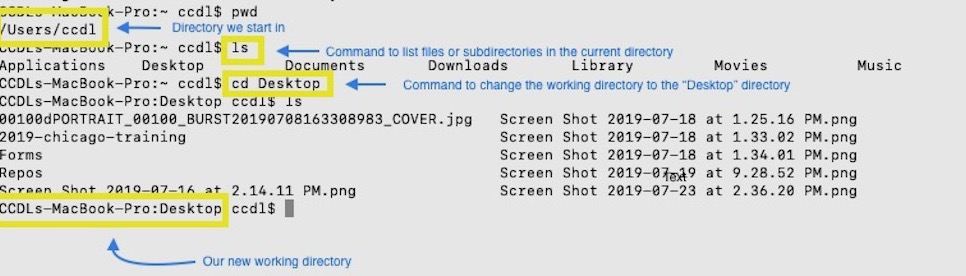
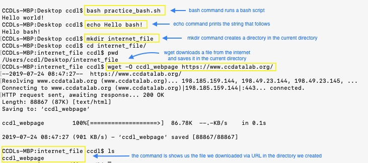

---
output:
  pdf_document: default
---
# Bulk RNA-seq Cheatsheet

#### The tables below consist of valuable codes that will help you through this module. Each table represents a different library/tool and its corresponding commands. 
Please note that these tables are not intended to tell you all the information you need to know about each command. The hyperlinks found in each piece of code will take you to the documentation for further information on the usage of each command. 

| Library/Package               | Piece of Code                                                 | What it's called      | What it does                                                             |
|-------------------------------|--------------------------------------------------------------|--------------------------------|--------------------------------------------------------------------------|
| Base R                | [`list.files()`](https://www.rdocumentation.org/packages/base/versions/3.6.1/topics/list.files)             | List files                | Produces a character vector of files or directories in the specified directory |
| Base R                | [`names()`](https://www.rdocumentation.org/packages/base/versions/3.6.1/topics/names)                       | Names                     | Gets or sets the names of an object                                      |                        
| Base R                | [`colnames()`](https://www.rdocumentation.org/packages/base/versions/3.6.1/topics/row%2Bcolnames)           | Column names              | Gets or sets the column names of a matrix or data frame                  |                                                    
| Base R                | [`all.equal()`](https://www.rdocumentation.org/packages/base/versions/3.6.1/topics/all.equal)               | All equal                 | Checks if two R objects are nearly equal                                 |                 
| Base R                | [`attr()`](https://www.rdocumentation.org/packages/base/versions/3.6.1/topics/attr)                         | Object Attributes         | Gets or sets the attributes of an object                                 |       
| Base R                | [`rowSums()`](https://stat.ethz.ch/R-manual/R-devel/library/base/html/colSums.html)                         | Row Sums                  | Returns the sum of the rows in a numeric matrix-like object (i.e.. a matrix, data.frame, etc.) |
| Base R                | [`relevel()`](https://www.rdocumentation.org/packages/stats/versions/3.6.1/topics/relevel)                  | Relevel                   | Reorders the levels of a factor as specified                             |                                                                                         
| Base R                | [`summary()`](https://www.rdocumentation.org/packages/base/versions/3.6.1/topics/summary)                   | Object Summary            | Returns a result summary of an object                                    |         
| Base R                | [`as.data.frame()`](https://www.rdocumentation.org/packages/base/versions/3.6.1/topics/as.data.frame)       | Data Frame                | Checks if an object is a data.frame, and transforms the object into one, if possible |

| Library/Package               | Piece of Code                                                 | What it's called      | What it does                                                             |
|-------------------------------|--------------------------------------------------------------|--------------------------------|--------------------------------------------------------------------------|
| DESeq2                | [`rlog()`](https://www.rdocumentation.org/packages/DESeq/versions/1.24.0/topics/rlog)                   | Regularized Log Transformation                  | Returns log2 transformed count data                                      |                                                                                         
| DESeq2                | [`vst()`](https://www.rdocumentation.org/packages/DESeq/versions/1.24.0/topics/vst)                     | Variance Stabilizing Transformation             | Estimates the dispersion trend of count data                             |                                                                                         
| DESeq2                | [`DESeqDataSetFromTximport()`](https://www.rdocumentation.org/packages/DESeq/versions/1.24.0/topics/DESeqDataSet-class)| DESeqDataSet constructor        | Creates a DESeqDataSet object                                            |                                                                                         
| DESeq2                | [`DESeq()`](https://www.rdocumentation.org/packages/DESeq/versions/1.24.0/topics/DESeq)                 | Differential Expression Analysis Based on the Negative Binomial Distribution | Estimates size factors, estimates dispersion, and performs negative binomial fitting and Wald statistics as steps in the default differential expression analysis |
| DESeq2                | [`plotPCA()`](https://www.rdocumentation.org/packages/DESeq/versions/1.24.0/topics/plotPCA)             | PCA plot                                        | Produces a principal component analysis plot for transformed data, while checking for batch effects |
| DESeq2                | [`counts()`](https://www.rdocumentation.org/packages/DESeq2/versions/1.12.3/topics/counts)              | Counts                                          | Saves the count data as a matrix                                         |                                                                                         
| DESeq2                | [`results()`](https://www.rdocumentation.org/packages/DESeq/versions/1.24.0/topics/results)             | Results                                         | Returns the results table from a DESeq2 analysis                         |                                                                                        
| DESeq2                | [`assay()`](https://www.bioconductor.org/packages/devel/bioc/manuals/DESeq2/man/DESeq2.pdf)             | Assay                                           | Returns count values in a matrix                                         |        

| Library/Package               | Piece of Code                                                 | What it's called      | What it does                                                             |
|-------------------------------|--------------------------------------------------------------|--------------------------------|--------------------------------------------------------------------------|
| fastp                 | [`fastp`](https://github.com/OpenGene/fastp)                    | FASTQ preprocessor                              | Preprocesses FASTQ files through adapter trimming, quality filtering, length filtering, and a number of additional option  |
| FastQC                | [`fastqc`](https://www.rdocumentation.org/packages/fastqcr/versions/0.1.2/topics/fastqc)                   | FASTQC (Quality Control)                        | Performs quality control checks on raw sequence data and outputs a QC(quality control) report   |

| Library/Package               | Piece of Code                                                 | What it's called      | What it does                                                             |
|-------------------------------|--------------------------------------------------------------|--------------------------------|--------------------------------------------------------------------------|
| ggplot2               | [`ggsave()`](https://www.rdocumentation.org/packages/ggplot2/versions/3.2.0/topics/ggsave)                 | GG Save                                         | Saves the last plot in working directory                                 |                                                                                         
| ggplot2               | [`last_plot()`](https://www.rdocumentation.org/packages/ggplot2/versions/3.2.0/topics/last_plot)           | Last plot                                       | Returns the last plot produced                                           |                                                                                         
| ggplot2               | [`geom_point()`](https://www.rdocumentation.org/packages/ggplot2/versions/3.2.0/topics/geom_point)         | Geom point                                      | Creates a scatterplot (when added to the `ggplot()` function)            |                                                                                         
| ggplot2               | [`xlab()`; `ylab()`](https://www.rdocumentation.org/packages/ggplot2/versions/3.2.0/topics/labs)           | X Axis Labels; Y Axis Labels                    | Modifies the labels on the x axis and on the y axis, respectively        |                                                                                        
| ggplot2               | [`coord_fixed()`](https://www.rdocumentation.org/packages/ggplot2/versions/3.2.0/topics/coord_fixed)       | Cartesian Coordinates with Fixed Aspect Ratio   | Coerces the coordinates on the plot to represent a fixed specified ratio |         

| Library/Package               | Piece of Code                                                 | What it's called      | What it does                                                             |
|-------------------------------|--------------------------------------------------------------|--------------------------------|--------------------------------------------------------------------------|
| stringr               | [`word()`](https://www.rdocumentation.org/packages/stringr/versions/1.4.0/topics/word)                    | Word                                            | Extracts words from a character vector                                   |                                                                                        
| readr                 | [`write_rds()`](https://www.rdocumentation.org/packages/readr/versions/1.3.1/topics/read_rds)             | Write RDS                                       | Writes data to a .rds output file                                        |                                                                                         
| tximport              | [`tximport()`](https://www.rdocumentation.org/packages/tximport/versions/1.0.3/topics/tximport)           | Tximport                                        | Imports transcript-level estimates and summarizes abundances, counts, and transcript lengths to the gene-level by default   |
| dplyr                 | [`pull()`](https://www.rdocumentation.org/packages/dplyr/versions/0.7.8/topics/pull)                      | Pull                                            | Extracts a variable as a vector                                          |                                                                                       
| pheatmap              | [`pheatmap()`](https://www.rdocumentation.org/packages/pheatmap/versions/1.0.12/topics/pheatmap)          | Pheatmap                                        | Plots clustered heatmaps                                                 |                                                   

| Tool               | Piece of Code                                                 | What it's called      | What it does                                                             |
|-------------------------------|--------------------------------------------------------------|--------------------------------|--------------------------------------------------------------------------|
| Salmon                | [`salmon index`](https://salmon.readthedocs.io/en/latest/salmon.html)             | Salmon index                                    | Builds a transcriptome index which is required for Salmon quantification (from the command line) |                                                                                        
| Salmon                | [`salmon quant`](https://salmon.readthedocs.io/en/latest/salmon.html)             | Salmon quantification                           | Runs Salmon’s quantification of transcript expression (from the command line)                    |           

### Useful command line commands:
 

