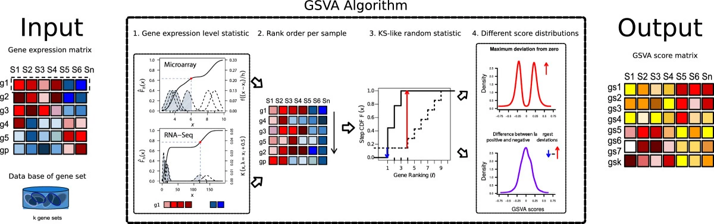

## Objectives

This notebook will demonstrate how to:

- Identify when Gene Set Variation Analysis (GSVA) is well-suited for an analysis
- Perform GSVA on transformed RNA-seq data with the `GSVA` package
- Explore the dependence of GSVA scores on gene set size with random gene sets

---

So far every pathway analysis method we've covered relies on some information about groups of samples in our data.
For over-representation analysis (ORA), we created gene sets from two different two group comparisons.
In the Gene Set Enrichment Analysis (GSEA) example, we used statistics from a differential gene expression (DGE) analysis where we compared _MYCN_ amplified cell lines to non-amplified cell lines; we needed that amplification status information.

What if we're less sure about groups in our data or we want to analyze our data in a more unsupervised manner?

In this notebook we will cover a method called Gene Set Variation Analysis (GSVA) ([Hänzelmann _et al._ 2013](https://doi.org/10.1186/1471-2105-14-7)) that allows us to calculate gene set or pathway scores on a per-sample basis.

We like this quote from the GSVA paper ([Hänzelmann _et al._ 2013](https://doi.org/10.1186/1471-2105-14-7)) to set the stage:

> While [gene set enrichment] methods are generally regarded as end points of a bioinformatic analysis, GSVA constitutes a starting point to build pathway-centric models of biology.

Rather than contextualizing some results you _already have_ from another analysis like DGE, GSVA is designed to provide an estimate of pathway variation for each of the samples in an experiment.
Note that these scores will depend on the samples included in the dataset when you run GSVA; if you added more samples and reran GSVA, you would expect the scores to change.

#### Other resources

* [Malhotra. _Decoding Gene Set Variation Analysis_. (2018)](https://towardsdatascience.com/decoding-gene-set-variation-analysis-8193a0cfda3)

## Set up

### Libraries

```{r libraries}
# Gene Set Variation Analysis
library(GSVA)
```

### Directories and files

#### Directories

```{r directories}
# We have some medulloblastoma data from the OpenPBTA project that we've
# prepared ahead of time
input_dir <- file.path("data", "open-pbta")

# Create a directory specifically for the results using this dataset
output_dir <- file.path("results", "open-pbta")
if (!dir.exists(output_dir)) {
  dir.create(output_dir, recursive = TRUE)
}
```

#### Input

We have VST transformed RNA-seq data, annotated with gene symbols, that has been collapsed such that there are no duplicated gene identifiers (see `setup`).

```{r input_file}
rnaseq_file <- file.path(input_dir, "medulloblastoma_vst_collapsed.tsv")
```

#### Output

```{r output_file, live = TRUE}
gsva_results_file <- file.path(output_dir, "medulloblastoma_gsva_results.tsv")
```

## Gene sets

The function that we will use to run GSVA wants the gene sets to be in a list, rather than a tidy data frame that we used with `clusterProfiler` (although it does accept other formats).

We're going to take this opportunity to introduce a different format that gene sets are often distributed in called [GMT (Gene Matrix Transposed)](https://software.broadinstitute.org/cancer/software/gsea/wiki/index.php/Data_formats#GMT:_Gene_Matrix_Transposed_file_format_.28.2A.gmt.29).

We're going to read in the Hallmark collection file directly from [MSigDB](https://www.gsea-msigdb.org/gsea/msigdb/index.jsp), rather than using `msigdbr` like we did in earlier notebooks.

The RNA-seq data uses gene symbols, so we need gene sets that use gene symbols, too.

```{r gmt}
# R can often read in data from a URL
hallmarks_url <- "https://data.broadinstitute.org/gsea-msigdb/msigdb/release/7.1/h.all.v7.1.symbols.gmt"

# QuSAGE is another pathway analysis method, the qusage package has a function
# for reading GMT files and turning them into a list
hallmarks_list <- qusage::read.gmt(hallmarks_url)
```

What does this list look like?

```{r head_hallmark, eval = FALSE}
head(hallmarks_list)
```

## RNA-seq data

We have VST transformed RNA-seq data, which is on a log2-like scale.
These data are from the Open Pediatric Brain Tumor Atlas (OpenPBTA)
OpenPBTA is a collaborative project organized by the CCDL and the Center for Data-Driven Discovery in Biomedicine (D3b) at the Children's Hospital of Philadelphia conducted openly on GitHub.

You can read more about the project [here](https://github.com/alexslemonade/openpbta-analysis/#openpbta-analysis).

We're only working with the medulloblastoma samples in this example.

```{r read_in_rnaseq}
rnaseq_df <- readr::read_tsv(rnaseq_file)
```

```{r peek_rnaseq, live = TRUE}
# What does the RNA-seq data frame look like?
rnaseq_df[1:5, 1:5]
```

For GSVA, we need a matrix.

```{r rnaseq_mat, live = TRUE}
rnaseq_mat <- rnaseq_df |>
  tibble::column_to_rownames("gene_symbol") |>
  as.matrix()
```

*Note: If we had duplicate gene symbols here, we couldn't set them as rownames.*

## GSVA



**Figure 1 from [Hänzelmann _et al._ (2013)](https://doi.org/10.1186/1471-2105-14-7).**

You may notice that GSVA has some commonalities with GSEA.
Rather than ranking genes based on some statistic _we_ selected ahead of time, GSVA fits a model and ranks genes based on their expression level relative to the sample distribution.
This is a way of asking if a gene _i_ is highly or lowly expressed in a sample _j_ in the context of this experiment and ranking accordingly ([Hänzelmann _et al._ 2013](https://doi.org/10.1186/1471-2105-14-7)).
The pathway-level score calculated is a way of asking how genes _within_ a gene set vary as compared to genes that are _outside_ of that gene set ([Malhotra. 2018](https://towardsdatascience.com/decoding-gene-set-variation-analysis-8193a0cfda3)).
(This is sometimes called a competitive test in gene set enrichment literature.)
The intuition here is that we will get pathway-level scores for each sample that indicate if genes in a pathway vary concordantly in one direction (overexpressed or underexpressed relative to the overall population) ([Hänzelmann _et al._ 2013](https://doi.org/10.1186/1471-2105-14-7)).

The output is a gene set by sample matrix of GSVA scores.

### Perform GSVA

```{r run_gsva}
gsva_results <- gsva(rnaseq_mat,
                     hallmarks_list,
                     method = "gsva",
                     # Appropriate for our transformed data on log2-like scale
                     kcdf = "Gaussian",
                     # Minimum gene set size
                     min.sz = 15,
                     # Maximum gene set size
                     max.sz = 500,
                     # Compute Gaussian-distributed scores
                     mx.diff = TRUE)
```

**Note: the `gsva()` documentation says we can use `kcdf = "Gaussian"` if we had RNA-seq log-CPMs, log-RPKMs or log-TPMs, but we would use `kcdf = "Poisson"` on integer counts.**

```{r gsva_peek}
# Let's explore what the output of gsva() looks like
gsva_results[1:5, 1:5]
```

### A note on gene set size

Often the scores of gene set enrichment methods are not comparable between gene sets of different sizes.
Let's do an experiment using randomly generated gene sets to explore this idea a bit more.

We need to get a collection of all possible genes we will sample from to create random gene sets.
Because we're doing some random sampling, we need to set a seed for this to be reproducible.

```{r random_setup}
# Use all the gene symbols in the dataset as the pool of possible genes
all_genes <- rownames(rnaseq_mat)

# Set a seed for reproducibility
set.seed(2020)
```

Our minimum gene set size earlier was 15 genes and our maximum gene set size was 500 genes.
We'll use the same minimum and maximum values for our random gene sets and some values in between.

```{r gene_set_sizes}
# Make a list of integers that indicate the random gene set sizes
gene_set_size <- list(15, 25, 50, 100, 250, 500)
```

For each gene set size, we will generate 100 random gene sets.

```{r random_gene_sets}
# Set number of replicates
nreps <- 100
# Generate 100 random gene sets of each size
random_gene_sets <- rep(gene_set_size, nreps) |>  # Repeat gene sizes so we run `nreps` times
  purrr::map(
    # Sample the vector of all genes, choosing the number of items specified
    # in the element of gene set size
    ~ base::sample(x = all_genes,
                   size = .x)
  )
```

The Hallmarks list we used earlier stored the gene set names as the name of the list, so let's add names to our random gene sets that indicate what size they are and so `gsva()` doesn't get upset.

```{r name_random_gene_sets}
# We will include the size of the gene set in the gene set name
# Start by taking the length of each pathway and appending "pathway_" to that
# number
lengths_vector <- random_gene_sets |>
  # Get the length of each gene set (number of genes)
  purrr::map(~ length(.x)) |>
  # Make it "pathway_<gene set size>"
  purrr::map(~ paste0("pathway_", .x)) |>
  # Return a vector
  purrr::flatten_chr()

# Add the names in lengths_vector to the list - "pathway_<gene set size>"
random_gene_sets <- random_gene_sets |>
  # make.names() appends a "version" if something is not unique
  purrr::set_names(nm = make.names(lengths_vector, unique = TRUE))
```

Run GSVA on our dataset with the same parameters as before, but now with random gene sets.

```{r random_gsva, live = TRUE}
random_gsva_results <- gsva(rnaseq_mat,
                            random_gene_sets,
                            method = "gsva",
                            # Appropriate for our transformed data on
                            # log2-like scale
                            kcdf = "Gaussian",
                            # Minimum gene set size
                            min.sz = 15,
                            # Maximum gene set size
                            max.sz = 500,
                            # Compute Gaussian-distributed scores
                            mx.diff = TRUE)
```

Now let's make a plot to look at the distribution of scores from random gene sets.
First we need to get this data in an appropriate format for `ggplot2`.

```{r longer_random_gsva}
# The random results are a matrix
random_long_df <- random_gsva_results |>
  data.frame() |>
  # Gene set names are rownames
  tibble::rownames_to_column("gene_set") |>
  # Get into long format
  tidyr::pivot_longer(cols = -gene_set,
                      names_to = "Kids_First_Biospecimen_ID",
                      values_to = "gsva_score") |>
  # Remove the .version added by make.names()
  dplyr::mutate(gene_set = stringr::str_remove(gene_set, "\\..*")) |>
  # Add a column that keeps track of the gene set size
  dplyr::mutate(gene_set_size = stringr::word(gene_set, 2, sep = "_")) |>
  # We want to plot smallest no. genes -> largest no. genes
  dplyr::mutate(gene_set_size = factor(gene_set_size,
                                       levels = c(15, 25, 50, 100, 250, 500)))

```

Let's make a violin plot so we can look at the distribution of scores by gene set size.

```{r random_violin}
# Violin plot comparing GSVA scores of different random gene set sizes
random_long_df |>
  ggplot2::ggplot(ggplot2::aes(x = gene_set_size,
                               y = gsva_score)) +
  # Make a violin plot that's a pretty blue!
  ggplot2::geom_violin(fill = "#99CCFF", alpha = 0.5) +
  # Add a point with the mean value
  ggplot2::stat_summary(
    geom = "point",
    fun = "mean",
    # Change the aesthetics of the points
    size = 3,
    color = "#0066CC",
    shape = 18
  ) +
  # Flip the axes
  ggplot2::coord_flip() +
  ggplot2::labs(title = "Random Gene Set GSVA Scores",
                x = "gene set size",
                y = "GSVA score") +
  ggplot2::theme_bw()
```

What do you notice about these distributions?
How might you use this information to inform your interpretation of GSVA scores?

### How can you use these scores?

If you did have groups information for your samples, you could test for pathway scores differences between groups.
Here's [an example](https://htmlpreview.github.io/?https://github.com/AlexsLemonade/OpenPBTA-analysis/blob/9b44bf1c186b3126b16dbe5b87756b3eae3feec2/analyses/gene-set-enrichment-analysis/02-model-gsea.nb.html) of that from the OpenPBTA project itself!

You can also visualize this matrix in a heatmap.
Here's a figure from the OpenPBTA project, where the middle panel is a heatmap of GSVA scores that were significantly different between histologies.


[*Code here.*](https://github.com/AlexsLemonade/OpenPBTA-analysis/blob/9b44bf1c186b3126b16dbe5b87756b3eae3feec2/figures/scripts/transcriptomic-overview.R#L106)

### Write results to file

```{r write_gsva_results}
gsva_results |>
  as.data.frame() |>
  tibble::rownames_to_column("pathway") |>
  readr::write_tsv(file = gsva_results_file)
```

## Session Info

```{r session_info}
sessionInfo()
```
