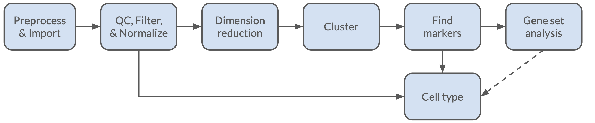
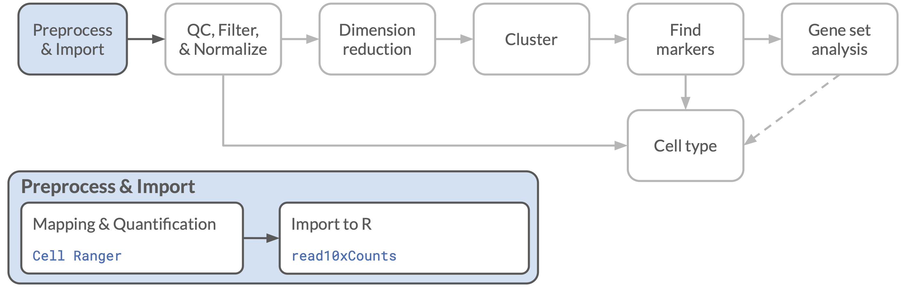
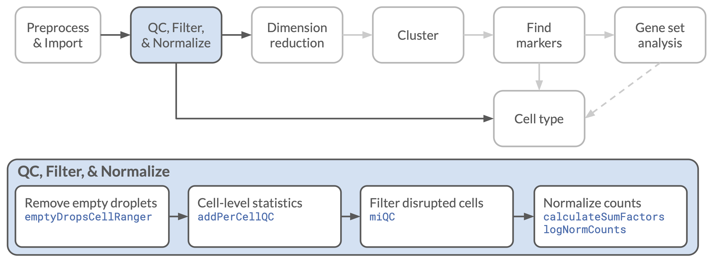
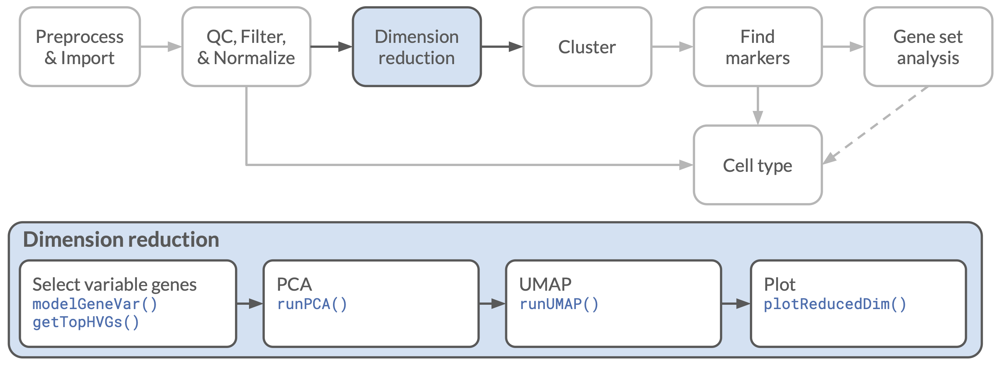

## Objectives

This notebook will demonstrate how to:

- Read Cell Ranger data into R
- Filter to cells using `emptyDropsCellRanger()`
- Calculate quality control measures on scRNA-seq data
- Remove likely compromised cells with `miQC()`
- Normalize expression data across cells
- Calculate and plot reduced dimension representations of expression data (PCA, UMAP)

---

In this notebook, we will review basic processing for single-cell RNA-seq data, starting with the output from Cell Ranger, and proceeding through filtering, quality control, normalization, and dimension reduction. We will perform these tasks using tools from the [Bioconductor project](https://bioconductor.org), in particular [`SingleCellExperiment` objects](https://bioconductor.org/packages/release/bioc/html/SingleCellExperiment.html) and functions that work with those objects.
Much of the material in this notebook is directly inspired by, and draws heavily on, material presented in the book [_Orchestrating Single Cell Analysis with Bioconductor_ (OSCA)](http://bioconductor.org/books/3.16/OSCA/).



The data we will use for this notebook is derived from a human glioblastoma specimen.
The sample was processed by 10x Genomics using a 3' RNA kit (v3.1), sequenced, and quantified with Cell Ranger 6.0.
Further details about the sample and processing can be found on the [10x website](https://www.10xgenomics.com/resources/datasets/2-k-sorted-cells-from-human-glioblastoma-multiforme-3-v-3-1-3-1-standard-6-0-0).


## Set Up

To start, we will load some of the libraries we will need later, and set a random number seed for reproducibility.

```{r setup}
# Load libraries

# Plotting functions
library(ggplot2)

# The main class we will use for Single Cell data
library(SingleCellExperiment)

# Setting the seed for reproducibility
set.seed(12345)
```

### Directories and files

Before we get too far, we like to define the input and output files that the notebook will use near the top of the document.
While you might not know the names of all of the files you will need or create output files when you start an analysis, we have found it helpful to keep all file and directory names in a single place near the top of the document.
This makes it easier for somebody coming to the code later to quickly see what files are needed as input and what will be produced as output.
More often than not, that somebody is you!

The gene expression data were processed to create a gene-by-cell expression matrix of counts for using Cell Ranger 6.0.
We have provided the raw data directory, `raw_feature_bc_matrix`, which is usually produced by Cell Ranger and placed in its `outs` directory.
This directory usually contains three files:
- `barcodes.tsv.gz`, a table of the cell barcodes that 10x uses, corresponding to the columns of the count matrix.
- `features.tsv.gz`, a table of the features (genes in this case) for which expression was quantified.
This will usually also include a bit of metadata about the features, including gene symbols (if the features are genes) and the type of data they represent (e.g., gene expression or antibody capture).
- `matrix.mtx.gz`, The counts themselves, stored in a sparse ["Matrix Exchange" format](https://math.nist.gov/MatrixMarket/formats.html).

Cell Ranger will also export these data in a single `HDF5` format file with a `.h5` extension, which can also be imported with the same commands we will use below.
However, we have found that processing large `.h5` files is often _much_ less efficient in R, so we prefer to start with the matrix files when possible.
In particular, we would not recommend working with `.h5` files for raw data; the filtering steps we will use below can sometimes take hours when using those files as input.

We will also need a table of mitochondrial genes, which we have stored in the `data/reference/` directory.

Finally, we will set up the our output directory, creating it if it does not yet exist, and define the name for the files we will save after all of our initial processing is complete.

```{r inputs, live=TRUE}
# Inputs --------------------------------------
# main data directory

# Path to the Cell Ranger matrix file

# reference data directory

# Path to mitochondrial genes table

```

```{r outputs}
# Outputs ------------------------------------

# Directory and file to save output
normalized_dir <- file.path(data_dir, "normalized")

# create the directory if it does not exist
fs::dir_create(normalized_dir)

# output RDS file for normalized data
output_sce_file <- file.path(normalized_dir,
                             "glioblastoma_normalized_sce.rds")
```


## Reading Cell Ranger data



Whether the 10x Cell Ranger data is in Matrix Exchange format or in an HDF5 file, we can use the `read10xCounts()` function from the `DropletUtils` package to read the data into R and create a `SingleCellExperiment` object.
(Though again, we do not recommend using the `.h5` file if you can avoid it, _especially_ for raw (unfiltered) data.)

If you used something other than Cell Ranger to process the raw data, you would need to use a different function to read it in and create the `SingleCellExperiment` object.
Some of these functions for other common data formats are discussed in [Chapter 3 of OSCA] (http://bioconductor.org/books/3.16/OSCA.intro/getting-scrna-seq-datasets.html#reading-counts-into-r).

```{r read SCE, live=TRUE}
# read SCE from matrix directory

```

Let's look at the contents of the object after reading it in:

```{r view SCE, live=TRUE}
# view SCE object

```

We can see from this summary that this `SingleCellExperiment` (SCE) object contains 36,601 rows, which correspond to the features (genes) that were analyzed, and 734,492 columns, which correspond to the possible barcode tags that were used in the experiment.
Note that not all of these barcode tags will have been used, and many of the features may never have been seen either.
One of our first steps will be to filter out barcodes that were never seen, or that may have only been seen in a droplet that did not contain a cell (an "empty droplet").

### Structure of the `SingleCellExperiment` object

In addition to the main `counts` matrix, listed as an `assay` in the SCE summary above, the SCE object can contain a number of other tables and matrices, each stored in a "slot" with a particular format.
The overall structure of the object can be seen in the figure below, which comes from an [OSCA Introduction chapter](http://bioconductor.org/books/3.16/OSCA.intro/the-singlecellexperiment-class.html).


We have just mentioned the main `assay` slot, which contains full matrices of data (such as transcript counts) with each row a feature and each column a cell.
There are also a couple of tables for metadata, and a slot to store reduced-dimension representations (e.g., PCA and/or UMAP) of the expression data.

We'll start with the `rowData` slot, which is a table of metadata for each feature in our object.
For now that contains the contents of the `features.tsv.gz` file that we discussed earlier.
If we had read the data from something other than Cell Ranger output, we might have different contents, but each row would still correspond to a single feature of the SCE object.

Let's look at this table, extracting it from the SCE object with the `rowData()` function and using `head()` to view only the first 6 rows.

```{r rowdata}
# view rowData (features)
head(rowData(raw_sce))
```

You can see that this table includes an `ID` for each feature, which is usually the Ensembl gene ID, as well as the corresponding gene symbol in the `Symbol` column.
Finally there is a column for `Type`, which in this case is always "Gene Expression", as all of the features in this data set are genes.
If there were another modality of data that had been assayed in this experiment, there might be other values in this column, such as "Antibody Capture" for CITE-seq experiments.

The second slot is the `colData` table, which now corresponds to the `barcodes.tsv.gz` file, containing one row per cell barcode, or, more generally, one row per column of the `counts` assay.
We can look at this table using the `colData()` function (and `head()` again to prevent printing the whole table):

```{r coldata}
# view colData (cell barcodes)
head(colData(raw_sce))
```

Here we see that there are currently two columns:

- the `Sample` column has the path of the file that we read in (you may not see the whole path in this display); this should be identical in all rows from a single sample.
- the `Barcode` column contains the sequence that was used to identify each potential droplet for sequencing (and a numeric tag, in this case).
These will be unique within a sample.

As we proceed to calculate per-cell statistics, we will be adding new data to this table.

## Quality control and filtering



### Filtering empty droplets

Most of the barcodes in any given 10x experiment will not be seen at all, so our first step can be to filter this raw data to only the cells where there is at least one transcript that was counted with that barcode.

To do this, we will use the `colSums()` function to quickly add up all the counts that correspond to each possible cell barcode, then filter our `raw_sce` down to just those columns where there are non-zero total counts.
We will need to extract the `counts` matrix from our SCE object, which we can do using the `counts()` function, conveniently enough.

```{r remove zeros, live=TRUE}
# sum columns from counts matrix

# filter SCE object to only rows with counts > 0

```

Now we can look at how our SCE object has changed:

```{r zero-filtered SCE}
raw_sce
```

But barcodes with zero counts are not the only ones that correspond to droplets without cells in them!
Even if a droplet does not have a cell in it, there will often be spurious reads from RNA sequences that were present in the extracellular solution, whether from the original sample or from cells that were damaged during single-cell library preparation.

We could identify these barcodes simply as those with low transcript counts.
Or, we can be a bit more clever!
We can look at the transcript counts _from_ the lowest-count droplets to create an expected distribution of transcripts in droplets that don't contain cells.
Then we can test each droplet to determine whether or not its transcript distribution deviates from that expectation.
If it does, then we have pretty good evidence that there _is_ a cell in there.

This test was first proposed by [Lun _et al._ (2019)](https://doi.org/10.1186/s13059-019-1662-y) and implemented as `emptyDrops()` in the `DropletUtils` package.
This method was then adopted, with some modifications, as the default cell filtering method used by Cell Ranger.
Here we will use the [`emptyDropsCellRanger()` function](https://rdrr.io/github/MarioniLab/DropletUtils/man/emptyDropsCellRanger.html) to perform filtering that more closely matches the Cell Ranger implementation.


```{r calculate droplet stats, live=TRUE}
# create a table of statistics using emptyDropsCellRanger

```

Most values in this table are `NA`, because individual statistics were not calculated for the low-count droplets that were used to generate the background distribution.
(Most droplets don't have cells, so this makes some sense!)

We can look at just the rows without `NA` values by selected the ones where the FDR (which we will use again soon), is not `NA`.

```{r droplet stats}
# view rows where FDR is not `NA`
droplet_df[!is.na(droplet_df$FDR), ]
```
You will notice that some cells with high counts also have `NA` values for many statistics.
In those cases, `NA` values are actually present _because_ of the high counts - `emptyDropsCellRanger()` automatically assumed cells were present, so they were also not tested.

Now we can filter our `raw_sce` object _by column_ to only keep the cells with a small FDR: those that are quite unlikely to be empty droplets.

```{r filter emptydrops, live=TRUE}
# filter droplets using `which` to prevent NA trouble

```

How many cells do we have now?

```{r filtered summary}
filtered_sce
```

### Additional quality control

In addition to filtering out empty droplets, we also will want to filter out cells that may have been damaged during library preparation.
These will often be characterized by a high proportion of mitochondrial transcripts and a smaller overall number of unique transcripts.
When a cell ruptures, cytoplasmic transcripts will leak out, but mitochondrial transcripts, still protected by the mitochondrial membrane, may remain.
As a consequence, there will be an over-abundance of mitochondrial reads, and fewer unique transcripts expressed.

Our first step then, is create a vector of the mitochondrial genes that are present in our dataset.
The mitochondrial file we defined during setup (`mito_file`) is a TSV file containing all of the human mitochondrial genes with additional annotation information for each gene, such as the gene location and alternative names.
(For more detail on the steps we took to create this file, you can look at [one of our setup notebooks](https://github.com/AlexsLemonade/training-modules/blob/master/scRNA-seq-advanced/setup/mito_gene_lists.Rmd))

All we need now is the `gene_id`, and only for the genes that are present in our SCE, so we will do some filtering with `dplyr` to pull out a vector with just those ids.

```{r get mitochondrial genes}
# read in a table of mitochondrial genes and extract ids
mito_genes <- readr::read_tsv(mito_file) |>
  # filter to only the genes that are found in our dataset
  dplyr::filter(gene_id %in% rownames(filtered_sce)) |>
  # create a vector from the gene_id column
  dplyr::pull(gene_id)
```

### Calculating summary QC statistics

We can now use the `scuttle` function `addPerCellQC()` to calculate some statistics based on the counts matrix, which will be added to the `colData` table.

In addition to calculating statistics like the total read count for each cell and the number of transcripts that are detected, we can also calculate those statistics for defined subsets of genes.
In this case, we will use our `mito_genes` vector to define a subset called `mito`.
The `mito` name is important in that it is the name that will be expected by a later function.
(We could define more subsets, but for now this one will do.)

```{r per cell QC, live=TRUE}

```

Now we can look at the colData to see what was added:

```{r view colData stats}
head(colData(filtered_sce))
```

We can also plot some of these statistics, here using the `plotMetrics()` function from the `miQC` package to plot the percent of reads that are mitochondrial (the `subsets_mito_percent` column) against the number of unique genes detected (the `detected` column) for each cell.

```{r miQC plotMetrics}
# use miQC::plotMetrics()
miQC::plotMetrics(filtered_sce) + theme_bw()
```

We can see that there is a range of mitochondrial percentages, and it does also seem that cells with high percentages of mitochondrial genes don't seem to contain very many unique genes.

How do we filter with this information?
One option is to define a cutoff for the mitochondrial percentage above which we call a cell compromised and exclude it from further analysis.
However, choosing that cutoff can be a bit fraught, as the expected percentage of mitochondrial reads can vary depending on the cell type and library preparation methods.
So it might be nice to have a method to determine that cutoff from the data itself.

### Filtering compromised cells

Determining mitochondrial cutoffs is exactly what the `miQC` package does ([Hippen _et al._ 2021](https://doi.org/10.1371/journal.pcbi.1009290))!
In truth, it does something possibly even a bit better: it fits a mixture model to the data that consists of distributions of healthy cells and compromised cells.
Then we can calculate whether each cell is more likely to belong to the healthy or compromised distribution.
We can then exclude the cells that are more likely to be compromised.

To use `miQC`, we first fit a model to the data in our SCE object:

```{r miQC model, live=TRUE}
# fit the miQC model

```

Now we can plot the model results using the `plotModel()` function to see how it corresponds to our data.
We should expect to see two fit lines:

- One line will correspond the the "healthy" cells and should show little to no relationship between the number of unique genes detected and the mitochondrial percentage.
- By contrast, the line that corresponds to "compromised" cells will show a negative relationship between the number of unique genes detected and the mitochondrial percentage.

This plot will also show, for each cell, the posterior probability that the cell is derived from the compromised distribution; a higher score indicates that a cell is more likely to be compromised.

It is also critical to note that this model can _and does_ fail at times.
Plotting the results as we have done here is not a step to skip.
**Always look at your data!**

```{r miQC plotModel, live=TRUE}
# plot the miQC model

```

We can now filter our data based on the probability compromised as calculated from the model.
But before we do that, we might want to quickly plot to see what would be filtered out with a given cutoff, using the `plotFiltering()` function.
The default is to exclude cells that have a posterior probability of 0.75 or greater of being compromised.
We stick with that default, but for clarity, we will also include it in our code!


```{r miQC plotFiltering}
# look at miQC filtering
miQC::plotFiltering(filtered_sce, miqc_model,
                    posterior_cutoff = 0.75) +
  theme_bw()
```

In this case, the line between the cells to be kept and those that will be removed seems to correspond to a mitochondrial percentage of about 12.5%, but note that this will not always be constant.
The cutoff point can vary for different numbers of unique genes within a sample, and it will certainly vary among samples!

At this point, we can perform the actual filtering using the `filterCells()` function, giving us a further filtered SCE object.

```{r miQC filtercells, live=TRUE}
# perform miQC filtering

```

#### One more filter: unique gene count

While the miQC filtering is pretty good, you may have noticed that it still left some cells that had very low numbers of unique genes.
While these cells may not be compromised, the information from them is also not likely to be useful, so we will filter those as well.
We will only keep cells that have at least 200 unique genes.

```{r unique cutoff, live=TRUE}
# filter cells by unique gene count (`detected`)

```


## Normalization

Now that we have done our filtering, we can start analyzing the expression counts for the remaining cells.

The next step at this point is to convert the raw counts into a measure that accounts for differences in sequencing depth between cells, and to convert the distribution of expression values from the skewed distribution we expect to see in raw counts to one that is more normally distributed.

We will do this using functions from the `scran` and `scuttle` packages.
The procedure we will use here is derived from the [OSCA chapter on normalization](http://bioconductor.org/books/3.16/OSCA.basic/normalization.html#normalization-by-deconvolution).
The idea is that the varying expression patterns that different cell types exhibit will affect the scaling factors that we would apply.
To account for that variation, we first do a rough clustering of cells by their expression with `scran::quickCluster()`, then use that clustering to calculate the scaling factor for each cell within the clusters using `scran::computeSumFactors()`.
Finally, we apply the scaling factor to the expression values for each cell and calculate the log-scaled expression values using the `scuttle::logNormCounts()` function.

```{r normalization, live=TRUE}
# Perform rough clustering

# use clusters to compute scaling factors and add to SCE object

# perform normalization using scaling factors
# and save as a new SCE object

```

This creates a new "assay" in the `normalized_sce` object, `logcounts`, which contains the normalized count values for each cell and gene.
(The data here are not _actually_ the log of the counts, since we also applied the scaling factors, but that name is used for historical reasons.)

Let's take a look:

```{r normalized sce}
normalized_sce
```

## Dimension reduction



Now that we have normalized expression values, we would like to produce some reduced-dimension representations of the data.
These will allow us to perform some downstream calculations more quickly, reduce some of the noise in the data, and allow us to visualize overall relationships among cells more easily (though with many caveats!).

### Selecting highly variable genes

While we could calculate the reduced dimensions using all of the genes that we have assayed, in practice most of the genes will have very little variation in expression, so doing so will not provide much additional signal.
Reducing the number of genes we include will also speed up some of the calculations.

To identify the most variable genes, we will use functions from the `scran` package.
The first function, `modelGeneVar()`, attempts to divide the variation observed for each gene into a biological and technical component, with the intuition that genes with lower mean expression tend to have lower variance for purely technical reasons.
We then provide the `modelGeneVar()` output to the `getTopHVGs()` function to identify the genes with the highest _biological_ variation, which is what we are most interested in.

```{r select HVGs}
# identify 2000 genes
num_genes <- 2000

# model variance, partitioning into biological and technical variation
gene_variance <- scran::modelGeneVar(normalized_sce)

# get the most variable genes
hv_genes <- scran::getTopHVGs(gene_variance,
                              n = num_genes)
```

The result is a vector of gene ids (ordered from most to least variable):

```{r view HVGs}
head(hv_genes)
```

### Principal components analysis

Now that we have selected the genes we would like to use for the reduced-dimension representations of the expression data, we can start to calculate them.
First we will use the `scater::runPCA()` function to calculate the principal components from the expression matrix.
This representation is fast and fairly robust, but the result is still quite multidimensional.
We want keep a fair number of components (dimensions) in order to accurately represent the variation in the data, but doing so means that plotting only a few of these dimensions (in 2D) is not likely to provide a full view of the data.

The default number of components is 50, which we will stick with, but let's enter it manually just for the record.

```{r runPCA, live=TRUE}
# calculate and save PCA results

```

These reduced-dimension results will be stored in a `reducedDim` slot in the SCE object.
We can see the names of the `reducedDim`s that we have by looking at the object summary:

```{r view reduced dimensions}
normalized_sce
```

If we want to extract the PCA results, we can do that with the `reducedDim()` function:
Note that for these reduced-dimensionality matrices, the rows are the cells and the columns are the PC dimensions.

```{r getReducedDim}
# extract the PCA matrix
pca_matrix <- reducedDim(normalized_sce, "PCA")

# look at the shape of the matrix
dim(pca_matrix)
```

### UMAP

Finally, we will calculate a UMAP (Uniform Manifold Approximation and Projection) representation of our data.
This is a machine-learning-based method that is useful for performing dimensionality reduction suitable for visualization.
It's goal is to provide a representation of the data in two dimensions (typically, more are possible) that preserves as much of the distance relationships among cells as possible.
While this does make for visually appealing and useful plots, it is important not to overinterpret the results!
In particular, while you will often see some apparent clustering of cells in the resulting output, those clusters may not be particularly valid, and the spacing within or between clusters may not reflect true distances.

In many ways this is analogous to the problem of projecting a map of the earth onto a flat surface; any choice will result in some distortions.
However, with UMAP, we rarely know exactly what choices were made and what distortions might have resulted.
The UMAP coordinates themselves should never be used for downstream analysis.

Since the UMAP procedure would be slow to calculate with the full data, so the `runUMAP()` function first calculates a PCA matrix and then uses _that_ to calculate the UMAP.
Since we already have a PCA matrix, we will tell the function use that instead of recalculating it.

```{r runUMAP, live=TRUE}

```

As before, we could extract the UMAP matrix from our SCE object with the `reducedDim()` function.
We can also visualize the UMAP results using the `plotReducedDim()` function.

```{r plotReducedDim, live=TRUE}
# plot the UMAP

                       # color by the most variable gene

```


## Unsupervised clustering

As a final analysis step at this stage, we will return to the PCA results to perform unsupervised clustering.
Here we will use a graph-based clustering method, which starts by identifying cells that are close together in the multidimensional space.
It then identifies "communities" of highly connected cells, and breaks them apart by regions of lower connection.

There are a number of algorithms that can perform this clustering, each with parameters that can affect how many clusters are identified and which cells belong to each cluster.
It is also worth noting that these clusters may or may not correspond to "cell types" by whatever definition you might prefer to use.
Interpretation of these clusters, or other measures of cell type, are something that will require more careful and likely more customized analysis.

We will perform our clustering using the `bluster` package, which can perform many different types of clustering.
As mentioned earlier, we are using "graph" clustering, which we define using the `NNGraphParam()` function.
Within that are a number of further options, such as the weighting used for building the network graph and the algorithm used for dividing the graph into clusters.

Modifying these parameters can result in quite different cluster assignments!
For the clustering below we will use Jaccard weighting and Louvain clustering, which correspond more closely to the default methods used by `Seurat` than the default parameters.
It is also worth noting that the the cluster assignments are somewhat stochastic.
In particular, the names/numbers of the clusters can be quite inconsistent between runs!


```{r clustering, live=TRUE}
# perform graph-based clustering

    # number of neighbors to use in network graph

    # weighting scheme for building the network graph
    # default is "rank"

    # cluster detection algorithm
    # default is "walktrap"

```

We can save the cluster assignments back into the `colData` of the SCE object with a little shortcut: the `$` followed by the name of the new column we want to add.

```{r add clusters to SCE, live=TRUE}
# save clusters to SCE colData

```

Now we can plot the UMAP again, this time colored by the cluster assignments that we just created.
Here rather than the general `plotReducedDim()` function, we will use `plotUMAP()`, which is exactly the same, except it always plots from the `reducedDim` slot named `UMAP`, so we can skip that argument.

```{r plot clusters, live=TRUE}
# plot UMAP with assigned clusters

```

What do you see in these results?

What would you want to do next?

## Save SCE object for later

We will now save our filtered and normalized object, including the dimension reduction and clustering results to an `RDS` file, using the file path that we defined at the start of the notebook.
If we were to want to return to this data, we could load this file directly into a new R session and not have to repeat the processing that we have done up to this point.

The data in these objects tends to be quite large, but very compressible.
To save space on disk (at the expense of time), we will make sure that the data is compressed internally before writing it out to a file.
Note that the file we write is still going to be an `.rds` file with no additional extension.
(Further note: The base R function `saveRDS()` uses compression by default, but the `tidyverse` function `readr::write_rds()` does not.)

```{r save SCE, live=TRUE}
# write RDS file with compression

```


## Print session info

As is our habit at the Data Lab, we will save information about the computing environment, the packages we have used in this notebook, and their versions using the `sessionInfo()` command.

```{r session info}
sessionInfo()
```

