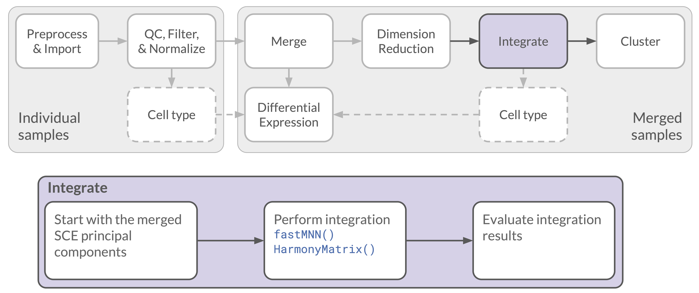

## Objectives

This notebook will demonstrate how to:

- Prepare SCE objects for integration
- Apply integration methods including `fastMNN` and `harmony`
- Visually explore the results of integration
- Use `purrr::map()` functions for iterating over lists

---

In this notebook, we'll perform integration on scRNA-seq datasets from the [Single-cell Pediatric Cancer Atlas (`ScPCA`)](https://scpca.alexslemonade.org/), a database of uniformly-processed pediatric scRNA-seq data built and maintained by the Data Lab.
The `ScPCA` database currently hosts single-cell pediatric cancer transcriptomic data generated by ALSF-funded labs, with the goal of making this data easily accessible to investigators (like you!).
The expression data in `ScPCA` were mapping and quantified with [`alevin-fry`](https://doi.org/10.1038/s41592-022-01408-3), followed by processing with Bioconductor tools using the same general procedures that we have covered in this workshop.
The processing pipeline used `emptyDropsCellRanger()` and `miQC` to filter the raw counts matrix, `scuttle` to log-normalize the counts, and `scater` for dimension reduction.
The processed data are stored as `.rds` files containing `SingleCellExperiment` objects.
You can read more about how data in the `ScPCA` is processed in [the associated documentation](https://scpca.readthedocs.io/en/latest/).


To learn about integration, we'll have a look at four samples from the [`SCPCP000005` project](https://scpca.alexslemonade.org/projects/SCPCP000005) ([Patel _et al._ 2022](https://doi.org/10.1016/j.devcel.2022.04.003)), an investigation of pediatric solid tumors led by the [Dyer](https://www.stjude.org/research/labs/dyer-lab.html) and [Chen](https://www.stjude.org/research/labs/chen-lab-taosheng.html) labs at St. Jude Children's Research Hospital.
The particular libraries we'll integrate come from two rhabdomyosarcoma (RMS) patients, with two samples from each of two patients, all sequenced with 10x Chromium v3 technology.
Each library is from a separate biological sample.

We'll be integrating these samples with two different tools, [`fastMNN`](http://www.bioconductor.org/packages/release/bioc/html/batchelor.html) ([Haghverdi _et al._ 2018](https://doi.org/10.1038/nbt.4091)) and [`harmony`](https://portals.broadinstitute.org/harmony/) ([Korsunsky _et al._ 2019](https://doi.org/10.1038/s41592-019-0619-0)).
Integration corrects for batch effects that arise from different library preparations, genetic backgrounds, and other sample-specific factors, so that datasets can be jointly analyzed at the cell level.
`fastMNN` corrects for batch effects using a faster variant of the mutual-nearest neighbors algorithm, the technical details of which you can learn more about from this [vignette by Lun (2019)](https://marionilab.github.io/FurtherMNN2018/theory/description.html).
`harmony`, on the other hand, corrects for batch effects using an iterative clustering approach, and unlike `fastMNN`, it is also able to consider additional covariates beyond just the batch groupings.

Regardless of which integration tool is used, the `SingleCellExperiment` (SCE) objects first need to be reformatted and merged into a single (uncorrected!) SCE object that contains all cells from all samples.
This merged SCE can then be used for integration to obtain a formally batch-corrected SCE object.


## Set up

```{r setup}
# Load libraries
library(ggplot2)  # plotting tools
library(SingleCellExperiment) # work with SCE objects

# Set the seed for reproducibility
set.seed(12345)
```


### Directories and files


We have already prepared count data for the four samples we'll be integrating (i.e., filtered cells, normalized counts, and calculated PCA & UMAP).
These SCE objects, stored as RDS files, are available in the `data/rms/processed/` directory and are named according to their `ScPCA` library ids :

- `SCPCL000479.rds` (Patient A)
- `SCPCL000480.rds` (Patient A)
- `SCPCL000481.rds` (Patient B)
- `SCPCL000482.rds` (Patient B)

Both Patient A (18 year old male) and Patient B (4 year old female) had recurrent embryonal rhabdomyosarcoma when samples were taken.

To begin, let's set up our directories and files:

```{r directories}
# Define directory where processed SCE objects to be integrated are stored
input_dir <- file.path("data", "rms", "processed")

# Define directory to save integrated SCE object to
output_dir <- file.path("data", "rms", "integrated")

# Create output directory if it doesn't exist
fs::dir_create(output_dir)

# Define output file name for the integrated object
integrated_sce_file <- file.path(output_dir, "rms_integrated_subset.rds")
```


We can use the `dir()` function to list all contents of a given directory, for example to see all the files in our `input_dir`:

```{r input dir, live = TRUE}
dir(input_dir)
```

We want to read in just four of these files, as listed previously.
To read in these files, we could use the `readr::read_rds()` function (or the base R `readRDS()`) four times, once for each of the files.
We could also use a `for` loop, which is the approach that many programming languages would lean toward.
A different and more modular coding approach to reading in these files (and more!) is to leverage the [`purrr`](https://purrr.tidyverse.org/) `tidyverse` package, which provides a convenient set of functions for operating on lists.
You can read more about the `purrr` functions and their power and utility in R in [the "Functionals" chapter of the _Advanced R_ e-book](https://adv-r.hadley.nz/functionals.html).

Of particular interest is the [`purrr::map()`](https://purrr.tidyverse.org/reference/map.html) family of functions, which can be used to run a given function on each element of a list (or vector) in one call.
The general syntax for `purrr::map()` and friends is:

```
# Syntax for using the map function:
purrr::map(<input list or vector>,
           <function to apply to each item in the input>,
           <any additional arguments to the function can go here>,
           <and also here if there are even more arguments, and so on>)
```


The output from running `purrr::map()` is always a list (but note that there are other `purrr::map()` relatives which return other object types, as you can read about in [the `purrr::map()` documentation](https://purrr.tidyverse.org/reference/index.html)).
If this concept sounds a little familiar to you, that's because it probably is!
Base R's `lapply()` function can provide similar utility, and the `purrr::map()` family of functions can (in part) be thought of as an alternative to some of the base R `apply` functions, with more consistent behavior.

Let's see a very simple example of `purrr::map()` in action, inspired by cancer groups the Data Lab has analyzed through the [OpenPBTA](https://github.com/AlexsLemonade/OpenPBTA-analysis/) project:

```{r map example}
# Define a list of cancer histologies
histologies <- list(
  "low-grade gliomas"  = c("SEGA", "PA", "GNG", "PXA"),
  "high-grade gliomas" = c("DMG", "DIPG"),
  "embryonal tumors"   = c("MB", "ATRT", "ETMR")
 )

# The overall length of the list is 3
length(histologies)

# How can we run `length()` on each item of the list?
# We can use our new friend purrr::map():
purrr::map(histologies, length)
```

Let's use `purrr::map()` to read in our SCE objects so that they are immediately stored together in a list.


We'll first need to define a vector of the file paths to read in.
We'll start by creating a vector of sample names themselves and then formatting them into the correct paths.
This way (foreshadowing!) we also have a stand-alone vector of just sample names, which will come in handy!

```{r sample names}
# Vector of all the samples to read in:
sample_names <- c("SCPCL000479",
                  "SCPCL000480",
                  "SCPCL000481",
                  "SCPCL000482")
```


```{r define sce_paths, live = TRUE}
# Now, convert these to file paths: <input_dir>/<sample_name>.rds
sce_paths <- file.path(input_dir,
                       glue::glue("{sample_names}.rds")
)
# Print the sce_paths vector
sce_paths
```

Let's make this a named vector using the sample names.
This will help us keep track of which objects are which after we read the SCE objects in:

```{r add list names, live = TRUE}
# Assign the sample names as the names for sce_paths
names(sce_paths) <- sample_names
```

We can now read these files in and create a list of four SCE objects. 
Since `readr::read_rds()` can only operate on one input at a time, we'll need to use `purrr::map()` to run it on all input file paths in one command.
Although `sce_paths` is a vector (not a list), it will still work as input to `purrr:map()`.
The output from this code will still be a list, since that's what `purrr::map()` always returns, and it will retain the sample names as the list names for convenient bookkeeping:

```{r read sce paths, live = TRUE}
# Use purrr::map() to read all files into a list at once
sce_list <- purrr::map(
  sce_paths,
  readr::read_rds
)
```

Let's have a look at our named list of SCE objects:

```{r print sce list, live=TRUE}
# Print sce_list
sce_list
```

If you look closely at the printed SCE objects, you may notice that they all contain `colData` table columns `celltype_fine` and `celltype_broad`.
These columns (which we added to SCE objects during [pre-processing](https://github.com/AlexsLemonade/training-modules/tree/master/scRNA-seq-advanced/setup/rms)) contain putative cell type annotations as assigned by [Patel _et al._ (2022)](https://doi.org/10.1016/j.devcel.2022.04.003):


> For each cell subset identified by clustering, we used a combination of `SingleR` version 1.0.1 ([Aran et al., 2019](https://www.nature.com/articles/s41590-018-0276-y)) and manual inspection of differentially expressed genes to annotate whether a cluster belongs to stromal, immune or malignant subpopulations. 
Malignant cells were confirmed in patient tumor data by inference of copy-number variation using `inferCNV` version 1.1.3 of the TrinityCTAT Project (https://github.com/broadinstitute/infercnv). 

We will end up leveraging these cell type annotations to explore the integration results; after integration, we expect cell types from different samples to group together, rather than being separated by batches. 

That said, the integration methods we will be applying _do not actually use_ any existing cell type annotations.
If we have annotations, they are a helpful "bonus" for assessing the integration's performance, but they are not part of the integration itself.


## Prepare the SCE list for integration


Now that we have a list of processed SCE objects, we need to merge the objects into one overall SCE object for input to integration.
A word of caution before we begin: **This merged SCE object is NOT an integrated SCE!**
Merging SCEs does not perform any batch correction, but just reorganizes the data to allow us to proceed to integration next.

To merge SCE objects, we do need to do some wrangling and bookkeeping to ensure compatibility and that we don't lose important information.
Overall, we'll want to make sure that:

1. All objects have compatible dimensions.
This means that all objects should...
    + Have the same genes (aka row names), in the same order
    + Have the same `colData` slot columns, in the same order
    + Have the same assays
2. After merging, we'll still be able to identify which sample different pieces of information came from
As we saw in the slides, this means we'll have to...
    + Attach sample names to the barcodes (aka column names)
    This also ensures that column names are unique; while a single sample (library) is guaranteed to have unique barcodes, technically they can be repeated across samples!
    + Attach sample names to `rowData` slot column names and `metadata` field names (if you care to keep this information around - today, we will!)
    + Add a new column indicating the sample to the `colData` slot

We'll approach this merge in two parts:

+ First, we'll take some time to thoroughly explore the our SCE objects to determine what wrangling we need to do to make all the objects _compatible_ for merging
+ Then, we'll write (ok, we've written it for you) a _custom function_ to format each SCE object for merging, including:
    + Making any changes to ensure objects are compatible
    + Adding in identifying information so we know which sample the cells and other metadata came from 
    + Removing the existing reduced dimension matrices (PCA and UMAP).
    This is because we'll want to recalculate these matrices on the merged objects, taking batch into account

When merging objects on your own, don't skip these data exploration steps!
The steps we take to prepare our SCEs will probably be different from the steps you need to take with other SCEs, and only by carefully exploring the objects can you figure out what steps you'll need to take to meet all of our conditions.


### Creating unique cell identifiers

As part of the custom function we'll write, we'll include a step to create unique cell identifiers by attaching sample names to the SCE column names (cell barcodes).
For example, we would update the column name for a cell from `Sample1` with the barcode `ACGT` to `Sample1-ACGT`.

We do this because we need to be able to unambiguously identify which sample a given cell came from, and it helps us avoid bugs!
When merging, there can't be any duplicate column names (barcodes) across _all_ the objects or R will throw an error.
While you're guaranteed to have unique barcodes in a given SCE object, there is _no guarantee_ that they are unique across multiple samples - it is absolutely possible to have cells from two different samples share the same barcode (and we've seen it happen!).

Adding the sample id to the column names (barcodes) is therefore a crucial step in our merging bookkeeping.


### Explore the SCE objects

#### Check the genes

First, we'll compare the object's genes (aka, their row names).
We can use some `purrr` magic to help us find the set of shared genes among all objects:

```{r shared genes}
# Define vector of shared genes
shared_genes <- sce_list |>
  # get rownames (genes) for each SCE in sce_list
  purrr::map(rownames) |>
  # reduce to the _intersection_ among lists
  purrr::reduce(intersect)

# How many shared genes are there?
length(shared_genes)
```

That's quite a lot!
In fact, because these objects were all uniformly processed by the same workflow (which did not filter out any genes!), we expect them to all have the same genes.
We can map over the list to confirm that indeed, they have the same number of rows (genes):


```{r check shared genes, live = TRUE}
# The number of genes in an SCE corresponds to its number of rows:
sce_list |>
  purrr::map(nrow)
```

Even though we know the genes already match, we need to also be sure they are in the same _order_ among all objects.
So, we'll hold onto that `shared_genes` variable we defined and use it soon in our custom formatting function to make sure all objects fully match.

It's worth noting that the intersection isn't the only option here, though!
Using the intersection means a lot of genes will get discarded if the objects have different genes.
We could instead take the _union_ of genes so nothing gets thrown out.
In this case, you'd need to create "dummy" assay rows for genes that a given SCE doesn't have and fill it with `NA` expression values.
You'll still have to make sure the SCEs have the same rows in the same order before merging, so you may need to do a decent bit of matrix wrangling.

#### Check the `colData` column names

Next up, we'll check the `colData` columns: we need these to be the same, and in the same order.
Let's print out each object's `colData` column name to see where we stand:

```{r coldata colnames}
sce_list |>
  purrr::map(
    \(sce) colnames(colData(sce)) 
  ) 
```
We see the same columns all around in the same order, which is great!

But what if there were different columns across objects, or they were differently ordered?
In that case, we could find the intersection of column names like we did above for genes, and use that to re-order and subset all `colData` slots in our custom formatting function.


#### Check the assays

Finally, we'll make sure that all objects share the same assays:

```{r assay names, live = TRUE}
# print all the assay names
sce_list |>
  purrr::map(assayNames)
```
Again, all objects are compatible already with both having a `counts` and `logcounts` assay.

In your own data exploration, if you encounter SCEs to merge that have extraneous assays that you don't need, you can remove them by setting them to `NULL` in your custom formatting function, e.g. `assay(sce, "assay_to_remove") <- NULL`.

#### `rowData` exploration

One of the other items we said we'd need to think about is the `rowData`, which contains gene metadata.
This slot is interesting because some of its columns are _specific_ to the given sample, while others are general:

```{r little head rowdata}
sce_list |>
  purrr::map(
    \(sce) head(rowData(sce), 3) # only print 3 rows for space!
  )
```

The column `gene_symbol` is not sample-specific - it just provides the corresponding gene symbol to the Ensembl ids seen here as row names.
The columns `mean` and `detected`, however, are sample-specific - they contain sample-specific statistics about gene expression.

This means we definitely need to update the column names `mean` and `detected` to include the sample id.
But, we don't need a separate `gene_symbol` column for each sample, so we can leave that one alone as just `gene_symbol`. 
Once we eventually merge, only one `gene_symbol` column will be left in the final object since it is the same across all the SCEs.

We'll show one way to do this in our custom function, but it's worth noting there's nothing _wrong_ with also adding the sample id to the `gene_symbol` column; you'll just end up with a bunch of redundant gene symbol columns.

### Perform SCE merging

As you can see, there's a lot of moving parts to consider!
Again, these moving parts may (will!) differ for SCEs that you are working with, so you have to explore your own SCEs in depth to prepare for merging.

Based on our exploration, here is a schematic of how one of the SCE objects will ultimately be modified into the final merged SCE:


We'll write a _custom function_ (seen in the chunk below) tailored to our wrangling steps that prepares a single SCE object for merging.
We'll then use our new `purrr::map()` programming skills to run this function over the `sce_list`.
This will give us a new list of formatted SCEs that we can proceed to merge.
It's important to remember that the `format_sce()` function written below is not a function for general use – it's been precisely written to match the processing we need to do for _these_ SCEs, and different SCEs you work with will require different types of processing.

We also include roxygen-style comments for this function, which can be a helpful consistent way to document your code if you like it - we've even written a blog post about it :) (<https://www.ccdatalab.org/blog/dont-make-me-write-tips-for-avoiding-typing-in-rstudio>).

```{r format_sce function}
#' Custom function to format an SCE before merging
#'
#' @param sce SCE object to format
#' @param sample_name Name of the sample
#' @param shared_genes Vector of shared genes across all SCE objects
#'
#' @returns An updated SCE object ready for merging
format_sce <- function(
  sce, 
  sample_name, 
  shared_genes
) {
  
  ### Remove the single-sample reduced dimensions 
  # We do this first since it makes the object a lot smaller for the rest of this code!
  reducedDims(sce) <- NULL
  
  ### Ensure objects have the same genes in the same order
  # Use the shared_genes vector to index genes to the intersection
  # Doing this both subsets to just those genes, and reorders!
  sce <- sce[shared_genes, ]
  
  ### There is no additional wrangling to do for the colData column names or assays.
  ### But if there were, you could add your custom code to do so here.
  ### Your custom function may need additional arguments for this, too.

  ### Ensure cell ids are identifiable and fully unique 
  # Update the SCE object column names (cell ids) by prepending the `sample_name`
  colnames(sce) <- glue::glue("{sample_name}-{colnames(sce)}")

  ### Ensure the rowData columns can be identified
  # Recall, we want to leave `gene_symbol` alone, but add the `sample_name` to the rest
  # We'll map over the column names and update the ones that _aren't_ `gene_symbol` using the
  # map function `purrr::map_chr()` which returns a character vector instead of a list
  rowdata_names <- colnames(rowData(sce))
  # prefix rowData names with the sample name, except for gene symbols
  new_rowdata_names <- ifelse(
    rowdata_names == "gene_symbol",
    "gene_symbol",
    glue::glue("{sample_name}-{rowdata_names}")
  )
  colnames(rowData(sce)) <- new_rowdata_names
  
  ### Ensure metadata slot fields can be identified
  # We'll simply prepend the `sample_name` to all fields for this slot
  names(metadata(sce)) <- glue::glue("{sample_name}-{names(metadata(sce))}")
  
  ### Add dedicated sample indicator column to the colData slot
  # Recall, the `sce$` shortcut points to the colData
  sce$sample <- sample_name
  
  ### Finally, we can return the formatted SCE object
  return(sce)  
}
```

To run this function, we'll use the `purrr::map2()` function, a relative of `purrr::map()` that allows you to loop over _two_ input lists/vectors.
In our case, we want to run `format_sce()` over paired `sce_list` items and `sce_list` names.

```{r format sces for merge, live = TRUE}
# We can use `purrr::map2()` to loop over two list/vector arguments
sce_list_formatted <- purrr::map2(
  # Each "iteration" will march down the first two
  #  arguments `sce_list` and `names(sce_list)` in order
  sce_list,
  names(sce_list),
  # Name of the function to run
  \(sce, sample_name) format_sce(sce, sample_name, shared_genes) 
)

# Print formatted SCE list
sce_list_formatted
```

(Psst, like `purrr` and want to dive deeper? Check out [the `purrr::imap()` function](https://purrr.tidyverse.org/reference/imap.html)!)


At long last, we are ready to merge the SCEs, which we'll do using the R function `cbind()`.
The `cbind()` function is often used to combine data frames or matrices by column, i.e. "stack" them next to each other.
The same principle applies here, but when run on SCE objects, `cbind()` will create a new SCE object by combining `counts` and `logcounts` matrices by column.
Following that structure, other SCE slots (`colData`, `rowData`, reduced dimensions, and other metadata) are combined appropriately.

Since we need to apply `cbind()` to a _list_ of objects, we need to use some slightly-gnarly syntax: We'll use the function `do.call()`, which allows the `cbind()` input to be a list of objects to combine.

```{r merges sces, live = TRUE}
# Merge SCE objects
merged_sce <- do.call(cbind, sce_list_formatted)

# Print the merged_sce object
merged_sce
```

We now have a single merged SCE object that contains all cells from all samples we'd like to integrate.

Let's take a peek at some of the innards of this new SCE object:

```{r explore merged_sce, live = TRUE}
# How many samples, and cells per sample?
table(colData(merged_sce)$sample)

# What are the new cell ids (column names)?
head(colnames(merged_sce))
tail(colnames(merged_sce))

# What does rowData look like?
head(rowData(merged_sce))
```


## Integration



So far, we've created a `merged_sce` object which is (almost!) ready for integration.

The integration methods we'll be using here actually perform batch correction on a reduced dimension representation of the normalized gene expression values, which is more efficient.
`fastMNN` and `harmony` specifically use PCA for this, but be aware that different integration methods may use other kinds of reduced dimensions.

Before merging, our objects had reduced dimension representations calculated on each individual SCE, and we removed them when preparing for merge.
We removed them because we don't actually want to use them anymore!
This is because part of their calculation involves scaling the raw data to center the mean.
When samples are separately centered, _all_ of them will be centered at zero, making it look like the datasets are already pretty overlapping when you plot their UMAPs together.
But, this is just a mathematical artifact of how dimension reduction is performed.

So, we'll begin by re-calculating PCA and UMAP on the merged object in a way that takes batches into consideration. 
For input to integration, we'll want the reduced dimension calculations to consider normalized gene expression values from all samples simultaneously.
So we'll need to recalculate PCA (and UMAP for visualization) on the merged object.

First, as usual, we'll determine the high-variance genes to use for PCA from the `merged_sce` object.
For this, we'll need to provide the argument `block = merged_sce$sample` when modeling gene variance, which tells `scran::modelGeneVar()` to first model variance separately for each batch and then combine those modeling statistics.
(Psst: isn't it handy we created that `sample` column when merging?!)

```{r calc merged hv genes}
# Specify the number of genes to identify
num_genes <- 2000

# Calculate variation for each gene
gene_variance <- scran::modelGeneVar(merged_sce,
                                     # specify the grouping column:
                                     block = merged_sce$sample)

# Get the top `num_genes` high-variance genes to use for dimension reduction
hv_genes <- scran::getTopHVGs(gene_variance,
                              n = num_genes)
```

To calculate the PCA matrix itself, we'll use an approach from the `batchelor` package, which is the R package that contains the `fastMNN` method.
The [`batchelor::multiBatchPCA()`](https://rdrr.io/bioc/batchelor/man/multiBatchPCA.html) function calculates a batch-weighted PCA matrix.
This weighting ensures that all batches, which may have very different numbers of cells, contribute equally to the overall scaling.

```{r make merged_pca, live = TRUE}
# Use batchelor to calculate PCA for merged_sce, considering only
#  the high-variance genes
# We'll need to include the argument `preserve.single = TRUE` to get
#  a single matrix with all samples and not separate matrices for each sample
merged_pca <- batchelor::multiBatchPCA(merged_sce,
                                       subset.row = hv_genes,
                                       batch = merged_sce$sample,
                                       preserve.single = TRUE)
```

Let's have a look at the output:
```{r print merged_pca, live = TRUE}
# This output is not very interesting!
merged_pca
```

We can use indexing `[[1]]` to see the PCA matrix calculated, looking at a small subset for convenience:

```{r print merged_pca indexed, live = TRUE}
merged_pca[[1]][1:5,1:5]
```

We can now include this PCA matrix in our `merged_sce` object:

```{r add merged_pca, live = TRUE}
# add PCA results to merged SCE object
reducedDim(merged_sce, "PCA") <- merged_pca[[1]]
```

Now that we have the PCA matrix, we can proceed to calculate UMAP to visualize the uncorrected merged data.

```{r calculate merged umap, live = TRUE}
merged_sce <- scater::runUMAP(merged_sce)
```

```{r plot uncorrected merged UMAP}
# UMAPs scaled together when calculated from the merged SCE
scater::plotUMAP(
  merged_sce,
  color_by = "sample",
  # Some styling to help us see the points:
  point_size = 0.5,
  point_alpha = 0.2
) +
  scale_color_brewer(palette = "Dark2", name = "sample") +
  guides(color = guide_legend(override.aes = list(size = 3, alpha = 1))) +
  ggtitle("UMAP calculated on merged_sce")
```

We see (mostly) four separate clumps representing the four different _merged but not yet integrated_ samples.
We can think of this UMAP as our "before" UMAP, and we can compare this to the "after" UMAP we see post-integration.

Let's discuss a little first: What visual differences do you think the UMAP on the integrated version of data will have?
What similarities do you think the integrated UMAP will have to this plot?


### Integration with `fastMNN`

Finally, we're ready to integrate!
To start, we'll use the `fastMNN` approach from the Bioconductor [`batchelor` package](http://www.bioconductor.org/packages/release/bioc/html/batchelor.html).

`fastMNN` takes as input the `merged_sce` object to integrate, and the first step it performs is actually to run `batchelor::multiBatchPCA()` on that SCE.
It then uses that batch-weighted PCA matrix to perform the actual batch correction.
The `batch` argument is used to specify the different groupings within the `merged_sce` (i.e. the original sample that each cell belongs to), and the `subset.row` argument can optionally be used to provide a vector of high-variance genes that should be considered for this PCA calculation.
`fastMNN` will return an SCE object that contains a batch-corrected PCA.
Let's run it and save the result to a variable called `integrated_sce`.


```{r run fastmnn, live = TRUE}
# integrate with fastMNN, again specifying only our high-variance genes
integrated_sce <- batchelor::fastMNN(
  merged_sce,
  batch = merged_sce$sample,
  subset.row = hv_genes
)
```

Let's have a look at the result:

```{r fastmnn result, live = TRUE}
# Print the integrated_sce object
integrated_sce
```

There are couple pieces of information here of interest:

- The `corrected` reduced dimension represents the batch-corrected PCA that `fastMNN` calculated.
- The `reconstructed` assay represents the batch-corrected normalized expression values, which `fastMNN` "back-calculated" from the batch-corrected PCA (`corrected`).
Generally speaking, these expression values are not stand-alone values that you should use for other applications like differential gene expression, as described in [_Orchestrating Single Cell Analyses_](http://bioconductor.org/books/3.19/OSCA.multisample/using-corrected-values.html).
If the `subset.row` argument is provided (as it was here), only genes present in `subset.row` will be included in these reconstructed expression values, but this setting can be overridden so that all genes have reconstructed expression with the argument `correct.all = TRUE`.

We're mostly interested in the PCA that `fastMNN` calculated, so let's save that information (with an informative and unique name) into our `merged_sce` object:

```{r fastmnn pcs, live = TRUE}
# Make a new reducedDim named fastmnn_PCA from the corrected reducedDim in integrated_sce
reducedDim(merged_sce, "fastmnn_PCA") <- reducedDim(integrated_sce, "corrected")
```

Finally, we'll calculate UMAP from these corrected PCA matrix for visualization.
In this case we need to specify two additional arguments since we're working with non-standard reduced dimension names:

+ `dimred = "fastmnn_PCA"`, which specifies the existing reduced dimension to use for the calculation
+ `name = "fastmnn_UMAP"`, which names the final UMAP that this function calculates

```{r calculate fastmnn umap, live = TRUE}
# Calculate UMAP
merged_sce <- scater::runUMAP(
  merged_sce,
  dimred = "fastmnn_PCA",
  name = "fastmnn_UMAP"
)
```

First, let's plot the integrated UMAP highlighting the different batches.
A well-integrated dataset will show batch mixing, but a poorly-integrated dataset will show more separation among batches, similar to the uncorrected UMAP.
Note that this is a more qualitative way to assess the success of integration, but there are formal metrics one can use to assess batch mixing, which you can read more about in [this chapter of OSCA](http://bioconductor.org/books/3.19/OSCA.multisample/correction-diagnostics.html).

```{r plot fastmnn umap batches}
scater::plotReducedDim(merged_sce,
                       # plot the fastMNN coordinates
                       dimred = "fastmnn_UMAP",
                       # color by sample
                       color_by = "sample",
                       # Some styling to help us see the points:
                       point_size = 0.5,
                       point_alpha = 0.2) +
  scale_color_brewer(palette = "Dark2", name = "sample") +
  guides(color = guide_legend(override.aes = list(size = 3, alpha = 1))) +
  ggtitle("UMAP after integration with fastMNN")
```

This `fastmnn_UMAP` certainly looks different from the one we made before integrating!
What different trends do you see?
Do all samples look "equally well" integrated, from a first look?

Importantly, one reason that batches may still appear separated in the corrected UMAP is if they _should_ be separated - for example, maybe two batches contain very different cell types, have very different diagnoses, or may be from different patients.

Recall from earlier that we conveniently have cell type annotations in our SCEs, so we can explore those here!
Let's take a quick detour to see what kinds of cell types are in this data by making a barplot of the cell types across samples:

```{r explore celltypes}
# Cell types are in the `celltype_broad` and `celltype_fine` columns
merged_sce_df <- as.data.frame(colData(merged_sce))

# Use ggplot2 to make a barplot the cell types across samples
ggplot(merged_sce_df,
       aes(x = sample,
           fill = celltype_broad)) +
  # Barplot of celltype proportions
  geom_bar(position = "fill") +
  # Use a CVD-friendly color scheme
  scale_fill_brewer(palette = "Dark2", na.value = "grey80") +
  # customize y-axis label
  labs(y = "Proportion") +
  # nicer theme
  theme_bw()
```

We see that Tumor cell types are by far the most prevalent across all samples, and normal tissue cell types are not very common.
We see also that `SCPCL000481` has a larger `Tumor_Myocyte` population, while all other samples have larger `Tumor_Mesoderm` populations.
This difference _may_ explain why we observe that `SCPCL000481` is somewhat more separated from the other samples in the `fastMNN` UMAP.

Let's re-plot this UMAP to highlight cell types:


```{r plot fastmnn umap celltypes}
scater::plotReducedDim(merged_sce,
                       dimred = "fastmnn_UMAP",
                       # color by broad celltypes
                       color_by = "celltype_broad",
                       point_size = 0.5,
                       point_alpha = 0.2) +
  # include argument to specify color of NA values
  scale_color_brewer(palette = "Dark2", name = "Broad celltype", na.value = "grey80") +
  guides(color = guide_legend(override.aes = list(size = 3, alpha = 1))) +
  ggtitle("UMAP after integration with fastMNN")
```

This UMAP shows that the normal tissue cell types (mostly vascular endothelium, muscle cells, and monocytes) tend to cluster together and are generally separated from the tumor cell types, which is an encouraging pattern!
Tumor cell types from different samples are all also clustering together, which is even more encouraging that we had successful integration.

However, it's a bit challenging to see all the points given the amount of overlap in the plot.
One way we can see all the points a bit better is to facet the plot by sample, using `facet_wrap()` from the `ggplot2` package (which we can do because `scater::plotReducedDim()` returns a `ggplot2` object):

```{r plot fastmnn umap celltypes faceted}
scater::plotReducedDim(merged_sce,
                       dimred = "fastmnn_UMAP",
                       color_by = "celltype_broad",
                       point_size = 0.5,
                       point_alpha = 0.2,
                       # Allow for faceting by a variable using `other_fields`:
                       other_fields = "sample") +
  scale_color_brewer(palette = "Dark2", name = "Broad celltype", na.value = "grey80") +
  guides(color = guide_legend(override.aes = list(size = 3, alpha = 1))) +
  ggtitle("UMAP after integration with fastMNN") +
  # Facet by sample
  facet_wrap(vars(sample)) +
  # Use a theme with background grid to more easily compare panel coordinates
  theme_bw()
```

What trends do you observe between tumor and healthy tissues among these integrated samples?


### Integration with `harmony`

`fastMNN` is only one of many approaches to perform integration, and different methods have different capabilities and may give different results.
For example, some methods can accommodate additional covariates (e.g., technology, patient, diagnosis, etc.) that can influence integration.
In fact the data we are using has a known _patient_ covariate; `SCPCL000479` and `SCPCL000480` are from Patient A, and `SCPCL000481` and `SCPCL000482` are from Patient B.

So, let's perform integration with a method that can use this information - [`harmony`](https://portals.broadinstitute.org/harmony/)!

To begin setting up for `harmony` integration, we need to add explicit patient information into our merged SCE.
We'll create a new column `patient` whose value is either "A" or "B" depending on the given sample name, using the [`dplyr::case_when()`](https://dplyr.tidyverse.org/reference/case_when.html) function.
We provide this function with a set of logical expressions and each assigned value is designated by `~`.
The expressions are evaluated in order, stopping at the _first_ one that evaluates as `TRUE` and returning the associated value.

```{r add patient info}
# Create patient column with values "A" or "B" for the two patients
merged_sce$patient <- dplyr::case_when(
  merged_sce$sample %in% c("SCPCL000479", "SCPCL000480") ~ "A",
  merged_sce$sample %in% c("SCPCL000481", "SCPCL000482") ~ "B",
)
```


Unlike `fastMNN`, `harmony` does not calculate corrected expression values nor does it return an SCE object.
Like `fastMNN`, `harmony` performs integration on a merged PCA matrix.
However, unlike `fastMNN`, `harmony` does not "back-calculate" corrected expression from the corrected PCA matrix and it only returns the corrected PCA matrix itself.
For input, `harmony` needs a couple pieces of information:

- First, `harmony` takes a batch-weighted PCA matrix to perform integration.
We already calculated a batch-weighted PCA matrix so we'll provide this as the the input.
- Second, we need to tell `harmony` about the covariates to use - `sample` and `patient`.
To do this, we provide two arguments:
  - `meta_data`, a data frame that contains covariates across samples.
  We can simply specify the SCE `colData` here since it contains `sample` and `patient` columns.
  - `vars_use`, a vector of which column names in `meta_data` should actually be used as covariates.
  Other columns in `meta_data` which are not in `vars_use` are ignored.

Let's go!

```{r run harmony, live = TRUE}
# Run harmony integration
harmony_pca <- harmony::RunHarmony(
  data_mat = reducedDim(merged_sce, "PCA"),
  meta_data = colData(merged_sce),
  vars_use = c("sample", "patient")
)
```

The result is a PCA matrix.
Let's print a subset of this matrix to see it:

```{r print harmony result, live = TRUE}
# Print the harmony result
harmony_pca[1:5, 1:5]
```

As we did with `fastMNN` results, let's store this PCA matrix directly in our `merged_sce` object with an informative name that won't overwrite any of the existing PCA matrices.
We'll also calculate UMAP from it.

```{r save harmony, live = TRUE}
# Store PCA as `harmony_PCA`
reducedDim(merged_sce, "harmony_PCA") <- harmony_pca

# As before, calculate UMAP on this PCA matrix with appropriate names
merged_sce <- scater::runUMAP(merged_sce,
                              dimred = "harmony_PCA",
                              name   = "harmony_UMAP")
```


Let's see how the `harmony` UMAP, colored by sample, looks compared to the `fastMNN` UMAP:

```{r plot harmony umap batches}
scater::plotReducedDim(merged_sce,
                       dimred = "harmony_UMAP",
                       color_by = "sample",
                       point_size = 0.5,
                       point_alpha = 0.2) +
  scale_color_brewer(palette = "Dark2", name = "sample") +
  guides(color = guide_legend(override.aes = list(size = 3, alpha = 1))) +
  ggtitle("UMAP after integration with harmony")
```

How do you think this `harmony` UMAP compares to that from `fastMNN` integration?

Let's see how this UMAP looks colored by cell type, and faceted for visibility:

```{r plot harmony umap celltypes}
scater::plotReducedDim(merged_sce,
                       dimred = "harmony_UMAP",
                       color_by = "celltype_broad",
                       point_size = 0.5,
                       point_alpha = 0.2,
                       # Specify variable for faceting
                       other_fields = "sample") +
  scale_color_brewer(palette = "Dark2", name = "Broad celltype", na.value = "grey80") +
  guides(color = guide_legend(override.aes = list(size = 3, alpha = 1))) +
  ggtitle("UMAP after integration with harmony") +
  facet_wrap(vars(sample))
```

What do you now notice in this faceted view that wasn't clear previously?
Are there other patterns you see that are similar or different from the `fastMNN` UMAP?
How do you think `fastMNN` vs. `harmony` performed in integrating these samples?

### Export

Finally, we'll export the final SCE object with both `fastMNN` and `harmony` integration to a file.
Since this object is very large (over 1 GB!), we'll export it to a file with some compression, which, in this case, will reduce the final size to a smaller ~360 MB.
This will take a couple minutes to save while compression is performed.

```{r save integration, live = TRUE}
# Export to RDS file with "gz" compression
readr::write_rds(
  merged_sce,
  integrated_sce_file,
  compress = "gz"
)
```


## Print session info

As always, we'll print the session info to be transparent about what packages, and which versions, were used during this R session.

```{r sessioninfo}
sessionInfo()
```
