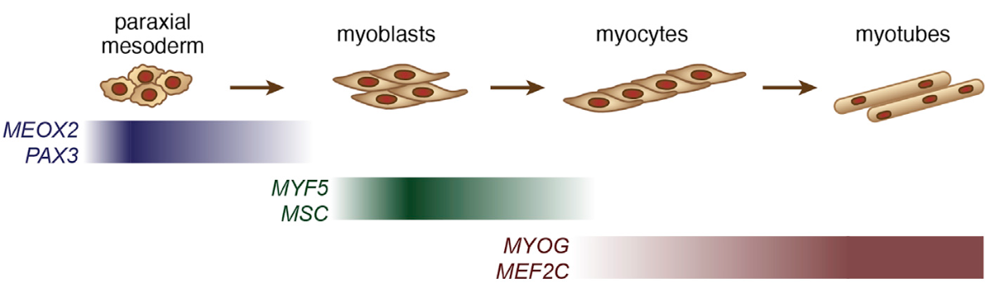

For these exercises, you will be performing differential expression analysis on the same set of rhabdomyosarcoma (RMS) samples we saw in the differential expression instruction notebook.
This time, however, you'll be testing a separate population of cells, the tumor mesoderm cells, for differentially expressed genes between alveolar RMS (ARMS) and embryonal RMS (ERMS) samples.


Before beginning, let's take a moment to consider the context for this data.
[Patel _et al._ (2022)](https://doi.org/10.1016/j.devcel.2022.04.003) employed scRNA-seq and snRNA-seq to explore the transcriptomic landscape of RMS, with a particular interest in identifying aspects of RMS' developmental program that can be exploited by therapeutics.
One key result from this study was that ERMS featured a clear developmental hierarchy that ARMS lacked, suggesting there may be different contributors to treatment resistance between subtypes.
Although development for all RMS samples mirrored normal myogenesis (shown below) with cell types of all stages, ARMS samples had significantly fewer tumor mesoderm cells compared to ERMS samples.
Given this difference in abundance, could there also be differences in gene expression in this cell population?
We'll be exploring that question in this notebook!





In this exercise notebook you will:

- Part A: Prepare single-cell data for differential expression (DE) analysis
- Part B: Perform DE analysis on the tumor mesoderm cell subpopulation
- Part C: Compare results to tumor myoblast DE analysis results


## Part A: Prepare single-cell data for differential expression (DE) analysis

### Read in and prepare the data

To begin, load some libraries that we'll need for these exercises, including...

- `SingleCellExperiment` for working with SCE objects
- `DESeq2` for performing differential expression
- `ggplot2` for plotting

```{r load libraries, solution = TRUE}
# Load libraries

```

Next, set the random seed for reproducibility:

```{r set seed, solution = TRUE}
# Set the random seed

```

In the next chunk, we'll set up some file paths, including the path to our RMS data and the output paths for our differential expression analysis results, including both the mesoderm analysis we'll perform here and the myoblast analysis we performed during instruction.

```{r filepaths}
# data directory for input RMS data
data_dir <- file.path("data", "rms")

# file containing just the samples to use for DE analysis,
#  as created during instruction
rms_sce_file <- file.path(data_dir, "integrated",  "rms_subset_sce.rds")

# analysis results directory, which should exist from instruction
deseq_dir <- file.path("analysis", "rms", "deseq")
if(!dir.exists(deseq_dir)){
  dir.create(deseq_dir, recursive = TRUE)
}

# File where we will output results from mesoderm DE analysis
deseq_mesoderm_file <- file.path(deseq_dir, "rms_mesoderm_deseq_results.tsv")

# File where we previously outputted results myoblast DE analysis during
#  instruction
deseq_myoblast_file <- file.path(deseq_dir, "rms_myoblast_deseq_results.tsv")
```


Now that we've defined our file paths, we can read some of it in.

First, let's read in the `deseq_myoblast_file` TSV and save it to `deseq_myoblast_results`.
We'll need this later when we compare mesoderm DE results to myoblast DE results.

```{r read myoblast TSV, solution = TRUE}
# read in myoblast de results for later

```

Next, read in the SCE file and save it to a variable called `rms_sce`.
Then, print it out to have a look at its contents.

```{r read input sce, solution = TRUE}
# read in sce object

# print sce

```

Before we proceed, this SCE object contains a `colData` column `sizeFactor` that was previously calculated when counts were normalized during initial processing.
This column will end up conflicting with some of `DESeq2`'s operations, so we want to remove this column before proceeding.
(Note that if you skipped this step, `DESeq2` would end up printing an error about this offending column specifically, so you would have found out later that it has to go!)

```{r remove sizeFactors column}
# Set column value to `NULL` in order to remove it
rms_sce$sizeFactor <- NULL
```

As we saw during instruction, this SCE contains three ERMS and three ARMS samples.
Let's remind ourselves of the distribution of cell types before proceeding.
To focus on the tumor cell types (as we will be doing for the rest of the notebook!), we'll also subset the `rms_sce` object to just tumor cells.

```{r filter tumor sce}
tumor_cells <- rms_sce$celltype_broad |>
  # Find which cell types start with "Tumor_"
  stringr::str_starts("Tumor_") |>
  # Pipe into `which()` to ensure that `NA` values are properly handled
  which()

# filter the SCE object to keep only those cells
rms_sce <- rms_sce[, tumor_cells]
```

Let's now plot the distribution of the remaining tumor cell types:

```{r celltype barplot}
# Create a data frame version of the colData table for plotting
coldata_df <- colData(rms_sce) |>
  as.data.frame()

# Make a barplot of cell type proportions across samples and diagnoses
ggplot(coldata_df) +
  aes(x = sample,
      fill = celltype_broad) +
  geom_bar(color = "black", # Add a thin outline for easier viewing
           lwd = 0.15) +
  facet_wrap(vars(diagnosis_group),
             # only put relevant samples in each panel
             scales = "free_x") +
  # Specify theme and modify x-axis text size
  theme_bw() +
  theme(axis.text.x = element_text(size = 7))
```

We can see that the proportion of `Tumor_Myoblast` is much higher than other cell types, including the `Tumor_Mesoderm` subpopulations we'll be testing here.
We also see that ERMS samples have more `Tumor_Mesoderm` cells and fewer `Tumor_Myocyte` cells compared to ARMS samples, consistent with Patel _et al._'s findings that ARMS samples tended to have more cell types from later myogenesis developmental stages compared to ERMS.
As we proceed to the pseudo-bulking steps for the `Tumor_Mesoderm` subpopulation, we will check that we have sufficient sample sizes to perform our analysis.


### Perform pseudo-bulking

To begin differential expression on single-cell data, we need to pseudo-bulk the data to "collapse" groups of interest.
As during instruction, we want to perform pseudo-bulking across two groupings: `celltype_broad` and `sample`.

To accomplish this, create a variable called `pb_groups`, which will be a `DataFrame` that contains only the `colData` columns of interest for pseudo-bulking.

```{r create pb_groups, solution = TRUE}
# first subset the coldata
# to only have the columns we care about for pseudo-bulking

```

Next, use this variable to create the pseudo-bulked SCE with the `scuttle::aggregateAcrossCells()` function, and save it to `pb_sce`.
In addition, you'll want to ensure column names are properly added back into this new pseudo-bulked object.

```{r create pb_sce, solution = TRUE}
# create a new SCE object that contains
# the pseudo-bulked counts across the provided groups

# Add column names formatted as `{celltype}_{sample}` back to `pb_sce`

```

Let's see what we've got!
Print out `pb_sce` below.
How many "cells" do we have now after pseudo-bulking?

```{r print pb_sce}
pb_sce
```

As we have seen, when we performed the pseudo-bulking, a new column `ncells` was added to the `colData` table.
This information tells us how many cells were collapsed into the grouping.

To perform our differential expression analysis on `Tumor_Mesoderm` cells, we'd like to see a suitable number of cells present in each group.
During instruction, we chose a threshold of `ncells >= 10` to include a group in analysis.
Let's do the same filtering here, and then check to see that we have enough biological replicates to perform analysis.
Recall, we are starting with three ERMS and three ARMS samples, and we'll need at least three samples from each diagnosis group for our cell type of interest for statistical viability.

To this end, let's take two filtering steps in the next chunk, saving the output to a new object called `filter_pb_sce`:

- We'll filter the `pb_sce` to retain only groupings where `ncells >= 10`
- We'll also filter the `pbe_sce` object to retain only our cell type of interest, `Tumor_Mesoderm`.

```{r filter pb_sce, solution = TRUE}
# First filter to keep only `ncells >= 10` and save to `filter_pb_sce`

# Then filter to keep only `Tumor_Mesoderm` and save to the same variable

```

Now let's check that we have retained enough samples to proceed.
In the following chunk, use the `table()` function on the filtered SCE's `diagnosis_group` to count up the number of each diagnosis - hopefully we still have three (pseudo-bulked) samples of each!

```{r table diagnosis_group, solution = TRUE}
# Make a table of the diagnosis group counts

```

Indeed, we have enough biological replicates to proceed, so let's head to differential expression analysis.

## Part B: Perform DE analysis on the tumor mesoderm cell subpopulation

Our data is nearly ready for us to identify genes that are differentially expressed between ARMS and ERMS in `Mesoderm_Tumor` cells.

There's just one more small preparation step to take - we need to subset the `pb_sce` object to only contain our subpopulation (tumor mesoderm cells) of interest.
In the chunk below, perform this filtering and save the resulting SCE object to `mesoderm_pb_sce`.

```{r filter to mesoderm, solution = TRUE}
# First define a vector indicating whether cells
# are tumor mesoderm or not

# Use the vector you created to subset the SCE to only
# contain those cells

```

Off to (the) differential expression (races)!

First, let's define a `DESeqDataSet` object called `deseq_object` from the `mesoderm_pb_sce`, specifying the design formula across the `diagnosis_group` variable.

```{r define deseq object, solution = TRUE}
# create the DESeqDataSet object

```

Now, use the convenience function `DESeq2::DESeq()` to perform the differential expression analysis as we saw during instruction, saving the result back to `deseq_object`.

```{r perform de analysis, solution = TRUE}
# perform differential expression

```

Before proceeding, we'll want to quickly check that the model was a decent fit to the data, and we can do this by visualizing the dispersion estimates using the function `DESeq2::plotDispEsts()`.
Make this plot in the chunk below:

```{r plot dispersions, solution = TRUE}
# plot dispersions

```

How does this plot look to you?
A well-fitted model should show decreasing dispersions as the mean along the x-axis increases.
Do you see that trend here?

To be able to interpret our results and compare genes, we next need to apply a shrinkage procedure that will correct expression levels to avoid overestimating fold change.
Do this in the next chunk by taking the following steps:

- Extract the results which pass a threshold of `alpha = 0.05` from `deseq_object`.
Save this data frame to a variable `deseq_results`.
- Perform the shrinkage procedure using `DESeq2::lfcShrink()`, saving results to `shrink_results`.
Make sure to look at your model first to find the position of the result coefficient to provide to `DESeq2::lfcShrink()`.

```{r perform shrinkage, solution = TRUE}
# Extract results into a data frame

# Before performing the shrinkage procedure, check
#  here to find where the result coefficient is

# Perform the shrinkage procedure, saving to `shrink_results`

```

Go ahead and print the resulting `shrink_results`:

```{r print shrink_results}
shrink_results
```

Before proceeding, it's worth discussing how to interpret these `log2FoldChange` values in terms of ARMS and ERMS samples.
In this case, we did not set a particular factor order for the `diagnosis_group` variable that we tested on, so R by default set the order alphabetically.
We can see this below using `levels()`.

```{r check diagnosis_group levels}
# See the order of the diagnosis_group column
levels(mesoderm_pb_sce$diagnosis_group)
```

This means that all results are _relative to ARMS_.
Negative `log2FoldChange` values indicate that ERMS has lower expression relative to ARMS.
Positive `log2FoldChange` values indicate that ERMS has higher expression relative to ARMS.

Something else we'll need to help us interpret these results are some gene names, since not all of us have had a chance to memorize the Ensembl IDs yet.
So, let's now add in a `gene_symbol` column to our results data frame (`shrink_results`).
These symbols were originally stored in the SCE's `rowData` table so we can simply grab the names from there.
In the chunk below, we'll do some wrangling to combine `shrink_results` with the gene names, saving the final result to `deseq_mesoderm_results`.

```{r add gene_symbol}
# Create a data frame from the SCE rowData
sce_rowdata_df <- rowData(mesoderm_pb_sce) |>
   # Convert to a data frame and move the rownames
   #  into a new column called `ensembl_id`
   tibble::as_tibble(rownames = "ensembl_id")

# Join the DESeq results with `sce_rowdata_df`
deseq_mesoderm_results <- shrink_results |>
  tibble::as_tibble(rownames = "ensembl_id") |>
  # join with sce_rowdata_df by Ensembl ids
  dplyr::left_join(sce_rowdata_df, by = "ensembl_id") |>
  # reorder columns so gene_symbol comes right after ensembl_id
  #  to make the table easier to read
  dplyr::relocate(gene_symbol, .after = "ensembl_id")

# Print the final results data frame
deseq_mesoderm_results
```


Let's now filter to only our significant results, using a cutoff of _adjusted P-value_ of 0.05, and save the new data frame to `deseq_mesoderm_results_sig`

```{r filter mesoderm significant, solution = TRUE}
# Filter results to padj <= 0.05

# Print the result

```

### Visualize results

Let's visualize some of our results!

To start, use the `EnhancedVolcano` package to make a volcano plot of the results.
For this plot, specify that points be labeled with the gene symbol and use the default P-value cutoff of `1e-05`.
Feel free to apply any additional styles you want (the plot itself is a `ggplot2` object!).
Hint: Make sure to plot the `deseq_mesoderm_results` data frame that contains both significant and not significant results.

```{r mesoderm volcano plot, solution = TRUE}
# Make an (enhanced) volcano plot

```

Let's pick some highly differentially expressed genes from this volcano plot and show them on a UMAP.
We'll pick one gene that shows higher ARMS expression (negative log2 fold changes), and one that shows higher ERMS expression (positive log2 fold changes).
To plot these on a UMAP, we'll need to know their Ensembl ids, so let's get that information first:


```{r find ensembl ids}
# Define some genes to visualize
arms_gene <- "HMCN2"
erms_gene <- "PLEKHB2"

# Use dplyr to get the associated Ensembl ids
deseq_mesoderm_results_sig |>
  # Find rows that contain our gene symbols
  dplyr::filter(gene_symbol %in% c(erms_gene, arms_gene)) |>
  # Select only these two columns
  dplyr::select(ensembl_id, gene_symbol)
```

To make our UMAP of mesoderm cells, we also want to filter our original `rms_sce` to contain only `Tumor_Mesoderm` cells.
(An aside!
You may recall we previously created `mesoderm_pb_sce` that was filtered to tumor mesoderm cells, so why can't we use that object to make a UMAP?
That object was derived from the _pseudo-bulked_ SCE, so it does not contain individual cells.
Therefore, we need to go back to the beginning and work with `rms_sce`.)

```{r filter rms_sce, solution = TRUE}
# Filter rms_sce to contain only Tumor_Mesoderm cells

```

We should also check the names of our reduced dimensions to see what the UMAP matrix is called so that we can plot it:

```{r find umap name}
# Print reducedDimNames of mesoderm_sce
reducedDimNames(mesoderm_sce)
```

We'd like to plot the integrated UMAP, so we'll plot the `"fastmnn_UMAP"` matrix below.

I map, you map, we all map for map maps!
First, let's visualize the gene with Ensembl id `ENSG00000148357` that is upregulated in ARMS.
For this plot, color by expression and facet by `diagnosis_group`.

```{r umap arms gene, solution = TRUE}
# Plot UMAP showing ENSG00000148357 expression across diagnosis groups

```

How does this plot look to you?
Does it seem to reflect the statistical result that ARMS has higher expression, on average, compared to ERMS?

Let's do the same with the gene that is upregulated in ERMS, and again think about whether the plot shows the trends you expected based on the differential expression results!

```{r mesoderm umap upreg}
# Plot UMAP showing ENSG00000115762 expression across diagnosis groups
scater::plotReducedDim(mesoderm_sce,
                       dimred = "fastmnn_UMAP",
                       colour_by = "ENSG00000115762",
                       other_fields = "diagnosis_group") +
  facet_wrap(vars(diagnosis_group)) +
  theme_bw()
```


We can also visualize this data using violin plots with the `scater::plotExpression()` function, allowing us to compare expression across subpopulations of interest (here, tumor cell types and diagnosis groups).

Let's make that plot below from the `rms_sce` object, which you'll recall we previously filtered to only tumor cells.
Use `facet_grid()` in your plot below to show separate panels for each combination of cell type and diagnosis group.

```{r plotExpression plot, solution = TRUE}
# Define a vector of Ensembl ids to plot

# Create faceted violin plot

```

Based on this plot, it looks like the expression differences among diagnosis groups we found for tumor mesoderm cells _could_ be an overall trend across cancer cell types.
If we wanted to formally test this, we could consider a multivariate model that accounts for both cell type and diagnosis group at once, rather than performing a separately testing each cell type.

Let's go ahead and save the `deseq_mesoderm_results` data frame to our output TSV file.

```{r export mesoderm results, solution = TRUE}
# Write out the results TSV file

```


## Part C: Compare results to tumor myoblast DE analysis results

During instruction, we performed differential expression analysis on tumor myoblast cells to detect differences between ARMS and ERMS samples.
We might wonder how our results for tumor mesoderm cells compare to those for myoblasts.
Before we compare some of these findings, we need to be aware of a few caveats:

- As mentioned above, if we were really interested in whether ARMS and ERMS samples have different expression _across any group of cell types_, we would have liked to start with a multivariate model.
By performing separate tests for separate cell types, we risk making comparisons based on "significance," for example concluding "this gene was significant in mesoderm but not myoblast, therefore it's only important in mesoderm cell types."
Significance as a property in-and-of-itself relies on arbitrary P-value cutoffs, and P-values across different tests and samples are not created equally!
This means you do not want to rely on these kinds of comparisons to draw conclusions, but they can be useful for exploration, as we will do here.

- During all of our DE tests, there's a good chance that we may have committed some light circularity:
The cell types we are using from [Patel _et al._ (2022)](https://doi.org/10.1016/j.devcel.2022.04.003) were determined from expression data.
But then we used these expression-derived cell types to filter for DE testing, and then we tested for differences in, you guessed it, expression!
It's not necessarily possible to avoid this trap (since we need to use _something_ to annotate cell types), but it's important to be aware that this is a confounding factor across our results.

Bearing these caveats in mind, let's go ahead and compare results a bit.
At the beginning of this notebook, we read in the tumor myoblast DE results and saved it as `deseq_myoblast_results`.
Let's remind ourselves what this data frame looks like:


```{r print deseq_myoblast_results}
head(deseq_myoblast_results)
```

The data frame has the same columns as our mesoderm results stored in `deseq_mesoderm_results`.
To compare results more easily, we'd like to have them all in a single data frame formatted to facilitate comparison.
For example, we can make a data frame that has columns for each test's P-values and log2-fold changes so we can directly compare the results for each gene.
Let's wrangle that together:

```{r combine test results}
# select from and rename myoblast results
myoblast_df <- deseq_myoblast_results |>
  dplyr::select(ensembl_id,
                gene_symbol,
                myoblast_padj = padj,
                myoblast_log2FoldChange = log2FoldChange)

# select & rename mesoderm result
mesoderm_df <- deseq_mesoderm_results |>
  dplyr::select(ensembl_id,
                gene_symbol,
                mesoderm_padj = padj,
                mesoderm_log2FoldChange = log2FoldChange)

# Combine myoblast and mesoderm results
deseq_results_all <- dplyr::inner_join(myoblast_df, mesoderm_df)

# Print the combined result data frame
deseq_results_all
```

We can now directly compare results on a per-gene basis!
One way we can explore the result differences is with a scatterplot showing log2-fold changes for each cell type.
We can also style the points to be colored based on their overall significance, using one color for each of the following conditions:

  - Both cell types are significant
  - Only myoblast tumor cells are significant
  - Only mesoderm tumor cells are significant
  - Neither cell type is significant

Coloring points by significance in `ggplot2` will require a bit more wrangling, for which we'll use the function [`dplyr::case_when()`](https://dplyr.tidyverse.org/reference/case_when.html).
We provide this function with a set of logical expressions and each assigned value is designated by `~`.
The expressions are evaluated in order, stopping at the _first_ one that evaluates as `TRUE` and returning the associated value.
We'll use `dplyr::case_when()` to help us create a new `significance_type` column in our data frame to contain this information.

```{r add significance categories}
deseq_results_all <- deseq_results_all |>
  # Create a new column called significance_type
  dplyr::mutate(significance_type = dplyr::case_when(
    # Use value "Both" if both comparisons are significant
    myoblast_padj <= 0.05 & mesoderm_padj <= 0.05 ~ "Both",
    # Use value "Myoblast only" if only myoblast is significant
    myoblast_padj <= 0.05 ~ "Myoblast only",
    # Use value "Mesoderm only" if only mesoderm is significant
    mesoderm_padj <= 0.05 ~ "Mesoderm only",
    # Default case: neither comparison is significant
    #  This will capture all remaining rows not covered by
    #  the previous conditions
    TRUE ~ "Neither"
  )) |>
  # Move the new column to the front of the data frame
  #  so we can easily see it when printing
  dplyr::select(significance_type, everything())

# Print the updated data frame
deseq_results_all
```

Let's have a quick look at the new `significance_type` variable by making a `table()` of its values:

```{r table signficance_type, solution = TRUE}
# Make a table of significance types

```

Most genes are not significant in either comparison, and the myoblast test detected more significant genes compared to the mesoderm test.
But there is still quite a bit of overlap in the genes identified as significant in both tests!

Now we can make our scatterplot:


```{r logfc scatterplot}
# Plot log2 fold changes against each other
ggplot(deseq_results_all,
       aes(x = myoblast_log2FoldChange,
           y = mesoderm_log2FoldChange,
           color = significance_type)) +
  # Styling to see points
  geom_point(size = 0.5,
             alpha = 0.5) +
  # Use the colorblind-friendly viridis color scale
  scale_color_viridis_d() +
  # Set plot labels
  labs(
    x = "Myoblast log2 fold change",
    y = "Mesoderm log2 fold change",
    color = "Signficance Type"
  ) +
  theme_bw() +
  # Make legend points larger and easier to see
  guides(color = guide_legend(override.aes = list(size = 2))) +
  # Set equal x and y scales for easier comparison between axes
  coord_equal()
```


What kind of trends do we see here?

- The middle of the plot close to coordinates `(0,0)` has a large cloud of yellow "Neither" points, which makes sense.
- Along each line `x = 0` or `y = 0`, we see strips of points for genes that are only significant for only one cell type.
For example, the blue "Mesoderm only" points mostly follow `x = 0`; for these points, the associated myoblast log2-fold changes are all at about 0.
- Finally, we have the purple "Both" points, which are present in each quadrant farther away from `(0,0)`, deemed significant in both DE tests.
Most of these points are in the top right and bottom left quadrants, corresponding to conditions where _both_ cell types show significant upregulation or downregulation, respectively.
However, we do also see some purple points, albeit fewer, in the top left and bottom right quadrants which represent genes where both cell types show significant expression differences but in _different_ directions.

To start exploring, let's pick out some of the genes with the largest fold-changes from the top right and bottom left quadrants of the plot.
Based on the plot, it looks like we'll find a set of shared upregulated genes by looking for expression values that are greater than 8 for both cell types, and downregulated genes by looking for expression values less than  -10 for myoblasts and -7 for mesoderm cells.


```{r find quadrant genes}
# Find genes in top right and bottom left quadrants
deseq_results_all |>
  dplyr::filter(
    # Find either the highly upregulated genes:
    (myoblast_log2FoldChange >= 8 & mesoderm_log2FoldChange >= 8) |
     # OR, the highly downregulated genes:
    (myoblast_log2FoldChange <= -10 & mesoderm_log2FoldChange <=-7)
  ) |>
  # arrange on myoblast_log2FoldChange
  dplyr::arrange(myoblast_log2FoldChange)
```

Something you'll see in these results are some pretty different P-values between cell types (also note that the `NA` genes here are lncRNAs with no formally assigned gene symbol).
Specifically, the myoblast P-values are all 3-15 orders of magnitude lower than their mesoderm counterparts, which _may_ be a result of the relatively higher sample size for myoblast tests - larger sample sizes lead to more extreme P-values.
Importantly, we do _not_ want to compare these P-values directly and conclude that a given gene was "more or less significant" in one cell type or another, since P-values cannot be compared across tests (again, for a more robust assessment of differential expression, use a multivariate model that accounts for cell types!).

To wrap up, feel free to perform some quick visualization of some of these genes!

Alternatively (or in addition!), you can visualize the differential expression of genes that regulate myogenesis, as shown in the figure from Patel _et al._ at the top of this notebook.
Let's have a quick look at those results:

```{r myogenesis genes}
# Define vector of myogenesis gene symbols
myogenesis_symbols <- c("MEOX2", "PAX3", "MYF5", "MSC", "MYOG", "MEF2C")

# Print the DE results for those genes
deseq_results_all |>
  dplyr::filter(gene_symbol %in% myogenesis_symbols) |>
  # sort in order of the `myogenesis_symbols` vector
  dplyr::arrange(match(gene_symbol, myogenesis_symbols))
```

You can make plots we've seen like...

- A faceted UMAP with `scater::plotUMAP()` showing expression across cell type and diagnosis group
- A violin plot with `scater::plotExpression()` faceted across cell type and diagnosis group


```{r diy plots, solution = TRUE}
# Use this chunk (or add more chunks!) to make your own plots

# vector of gene symbols named by Ensembl id

```

## Session Info

```{r sessioninfo}
sessionInfo()
```
