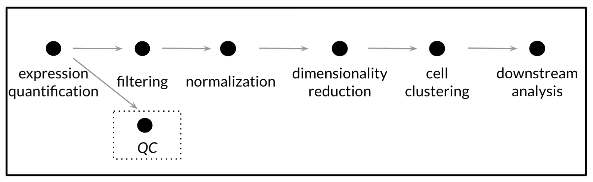

# Introduction to single-cell RNA-seq

**CCDL 2021**

## Single Cell RNA-seq Technologies

Single-cell technologies can be divided into two categories, tag-based and full-length, based on their capture methods and quantitative nature.

In *Tag-based* scRNA-seq, cells are separated by emulsion/droplets, and individual cells are given a unique cell barcode prior to sequencing.
An example of tag-based scRNA-seq is 10X Genomics [(Zheng _et al._ 2017)](https://www.ncbi.nlm.nih.gov/pubmed/28091601). 

In *full-length* scRNA-seq, cells are physically separated into individual wells of a plate and are often also sorted by other means (e.g., Fluorescence Activated Cell Sorting).
With full-length scRNA-seq, each cell is sequenced individually and has its own fastq file. 
An example of full-length scRNA-seq is Smart-seq2 [(Picelli _et al._ 2014)](https://www.nature.com/articles/nprot.2014.006).

For the purposes of this tutorial, we will focus on tag-based scRNA-seq, but it is important to keep in mind that the pre-processing steps and the biases to look out for in post-processing vary based on technology and how the cells are sorted.

For more extensive background on single-cell experimental methods, Kiselev _et al._ have a very good [tutorial for scRNA-seq](https://scrnaseq-course.cog.sanger.ac.uk/website/index.html).

### Tag-based scRNA-seq  
*Example:* 10X Genomics [(Zheng _et al._ 2017)](https://www.ncbi.nlm.nih.gov/pubmed/28091601)
Individual cells are separated by emulsion/droplets prior to cell lysis. 
Transcripts from each cell are then tagged with two barcodes: a unique cell barcode and a Unique Molecular Identifier (UMI) 
All transcripts from all cells are then pooled together and undergo PCR amplification and sequencing as if they are one sample.

These types of methods, because they are newer, are more likely to have (UMIs) [(Islam _et al._ 2014)](http://www.nature.com/doifinder/10.1038/nmeth.2772). 
Tagging of each transcript with a different UMI before amplification allows the identification of PCR duplicates, allowing control for PCR amplification errors and biases.
Individual samples have two fastq files: one for the cell and UMI barcodes (R1) and another with the transcript sequence reads (R2).

#### Pros:  
- Can run potentially millions of cells at once.   
- Much less computationally demanding.
- Won't take up all your computer's storage.  
- Much cheaper.  

#### Cons:  
- Sequencing is not bidirectional so data will likely have more intense 3' bias.  
- The sequencing depth per cell with these technologies is generally lower.

## Resources:

- Hemberg Lab [scRNA-seq training course](https://scrnaseq-course.cog.sanger.ac.uk/website/index.html)

- [ASAP: Automated Single-cell Analysis Pipeline](https://asap.epfl.ch/) is a web server that allows you to process scRNA-seq data. ([Gardeux _et al._ 2017.](https://doi.org/10.1093/bioinformatics/btx337 ))

- Smith. [_Unique Molecular Identifiers – the problem, the solution and the proof_](https://cgatoxford.wordpress.com/2015/08/14/unique-molecular-identifiers-the-problem-the-solution-and-the-proof/) provides an excellent background on UMIs.

### Literature on the comparisons and explanations of scRNA-seq technologies:
- [Baran-Gale _et al._ (2018)](https://doi.org/10.1093/bfgp/elx035)  
- [Lafzi _et al._ (2019)](https://doi.org/10.1038/s41596-018-0073-y) 
- [Ziegenhain _et al._ (2018)](http://dx.doi.org/10.1016/j.molcel.2017.01.023) 
- [Zhang _et al._ (2018)](https://doi.org/10.1016/j.molcel.2018.10.020)

### Literature on scRNA-seq analysis and best practices:
- [AlJanahi _et al._ (2018)](https://doi.org/10.1016/j.omtm.2018.07.003) 
- [Amezquita _et al._ (2019)](https://www.nature.com/articles/s41592-019-0654-x) 
- [Angerer _et al._ (2017)](http://dx.doi.org/10.1016/j.coisb.2017.07.004)
- [Bruning _et al._ (2021)](https://www.biorxiv.org/content/10.1101/2021.02.15.430948v2)
- [Luecken & Theis (2019)](https://doi.org/10.15252/msb.20188746)
