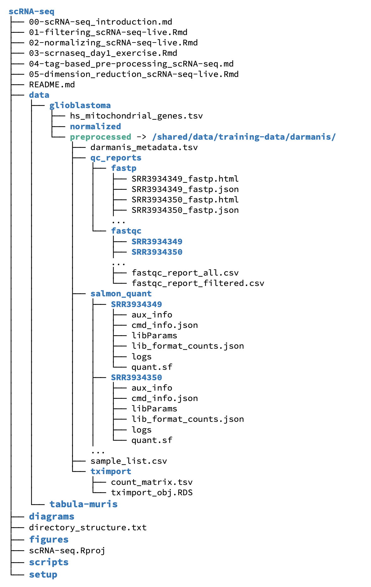

**CCDL 2020**

In this notebook, we'll perform quality control analyses of scRNA-seq count data. 
The [data set](https://www.ncbi.nlm.nih.gov/geo/query/acc.cgi?acc=GSE84465) we are using is cells from a glioblastoma sample that were Fluorescence-Activated Cell sorted (FACS) and then processed by paired end sequencing of RNA using the [Smart-seq2 protocol](http://www.nature.com/doifinder/10.1038/nmeth.2639) 
[(Darmanis *et al.* 2017)](https://www.ncbi.nlm.nih.gov/pubmed/29091775).

  
## Set Up 

```{r setup}
# Magrittr for the pipe %>%
library(magrittr)

# GGPlot2 for the plots
library(ggplot2)
```

## Import single-cell RNA-seq counts matrix

The Smart-seq2 sequencing results in separate paired fastq files for each processed cell (in this case over 7000 total fastq files).
We have processed this data with `salmon quant` and used `tximport` to create a gene-level count matrix, filtering samples to only include those with at least 30% of reads mapping.

 

We will discuss *tag-based* scRNA-seq data (such as 10X), in a later notebook, where you will learn how to process raw data to a count matrix and could apply these same types of steps to filter and normalize the data.

### Directories and files

The data files we will be using for this part of the project are in the `data/glioblastoma` subdirectory of the `scRNA-seq` directory where this file is located.
The main files we will be using at this stage are further located in the `preprocessed` subdirectory (or a subdirectory of that subdirectory). 
A figure of the (partial) directory structure for this module is shown below.



Importantly, the `preprocessed` directory is actually a *link* (think of a shortcut or alias) to a shared folder, so everyone is looking at exactly the same sets of files in there, and you will not be able to write to that directory.
It's good practice to store your data in a place that you should never write to, except when adding new data.
Not so much the shared directory or links, but to think of the place where raw data is stored as one that you should never write to, except when adding new data.
This can save many headaches of accidentally changing or overwriting raw data (we've all done it!).

We will write our output file for this stage in the `data/glioblastoma/filtered` directory, which may not exist yet, so we will also have to make it.


```{r filepaths}
# main data directory
data_dir <- file.path("data", "glioblastoma")

# Count matrix file location
gene_matrix_file <- file.path(data_dir,
                              "preprocessed",
                              "tximport", 
                              "count_matrix.tsv")

# Metadata file location
metadata_file <- file.path(data_dir, "preprocessed", "darmanis_metadata.tsv")

# Mitochondrial genes
mito_genes_file <- file.path(data_dir, "hs_mitochondrial_genes.tsv")

# create the output directory
filtered_dir <- file.path(data_dir, "filtered")
if (!dir.exists(filtered_dir)) {
  dir.create(filtered_dir, recursive = TRUE)
}

# Output file 
filtered_count_file <- file.path(filtered_dir, "filtered_count_matrix.tsv")
```

Let's import the gene matrix and metadata. 

```{r read_data}
# Read in the data
sc_data <- readr::read_tsv(gene_matrix_file, progress = FALSE)

# Read in the metadata
sc_metadata <- readr::read_tsv(metadata_file, progress = FALSE)
```

Now that we have loaded our data, let's take a look at the general format
Use a command we have used previously to look at the first few rows of `sc_data`.

```{r peek_data, live = TRUE}
# Put a command here that would allow you to see the first few rows of `sc_data`

```

You'll notice the first column contains the gene information and the rest are samples. 

Do the sample ids match what we have in the metadata? 
For now, we will not worry about order, but just check that we have metadata for every sample.

```{r sample_match, live = TRUE}

```


For the analyses in this notebook, the gene column (which is a `character` type), will get in the way, so we will turn this column into the rownames instead, and convert the rest to a matrix.
Recall that we can do this because all the remaining data has the same type.
While not strictly necessary, having the data in the form of a matrix will make some calculations more efficient.

```{r make_matrix}
# Set the column as the gene names
sc_data <- tibble::column_to_rownames(sc_data, "gene")
sc_data <- as.matrix(sc_data)
```

Let's look at the mean expression of the genes in this dataset. 
We will use `apply()` in order to calculate things across our data frame. 
The second argument in `apply()` specifies whether we are calculating by rows or columns. 
(1 = rows, 2 = columns).

In the code chunk below, use `apply()` with the correct arguments to calculate the gene means. 

```{r means, live = TRUE}
# Let's calculate the gene means (by row)

```

This works just fine, but you may have noticed it is a bit slow.
For a few common summary functions like means and sums, R has much more efficient functions to calculate across rows or columns. 
In this case, we can use `rowMeans()` to do the same calculation, much more quickly.


```{r rowmeans}
# use rowMeans() to calculate gene means
gene_means <- rowMeans(sc_data)
```

Let's make our first density plot with these data.
We will use `ggplot()` as you have seen before, but since the object we want to plot, `gene_means`, is a vector not a data frame, we will skip the `data` argument and go straight to the `mapping` aesthetics.
The remainder of the `ggplot` code should look familiar.

```{r mean_density}
# Plot the density of the means using ggplot2
ggplot(mapping = aes(x = gene_means)) +
  geom_density() +
  xlab("Mean gene count") 
```

That plot is not quite as informative as we might like, as a few genes with very high expression are making the scale just a *bit* wide.
Lets zoom in on the left part of the graph by adding an `xlim()` argument. 
(Note that `xlim()` will remove points outside the specified range, so you will get a warning.)

```{r zoom_density, live = TRUE}
# Plot the density of the means using ggplot2

```

Even as we zoom in, the counts data has many zeroes, which we actually expect in a single cell RNA-seq experiment.

Let's calculate what proportion of the data is zeros:

```{r zero_fraction, live = TRUE}

```


## Quality control measures for the counts matrix
  
The small amount of RNA in a single cell results in higher chances of errors and biases in RNA isolation, amplification, and sequencing. 
We should check that the overall data we observe for each sample/cell are reasonable before proceeding too far. 
The next section explores some of the ways we can filter the data set to clean things up.

#### Total counts as a quality measure

First, lets look at the total number of counts per sample, across all genes. 
For this we will use `colSums()`, as each column represents a different sampled cell.

```{r total_counts, live = TRUE}
# Make a vector of total_counts number of counts per sample using colSums()

```


```{r counts_summary, live = TRUE}
# Take a look at the summary statistics for the total counts

```

Yikes, one of the samples has only 413 counts, compared to the median of ~950,000!
It's highly likely that this 'cell' is either an empty well or did not get sequenced properly. 

Let's visualize the distribution of total counts to see if the 413 count sample is the only one we should get rid of.

In following graphs, we will use vertical red lines to indicate possible cutoffs. 

```{r total_counts_plot, live = TRUE}
# Let's use the same kind of plot as above but add more layers

```


How many cells would be removed with this (or other cutoffs) for counts per sample?

```{r count_cutoffs}
# Calculate the number of cells that would be removed with a given cutoff
count_cutoff <- 20000
sum(total_counts <= count_cutoff)
```


### Number of genes a cell expresses as a quality measure

What if a single gene accounted for all counts in a particular cell?
This cell would not have helpful data for us, so we should look to remove any cells we suspect might not have a useful amount of its transcriptome measured.
But before we can determine how many genes we consider a particular cell to be expressing we need to determine a numeric cutoff for what we consider to be a detected gene.
How many counts must there be for you to consider a gene expressed? 
Here let's go for a simple detection cutoff of > 0. 

```{r detection_matrix, live=TRUE}
# make a detection_mat matrix that is TRUE when a gene is expressed in a sample

```

Now that we have turned our data into a matrix of `TRUE/FALSE` for detection, we can sum this data by column to effectively get a vector of how many genes were measured in each cell. 

```{r genes_expressed, live = TRUE}
# Make a vector that contains the number of genes expressed by a particular cell

```

Let's plot this using the same style and type of graph as above. 

```{r genes_expressed_plot, live = TRUE}

```


As you may have noticed in our `sc_metadata` we have cell-type information for these data. 
Let's use the power of our single-cell resolution data to our advantage and look at this data with cell-type labels. 
In order to do this, we need to prepare a data frame that has our `num_genes_exp` numbers along side our cell-type labels.
We will do this with `dplyr::left_join()` to merge count data to our metadata table.

```{r join_metadata, live = TRUE}
# Let's make a dataframe with this information

```

The next graph we are using the same steps as before, but to make individual graphs for each cell type, we are using the ggplot2 `facet_wrap()` function.

```{r facet_genes, live = TRUE}
# Plot with faceting by cell type

```

Now we are aware of how our filtering may be affecting different cell types differently. 


### Mitochondrial gene expression

If a cell is dead or dying, its mRNA will tend to leak out of the cell, leaving an overabundance of mitochondrial RNA, which is more likely to stay within the mitochondria longer. 
To look for this, we would like to calculate the fraction of mitochondrial expression for each cell as well.
First, we will need a list of the mitochondrial genes, which we have prepared in a tsv file `hs_mitochondrial_genes.tsv` that we will now read in:

```{r read_mito}
# read `hs_mitochondrial_genes.tsv` from data_dir
mito_genes_df <- readr::read_tsv(mito_genes_file) 
```

Now we can use the `gene_id`s from that list to select only the rows of the count matrix that correspond to the mitochondrial genes and sum their expression for each sample.

```{r mito_filter, live = TRUE}
# create a mito_rows vector that is TRUE for mitochondrial genes in our dataset

# sum the counts from just those genes for all samples

# calculate mito_fraction for all samples

```

Lets make a plot of this distribution as well!

```{r plot_mito, live = TRUE}

```


### Combining sample QC measures

Lets put all of the QC measures we have calculated into a single data frame, so we can look at how they might relate to one another.

```{r qc_dataframe, live = TRUE}
# create a data frame of 
# geo_accession, total_counts, num_genes_exp, and mito_fraction

  # add on the cell type from metadata with left_join()

  # sort by mito_fraction for plotting 

```

Now we can plot these measures all together, along with some possible cutoffs.

```{r qc_scatterplot}
ggplot(qc_df, aes (x = total_counts,
                   y = num_genes_exp, 
                   color = mito_fraction)) +
  geom_point(alpha = 0.5) +
  scale_color_viridis_c() + 
  geom_vline(xintercept = 300000, color = "red") +
  geom_hline(yintercept = 4000, color = "red") +
  labs(x = "Total Count",
       y = "Number of Genes Expressed",
       color = "Mitochondrial\nFraction") + 
  theme_bw()
```


If we want to filter our data based on these measures and cutoffs we like, we can do this with `dplyr::filter()` and then select the resulting columns from the matrix.

```{r qc_filter, live = TRUE}
# create a filtered_samples data frame from qc_df

# select only passing samples for sc_data_filtered

```


## Number of samples that express a gene as a quality measure

Now we have an idea of what samples we probably want to get rid of.
But what if our data contains genes that we can't reliably measure in these cells?

Let's use our `detection_mat` to add up how many samples express each of these genes so we can try to filter out unreliably measured genes.  

```{r sample_exp, live = TRUE}
# Make a num_samples_exp vector that contains the 
# number of cells that express a particular gene

```

Let's make another density plot with the number of samples that express each gene:

```{r sample_exp_plot}
# Let's take a look at what this looks like:
ggplot(mapping = aes(x = num_samples_exp)) +
  geom_density(fill = "lightblue") +
  geom_vline(xintercept = 200, col = "red") +
  xlab("Number of Samples Expressing Each Gene") + 
  theme_classic()
```

How many genes will be excluded if we draw our cutoff at 200 samples?

```{r filter_effect, live = TRUE}

```
That's a lot! How do we feel about that?


To filter the genes that are not expressed in many samples, we will take a somewhat simpler approach, and use base R to select the rows from our matrix (already filtered by sample) that are above the cutoff.

```{r filter_genes}
cutoff <- 200
# filter sc_data_filtered to only genes above cutoff value
# save as sc_data_filtered_gene_express
sc_data_filtered_gene_express <- sc_data_filtered[num_samples_exp >= cutoff, ]
```


## Save the filtered data

To save our filtered count matrix, we will first convert it back to a data frame, adding back the gene ids which were in the matrix row names. 

```{r df_convert}
sc_filtered_df <- tibble::as_tibble(sc_data_filtered_gene_express) %>%
  dplyr::mutate(gene = rownames(sc_data_filtered_gene_express)) %>%
  dplyr::select(gene, dplyr::everything()) # make the genes the first column
```

Write the output file. 
This is still a large matrix, it might take some time!

```{r write_df}
readr::write_tsv(sc_filtered_df, filtered_count_file)
```


### Print session info

```{r sessioninfo}
sessionInfo()
```
