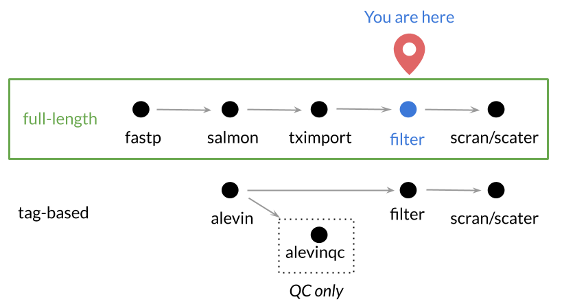

**CCDL 2019**

In this notebook, we'll perform quality control analyses and normalization of 
scRNA-seq count data. 
    
For this tutorial, we will be using a pair of single-cell analysis specific 
R packages: `scater` and `scran` to work with our data. 
This tutorial is in part based on the [scran
tutorial.](https://bioconductor.org/packages/devel/bioc/vignettes/scran/inst/doc/scran.html)
  
## Set Up 

For these analyses, we will need `scater` and `scran` packages, which have been 
installed already on your Docker container. 

```{r setup}
# Set seed for reproducibility
set.seed(1234)

# Magrittr for the pipe %>%
library(magrittr)

# GGPlot2 for the plots
library(ggplot2)

```

**TODO: move this out to the main library or do it manually?**
In this notebook, we will be using a pre-made function to do some of our work. 
We will load in our pre-made function using the `source` function. 

```{r}
# Read in a function for filtering the gene matrix from a source script
source(file.path("scripts", "gene_matrix_filter.R"))
```

## Import single-cell RNA-seq counts matrix

This [data set](https://www.ncbi.nlm.nih.gov/geo/query/acc.cgi?acc=GSE84465) 
we are using is glioblastoma data that was Fluorescence-Activated Cell sorted 
and then was processed by paired end sequencing using Smart-seq2 protocol 
[(Darmanis et al. _Cell Reports._ 2017.).](https://www.ncbi.nlm.nih.gov/pubmed/29091775).

The Smart-seq2 protocol results in separate paired fastq files for each processed cell (in this case over 7000 total fastq files).
We have processed this data with `salmon quant` and used `tximport` to create a gene-level count matrix. 


 

As far as *tag-based* scRNA-seq data, we will explain how to process raw data, 
like fastq files, in the next section, so you can also get it to a count matrix
and could use these same steps to filter and normalize the data.

### Directories and files

```{r}
# Shared data for these projects are in a shared folder on the server
# This can be found relative to the user home directory, abbreviated "~"
data_dir <- file.path("data", "glioblastoma", "preprocessed")

####TODO#### remove untrimmed files
# Count matrix file location
gene_matrix_file <- file.path(data_dir, 
                              "tximport_untrimmed", 
                              "count_matrix.tsv")

# Metadata file location
metadata_file <- file.path(data_dir, "darmanis_metadata.tsv")

# Output directory 
norm_dir <- file.path("data", "glioblastoma", "normalized")
if (!dir.exists(norm_dir)) {
  dir.create(norm_dir, recursive = TRUE)
}
```

Let's import the gene matrix and metadata. 

```{r Import Data}
# Read in the data
sc_data <- readr::read_tsv(gene_matrix_file, progress = FALSE)

# Read in the metadata
sc_metadata <- readr::read_tsv(metadata_file, progress = FALSE)
```

Now that we have loaded our data, let's take a look at the general format
Use a command we have used previously to look at the first few rows of `sc_data`.

```{r peek, live = TRUE}
# Put a command here that would allow you to see the first few rows of `sc_data`
head(sc_data)
```

You'll notice the first column contains the gene information and the rest are samples. 
For the analyses in this notebook, the gene column (which is a `character` type), will get in the way, so we will turn this column into the rownames instead, and convert the rest to a matrix.
Recall that we can do this because all the remaining data has the same type.
While not strictly necessary, having the data in the form of a matrix will make some calculations more efficient.

```{r make_matrix}
# Set the column as the gene names
sc_data <- tibble::column_to_rownames(sc_data, "gene")
sc_data <- as.matrix(sc_data)
```

Let's look at the mean expression of the genes in this dataset. 
We will use `apply` in order to calculate things across our data.frame. 
The second argument in `apply` specifies whether we are calculating by rows or columns. 
(1 = rows, 2 = columns).

In the code chunk below, replace `<ROW_OR_COLUMN_INDICATOR>` with the correct
argument to calculate the gene means. 

```{r means, live = TRUE}
# Let's calculate the gene means and make a density plot
system.time(gene_means <- apply(sc_data, 1, mean))

```

This works just fine, but you may have noticed it is a bit slow.
For a few common summary functions like means and sums, R has much more efficient functions to calculate across rows or columns. 
In this case, we can use `rowMeans()` to do the same calculation, much more quickly.


```{r rowmeans}
gene_means <- rowMeans(sc_data)
```


Let's make our first density plot with these data.
We will use `ggplot()` as you have seen before, but since the object we want to plot, `gene_means`, is a vector not a data frame, we will skip the `data` argument and go straight to the `mapping` aesthetics.
The remainder of the `ggplot` code should look familiar.

```{r}
# Plot the density of the means using ggplot2
ggplot(mapping = aes( x = gene_means)) +
  geom_density() +
  xlab("Mean transcript count") 
```
That plot is not quite as informative as we might like, as a few genes with very high expression are making the scale just a *bit* wide.
Lets zoom in on the left part of the graph by adding an `xlim()` argument. 
(Note that `xlim()` will remove points outside the specified range, so you will get a warning.)

```{r}
# Plot the density of the means using ggplot2
ggplot(mapping = aes( x = gene_means)) +
  geom_density() +
  xlab("Mean transcript count") +
  xlim(0, 100)
```

Even as we zoom in, the counts data has many zeroes, which we actually expect in a single cell RNA-seq experiment.

Let's calculate what proportion of the data is zeros:

```{r zero_fraction, live = TRUE}
sum(sc_data == 0)/(nrow(sc_data) * ncol(sc_data))
```


## Filter the counts matrix
  
The small amount of RNA in a single cell results in higher chances of errors or 
biases in amplification steps , so we don't necessarily want to keep the data for 
all the cells and genes. 
The next section explores some of the ways we can filter the data set clean things up.

#### Total counts as a quality measure

First, lets look at the total number of counts per sample, across all genes. 
For this we will use `colSums()`, as each column represents a different sampled cell.

```{r live = TRUE}
# Make a vector of total_counts number of counts per sample using colSums()
total_counts <- colSums(sc_data)
```


```{r}
# Take a look at the summary statistics for the total counts
summary(total_counts)
```

Yikes, one of the samples has only 414 counts, compared to the median of ~950,000!
It's highly likely that this 'cell' is either an empty well or did not get 
sequenced properly. 

Let's visualize the distribution of total counts to see if the 414 count sample 
is the only one we should get rid of.

In following graphs, we will use vertical red lines to indicate possible 
cutoffs. 

```{r total_counts_plot, live = TRUE}
# Let's use the same kind of plot as above but add more layers
ggplot(mapping = aes(x = total_counts)) + 
  geom_density(fill = "lightblue") +
  geom_vline(xintercept = 200000, color = "red") +
  xlab("Counts per sample")
```


```{r count_filter}
# Filter our data based on this cutoff 
# We are selecting columns from the matrix, keeping all rows.
count_cutoff <- 20000
sc_data_filtered <- sc_data[, total_counts > count_cutoff]
```

Remember that now that we've filtered our data, we need to filter our metadata
accordingly.

```{r Filter metadata accordingly}
# So we can be sure that our data matches or metadata, we will use a filter
sc_metadata_filtered <- sc_metadata %>% 
  dplyr::filter(geo_accession %in% colnames(sc_data_filtered))

# Let's double check that the samples in the data and metadata are the same.
all.equal(colnames(sc_data_filtered), sc_metadata_filtered$geo_accession)
```

### Number of genes a cell expresses as a quality measure

What if a single gene accounted for all counts in a particular cell?
This cell would not have helpful data for us, so we should look to remove any 
cells we suspect might not have a useful amount of its transcriptome measured.
But before we can determine how many genes we consider a particular cell to be 
expressing we need to determine a numeric cutoff for what we consider to be a 
detected gene.
How many counts must there be for you to consider a gene expressed? 
Here let's go for a simple detection cutoff of > 0. 

```{r Create detection matrix}
detection_mat <- sc_data_filtered > 0 
```

Now that we have turned our data into a matrix of `TRUE/FALSE` for detection, we
can sum this data by column to effectively get a vector of how many genes were 
measured in each cell. 

```{r}
# Make a vector that contains the number of genes expressed by a particular cell
num_genes_exp <- colSums(detection_mat)
```

Let's plot this using the same style and type of graph as above. 

```{r}
# Let's take a look at what this looks like:
ggplot(mapping = aes(x = num_genes_exp)) +
  geom_density(fill = "lightblue") + 
  xlab("Number of genes expressed") +
  theme_classic() # Adding this to make it a prettier style aesthetically
```

But as you may have noticed in our `sc_metadata` we have cell-type information 
for these data. 
Let's use the power of our single-cell resolution data to our advantage and look 
at this data with cell-type labels. 
In order to do this, we need to prepare a data.frame that has our `num_genes_exp`
numbers along side our cell-type labels.

```{r}
# Let's make a dataframe with this information
num_genes_exp_df <- data.frame(num_genes_exp, 
                               'cell_type' = sc_metadata_filtered$cell.type.ch1) 
```

The next graph we are using the same steps as before but to make individual graphs for each 
cell type, we are using an option in ggplot2 called `facet_wrap`.

```{r}
# Plot these data
ggplot(num_genes_exp_df, aes(x = num_genes_exp)) + 
  xlab("Number of Genes Expressed") +
  geom_density(fill = "lightblue") + 
  geom_vline(xintercept = 2000, color = "red") + 
  facet_wrap(~ cell_type) + # Facet wrap uses labels you give it to make individual graphs. 
  theme_classic()
```

Now we are aware of how our filtering may be affecting different cell types differently. 

### Number of samples that express a gene as a quality measure

Now we have an idea of what samples we probably want to get rid of.
But what if our data contains genes that we can't reliably measure in these cells?

Let's use our `detection_mat` to add up how many samples express each of 
these genes so we can try to filter out unreliably measured genes.  

```{r}
# Make a vector that contains the number of cells that express a particular gene
num_samples_that_exp <- rowSums(detection_mat)
```

Let's make another density plot with the number of samples that express each gene:

```{r}
# Let's take a look at what this looks like:
ggplot(mapping = aes(x = num_samples_that_exp)) +
  geom_density(fill = "lightblue") +
  geom_vline(xintercept = 200, col = "red") +
  xlab("Number of Samples Expressing Each Gene") + 
  theme_classic()
```

### Apply a filter based on our criteria

Now that we've explored our data, let's used the information we've learned to 
do a final filtering of our data.

```{r Apply filter}
sc_data_filtered <- sc_data %>%
  

# Put the gene names back as a column and gene_matrix_filter will handle it
sc_data_filtered <- sc_data_filtered %>% 
  tibble::rownames_to_column("gene")

# Do the filtering
sc_data_filtered <- gene_matrix_filter(sc_data_filtered, 
                                       min_counts = 0, 
                                       num_samples = 10, 
                                       num_genes = 750)

# Store the genes separately
genes <- sc_data_filtered %>% dplyr::pull("gene")
```

Need to filter our metadata accordingly, again:

```{r}
# Filter metadata accordingly again
sc_metadata_filtered <- sc_metadata_filtered %>% 
  dplyr::filter(geo_accession %in% colnames(sc_data_filtered))
```

### Save the filtered data


### Print session info

```{r}
sessionInfo()
```