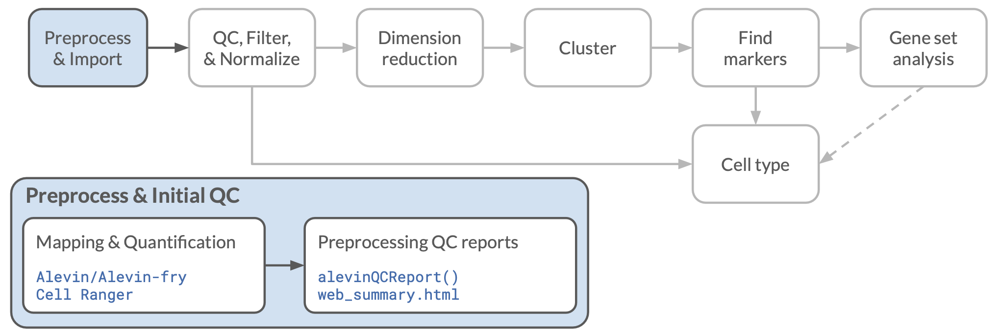

## Objectives

This notebook will demonstrate how to:

- Navigate the terminal interface
- Quantify single cell expression data with Alevin 
- Perform basic quality control and interpret results 

---

In this notebook, we will be running through the basics of processing raw single-cell RNA-seq data.

We will be using a tag-based scRNA-seq sample from the [*Tabula Muris* project](https://www.nature.com/articles/s41586-018-0590-4).
This dataset is made of 20 mouse organs that were sequenced using 10x Genomics Chromium single cell sequencing methods.
For 10x Genomics scRNA-seq data, cells are separated by emulsion/droplets, and individual cells are given barcodes (often abbreviated 'CB' in documentation).
Each transcript will also contain a [Unique Molecular Identifiers (UMIs)](http://www.nature.com/doifinder/10.1038/nmeth.2772) which allow us to examine PCR amplification errors and biases.



## About the data

We obtained these data from Tabula Muris project's [Figshare](https://figshare.com/projects/Tabula_Muris_Transcriptomic_characterization_of_20_organs_and_tissues_from_Mus_musculus_at_single_cell_resolution/27733).
The BAM files that were on Figshare were converted to `fastq` files using
[`bamtofastq`](https://support.10xgenomics.com/docs/bamtofastq) from 10x Genomics.
We will process a `fastq` file from mouse bladder for this as an example.  
To limit the amount of time this takes to run in the context of this workshop,
we are only running part of the sample's reads.

*Note*: Depending on the format of the data you are working with, i.e., if you have a set of `.bcl` files, you may need to use [`cellranger mkfastq`](https://support.10xgenomics.com/single-cell-gene-expression/software/pipelines/latest/using/mkfastq) to create `.fastq` files for each sample.
However, most public data is available in `fastq` format, and most sequencing cores will generate the `.fastq` files, so that is where we will start.


## Checking directories and files

If you have opened the `scRNA-seq.Rproj` file, your Terminal should already be set to the `scRNA-seq` directory, but it is worth checking with the `pwd` command in the Terminal 
(or by looking at the path shown in the command prompt or at the top of the Terminal pane). 

If you are in a different directory, we will want to use `cd` to change to the `training-modules/scRNA-seq` directory. 

Copy and paste the text in the code blocks below into your `Terminal` window in RStudio.
It should be in the lower left hand corner as a tab next to `Console`.

```bash
cd ~/training-modules/scRNA-seq
```

Once you are there, you should be able to run the following command in the Terminal to look at the contents of the `data/tabula-muris` directory:

```bash
ls data/tabula-muris
```

Here you will see the `fastq` directory, which is a actually link to a shared folder with the raw fastq files, split by sample.
We will use these files, but we will not write to this directory. 

We can look inside the contents of the `fastq` directory, and we should see 16 subfolders corresponding to 16 different samples. 
Within each of these folders should be the `fastq` files associated with that sample. 
Again, we can use the `ls` command to show the contents of each of the directories. 

In this scenario, `10X_P4_3` refers to the sample name that we will be processing, which contains data from mouse bladder cells.

```bash
ls data/tabula-muris/fastq/10X_P4_3
```

You should see a list of multiple `fastq` files all starting with `10X_P4_3`, indicating the sample name. 

If you notice, each `fastq` file name contains either `R1` or `R2`.
These correspond to the two sequencing reads of a paired-end library.
For 10x data, the first read (the `R1` file) will contain the cell barcode and UMI sequence, and the second read (the `R2` file) will contain a cDNA sequence corresponding to the captured transcript.
We will need both of these files to quantify our data. 

```
10X_P4_3_L001_R1_001.fastq.gz  10X_P4_3_L002_R1_001.fastq.gz
10X_P4_3_L001_R1_002.fastq.gz  10X_P4_3_L002_R1_002.fastq.gz
10X_P4_3_L001_R1_003.fastq.gz  10X_P4_3_L002_R1_003.fastq.gz
10X_P4_3_L001_R2_001.fastq.gz  10X_P4_3_L002_R2_001.fastq.gz
10X_P4_3_L001_R2_002.fastq.gz  10X_P4_3_L002_R2_002.fastq.gz
10X_P4_3_L001_R2_003.fastq.gz  10X_P4_3_L002_R2_003.fastq.gz
```

Sequencing runs are often split into multiple `fastq` files, both when a sample was run across multiple lanes and to keep the individual file sizes down. 
This was the case for the *Tabula Muris* data we are using here as well. 
The files that you see in the `data/tabula-muris/fastq/10X_P4_3` directory shown above represent 2 lanes worth of data, with three R1 and three R2 files per lane.

You will also see the file `TM_droplet_metadata.csv`, which contains metadata for the *Tabula Muris* experiments.

### Set up output directory

Now that we are in `scRNA-seq`, we'll make a directory for us to store our quantification files in.
In `Terminal`, run the following command:

```bash
mkdir -p data/tabula-muris/alevin-quant/10X_P4_3_subset
```

## Quantifying cell expression with Salmon Alevin

[Alevin](https://genomebiology.biomedcentral.com/articles/10.1186/s13059-019-1670-y) is run from the command line (Terminal) to perform mapping and quantification of tag-based single cell expression data. 

### Indexing the mouse transcriptome 

Before you can quantify with Salmon and [Alevin](https://genomebiology.biomedcentral.com/articles/10.1186/s13059-019-1670-y) we need to index the transcriptome for the species we will be mapping to.
This step would be the same for mapping bulk RNA-seq data, and you can use the same transcriptome indexes as bulk RNA-seq, however, due to the shorter read lengths in the 10x sequencing, we may want to use shorter kmers than the default index size that salmon uses.
In this instance, we used a `-k` of 23.

In the interest of time, we have already run the command below and have the index built and ready for you in a shared directory.

But for your own reference, here is how you might do it yourself:
```
# salmon --threads=16 --no-version-check index \
#  -t Mus_musculus.GRCm38.cdna.all.fa.gz \
#  -i index/Mus_musculus/short_index \
#  -k 23
```

Scripts to build the indexes like those we are using here (and others) can be found in [this repository](https://github.com/AlexsLemonade/training-txome-prep). 


### Running Salmon Alevin

Copy and paste this in your `Terminal` to run the Alevin quantification.
This will take about 20 minutes to run, so we will start now, then talk about the options.

Note that here we are only giving the full paths to one of the `R1` files and one of the `R2` files. 
For the sake of time, we are only going to be running this on a subset of reads, but will also show you how to run it on the full sample.  

```bash
salmon alevin \
  -i index/Mus_musculus/short_index \
  -l ISR \
  -1 data/tabula-muris/fastq/10X_P4_3/10X_P4_3_L001_R1_001.fastq.gz \
  -2 data/tabula-muris/fastq/10X_P4_3/10X_P4_3_L001_R2_001.fastq.gz \
  -o data/tabula-muris/alevin-quant/10X_P4_3_subset \
  -p 4 \
  --chromium  \
  --tgMap index/Mus_musculus/Mus_musculus.GRCm38.95.versioned_tx2gene.tsv \
  --dumpFeatures
```

### Salmon Alevin command line options

For detailed information about all options available see the [Alevin documentation](https://salmon.readthedocs.io/en/latest/alevin.html) and [Salmon documentation](https://salmon.readthedocs.io/en/latest/salmon.html).

Many of the options for the `salmon alevin` command are the same as those you would see when mapping and quantifying bulk RNA-seq data with `salmon quant`:

- `-i` gives the location of the transcriptome index
- `-1` and `-2` are the paired read input files
- `-o` designates the output folder
- `-p` allows us to specify how many processors to use; in this case we will use 4


#### `-l`
The `-l` option is for designating the library format. 
For most single-cell quantification, you will want to use the `ISR` library type.
See [Salmon's documentation](https://salmon.readthedocs.io/en/latest/library_type.html#fraglibtype) for more information on fragment library types (and all of the other options available).
Note that this option must come *before* the read files.

#### `--chromium`
Because we are using 10x v2 chromium data, we have to use this flag to tell `alevin` where to expect the barcodes, UMIs and sequence data.
If we were using 10x v3 data, we would need the `--chromiumV3` flag instead. 
Drop-seq data is also supported, for which we would use the `--dropseq` flag instead of this.


#### `--tgMap`
The transcriptome file that we are mapping to has separate sequences for each transcript of a gene, but due to the sparse nature of single-cell data, we are not likely to be able to meaningfully distinguish among different transcripts.
For this reason, `alevin` will quantify our results at the gene level, so we need to provide a file that maps each transcript to its gene.
For this example, we've pre-made the file `Mus_musculus.GRCm38.95.versioned_tx2gene.tsv` from the Ensembl transcriptome that we indexed above. 
The file is a TSV (tab-separated values) file with 2 columns: one of transcripts and the other the gene that each comes from.


#### `--dumpFeatures`
This option will print out information that we will use for quality checks later on, including files with information on the UMIs and cell barcodes.

See the [Alevin documentation](https://salmon.readthedocs.io/en/latest/alevin.html) for a complete list of the Alevin options.
There are also a number of example analyses at the [Alevin tutorial](https://combine-lab.github.io/alevin-tutorial/) website.


### Note: Running the FULL sample.

When we took a look at the `data/tabula-muris/fastq/10X_P4_3` directory earlier, we noticed that there were multiple files representing 2 lanes worth of data, with three R1 and three R2 files per lane:

We should really run all of these through Salmon, though that will take about six times as long as the single pair of reads we used. 
To do this, we could list each R1 and R2 file (space separated) after the `-1` and `-2` arguments, respectively.
But that is a lot of typing, so a nice shortcut is to use a `*` character to represent a wildcard that will be filled in with whatever characters are present in the files at the given path.
In the pattern `10X_P4_3_L*_R1_*.fastq.gz`, this would allow any lane number and any subset, so would match all of the following files (all the R1 files in this case):

```
10X_P4_3_L001_R1_001.fastq.gz  10X_P4_3_L002_R1_001.fastq.gz
10X_P4_3_L001_R1_002.fastq.gz  10X_P4_3_L002_R1_002.fastq.gz
10X_P4_3_L001_R1_003.fastq.gz  10X_P4_3_L002_R1_003.fastq.gz
```

For this directory, that would make our full `salmon alevin` command look like this (don't run this now!):

```
# salmon alevin \
#   -i index/Mus_musculus/short_index \
#   -l ISR \
#   -1 data/tabula-muris/fastq/10X_P4_3/10X_P4_3_L*_R1_*.fastq.gz \
#   -2 data/tabula-muris/fastq/10X_P4_3/10X_P4_3_L*_R2_*.fastq.gz \
#   -o data/tabula-muris/alevin-quant/10X_P4_3 \
#   -p 4 \
#   --chromium  \
#   --tgMap index/Mus_musculus/Mus_musculus.GRCm38.95.versioned_tx2gene.tsv \
#   --dumpFeatures
```

In general, you will want to run all lanes and all files for a given sample together.
But **DO NOT** combine multiple *samples* into a single `alevin` quantification!
Keep separate samples (and replicates) separate!

## Initial quality control with `alevinQC`

Now that we have quantified our data with Alevin, we are ready to perform initial quality control checks.

In order to perform these quality control checks, we'll use the `alevinQC` R package.
Note that `alevinQC` depends on files that we get using the`--dumpFeatures` option in Alevin.

About the `alevinQCReport()` function:
The first argument needs to be where the sample's output data was put when Alevin was run (as a character string, aka using quotes).
The rest of `alevinQCReport()`'s arguments tell R where to put the output QC report.

```{r alevinQC, eval = FALSE}
# Produce a QC report
alevinQC::alevinQCReport("data/tabula-muris/alevin-quant/10X_P4_3_subset",
                         sampleId = "10X_P4_3_subset",
                         outputFile = "10X_P4_3_subset-qc_report.html",
                         outputDir = "qc-reports")
```

Look for the `10X_P4_3_subset-qc_report.html` file created in the `qc-reports` directory to examine the quality of your data and performance of Alevin.

We have also placed an example of a poor quality sample alevinQC report in the `qc-reports` directory, with the name `Bad_Example_10X_P4_2_qc_report.html`.

This report will show a few key metrics that inform you about the quality of your sample. 
There is a lot of information included in the report, so some key metrics to note are included in the `Summary tables`:

- Fraction of reads in whitelist barcodes 
- Mean number of reads per cell
- Median number of detected genes per cell 

The fraction of reads in whitelist barcodes is particularly important as a low percentage here means the library contains many reads that do not contain the expected cell barcodes. 
This is indicative of poor single-cell capture during library construction. 

The mean number of reads per cell and median number of detected genes per cell can be helpful in understanding how deeply the library was sequenced. 
The higher these numbers are, the more information you will obtain per cell. 

The **knee plot** shows the number of distinct UMIs for each possible cell barcode on the y-axis, with the barcodes ranked from the most UMIs to the fewest along the x-axis.

Cell barcodes with low UMI counts are likely to be empty droplets that did not contain a cell. 
These droplets must be filtered out so we only consider true cells for downstream analysis.

To do this, we can look for a "knee" on the curve where the number of UMIs per barcode starts to drop off rapidly, with the intuition that this is where we are reaching the end of the UMIs per cell distribution for true cells.
We can then choose a threshold below the knee and only include barcodes above this threshold in the final cell barcode list.

This "knee" method, which is implemented by `alevin`, is fairly effective and does not require any read mapping or quantification before filtering.
More recent versions of Cell Ranger use a somewhat different method based on the "empty drops" method of [Lun *et al.* (2019)](https://doi.org/10.1186/s13059-019-1662-y), that is applied after initial gene quantification.
This allows filtering to retain cells with low counts that are nonetheless likely to represent real cells.

## Next steps: Loading Alevin output into R

After we have successfully quantified our tag-based scRNA-seq data (and done some QC), we will want to read it into R to start to analyze it. 
The easiest way to do this is to use the `tximeta` package, which we will introduce in the next notebook.


## Session Info

```{r sessioninfo}
sessionInfo()
```
