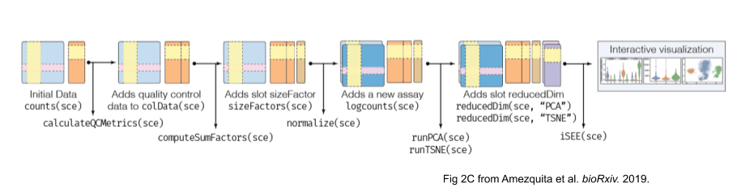
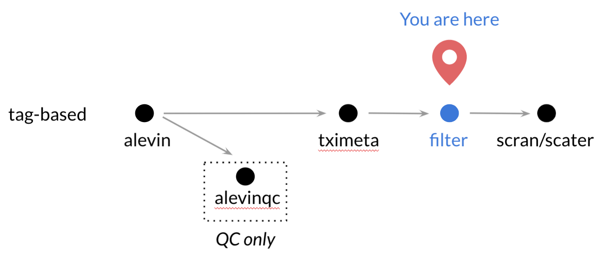

## Objectives

This notebook will demonstrate how to:

- Import alevin results with tximeta
- Calculate and examine cell quality measures

---

We will continue with the Tabula Muris data set that we started with in the previous notebook. 

  
## Set Up 

```{r setup}
# Magrittr for the pipe %>%
library(magrittr)

# tximeta for importing alevin results
library(tximeta)

# SingleCellExperiment package for organizing our results
library(SingleCellExperiment)

# GGPlot2 for the plots
library(ggplot2)
```

## Import single-cell RNA-seq quantification


### Directories and files

The data files we will be using for this part of the project are in the `data/tabula-muris` subdirectory of the `scRNA-seq` directory where this notebook is located.

The main files we will be using at this stage are the results from our earlier quantification, located in the `alevin-quant` subdirectory.
Rather than just the subset, we will use the full data in order to get a somewhat more realistic view of a 10X data set.
This data set is still a few years old though: newer datasets will tend to have more cells!

```{r filepaths}
# main data directory
data_dir <- file.path("data", "tabula-muris")

# Path to the single-sample alevin results
alevin_file <- file.path(data_dir, "alevin-quant", 
                         "10X_P4_3", "alevin", "quants_mat.gz")

# Mitochondrial gene table
mito_file <- file.path(data_dir,
                       "mm_mitochondrial_genes.tsv")


# create the output directory
filtered_dir <- file.path(data_dir, "filtered")
if (!dir.exists(filtered_dir)) {
  dir.create(filtered_dir, recursive = TRUE)
}

# Output file 
filtered_sce_file <- file.path(filtered_dir, "filtered_sce.rds")
```


## Importing alevin results with tximeta

`tximeta` needs a data frame with at least these two columns: 
- a `files` column  with the file paths to the quant.mat.gz files
- a `names` column with the sample names

In this case, we are only importing a single experiment, so we will create a data frame with only one row.

```{r names_sf_files, live = TRUE}
coldata <- data.frame(files = alevin_file, 
                      names = "10X_P4_3")
```

Using the `coldata` data frame that we set up, we can now run the `tximeta()` to import our expression data while automatically finding and associating the transcript annotations that were used when we performed the quantification.

The first time you run `tximeta()` you may get a message about storing downloaded transcriptome data in a cache directory so that it can retrieve the data more quickly the next time.
We recommend you use the cache, and accept the default location.

```{r read_data, live = TRUE}
# Read in alevin results with tximeta
bladder_sce <- tximeta(coldata, type = "alevin")
```

In the intro-to-R-tidyverse module notebook, `01-intro-to-base_R.Rmd`, we discuss base R object types, but there are some 'special' object types that are package-specific. 
`tximeta` creates a `SummarizedExperiment` object (or more specifically a `RangedSummarizedExperiment` object.), which is used by many Bioconductor packages to store and process results from gene expression studies.

```{r view_scdata, live = TRUE}
# Explore the SummarizedExperiment data
bladder_sce
```

The main component we are concerned with for now is the `counts` matrix, which is stored as an "assay", with a row for each gene and a column for each cell. 
In this case, we can see there is information for 35,429 genes, and Alevin reports data for 344 cells.

`tximeta` also automatically added some annotation information about each gene, which can be seen by extracting the `rowData` table.

```{r view_annoation, live = TRUE}
# Examine row (gene) metadata
rowData(bladder_sce)
```

We could leave the object as it is, but we can unlock some extra functionality by converting this from a `SummarizedExperiment`object to a `SingleCellExperiment`, so we will go ahead and do that next.
`SingleCellExperiment` objects are a subtype of `SummarizedExperiment` objects that a lot of single-cell analysis R packages use, so we will try to get acquainted with them. 

Below is a figure from [Amezquita *et al.* (_bioRxiv._ 2019)](https://www.biorxiv.org/content/10.1101/590562v1) (the preprint version of the above-linked paper) that shows the general structure of `SingleCellExperiment` objects. 



Note that each function which transforms the `SingleCellExperiment` object can store its results back into the object (or a new copy of the object, but that tends to be a waste of space).
Each of these transformation functions also have a corresponding extraction function that allow you to extract (or set) those results from the `SingleCellExperiment` object. 

For more information on `SingleCellExperiment` objects, check out this [excellent vignette](https://bioconductor.org/packages/devel/bioc/vignettes/SingleCellExperiment/inst/doc/intro.html) and/or [Amezquita *et al.* (2020)](https://www.nature.com/articles/s41592-019-0654-x)

To perform the conversion to a `SingleCellExperiment`, we will use the R function `as()`, which "coerces" objects from one type to another.

```{r convert_sce, live = TRUE}
# Convert the SummarizedExperiment to a SingleCellExperiment
bladder_sce <- as(bladder_sce, "SingleCellExperiment")
bladder_sce
```

Doing this added a couple of (currently empty) slots for things like dimensionality reduction results and alternative feature experiments. Foreshadowing!

## Summarizing expression  

For a first pass at the data, we will extract just the counts matrix from the `SingleCellExperiment` object, and use some base R functions to look at our results.

We can extract the gene by cell count matrix using the `counts()` function.
This actually returns a special format of matrix called a "sparse" matrix. 
Since single cell count data is mostly zeros, this format (a `dgCMatrix` object) allows R to save a lot of memory.
This object takes up about 6.4 MB, but if we stored it in the normal format, it would be closer to 100 MB!
Thankfully, most of the functions that we use to work with regular matrices work just fine with these as well.

```{r make_matrix}
sc_counts <- counts(bladder_sce)
```

Let's look at the mean expression of the genes in this dataset. 
We will use `apply()` in order to calculate things across our data frame. 
The second argument in `apply()` specifies whether we are calculating by rows or columns. 
(1 = rows, 2 = columns).

In the code chunk below, use `apply()` with the correct arguments to calculate the gene means. 

```{r means, live = TRUE}
# Let's calculate the gene means (by row)
gene_means <- apply(sc_counts, 1, mean)
```

This works just fine, but you may have noticed it is a bit slow.
For a few common summary functions like means and sums, R has much more efficient functions to calculate across rows or columns. 
In this case, we can use `rowMeans()` to do the same calculation much more quickly.


```{r rowmeans}
# use rowMeans() to calculate gene means
gene_means <- rowMeans(sc_counts)
```

Let's make our first density plot with these data.
We will use `ggplot()` as you have seen before, but since the object we want to plot, `gene_means`, is a vector not a data frame, we will skip the `data` argument and go straight to the `mapping` aesthetics.
The remainder of the `ggplot` code should look familiar.

```{r mean_density}
# Plot the density of the means using ggplot2
ggplot(mapping = aes(x = gene_means)) +
  geom_density() +
  xlab("Mean gene count") 
```

That plot is not quite as informative as we might like, as a few genes with high expression are making the scale just a *bit* wide.
Lets zoom in on the left part of the graph by adding an `xlim()` argument. 
(Note that `xlim()` will remove points outside the specified range, so you will get a warning.)

```{r zoom_density, live = TRUE}
# Plot the density of the means using ggplot2
ggplot(mapping = aes(x = gene_means)) +
  geom_density() +
  xlab("Mean gene count") +
  xlim(0, 5)
```

Even as we zoom in, the counts data has many zeroes, which we actually expect in a single cell RNA-seq experiment.

Let's calculate what proportion of the count data is zeros:

```{r zero_fraction, live = TRUE}
sum(sc_counts == 0)/(nrow(sc_counts) * ncol(sc_counts))
```


## Quality control measures for the counts matrix
  
The small amount of RNA in a single cell results in higher chances of errors and biases in RNA isolation, amplification, and sequencing. 
We should check that the overall data we observe for each sample/cell are reasonable before proceeding too far.

The next section explores some of the ways we can filter the data set to clean things up before we continue to downstream analysis.


#### Total counts as a quality measure

First, lets look at the total number of counts per cell, across all genes. 
For this we will use `colSums()`, as each column represents a different sampled cell.

```{r total_counts, live = TRUE}
# Make a vector of total_counts number of counts per sample using colSums()
total_counts <- colSums(sc_counts)
```


```{r counts_summary, live = TRUE}
# Take a look at the summary statistics for the total counts
summary(total_counts)
```

Yikes, at least one of the cells has only 1 read!, compared to the median of ~4000!
It's highly likely that this 'cell' is either an empty well or did not get sequenced properly. 

Let's visualize the distribution of total counts to see if this is the only cell we might want to exclude.

In following graphs, we will use vertical red lines to indicate possible cutoffs. 

```{r total_counts_plot, live = TRUE}
# Let's use the same kind of plot as above but add more layers
ggplot(mapping = aes(x = total_counts)) + 
  geom_density(fill = "lightblue") +
  geom_vline(xintercept = 1000, color = "red") +
  xlab("Counts per cell")
```

How many cells would be removed with this (or other cutoffs) for counts per sample?

```{r count_cutoffs}
# Calculate the number of cells that would be removed with a given cutoff
count_cutoff <- 1000
sum(total_counts <= count_cutoff)
```


### Number of genes a cell expressed as a quality measure

What if a single gene accounted for all counts in a particular cell?
This cell would not have helpful data for us, so we should look to remove any cells we suspect might not have a useful amount of its transcriptome measured.

But before we can determine how many genes we consider a particular cell to be expressing we need to determine a numeric cutoff for what we consider to be a detected gene.
How many counts must there be for you to consider a gene expressed? 
Here let's go for a simple detection cutoff of > 0. 

```{r detection_matrix, live=TRUE}
# make a detection_mat matrix that is TRUE when a gene is expressed in a sample
detection_mat <- sc_counts > 0 
```

Now that we have turned our data into a matrix of `TRUE/FALSE` for detection, we can sum this data by column to effectively get a vector of how many genes were measured in each cell. 

```{r genes_expressed, live = TRUE}
# Make a vector that contains the number of genes expressed by a particular cell
num_genes_exp <- colSums(detection_mat)
```

Let's plot this using the same style and type of graph as above. 

```{r genes_expressed_plot}
ggplot(mapping = aes(x = num_genes_exp)) +
  geom_density(fill = "lightblue") +  
  xlab("Number of genes expressed") +
  theme_classic() 
```

This plot helps us visualize the distribution of genes per cell and can help inform how we choose the cutoff.
It's important to remember that different cell types can have quite different patterns with regards to number of genes expressed.
If we were to use strict cutoffs to select which cells are "valid", there is the possibility that we could bias our results, so this is something we want to be careful about. 

Let's see what happens if we only keep cells with > 500 expressed genes. 
Just like when we looked at total counts, we can add in a vertical line to the previous plot where the possible cutoff would be.  

```{r genes_expressed_cutoff, live = TRUE}
ggplot(mapping = aes(x = num_genes_exp)) +
  geom_density(fill = "lightblue") +  
  xlab("Number of genes expressed") +
  theme_classic() + 
  geom_vline(xintercept = 500, color = "red")
```
How many cells would be removed with this cutoff?

```{r count_gene_cutoffs, live = TRUE}
# Calculate the number of cells that would be removed with a given cutoff
gene_cutoff <- 500
sum(num_genes_exp <= gene_cutoff)
```

### Mitochondrial gene expression

If a cell is dead or dying, its mRNA will tend to leak out of the cell, leaving an overabundance of mitochondrial RNA, which is more likely to stay within the mitochondria longer. 
To look for this, we would like to calculate the fraction of mitochondrial expression for each cell as well.
First, we will need a list of the mitochondrial genes, which we have prepared in a tsv file `mm_mitochondrial_genes.tsv` that we will now read in, and filter to just the genes that are found in the data set.  

```{r read_mito}
# read `mm_mitochondrial_genes.tsv` from data_dir
mito_genes <- readr::read_tsv(mito_file) %>%
  # filter to only gene in the sce object
  dplyr::filter(gene_id %in% rownames(bladder_sce)) %>%
  dplyr::pull(gene_id)
```

Now we can use the genes from that list to select only the rows of the count matrix that correspond to the mitochondrial genes and sum their expression for each sample.

```{r mito_filter, live = TRUE}
# create a mito_rows vector that is TRUE for mitochondrial genes in our dataset
mito_rows <- rownames(sc_counts) %in% mito_genes

# sum the counts from just those genes for all samples
mito_counts <- colSums(sc_counts[mito_rows, ])

# calculate mito_fraction for all samples
mito_fraction <- mito_counts/total_counts
```

Lets make a plot of this distribution as well!

```{r plot_mito, live = TRUE}
ggplot(mapping = aes(x = mito_fraction)) +
  geom_density(fill = "lightblue") + 
  xlab("Mitchondrial fraction") +
  geom_vline(xintercept = 0.2, color = "red") +
  theme_classic() 
```
Here, we want to keep cells with a low fraction of reads corresponding to mitochondrial genes and remove any cells with a high mitochondrial fraction. 


### Combining sample QC measures

Lets put all of the QC measures we have calculated into a single data frame, so we can look at how they might relate to one another.

```{r qc_dataframe, live = TRUE}
# make a data frame with number of genes expressed, total counts, and mito fraction 
qc_df <- data.frame(barcode = names(num_genes_exp),
                    genes_exp = num_genes_exp,
                    total_counts = total_counts,
                    mito_fraction = mito_fraction)
  
```

Now we can plot these measures all together, along with some possible cutoffs.

```{r qc_scatterplot}
ggplot(qc_df, aes (x = total_counts,
                   y = genes_exp, 
                   color = mito_fraction)) +
  geom_point(alpha = 0.5) +
  scale_color_viridis_c() + 
  geom_vline(xintercept = 1000, color = "red") +
  geom_hline(yintercept = 500, color = "red") +
  labs(x = "Total Count",
       y = "Number of Genes Expressed",
       color = "Mitochondrial\nFraction") + 
  theme_bw()
```

If we want to filter our data based on these measures and cutoffs we like, we can do this with `dplyr::filter()` and then select the resulting columns from the matrix.

```{r qc_filter, live = TRUE}
# create a filtered_samples data frame from qc_df
filtered_samples <- qc_df %>%
  dplyr::filter(total_counts > 1000,
                genes_exp > 500,
                mito_fraction < 0.2)
# select only passing samples for bladder_sce_filtered
sc_counts_filtered <- sc_counts[, filtered_samples$barcode]
```

## Filtering the `SingleCellExperiment` directly

### Calculating cell QC stats with `scater`

The methods above were nice for demonstrating the kinds of filtering we might do, but all the steps would certainly be repetitive if we had to do them for each sample.
Thankfully, there are some nice methods that have been developed in packages like `scater` to perform them all at once and add the results to the `SingleCellExperiment` object.
The advantages of using functions like this are that we can keep all of the metadata together, filter directly on the object of interest, avoid a lot of repetition, and in doing so avoid many potential errors. 

We will start with the function `addPerCellQC()`, which takes a `SingleCellExperiment` and a list of gene sets that that we might want to calculate subset information for.
In our case, we will just look at mitochondrial genes again.

```{r}
bladder_sce <- scater::addPerCellQC(
  bladder_sce,
  # a list of named gene subsets that we want stats for
  # here we are using mitochondrial genes
  subsets = list(mito = mito_genes)
  )
```

The results of these calculations are now stored as a data frame in the `colData` slot of the `SingleCellExperiment` object, which we can pull out with the `colData()` function.
(Unfortunately, it is not quite a regular data frame, but we can easily convert it to one.)
Even nicer, we can access the QC data in those columns directly with just the familiar `$` syntax!

The calculated statistics include `sum`, the total UMI count for the cell, `detected`, the number of genes detected, and a few different statistics for each subset that we gave, including the percent (not fraction!) of all UMIs from the subset. 
Since the subset we used was named `mito`, this column is called `subsets_mito_percent`.

Using these, we can recreate the plot from before:

```{r replot}
# extract the column data and convert to a data frame
bladder_qc <- data.frame(colData(bladder_sce))

# plot with the qc data frame
ggplot(bladder_qc, aes (x = sum,
                        y = detected, 
                       color = subsets_mito_percent)) +
  geom_point(alpha = 0.5) +
  scale_color_viridis_c() + 
  labs(x = "Total Count",
       y = "Number of Genes Expressed",
       color = "Mitochondrial\nFraction") + 
  theme_bw()
```
### Applying a filter to a `SingleCellExperiment`

Filtering the `SingleCellExperiment` object is done as if it were just the counts matrix, with brackets and indexes. 
While this will look much like what we did before, it is better, because it will also keep the filtered QC stats alongside, in case we wanted to revisit them later.
Otherwise, we would have to filter our QC results separately, which is an easy place for errors to creep in.

```{r filter_sce}
# create a boolean vector of QC filters
cells_to_keep <- bladder_sce$sum > 1000 & 
  bladder_sce$detected > 500 &
  bladder_sce$subsets_mito_percent < 20

# filter the sce object (cells are columns)
bladder_sce_filtered <- bladder_sce[, cells_to_keep]
```

Just to check, we should have the same number of cells in `bladder_sce_filtered` as our previous `sc_counts_filtered`.

```{r check_cell_count, live = TRUE}
ncol(sc_counts_filtered) == ncol(bladder_sce_filtered)
```

## Number of cells that express a gene as a quality measure

Now we have an idea of what cells we probably want to get rid of.
But what if our data contains genes that we can't reliably measure in these cells?

We could use our earlier `detection_mat` to add up how many cells express each gene, but we will skip straight to the `scater` function this time, which is called `addPerFeatureQC()`.
This will add QC statistics to the `rowData` for each gene (alongside the annotation data we already had there)
The columns it adds are the average expression level of each gene (`mean`) and the percentage of cells in which it was detected (`detected`).

```{r sample_exp, live = TRUE}
bladder_sce_filtered <- scater::addPerFeatureQC(bladder_sce_filtered)
```

Let's make another density plot with the percentage of samples that express each gene:

```{r sample_exp_plot}
# extract the gene information with 
gene_info <- data.frame(rowData(bladder_sce_filtered))

# Plot the detected percentage
ggplot(gene_info, aes(x = detected) )+
  geom_density(fill = "lightblue") +
  xlab("Percent of Cells Expressing Each Gene") + 
  theme_classic()
```

How many genes will be excluded if we draw our cutoff at 5% of cells?

```{r filter_effect, live = TRUE}
sum(gene_info$detected < 5)
```

That's a lot! How do we feel about that?

```{r filter_genes, live = TRUE}
cutoff <- 2
# filter bladder_sce_filtered to only genes above a cutoff value
bladder_sce_filtered <- bladder_sce_filtered[gene_info$detected >= cutoff, ]
```

How big is the `SingleCellExperiment` object now?

```{r filtered_size, live = TRUE}
dim(bladder_sce_filtered)
```

## Save the filtered data

We will save the filtered `SingleCellExperiment` object as a `.rds` file for later use.

```{r}
readr::write_rds(bladder_sce_filtered, file = filtered_sce_file)
```


### Print session info

```{r sessioninfo}
sessionInfo()
```
