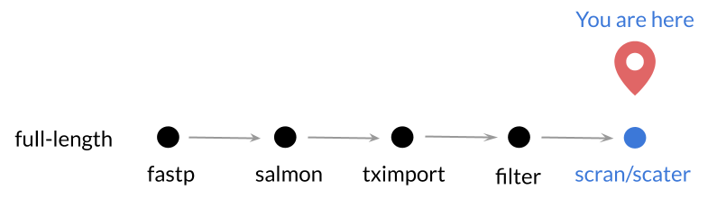

**CCDL 2019**

In this notebook, we'll perform normalization of scRNA-seq count data that we have already done quality-control analyses of. 
    
For this tutorial, we will be using a pair of single-cell analysis specific 
R packages: `scater` and `scran` to work with our data. 
This tutorial is in part based on the [scran
tutorial.](https://bioconductor.org/packages/devel/bioc/vignettes/scran/inst/doc/scran.html)
  
## Set Up 

For these analyses, we will need `scater` and `scran` packages, which have been 
installed already on your Docker container. 

```{r setup}
# Set seed for reproducibility
set.seed(1234)

# Magrittr for the pipe %>%
library(magrittr)

# GGPlot2 for the plots
library(ggplot2)

# Packages for single cell processing
library(scater)
library(scran)
```

Now let's set up the files we will be using:

```{r files}
# main data directory
data_dir <- file.path("data", "glioblastoma")

# Filtered count matrix file from previous notebook
filtered_count_file <- file.path("data", "glioblastoma", "filtered_count_matrix.tsv")

# Metadata file location
metadata_file <- file.path(data_dir, "preprocessed", "darmanis_metadata.tsv")

# Output directory
norm_dir <- file.path(data_dir, "normalized")
if (!dir.exists(norm_dir)) {
  dir.create(norm_dir, recursive = TRUE)
}
```


## Load the filtered count matrix and metadata

```{r}
sc_data_filtered <- readr::read_tsv(filtered_count_file)
sc_metadata <- readr::read_tsv(metadata_file)
```


## Set up a SingleCellExperiment object from count data

Now that we have filtered our data, we are ready to normalize it.
To do this, we are going to use some single-cell RNA-seq R packages called `scater` and `scran`.



The functions in these packages require the data to be in their own special 
object type (not an uncommon thing for R packages to do) called `SingleCellExperiment`.
So first, we are going to set up our data in this format.
To learn more about `SingleCellExperiment` objects and how it works with
Bioconductor packages, we recommend this article: [Amezquita et al. _bioRxiv._ 2019.](https://www.biorxiv.org/content/10.1101/590562v1).

```{r Set up SCE object}
# Prep a matrix with just the rounded counts so we can create an sce object
counts_mat <- round(as.matrix(sc_data_filtered[, -1]))

```

Put our counts matrix in this special `SingleCellExperiment` function: 

```{r}
# Set up the Single Cell Experiment object 
sce_raw <- SingleCellExperiment::SingleCellExperiment(list(counts = counts_mat))

# save some memory
rm(counts_mat)

# Store the gene names in this object
rowData(sce_raw) <-  sc_data_filtered$gene
```

In the intro-to-R-tidyverse module notebook, `01-intro-to-r`, we discuss base R 
object types, but there are some 'special' object types that are 
package-specific. 
`SingleCellExperiment` objects, for example, are what a lot of single-cell 
analysis R packages use, so we will try to get acquainted with them. 

Use this chunk we've set up below to do some exploring of the 
`SingleCellExperiment` object you just made.

```{r Explore SCE structure}
# The SingleCellExperiment is a special type of object used by scater and scran
# R packages, explore its properties here. 
# Also check it out in the environment tab.
```

Below is a figure from [Amezquita et al. _bioRxiv._ 2019.](https://www.biorxiv.org/content/10.1101/590562v1) 
that shows the general structure of `SingleCellExperiment` objects. 


Note that each function which transforms the `SingleCellExperiment` object
stores its results back into the object.
Each of these transformation functions also have a corresponding extraction 
function that allow you extract (or set) those results from the 
`SingleCellExperiment` object.

For more information on `SingleCellExperiment` objects, check out this [excellent vignette](https://bioconductor.org/packages/devel/bioc/vignettes/SingleCellExperiment/inst/doc/intro.html)
and/or [Amezquita et al. _bioRxiv._ 2019.](https://www.biorxiv.org/content/10.1101/590562v1)

## Normalization of count data 

In whatever data we are working with, we are always looking to maximize biological 
variance and minimize technical variance. 
This is where normalization methods usually come into the workflow.
With this high amount of zeroes in our data, this makes normalization particularly
tricky.
So in order to account for these zeroes, we normalize cells in groups with other 
cells like them; a method introduced in [Lun et al 2016](https://genomebiology.biomedcentral.com/articles/10.1186/s13059-016-0947-7).

*These steps may take a minute or so.*

```{r}
# Step 1) Group cells with other like cells by clustering.  
qclust <- scran::quickCluster(sce_raw)

# Step 2) Compute sum factors for each cell cluster grouping.  
sce_raw <- scran::computeSumFactors(sce_raw, clusters = qclust)

### TODO: This is now deprecated- update to latest recommendations ###

# Step 3) Normalize using these pooled sum factors and log transform. 
sce_norm <- scater::normalize(sce_raw)
```

## Compare normalized data to count data

One way to determine whether our normalization yields biologically relevant 
results, is to plot it and see if similarly labeled samples and cells end up 
together.
Because plotting 1000's of genes together isn't practical, we will reduce the 
dimensions of our data using Principal Components Analysis. 
Note that the `t()` function is being used here to transpose the `matrix`, so 
it is samples x genes. 
We could however, obtain PCA scores for each gene if we didn't transpose our
data.frame first. 

```{r}
# Use PCA for dimension reduction of cells' raw data
count_pca <- prcomp(t(counts(sce_raw)))

# Use PCA for dimension reduction of cells' scran normalized data
norm_pca <- prcomp(t(logcounts(sce_norm)))
```

Now we will retrieve the PCA scores, by using `$x` at the end of our `prcomp`
objects.

```{r Graph PCA}
# Make the counts PC scores into a dataframe with cell type labels for easy graphing 
count_pca_scores <- data.frame(count_pca$x[, 1:2],
                               geo_accession = rownames(count_pca$x)) %>%
  dplyr::left_join(dplyr::select(sc_metadata, 
                                 geo_accession, 
                                 cell_type = cell.type.ch1))

# Set up the normalized PC scores in the same way
norm_pca_scores <- data.frame(norm_pca$x[, 1:2],
                              geo_accession = rownames(norm_pca$x)) %>%
  dplyr::left_join(dplyr::select(sc_metadata, 
                                 geo_accession, 
                                 cell_type = cell.type.ch1))
```

Let's plot the counts PCA scores with their cell labels:

```{r Plotting counts pca}
# Now plot counts pca
ggplot(count_pca_scores, aes(x = PC1, y = PC2, color = cell_type)) +
  geom_point() + 
  ggtitle("Counts PCA Scores") + 
  colorblindr::scale_color_OkabeIto() # We are adding this so it is colorblind friendly
```

We've plotted the counts data for you. Knowing that we want the same graph,
but different data, use the above template to plot the normalized data.

Let's plot the `norm_pca_scores` data:

```{r Plotting norms pca, live = TRUE}
ggplot(norm_pca_scores, aes(x = PC1, y = PC2, color = cell_type)) +
  geom_point() + 
  ggtitle("Normalized log counts PCA Scores") + 
  colorblindr::scale_color_OkabeIto()
```

The normalization has appeared to help separate the rest of the brain cells 
from the immune cells. 

## Save the normalized data to tsv file

In case we wanted to return to this data later, let's save the normalized data
to a tsv file. 
In order to do this we need to extract our normalized counts from `sce_norm`. 
Refer back to the `SingleCellExperiment` figure above to determine why we are 
using this `logcounts` function.

```{r Save Data to .tsv}
# Save this gene matrix to a tsv file
logcounts(sce_norm) %>% 
  as.data.frame() %>%
  readr::write_tsv(file.path(norm_dir, "scran_norm_gbm_gene_matrix.tsv"))
```

Also note that `readr::write_tsv` requires a `data.frame`; so we need to convert 
our `matrix` to a data.frame.
Because our metadata has been filtered to match our gene matrix, we will also 
save a new file for the metadata. 

```{r}
readr::write_tsv(sc_metadata_filtered, file.path(norm_dir, 
                                                 "gbm_filtered_metadata.tsv"))
```

We will return to our normalized `sce_norm` object in the exercise, so we will 
also save our data in an RDS file so that we can re-load it into our R 
environment as a `SingleCellExperiment` object.

```{r}
# Save the data as an RDS
readr::write_rds(sce_norm, file.path(norm_dir, "sce_norm.RDS"))
```

### Print session info

```{r}
sessionInfo()
```
