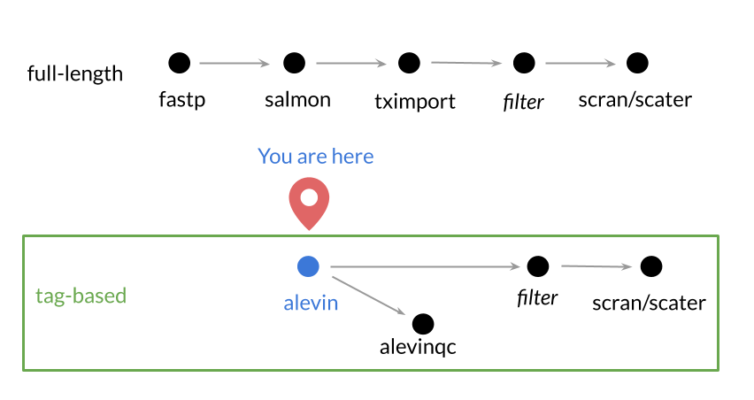
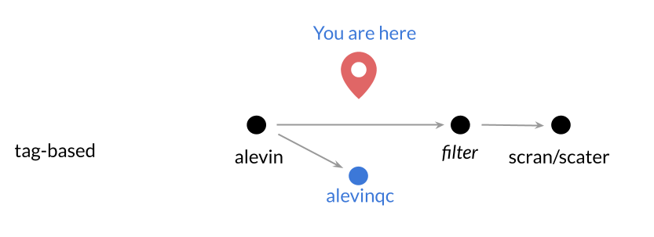

# Preprocessing single-cell RNA-seq data

**CCDL 2019**

#### In this section, we will be running through the basics of preprocessing single-cell RNA-seq data.

We will be using a tag-based scRNA-seq sample from [Tabula Muris data](https://www.nature.com/articles/s41586-018-0590-4).
This dataset is made of 20 mouse organs that were sequenced using 10X Genomics
Chromium single cell sequencing methods.
For 10X Genomics scRNA-seq data, cells are separated by emulsion/droplets, and individual cells
are given barcodes (often abbreviated 'CB' in documentation).
These data also have
[Unique Molecular Identifiers (UMIs)](http://www.nature.com/doifinder/10.1038/nmeth.2772)
which allow us to examine PCR amplification errors and biases.



*Note*: Raw single-cell RNA-seq data from non-tag-based methods, like the Smart-seq2
dataset we were working with in the previous section, can be processed using
Salmon, just like is done in the bulk RNA-seq module.

## Steps for Processing scRNA-seq Data:

### Step 0: About the data

We obtained these data from Tabula Muris project's [Figshare](https://figshare.com/projects/Tabula_Muris_Transcriptomic_characterization_of_20_organs_and_tissues_from_Mus_musculus_at_single_cell_resolution/27733).
The bam files that were on Figshare were converted to fastq files using
`CellRanger bamtofastq`.
We will process a fastq file from mouse bladder for this as an example.  
To limit the amount of time this takes to run in the context of this workshop,
we are only running part of the sample's reads.

*Note*: depending on the state of the data you are working with, ie. if you have
a `.bcl` file, you will need to use `CellRanger` with their `mkfastq` command to
make fastq files from this.
However, most public data is available in fastq format and a core facility may
return your data to you in this format.
We will start from fastq files.

### Step 1: Get to the scRNA-seq directory

Before you run the command below, you need to make your current directory:
`kitematic/scRNA-seq`.
To do this, use the `Terminal` command-line.
Remember to use `ls` and `cd` to help get you there.

### Step 2: Set up your output directory

Now that we are in `kitematic/scRNA-seq`, we'll make a directory
for us to store our quantification files in.
In `Terminal`, run the following command:
```
mkdir -p data/tabula_muris/alevin_quant/10X_P4_3
```
In this scenario, `10X_P4_3` refers to our sample name.

### Step 3: Index the mouse transcriptome with Salmon

Before you can quantify with Salmon and [Alevin](https://www.biorxiv.org/content/10.1101/335000v2)
we need our species' [transcriptome to be indexed.](https://github.com/AlexsLemonade/training-txome-prep)
You can use the same transcriptome index as bulk RNA-seq, however,
due to the shorter read lengths as opposed to bulk, you will want to build the
index with a smaller `-k`.
In this instance, we used a `-k` of 23 using the Ensembl transcriptome.

In the interest of time, we have already run the command below and have the index
built and ready for you in your directory.
But for your own reference, here is how you'd do it yourself:
```
# salmon --threads=16 --no-version-check index \
#  -t Mus_musculus.GRCm38.cdna.all.fa.gz \
#  -i index/Mus_musculus/short_index \
#  -k 23
```

### Step 4: For each sample, run [Alevin](https://www.biorxiv.org/content/10.1101/335000v2) for quantification

From the command line, running Alevin is not too much different from running
Salmon for bulk RNA-seq.

You'll recognize a lot of these options as the same as regular `Salmon` such as
- `-l` to designate library type
- `-1` and `-2` for file input
- `-o` to designate a folder for output

Notation for these 10X files is:
- `R1` files contain the barcodes for cells as well as the UMIs
- `R2` files contain the full reads for that sample.  

### `Alevin`-specific options summary:

#### `-l`
As mentioned, `-l` is for designating library type. For all single-cell quant,
you will want to use the `ISR` library type.
See [Salmon's documentation](https://salmon.readthedocs.io/en/latest/library_type.html)
for more information on fragment library types.

#### `--chromium`
Because we are using 10X chromium data, we have to use this flag. However,
Drop-seq data is also supported, and in this case you would use a `--dropseq`
flag instead of this.

#### `--tgMap`
This is needed to supply a transcript to gene key that Alevin will use to
quantify the genes.
For our example, we've pre-made the file `Mus_musculus.GRCm38_tx2gene.tsv` from
the Ensembl transcriptome that we indexed above. The file has to be a tsv file.

#### `--dumpCsvCounts`
Using this option will make the counts in a csv file and make it easier for us to
import into R later.

#### `--dumpFeatures`
This option will print out information that we will need for quality checks
later on, including files with information on the UMIs and cell barcodes.

#### Running Salmon Alevin

Copy and paste this in your command line to run Alevin quantification.

```
salmon alevin -l ISR \
  -i index/Mus_musculus/short_index \
  -1 data/tabula_muris/fastq/tab_mur_10X_P4_3_L001_R1_subset.fastq.gz \
  -2 data/tabula_muris/fastq/tab_mur_10X_P4_3_L001_R2_subset.fastq.gz \
  --chromium  \
  -p 10 \
  -o data/tabula_muris/alevin_quant/10X_P4_3 \
  --tgMap index/Mus_musculus/Mus_musculus.GRCm38_tx2gene.tsv \
  --dumpCsvCounts \
  --dumpFeatures
```

See the [Alevin documentation](https://salmon.readthedocs.io/en/latest/alevin.html)
for a complete list of the Alevin options and see the
[Alevin tutorials](https://combine-lab.github.io/alevin-tutorial/2018/running-alevin/)
for example analyses.

### Step 5: Prep R for analyzing our Alevin output

To use our Alevin data in R, we will first need to navigate to the R console.

Similar to how we need to be in the `scRNA-seq` directory when we were in
`Terminal`, we need to do the same thing in R now.

First open the R console and use `setwd()` to change to R's working (aka
current) directory to `scRNA-seq`.
Remember that this folder: `data/tabula_muris/alevin_quant/10X_P4_3` that
contains the Alevin quantification files, is located in `scRNA-seq`.
You can run `dir()` to check what files and folders are in R's current
directory.
Once you are in `scRNA-seq` folder, you can continue to the next steps.

### Step 6: Read Alevin output into R

*In the interest of time, we won't import these data into R, but this is how you'd
do it on your own, in R.*

After we have successfully quantified our tag-based scRNA-seq data, we would
probably want to read it into R to start to analyze it.

Alevin provides count data output for each transcript and cell. To read this
data into R, we would import a function from the script `read_alevin.R` which is
located in the `scRNA-seq/scripts` folder.
This script is based on the COMBINE lab's function in their [tutorial](https://combine-lab.github.io/alevin-tutorial/2018/running-alevin/).

In the R console:
```r
# Import the function to read alevin output data
# source(file.path("scripts", "read_alevin.R"))
```

After we have imported the function in this script like above, you can use
the `read_alevin` function to read in your output.
The argument needs to be the directory that contains your output.
In this case we named our directory `alevin_quant`, so that would be our
argument.

In the R console:
```r
# Read in the data
# alevin_data <- read_alevin("data/tabula_muris/alevin_quant/10X_P4_3")
```

### Step 7: Perform QC checks with `alevinQC`

Now that we have quantified our data with Alevin, we are ready to perform
quality control checks.



In order to perform quality control checks, we'll use the `alevinQC` R package.
Note that `alevinQC` depends on files that we get using the`--dumpFeatures`
option in Alevin.

About the `alevinQCReport` function:
The first argument needs to be where the sample's output data was put when
Alevin was run (as a character string, aka using quotes)
The rest of `alevinQCReport`'s arguments tell R where to put the output QC
report also using `characters`.

In R console, copy paste and run this:
```r
# Produce a QC report
alevinQC::alevinQCReport("data/tabula_muris/alevin_quant/10X_P4_3",
                         sampleId = "10X_P4_3_subset",
                         outputFile = "10X_P4_3_subset_qc_report.html",
                         outputDir = "data/tabula_muris/qc_reports",
                         outputFormat = "html_document")
```

Check out `data/tabula_muris/qc_reports/10X_P4_3_subset_qc_report.html`
in order to examine the quality of your data and performance of Alevin.
Remember that this is only part of this sample, so it won't look as good as if
we had run the full fastq file, which we have provided the alevinQC report of
in your `scRNA-seq/data/tabula_muris/qc_reports` directory (or by the link below).

The full alevinQC report for P4_3 mouse bladder sample can be found [here.](https://alexslemonade.github.io/training-modules/scRNA-seq/data/tabula_muris/qc_reports/10X_P4_3_qc_report.html)

This is an example of [a poor quality sample alevinQC report](https://alexslemonade.github.io/training-modules/scRNA-seq/data/tabula_muris/qc_reports/Bad_Example_10X_P4_2_qc_report.html).
