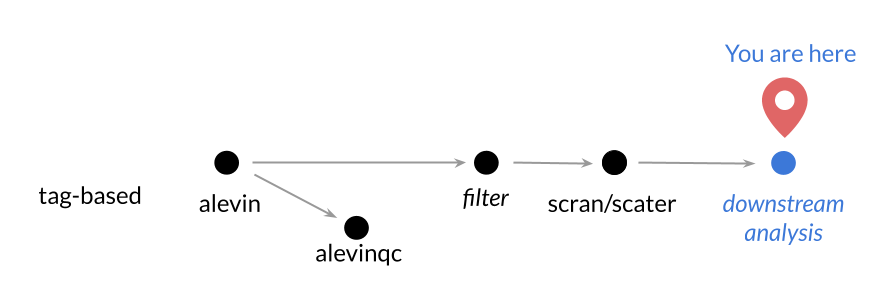

**CCDL 2019**

In this notebook, we'll use dimension reduction techniques on single-cell 
RNA-seq data. 

As compared to bulk RNA-seq data, single cell RNA-seq data generally has more 
dimensions, (since we have data points for each individual cell level rather 
than the tissue as a whole). 
Because of this, its common to use dimension reduction techniques so all of the
data is in a more easily manageable form for plotting, clustering, or other 
downstream analyses. 

## Set Up 

```{r}
# Load libraries
library(ggplot2)

# Magrittr pipe
`%>%` <- dplyr::`%>%`

# Setting the seed so our t-SNE is reproducible
set.seed(12345)
```

For this module, we are going to use the dataset that we processed part of in 
`02-tag-based_pre-processing_scRNA-seq.md`
We have already filtered and `scran` normalized this data for you (following 
the same steps we did in `01-normalizing_scRNA-seq.Rmd`, but using slightly 
different cutoffs).
We also randomly selected 500 cells, and are only using the top 95% 
highest average expression genes from these 500 cells.



## Directories and files

```{r}
# Directory where the gene matrix is 
gene_matrix_file <- file.path("data", "tabula_muris", "normalized", 
                              "scran_norm_tab_mur.tsv")

# Directory where the metadata file is 
metadata_file <- file.path("data", "tabula_muris", "normalized", 
                           "tab_mur_metadata.tsv")
```

## Import the gene matrix and metadata 

```{r Load in Tabula Muris Data}
# Read in normalized gene matrix
tab_mur_data <- readr::read_tsv(gene_matrix_file, progress = FALSE) 

# Read in associated metadata
tab_mur_meta <- readr::read_tsv(metadata_file, progress = FALSE)
```

## Principal Components Analysis

Just like we did with our other scRNA-seq data, we will also run PCA with this
dataset. 
Before we do that, we are going to go ahead and transpose our matrix, since 
we will need a sample x gene matrix for our dimension reduction in the 
following steps. 

```{r Transpose Data}
# Transpose our matrix
transposed_data <- t(tab_mur_data)
```

Now let's used the transposed data to obtain PCA scores for our samples.

```{r PCA}
# Run PCA
pca_tab_mur <- prcomp(transposed_data)

# Make a dataframe with these PCA scores
pca_tab_mur <- data.frame(pca_tab_mur$x[, 1:2],
                          tissue = as.factor(tab_mur_meta$tissue))
```

Let's plot our first two principal components and label our cells with what 
tissue they are from.

```{r Plot PCA}
# Plot this with ggplot2 and label the points with cell types
ggplot(pca_tab_mur, aes(x = PC1, y = PC2, color = tissue)) + 
  geom_point() +
  # Add this so our color palette is colorblindness friendly
  colorblindr::scale_color_OkabeIto()
```

## t-SNE experiment

t-SNE is a popular dimension reduction technique that has become even more 
popular with single-cell RNA-seq data analysis. 
It would be a good use of our time to explore t-SNE parameters and how they 
affect the outcomes.
First, let's run our data through t-SNE on default parameters and see what our 
data looks like with a `ggplot2` scatterplot.
Here we will be using the R package, `Rtsne` to perform t-SNE. 
Although packages like `scater` have built in methods for performing dimension
reduction (`scater::runTSNE`), we want to show you a method that can be applied 
to most any data so long as it is in a matrix.

```{r t-SNE}
# Run t-SNE using the Rtsne package
tsne_tab_mur <- Rtsne::Rtsne(transposed_data)

# Make this a data.frame so ggplot will like it
# Note that Y is the output coordinates from Rtsne
tsne_data <- data.frame(tsne_tab_mur$Y)
  
# Plot this with ggplot2
ggplot(tsne_data, aes(x = X1, y = X2)) + 
  geom_point() + 
  colorblindr::scale_color_OkabeIto()
```

#### Apply metadata labels to our t-SNE

Let's re-plot this with labels using some of our metadata to see 
how the cells are clustering (or not clustering) by different variables. 
Remember that `tab_mur_meta` has the corresponding information for each of our
cells. 
Below we have set up the cells to be colored by the `tissue` variable. 
Run this, but also feel free to look at what other information we have for these
cells in `tab_mur_meta` by using `str()` and change this to a different variable to 
graph it by.

```{r}
# Plot this with ggplot2, but add the color argument
ggplot(tsne_data, aes(x = X1, y = X2, color = tab_mur_meta$tissue)) + 
  geom_point() +
  colorblindr::scale_color_OkabeIto()
```

Now that we have an idea of what the default parameters look like, let's try
experimenting with the perplexity parameter. 
For us to determine a good number range to use for testing perplexity, let's 
first look up the documentation for `Rtsne::Rtsne` and find out what the 
default for the `perplexity` argument is. 

In order to prepare for this experiment, we will create a *function* that allows
us to rerun this same code chunk easily, but create an argument that allows us
to change one variable: our perplexity variable. 

```{r Make t-SNE plot function}
TsnePlotWrapper <- function(perplexity_param = 30) {
  # Purpose: Run t-SNE and plot the output
  # Args: perplexity_param: a single numeric argument that will change the 
  #                         perplexity variable in the Rtsne function. 
  # Output: a ggplot scatterplot with the two t-SNE coordinates plotted and 
  #         cell-types labeled with data point colors. 

  # Run t-SNE but set the perplexity parameter
  tsne_tab_mur <- Rtsne::Rtsne(transposed_data, perplexity = perplexity_param)

  # Make this a data.frame so ggplot will like it
  tsne <- data.frame(tsne_tab_mur$Y)
  
  # Plot this with ggplot2
  ggplot(tsne, aes(x = X1, y = X2, color = tab_mur_meta$tissue)) + 
    geom_point() + 
    colorblindr::scale_color_OkabeIto()
}
```

Fill in the next five code chunks with the function and the perplexity argument 
you would like to use for each. 
Then run the chunks and compare your output graphs.

```{r Run tSNE 1}
# We've set up the first example for you
TsnePlotWrapper(perplexity_param = 3)
```

```{r Run t-SNE 2}
# Run tSNE_plot_wrapper function for a second time, but use a different perplexity
# argument
```

```{r Run t-SNE 3}
# Run tSNE_plot_wrapper function for a third time, but use a different perplexity
# argument
```

```{r Run t-SNE 4}
# Run tSNE_plot_wrapper function for a fourth time, but use a different perplexity
# argument
```

```{r Run t-SNE 5}
# Run tSNE_plot_wrapper function for a fifth time, but use a different perplexity
# argument
```

#### Some 'big picture' thoughts to take from this experiment: 

1) Different analyses (such as t-SNE) have various limitations for interpretability.
   We found in our experiment that the coordinates of t-SNE output for any given 
   cell might change drastically, 
   This probably means that you shouldn't rely too heavily on the exact values of
   t-SNE's output. 
2) Different analyses also have their strengths.   
   Using cell-type labeling, our experiment illustrated that t-SNE does 
   appear to give some biologically relevant output information for this dataset. 
3) Playing with parameters so you can fine-tune them is a good way to give you more
   information about a particular analysis as well as the data itself. 
   
In summary, if the results of an analysis can be completely changed by changing its
parameters, you should be more cautious when it comes to the conclusions you
draw from it as well as having good rationale for he parameters you choose. 

### For further reading on dimension reduction:  

- [Wattenberg et al](](https://distill.pub/2016/misread-tsne/) discuss how to 
use t-SNE properly with great visuals.  
- [Nyguen & Holmes _PLoS Comput Biol_ 2019.](https://journals.plos.org/ploscompbiol/article/file?id=10.1371/journal.pcbi.1006907&type=printable)
lay out guidelines on choosing dimensions reduction methods.  
- [Becht et al _Nature Biotechnology_ 2018.](https://www.nature.com/articles/nbt.4314) discusses using [UMAP](https://github.com/lmcinnes/umap) for single-cell data  
- This website explains [PCA visually](http://setosa.io/ev/principal-component-analysis/)  
  
**Single-cell specific dimension reduction methods to consider:**  
- [VASC](https://www.sciencedirect.com/science/article/pii/S167202291830439X)  
- [scVI](https://scvi.readthedocs.io/en/master/readme.html)  

#### Print session info:

```{r}
sessionInfo()
```
