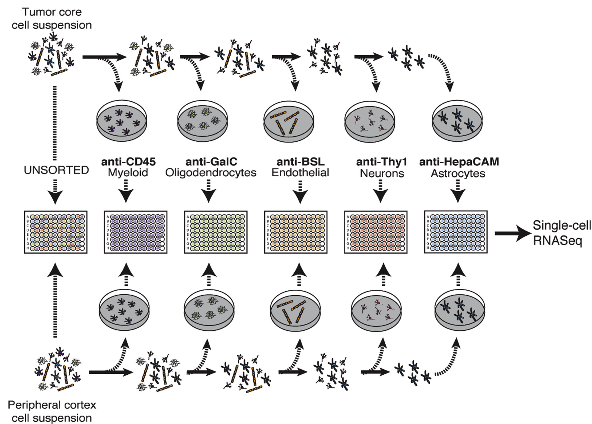

Our objective for this exercise is to investigate the expression of marker genes across cell types.
Here we consider *marker genes* to be genes considered by the field to be classic indicators of cell type.

These *marker genes* are the ones often used for FAC sorting, which is what was done in [Darmanis *et al.* (2017)](https://www.ncbi.nlm.nih.gov/pubmed/29091775)
We previously filtered and normalized these data in `01-filtering_scRNA-seq.Rmd` and `02-normalizing_scRNA-seq.Rmd`. 
Here's a figure from their paper to give you a very brief overview of their FAC sorting methodology. 
  


For more details on the methods, [see their manuscript.](https://www.ncbi.nlm.nih.gov/pubmed/29091775)
In short, this study splits cells from a glioblastoma tumor by their cell type based on their FAC sorting. 

The authors identified neoplastic cells using multiple analyses, including a high level of _SOX9_ expression. 
The neoplastic cells make up the vast majority of the tumor core. 
So by seeing what marker genes they express, we may get an initial, gene-by-gene idea of how these cells behave. 

After extracting the normalized data for our marker genes of interest, we will make a heatmap to compare the mean expression of the marker genes by cell type.
Then we will visualize the marker gene expression in reduced dimensions by creating a principal components scatterplot that color codes each cell by the expression level of a marker gene. 

## Setup 

Set the seed and load the libraries we need.

```{r setup}
# Set the seed
set.seed(1234)

# Load the pipe
library(magrittr)

# ggplot2 for plotting
library(ggplot2)
```

Use the template code chunk below to make a new directory where you can save plots (if it does not exist).

```{r plotdir}
plots_dir <- "plots"
if (!dir.exists(plots_dir)) {
  dir.create(plots_dir)
}
```

## Import and set up the data and metadata

Get the file path to the RDS file containing a normalized `SingleCellExperiment` object that we saved in `02-normalizing_scRNA-seq.Rmd`.

```{r sce_file}
# store the path in a variable named `sce_file` 
sce_file <- file.path("data", "glioblastoma", "normalized", 
                      "glioblastoma_sce.RDS")
```

Import the `SingleCellExperiment` object using `readr`'s function for reading RDS files. 
Remember to use  `::` to call any packages that you might use that you haven't imported.

```{r readrds, solution = TRUE}
# read the RDS file and save it in the variable `sce_norm`

```

Use the empty code chunk below to explore `sce_norm`.

```{r explore-sce, solution = TRUE}

```

Here we are extracting the gene names from `sce_norm`. 
We've done this step for you. 
Run the code chunk below and see what is in the `genes` object

```{r gene_names}
# Extract the gene names 
genes <- rownames(sce_norm)
```

Complete the following code chunk to extract the normalized gene matrix and save  it as a data.frame called `sce_norm_df`, where the first column is called "genes" and has the genes we extracted above.
Use the argument `stringsAsFactors = FALSE` in the creation of this data.frame. 
This makes it so that the variables aren't by default turned into factors. 

```{r make_df, solution = TRUE}
# Extract the normalized data as a data.frame and have a genes column

```

We stored the metadata inside the `SingleCellExperiment` object too, so let's get that out!
It is stored in the `colData`, and we will want to create a regular data frame from it

```{r metadata}
metadata <- as.data.frame(colData(sce_norm))
```

Use the code chunk below to investigate the variables in `metadata`.

```{r view_meta, eval = FALSE, solution = TRUE}

```

Now create a vector of just the cell types column, converting it to a `factor`.

```{r cell_types, solution = TRUE}
# Extract the cell type column and turn it into a factor

```

## What marker genes should we investigate across cell types?  

For this exercise, we want to analyze specific genes and their expression among the cell types in our dataset, so we made a list of genes below. 
We have already added _SOX9_ and _CD45_ as marker genes to investigate as controls, due to their use in the methods for FAC sorting. 
_MOG_ has been added as a different type of control: a gene that wasn't used for FACS, but is related to myelination, and thus the oligodendrocyte phenotype. 

Add other genes you are interested in to the gene list we started for you below. 
You can use  [GeneCard](https://www.genecards.org/.) to get information about your chosen gene. 

Note: In the pathway analysis module, we will show you how to convert Ensembl IDs to other kinds of gene IDs in a bulk fashion. 
However, for this exercise, we will only need a few genes and we've already set some up for you. 

Once you have chosen gene(s), and found their Ensembl IDs, add them to this data frame in the same format we have started for you by replacing our `<FILL_IN_THE_BLANKS>` in the example code block below.
You will then want to copy this code into the blank chunk immediately below it to run the chunk and create the `markers` data frame.

```
# Make a data frame that contains gene symbols and their associated Ensembl IDs
markers <- data.frame(symbols = c("SOX9", # 'Neoplastic' marker gene
                                  "CD45", # FACs marker for macrophages and microglia
                                  "MOG", # Myelination gene - Oliogodendrocytes
                                  <FILL_IN_THE_BLANKS>), # Add a gene or more here
                      ensembl = c("ENSG00000125398",
                                  "ENSG00000081237", 
                                  "ENSG00000204655",
                                  <FILL_IN_THE_BLANKS>), # Add the Ensembl IDs in the same order
                      stringsAsFactors = FALSE)
```

```{r, solution = TRUE}
# Make a data frame that contains gene symbols and their associated Ensembl IDs

```

Depending on the gene you chose, it may not be in our filtered matrix, so you 
may need to try a few. 
You can use an `%in%` operator to check if the gene you are looking for is in 
our filtered gene matrix (Remember it has to be an Ensembl gene ID e.g.`ENSG`,
and it needs to be in quotes).

```{r gene_check, solution = TRUE}
# Use the phrase below to find out if a gene you are interested in is in sce_norm_df

```

Use this code chunk to look at the `markers` data frame, and to check your work!

```{r peek_markers, solution = TRUE}

```

Let's build a chain of `dplyr` functions to create a `data.frame` with the data for our marker genes.
Use `dplyr::filter` to extract the marker genes from `sce_norm_df`.
Remember that each step in a `dplyr` chain of functions needs to be followed by the `%>%` operator and that we haven't loaded the `dplyr` library so use `::` as needed. 

```{r marker_data, solution = TRUE}
# Make a data frame named `marker_data` that contains  
# the expression data for genes in `markers` only

```

Let's change the Ensembl gene IDs to symbols since they are easier to read and make sense of.
First, we should check if the genes in `markers` and the genes in `marker_data` are in the same order.

```{r check_order}
all.equal(marker_data$genes, markers$ensembl)
```

Use `dplyr::arrange` to make it so your genes are in the same order in `markers` and `marker_data`.

```{r arrange_markers, solution = TRUE}
# Arrange markers in order by Ensembl ID

# Test if you made the genes in marker and marker_data in the same order

```

Now that your genes are in the correct order, assign the gene symbols from `markers` to the `rownames` in `marker_data`.

```{r symbol_rownames, solution = TRUE}
# Assign gene symbols to the rownames in marker_data

```

Let's build another chain of `dplyr` functions to further clean our `marker_data`. 

1) Get rid of the `genes` column since now we have stored that information as 
gene symbols in the rownames. 
2) transpose the data frame so we have the samples in rows and genes in columns
3) transposing will convert to a matrix, so make it back into a data frame
4) Add the `cell_type` vector as a new column.

```{r transpose_add_cell, solution = TRUE}

```

Use this chunk to check out your cleaned `marker_data`

```{r peek_markerdata, solution = TRUE}

```


## How does the mean expression of marker genes compare across cell types?

First we want to summarize the expression of each gene, separated by cell type.
We will use `dplyr` functions to calculate the means of these marker genes based on the cell-type labels. 
First we `group_by` the cell types, then use a `summarize` function to calculate the means.
Because we actually want the means for *every* column, we can use `summarize_all()`

For later use, we will want the `cell_types` as the row names, so we will add that conversion to our `dplyr` chain below.

```{r marker_means}
# Calculate the means based on the cell types
marker_means <- marker_data %>%
  dplyr::group_by(cell_types) %>%
  dplyr::summarize_all(mean) %>%
  tibble::column_to_rownames("cell_types") # we will want this out later
```

Next we will use `pheatmap::pheatmap` to make a heatmap of cell-type mean expression of these marker genes. 
Since we want the a heatmap with cell types as columns and genes as rows, we will transpose our data frame.
We have used the argument `scale = "row"` to normalize the data for display (feel free to see what happens without it!). 

```{r pheatmap}
## Plot the heatmap of all marker genes
pheatmap::pheatmap(t(marker_means), scale = "row")
```

What do you think? Do these results make sense?

If you'd like to make a more customizable heatmap, we recommend using the package `ComplexHeatmap`. 
They provide [excellent vignettes](https://jokergoo.github.io/ComplexHeatmap-reference/book/), but be warned, it can get tricky!

## How does marker gene expression relate to principal components analysis scores across different cell types? 

Another way to examine the relationship of marker genes and cell types is to make a PCA plot, as we did previously, but color the scatterplot points according to one of the marker gene's expression. 

Perform PCA on `sce_norm` using the `scater::calculatePCA()` function and convert the result to a `data.frame`.

```{r pca, solution = TRUE}
# Perform PCA on the samples of sce_norm

```

To ease plotting, combine the PCA results with the marker data that extracted previously.

To stitch these two data frames together row by row (combining columns for each row), we can use the `cbind()` function
Call this new data frame `pca_res_df`, and check that it has data for the PC values as well as cell type and marker gene expression values.

```{r bind_df, solution = TRUE}
# Make a dataframe that includes the cell type information,  
# PC scores, and the marker expression data

```

```{r peek_pca_res_df, solution = TRUE}
# Look at the pca_res_df

```


Use your `pca_res_df` to make a scatterplot of the PCA results, coloring cells by the expression of a marker gene of your choosing. 

```{r expression_plot, solution = TRUE}
# Plot expression of select genes over PCA results

```

Feel free to play around with aspects of this plot and see how the plot changes.
Look at [ggplot2's guide](https://ggplot2.tidyverse.org/) for more options than you can shake a stick at. 

When you are happy with your plot, save it to the plots directory.
```{r save_plot, solution = TRUE}

```


### Session info

```{r}
sessionInfo()
```
