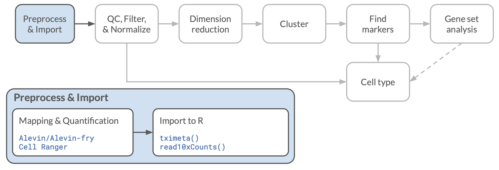
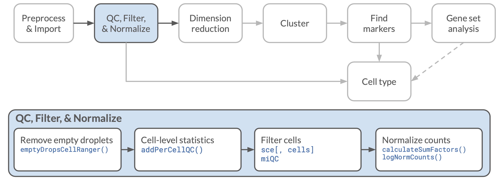
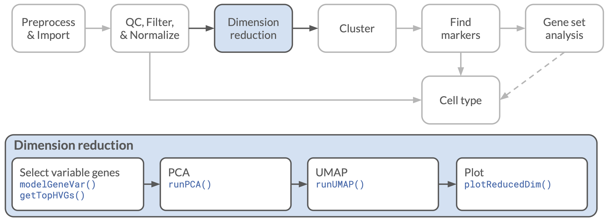

## Objectives

This notebook will demonstrate how to:

- Read Cell Ranger data into R
- Filter post-quantification cells using `emptyDropsCellRanger()`
- Apply dimensionality reduction methods to single cell data
- Visualize samples in reduced dimensional space

---

In this notebook, we'll try out some dimension reduction techniques on single-cell RNA-seq data.

Visualizing highly dimensional data is a common challenge in genomics, and especially with RNA-seq data.
The expression of every gene we look at is another dimension describing a sample.
When we also have hundreds or thousands of individual samples, as in the case of single-cell analysis, figuring out how to clearly display all of the data in a meaningful way is difficult.

A common practice is to common to use dimension reduction techniques so all of the data is in a more manageable form for plotting, clustering, and other downstream analyses.

## Set Up

```{r setup}
# Load libraries
library(ggplot2)
library(scater)
library(scran)

# Setting the seed for reproducibility
set.seed(12345)
```

### Directories and files

The data we will be using for this module comes from a a 10x Genomics data set of [expression data from a Hodgkin's Lymphoma tumor](https://support.10xgenomics.com/single-cell-gene-expression/datasets/4.0.0/Parent_NGSC3_DI_HodgkinsLymphoma).
The data was generated with the 10Xv3.1 chemistry, and processed with Cell Ranger and 10x Genomics standard pipeline.


There are a variety of files that you will often see as part of the standard output from Cell Ranger, which are described in detail in [10x Genomics documentation](https://support.10xgenomics.com/single-cell-gene-expression/software/pipelines/latest/output/overview).
We have included some of these in the `data/hodkins/cellranger` directory, including the `web_summary.html` file that includes some similar QC statistics to those we generated with `alevinQC`.
The main file we will be working with are the feature by barcode matrices.
Cell Ranger does some filtering on its own, but we will start with the raw data.

```{r filepaths}
# main data directory
data_dir <- file.path("data", "hodgkins")
# reference files
ref_dir <- file.path("data", "reference")

# Path to the Cell Ranger matrix
raw_matrix_dir <- file.path(data_dir, "cellranger",
                            "raw_feature_bc_matrix")

# Path to mitochondrial genes table
mito_file <- file.path(ref_dir, "hs_mitochondrial_genes.tsv")

# Directory and file to save output
normalized_dir <- file.path(data_dir, "normalized")
fs::dir_create(normalized_dir)

output_sce_file <- file.path(normalized_dir, "normalized_hodgkins_sce.rds")

```

## Reading Cell Ranger data

Cell Ranger output includes count data in two main formats.
The first is a folder with a feature list, a barcode list, and a sparse matrix in ["Matrix Exchange" format](https://math.nist.gov/MatrixMarket/formats.html).
The `DropletUtils::read10xCounts()` function takes this directory and reads in the data from these three files, assembling the `SingleCellExperiment` object we have worked with before.

Alternatively, we could use the `HDF5` format file that Cell Ranger outputs as a file with the `.h5` extension, which contains the same data.
For whatever reason, the way you read the data affects how it is stored in R.
Reading from the directory results in smaller objects in R, so that is what we will do here.

Cell Ranger also outputs both filtered and raw matrices; today we will start with the raw matrix and perform our own filtering.



```{r read10x, live = TRUE}
hodgkins_sce <- DropletUtils::read10xCounts(
  raw_matrix_dir, 
  col.names = TRUE # ensure barcodes are set as column names in the SCE object
)
```

How many potential cells are there here?

```{r cellcount, live = TRUE}
dim(hodgkins_sce)
```

That is a lot of cells!
In fact, it is really every possible barcode, whether there were reads associated with it or not.
We should probably do something about that.


## QC and normalization



### Basic QC stats

We will start by calculating the basic QC stats as we have done previously, adding those to our `SingleCellExperiment` object.

The first step again is reading in our table of mitochondrial genes and finding the ones that were quantified our data set.

```{r mitogenes}
mito_genes <- readr::read_tsv(mito_file) |>
  dplyr::filter(gene_id %in% rownames(hodgkins_sce)) |>
  dplyr::pull(gene_id)
```

Next we will calculate the QC stats that we used before.
Note that this is much slower than before, as we have many more genes in the unfiltered set!

```{r calculateQC}
hodgkins_sce <- scater::addPerCellQC(
  hodgkins_sce,
  subsets = list(mito = mito_genes))
```

We can now do the most basic level of filtering: getting rid of "cells" with no reads.

```{r remove_zero, live = TRUE}
hodgkins_sce <- hodgkins_sce[, hodgkins_sce$total > 0]
dim(hodgkins_sce)
```

### Filtering with `emptyDropsCellRanger()`

The `DropletUtils` package that we used to read in the 10x data has a number of other useful features.
One is the `emptyDropsCellRanger()` function, which uses the overall gene expression patterns in the sample to identify droplets that are likely to not contain an intact cell, but may simply have contained loose ambient RNA released during cell separation.
This method was originally developed by [Lun *et al.* (2019)](https://doi.org/10.1186/s13059-019-1662-y) and implemented as the function `emptyDrops()`, but has since been adapted as the main filtering method used by Cell Ranger. 
The `emptyDropsCellRanger()` function emulates the variant of this function that used by Cell Ranger, making the results more comparable between the two methods.

The Empty Drops method uses the droplets with very low UMI counts to estimate the "ambient" expression pattern of RNA content outside of cells.
It then scores the remaining cells based how much they deviate from that pattern, assigning a small P value when the droplet's expression deviates from the ambient expression pattern.
Because it uses the low UMI count droplets, this method should not be used when other filtering has already been performed (which is unfortunately the case with the version of `salmon alevin` we used).

This method seems to perform well to exclude false "cells" while retaining cells with distinct expression profiles but low counts that might have failed a simple cutoff.
Note that this method also requires that the data has already been quantified, with reads assigned to genes, as compared to a simple total UMI count filter which can be performed much earlier in the pipeline.

The `emptyDropsCellRanger()` function takes the `counts` matrix from our SingleCellExperiment, and returns a data frame with the statistics it calculates.
This will take a few minutes to run, but we can speed it up by allowing parallel processing.

```{r emptydrops, live = TRUE}
droplet_stats <- DropletUtils::emptyDropsCellRanger(
  counts(hodgkins_sce),
  BPPARAM = BiocParallel::MulticoreParam(4)) # use multiprocessing
```

We will use a false discovery rate (FDR) of 0.01 as our cutoff for "real" cells.
Since `emptyDropsCellRanger()` uses low count cells to estimate the "ambient" expression pattern, those cells are not assigned an FDR value, and have a value of NA.
These NAs can be a problem for filtering with a Boolean vector, as we did above, so instead we will use the `which()` function to get the *positions* of the cells that pass our filter and select the columns we want using that.

```{r filter_empty, live = TRUE}
cells_to_retain <- which(droplet_stats$FDR <= 0.01)

filtered_sce <- hodgkins_sce[, cells_to_retain]
dim(filtered_sce)
```

How does this compare to the number of cells in the Cell Ranger filtered data?
Looking the `web_summary.html` report from Cell Ranger, it seems that it would have kept 3,394 cells, so we seem to be getting broadly similar results.

### Checking mitochondrial content

While `emptyDropsCellRanger()` should have filtered out droplets containing no cells, it will not necessarily filter out damaged cells.
For that we will still want to look at mitochondrial content, as we did previously.
The statistics we calculated earlier with `addPerCellQC()` are retained in our new object, so we can plot those directly.

```{r mito_percent_plot}
# Plot the mitochondrial percents stored in `filtered_sce`
ggplot(mapping = aes(x = filtered_sce$subsets_mito_percent)) +
  geom_histogram(bins = 100)
```
There are certainly some cells with high mitochondrial percentages!
For now, we will use a cutoff of 20% to filter out the worst of the cells.

```{r live = TRUE}
filtered_sce <- filtered_sce[, filtered_sce$subsets_mito_percent < 20]
```


We can also filter by features (genes in our case) using `scater::addPerFeatureQC()` which will compute the number of samples where each gene is detected and the mean count across all genes.
We can then use those data (stored in `rowData`) to filter by row to only the genes that are detected in at least 5% of cells, and with a mean count > 0.1.

```{r gene_qc}
filtered_sce <- scater::addPerFeatureQC(filtered_sce)
detected <- rowData(filtered_sce)$detected > 5
expressed <- rowData(filtered_sce)$mean > 0.1

# filter the genes (rows) this time
filtered_sce <- filtered_sce[detected & expressed, ]
```

How many cells do we have now?

```{r filtered_dim}
dim(filtered_sce)
```


### Normalize

Now we will perform the same normalization steps we did in a previous dataset, using `scran::computeSumFactors()` and `scater::logNormCounts()`.
You might recall that there is a bit of randomness in some of these calculations, so we should be sure to have used `set.seed()` earlier in the notebook for reproducibility.

```{r sumfactors}
# Cluster similar cells
qclust <- scran::quickCluster(filtered_sce)

# Compute sum factors for each cell cluster grouping.
filtered_sce <- scran::computeSumFactors(filtered_sce, clusters = qclust, positive = FALSE)
```

It turns out in this case we end up with some negative size factors.
This is usually an indication that our filtering was not stringent enough, and there remain a number of cells or genes with nearly zero counts.
This probably happened when we removed the infrequently-expressed genes; cells which had high counts from those particular genes (and few others) could have had their total counts dramatically reduced.

To account for this, we will recalculate the per-cell stats and filter out low counts.
Unfortunately, to do this, we need to first remove the previously calculated statistics, which we will do by setting them to `NULL`.

```{r reQC}
# remove previous calculations
filtered_sce$sum <- NULL
filtered_sce$detected <- NULL
filtered_sce$total <- NULL
filtered_sce$subsets_mito_sum <- NULL
filtered_sce$subsets_mito_detected <- NULL
filtered_sce$subsets_mito_sum <- NULL

# recalculate cell stats
filtered_sce <- scater::addPerCellQC(filtered_sce, subsets = list(mito = mito_genes))

# print the number of cells with fewer than 500 UMIs
sum(filtered_sce$sum < 500)
```

Now we can filter again.
In this case, we will keep cells with at least 500 UMIs after removing the lowly expressed genes.
Then we will redo the size factor calculation, hopefully with no more warnings.


```{r refilter}
filtered_sce <- filtered_sce[, filtered_sce$sum >= 500]

qclust <- scran::quickCluster(filtered_sce)

filtered_sce <- scran::computeSumFactors(filtered_sce, clusters = qclust)
```

Looks good! Now we'll do the normalization.

```{r normalize}
# Normalize and log transform.
normalized_sce <- scater::logNormCounts(filtered_sce)
```

At this point, we have a few different versions of our `SingleCellExperiment` object.
The original (mostly) unfiltered version is in `hodgkins_sce`, the filtered version in `filtered_sce`, and the normalized version in `normalized_sce`.
We can clean those up a bit to save memory, keeping only the latest `normalized_sce` version, which now has two `assay`s:
`counts` with the raw data and `logcounts` with the normalized and transformed data.

```{r clean_up, live = TRUE}
assayNames(normalized_sce)
rm(hodgkins_sce, filtered_sce)
```


## Dimensionality reduction and display



### Principal Components Analysis

Principal component analysis (PCA) is a dimensionality reduction technique that allows us to identify the largest components of variation in a complex dataset.
Our expression data can be thought of as mapping each sample in a multidimensional space defined by the expression level of each gene.
The expression of many of those genes are correlated, so we can often get a better, simpler picture of the data by combining the information from those correlated genes.

PCA rotates and transforms this space so that each axis is now a combination of multiple correlated genes, ordered so the first axes capture the most variation from the data.
These new axes are the "principal components."
If we look at the first few components, we can often get a nice overview of relationships among the samples in the data.

#### Storing PCA results with the raw data

We will store the PCA results in our `SingleCellExperiment` object, as we will want to use them later.
To do this, we will use the `runPCA()` function from `scater`, which performs the PCA calculations and returns a new object with the results stored in the `reducedDim` slot.
If we wanted to, we could get the raw results as a matrix instead with `calculatePCA()` function, as we did in a previous notebook.

We will also use the `ntop` argument to calculate the PCA using 2000 genes with the highest variance.
The default is `ntop = 500`.

```{r runPCA, live = TRUE}
# calculate PCA using the top 2000 genes
normalized_sce <- runPCA(normalized_sce, ntop = 2000)
```

We can see what reduced dimensionality matrices are stored in the object with the `reducedDimNames()` function.

```{r reduced_dim_names, live = TRUE}
# print the reduced dimensionality tables available
reducedDimNames(normalized_sce)
```

To extract them by name, we use the `reducedDim()` function, much like the `assay()` function to extract original data.

```{r extract_reduced, live = TRUE}
# print the top corner of the PCA matrix
reducedDim(normalized_sce, "PCA")[1:10, 1:5]
```

#### Plotting PCA results

If we have the PCA results stored in the `SingleCellExperiment` object, we can use the `scater::plotReducedDim()` function to plot it with some nice defaults easily.
One nice thing about this function is that it uses `ggplot2` under the hood, so if we wanted to customize it later, we could.

```{r plotPCA, live = TRUE}
# plot PCA results
plotReducedDim(normalized_sce, "PCA")
```
PCA gives us a matrix with more than just two dimensions, and we might want to look at some higher dimensions too.
We can do that with the `ncomponents` argument.

```{r plotPCA34, live = TRUE}
# plot PC3 and PC4
plotReducedDim(normalized_sce, "PCA", ncomponents = c(3,4))
```

### Modeling variance

The variation in gene expression we see among cells comes from a combination of variation due to technical effects and the biology we really care about.
In order to roughly account for this we could just take the largest variance genes, on the assumption that low variance genes are mostly just noise.
This is the default approach that `runPCA()` and `calculatePCA()` take, using the genes with the greatest variance across cells to calculate the PCA matrix.

If we want to be a bit more careful about it, we can model the variance in expression of each gene as a function of the mean expression for that gene.
This is useful because we generally expect the variance to increase as mean expression increases, even if there is no biological signal in the expression variation.

We will do this modeling of variance by expression with the `scran::modelGeneVar()` function, saving the results to a new variable.

```{r model_variance}
gene_variance <- scran::modelGeneVar(normalized_sce)
```

Now let's plot the relationship between gene expression and variance we were discussing.
Here we will also add the fitting curve that `scran::modelGeneVar()` created, which is stored as function in the  `$trend` slot of the `gene_variance` object.
We can add a function like that curve to a `ggplot` with a `stat_function` layer.

```{r plot_variance}
ggplot(as.data.frame(gene_variance), aes(x = mean, y = total)) +
  geom_point(alpha = 0.1) +
  stat_function(fun = metadata(gene_variance)$trend, color = "blue") +
  labs(
    x = "Mean log-expression",
    y = "Variance") +
  theme_bw()
```

Now we can use `scran::getTopHVGs()` to select the genes that have the most biological variation (according to the model) and recalculate PCA scores using only those genes.
(In practice, we are selecting the genes with the largest residual variation after removing technical variation modeled by the mean/variance relationship.)

Here we are picking the 2000 top genes to match the number of genes from our earlier calculations.

```{r get_highvar, live = TRUE}
# select the most variable genes
highvar_genes <- scran::getTopHVGs(gene_variance, n = 2000)
# calculate a PCA matrix using those genes
normalized_sce <- runPCA(normalized_sce, subset_row = highvar_genes)
```

Now we can plot our new PCA values for comparison.
You might realize that our old PCA values were replaced when we ran `runPCA()` again, so we can't recreate the earlier plots at this stage of the notebook.
You will have to scroll up to your earlier plots to compare.

```{r plotPCA_highvar, live = TRUE}
# plot the new PCA results
plotReducedDim(normalized_sce, "PCA")
plotReducedDim(normalized_sce, "PCA", ncomponents = c(3,4))
```

### UMAP

**UMAP** (Uniform Manifold Approximation and Projection) is a machine learning technique designed to provide more detail in highly dimensional data than a typical principal components analysis.
While PCA assumes that the variation we care about has a particular distribution (normal, broadly speaking), UMAP allows more complicated distributions that it learns from the data.
The underlying mathematics are beyond me, but if you are more ambitious than I, you can look at the paper by [McInnes, Healy, & Melville (2018)](https://arxiv.org/abs/1802.03426).
The main advantage of this change in underlying assumptions is that UMAP can do a better job separating clusters, especially when some of those clusters may be more similar to each other than others.

Another dimensionality reduction technique that you may have heard of is **t-SNE** (t-distributed Stochastic Neighbor Embedding), which has similar properties to UMAP, and often produces similar results.
There is some ongoing debate about which of these two techniques is superior, and whether the differences are due to the underlying algorithm or to implementation and parameter initialization defaults.
Regardless of why, in our experience, UMAP seems to produce slightly better results and run a bit faster, but the differences can be subtle.

#### Default parameters

For ease of use with this data, we will be using the `scater::calculateUMAP()` and `scater::runUMAP()` function to apply UMAP to our single cell data, but similar functions the `uwot` package (notably `uwot::umap()`) can be used to apply UMAP to any numerical matrix.

UMAP can be slow for a large data set with lots of parameters.
It is worth noting that the `scater::calculateUMAP()` implementation actually does PCA first, and then runs UMAP on the top 50 PCs.
If we have already calculated PCA (as we have) we can tell it to use those results with the `dimred` argument.

As with PCA, there are two functions we could use:
`scater::calculateUMAP()` will return a matrix of results, with one row for each sample, and a column for each of the UMAP dimensions returned.
`scater::runUMAP()` performs the same function, but returns the results in a SingleCellExperiment object.

Let's see how it looks with the (mostly) default parameters:

```{r calculate_umap, live = TRUE}
# Run UMAP
normalized_sce <- runUMAP(normalized_sce,
                          dimred = "PCA") # use already stored PCA results
```

Now we can plot with the same `plotReducedDim()` function, specifying we want to plot the UMAP results this time.
We will also add some color this time with the `color_by` argument, using the number of genes detected in each cell to assign a hue.

```{r plot_umap, live = TRUE}
# make a UMAP plot with `plotReducedDim()`
plotReducedDim(normalized_sce, "UMAP", color_by = "detected")
```

There is clearly a lot of structure in there, but is it meaningful?
Do the clusters we see differentiate cell types? How should we divide them up?

We will come back to this question later!

### UMAP experiments

Now that we have an idea of what a UMAP plot with the default parameters looks like, let's try experimenting with the `n_neighbors` parameter.
First, we should see what this parameter is, and what the default value is.
In the console, run `?scater::calculateUMAP` to see what this (and other parameters) are.
For even more parameters, you can look at the underlying implementation code that `calculateUMAP()` uses, which is the function `uwot::umap()`

In order to make our experimentation easier, we will create a *function* that allows us to rerun the same code easily, but create an argument that allows us to change one variable: the `n_neighbors` variable.
Here we are saving only a line of code, but we could apply this to a much more complex series of operations if we wanted to!

```{r UMAP-function}
UMAP_plot_wrapper <- function(sce = normalized_sce, nn_param = 15) {
  # Purpose: Run UMAP and plot the output
  # Arguments: 
  # - sce: A normalized SCE object
  # - nn_param: a single numeric argument that will change the
  #             n_neighbors variable in the calculateUMAP() function.
  # Output: a scatterplot with the two UMAP coordinates plotted and
  #         cell-types labeled with data point colors.

  # Run UMAP with a specified n_neighbors parameter
  sce_umap <- scater::runUMAP(sce, dimred = "PCA", n_neighbors = nn_param)
  scater::plotReducedDim(sce_umap, "UMAP", color_by = "detected") +
    # make the legend label more informative (this is ggplot2 code!)
    guides(color = guide_colorbar(title="genes\nexpressed"))
}
```

Let's make sure that works and gives the same result as before when we use the default parameters.

```{r function-test}
UMAP_plot_wrapper(nn_param = 15)
```

*Kind of?*

This isn't your fault!
UMAP is a non-deterministic function, which means that there is a random component to the results.
We can use `set.seed()` to be sure that an individual run (or set of runs) is the same every time you run your analysis, but it is important to check your results a few times with different random starting points to be sure that the random component is not giving you anomalous results.
Setting a different random number seed with `set.seed()` is one way to do this, or you can run the analysis multiple times in the same session, as we have done here.

Fill in the next few code chunks with the function and the `n_neighbors` argument you would like to use for each.
(Feel free to add more tests!)
Then run the chunks and compare your output graphs.

```{r run-UMAP-1, live = TRUE}
# Try something low?
UMAP_plot_wrapper(nn_param = 3)
```

```{r run-UMAP-2, live = TRUE}
# Try something high?
UMAP_plot_wrapper(nn_param = 100)
```

```{r run-UMAP-3, live = TRUE}
# Try whatever you like!
UMAP_plot_wrapper(nn_param = 5)
```

#### Some 'big picture' thoughts to take from this experiment:

1. Analyses such as UMAP have various limitations for interpretability.
The coordinates of UMAP output for any given cell can change dramatically depending on parameters, and even run to run with the same parameters.
This probably means that you shouldn't rely on the exact values of UMAP's output.

    - One particular limitation of UMAP (and t-SNE) is that while observed clusters have some meaning, the distance *between* clusters usually does not (nor does cluster density).
    The fact that two clusters are near each other should NOT be interpreted to mean that they are more related to each other than to more distant clusters.
    (There is some disagreement about whether UMAP distances have more meaning, but it is probably safer to assume they don't.)


2. Playing with parameters so you can fine-tune them is a good way to give you more information about a particular analysis as well as the data itself.

3. Where results are consistent, they are more likely to have meaning.
While we do not have labeled cell types in this case, there does seem to be some consistency of the overall patterns that we see (if not precise values), and this likely reflects biological information (or technical artifacts).

In summary, if the results of an analysis can be completely changed by changing its parameters, you should be more cautious when it comes to the conclusions you draw from it as well as having good rationale for the parameters you choose.

### t-SNE comparison

In the block below is a similar analysis and plot with t-SNE (t-distributed Stochastic Neighbor Embedding).
Note that this analysis also uses PCA before moving on to the fancy machine learning.

```{r tsne, live = TRUE}
# Run TSNE
normalized_sce <- runTSNE(normalized_sce, dimred = "PCA")

# plot with scater function
plotReducedDim(normalized_sce, "TSNE", color_by = "detected")
```

Different! (Slower!) Is it better or worse? Hard to say!
Different people like different things, and one plot might illustrate a particular point better than another.

## Save results

We are going to use this data more in the next notebook, so let's save it as an `RDS` file.

```{r save}
readr::write_rds(normalized_sce, file = output_sce_file)
```


### Some further reading on dimension reduction:

- This website explains [PCA visually](http://setosa.io/ev/principal-component-analysis/).
- [Becht *et al.* (2018)](https://www.nature.com/articles/nbt.4314) discusses using [UMAP](https://github.com/lmcinnes/umap) for single-cell data.
- [Wattenberg *et al.* (2016)](https://distill.pub/2016/misread-tsne/) discuss how to use t-SNE properly with great visuals.
(The lessons apply to UMAP as well, with a broad substitution of the `n_neighbors` parameter for `perplexity`.)
- [Nguyen & Holmes (2019)](https://journals.plos.org/ploscompbiol/article?id=10.1371/journal.pcbi.1006907) lay out guidelines on choosing dimensions reduction methods.
- [Freitag (2019)](https://rpubs.com/Saskia/520216) is a nice explanation and comparison of many different dimensionality reduction techniques that you may encounter.


## Session Info

```{r session}
sessionInfo()
```
