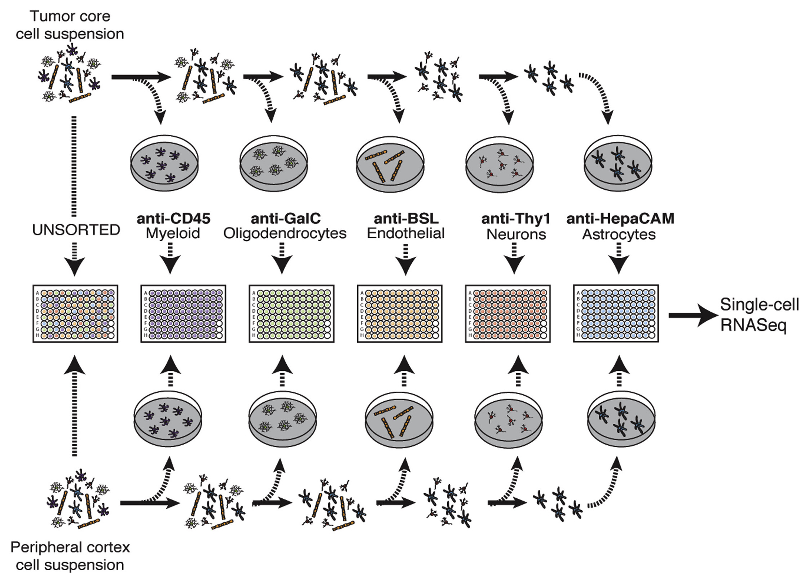
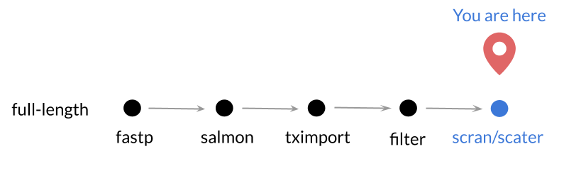

Our objective for this exercise is to investigate the expression of marker genes
across cell types.
Here we consider *marker genes* to be genes considered by the field to be 
classic indicators of cell type.

These *marker genes* are the ones often used for FAC sorting, which is what
was done in [Darmanis et al. _Cell Reports._ 2017.](https://www.ncbi.nlm.nih.gov/pubmed/29091775)
We previously normalized and filtered these data in `01-normalizing_scRNA`. 
Here's a figure from their paper to give you a very brief overview of their 
FAC sorting methodology. 
  


For more details on the methods, [see their manuscript.](https://www.ncbi.nlm.nih.gov/pubmed/29091775)
But, in short, this study splits cells from a glioblastoma tumor by their 
cell-type based on their FAC sorting. 

The authors identified neoplastic cells using multiple analyses, including a
high level of _SOX9_ expression. 
The neoplastic cells make up the vast majority of the tumor core. 
So by seeing what marker genes they express, we may get an initial, gene-by-gene
idea of how these cells behave. 

After extracting the normalized data for our marker genes of interest, we will 
make a heatmap to compare the mean expression of the marker genes by cell type.
Then we will visualize the marker gene expression in reduced dimensions by 
creating a principal components scatterplot that color codes each cell by the 
expression level of a marker gene. 

## Setup 

We'll be using the `%>%` operator (pipe) and we will need to set the seed so our 
results are reproducible.

```{r}
# Set the seed
set.seed(1234)

# Load the pipe
`%>%` <- dplyr::`%>%`
```

Use the template code chunk below to make a new directory where you can save plots.

```{r}
plots_dir <- <DIRECTORY_NAME>
if (!dir.exists(<FILL_IN_THE_BLANK>)) {
  dir.create(<FILL_IN_THE_BLANK>)
}
```

## Import and set up the data and metadata

Use `readr`'s function for reading RDS files. 
Import the `SingleCellExperiment` object that we stored in "sce_norm.RDS" in the
`data/glioblastoma/normalized/` folder in `01-normalizing_scRNA-seq`. 



Remember to use `file.path` and `::` to call any packages that you might use that
you haven't imported.

```{r}
sce_norm <- 
```

Use the empty code chunk below to explore `sce_norm`.

```{r}

```

Here we are extracting the gene names from `sce_norm`. 
We've done this step for you. 
Run the code chunk below and see what `genes` object gives you.

```{r}
# Extract the gene names 
genes <- rowData(sce_norm)$value
```

Complete the following code chunk to extract the normalized gene matrix and save 
it as a data.frame called `sce_norm_df`, where the first column is called 
"genes" and has the genes we extracted above.
Use the argument `stringsAsFactors = FALSE` in the creation of this data.frame.
This makes it so that the variables aren't by default turned into factors. 

```{r}
# Extract the normalized data as a data.frame and have a genes column
sce_norm_df <- 
```

Load the metadata that we saved in a TSV file called "gbm_filtered_metadata.tsv" 
in the "data" folder in `01-normalizing_scRNA-seq`.

```{r}
metadata <- 
```

Complete the code chunk below to investigate the variables in `metadata`.
Then extract the cell-type labels as their own object, made into a `factor`,
named `cell_types`.

```{r}
cell_types <- 
```

## What marker genes should we investigate across cell types?  

For this exercise, we want to analyze specific genes and their expression among 
the cell types in our dataset. 
We have already added _SOX9_ and _CD45_ as marker genes to investigate as 
controls, due to their use in the methods for FAC sorting. 
_MOG_ has been added as a different type of control: a gene that wasn't used for
FACS, but is related to myelination, and thus the oligodendrocyte phenotype. 

Add other genes you are interested in to the gene list we started for you below. 
You can use  [GeneCard](https://www.genecards.org/.) to get information about 
your chosen gene. 
Then add your chosen gene to this data.frame in the same format we have started 
for you by replacing our `<FILL_IN_THE_BLANKS>`. 

Note: In the machine-learning module notebook `01-medulloblastoma_data_prep`, we
will show you how to convert Ensembl IDs to other kinds of gene IDs in a bulk
fashion. 
However, for this exercise, we will only need a few genes and we've already set 
some up for you. 

```{r}
# Make a data.frame that contains gene symbols and their associated Ensembl IDs
markers <- data.frame(symbols = c("SOX9", # 'Neoplastic' marker gene
                                  "CD45", # FACs marker for macrophages and microglia
                                  "MOG", # Myelination gene - Oliogodendrocytes
                                  <GENE_SYMBOL>), # Add your own gene
                      ensembl = c("ENSG00000125398",
                                  "ENSG00000081237", 
                                  "ENSG00000204655",
                                  <ENSEMBL_GENE_ID>, stringsAsFactors = FALSE)
```

Depending on the gene you chose, it may not be in our filtered matrix, so you 
may need to try a few. 
You can use an `%in%` operator to check if the gene you are looking for is in 
our filtered gene matrix (Remember it has to be an Ensembl gene ID e.g.`ENSG`,
and it needs to be in quotes).

```{r}
# Use the phrase below to find out if a gene you are interested in is in sce_norm_df
<ENSEMBL_GENE_ID> %in% sce_norm_df$genes
```

Use this code chunk to look at what `markers` looks like.

```{r}

```

Let's build a chain of `dplyr` functions to create a `data.frame` with the data 
for our marker genes.
Use `dplyr::filter` to extract the marker genes from `sce_norm_df`.
Remember that each step in a `dplyr` chain of functions needs to be followed by 
the `%>%` operator and that we haven't loaded the `dplyr` library so use the 
`::` if needed.

```{r}
# Make a data.frame with the genes in `markers` only
marker_data <- 
```

Let's change the Ensembl gene IDs to symbols since they are easier to read and 
make sense of.
First, we should check if the genes in `marker` and the genes in `marker_data`
are in the same order.

```{r}
all.equal(marker_data$genes, markers$ensembl)
```

Use `dplyr::arrange` to make it so your genes are in the same order in `markers`
and `marker_data`.

```{r}
# Use this line to arrange markers in order by Ensembl ID

# Test if you made the genes in marker and marker_data in the same order
all.equal(marker_data$genes, markers$ensembl)
```

Now that your genes are in the correct order, assign the gene symbols from 
`markers` to the `rownames` in `marker_data`.

```{r}
# Assign gene symbols to the rownames in marker_data
rownames(marker_data) <-
```

Let's build another chain of `dplyr` functions to further clean our `marker_data`. 

1) Get rid of the `genes` column since now we have stored that information as 
gene symbols in the rownames. 

2) Add the `cell_type` vector as a new column. Note that we will need to 
transpose the data so our dimensions match.

```{r}
marker_data <- 
  # Use this line  to remove the `genes` column

  # Use this line to transpose this data

  # We've done this step of turning the matrix back into a data.frame after we 
  # transposed
  as.data.frame() %>%  
  # Use this line to add a column with the information in `cell_types`

```

Use this chunk to check out your cleaned `marker_data`

```{r}

```

\*Note that this is just one way to do it. 

## How does the mean expression of marker genes compare across cell types?

Let's build a chain of `dplyr` functions to calculate the means of these marker 
genes based on the cell-type labels. 

```{r}
# Build a pipe to calculate the mean expressions within each cell type
marker_means <- marker_data %>%
  # Use this line for a dplyr function to group the data by their cell types 

  # Use this line for a dplyr function to summarize to a mean

  # Use the tibble::column_to_rownames to hide the cell-type column

```

Use `pheatmap::pheatmap` to make a heatmap of cell-type mean expression of these
marker genes. 
Make the heatmap so that the cell types are columns and the genes are rows. 
Also use the argument `scale = "row"`. 

```{r}
# Make a heatmap of gene expression means and cell types

```

What do you think? Do these results make sense?

If you'd like to make a more customizable heatmap, we recommend using the 
package `ComplexHeatmap`. 
They provide [excellent vignettes](https://jokergoo.github.io/ComplexHeatmap-reference/book/).

## How does marker gene expression relate to principal components analysis scores across different cell types? 

Another way to examine the relationship of marker genes and cell types is to 
make a PCA plot, like we did previously, but color the scatterplot points 
according to one of the marker gene's expression. 

Perform PCA on `sce_norm_df` by using the `prcomp` function (hints: you will need 
to transpose the data and tell R to ignore the gene column - try a negative index). 

```{r}
# Perform PCA on the samples of sce_norm_df
pca_res <-
```

Use the following code chunk to inspect your `pca_res` object with your PCA 
results. 
Remember that `x` labeled entry in this object contains the cells' PCA scores. 
Do the number of scores you have correspond to the number of cells you have?
You can use this chunk to check. 

```{r}

```

Make the PCA results into a data.frame that is more easily used by `ggplot2`. 
This data.frame should include the cell-type information, the first two PC scores, 
and `marker_data`. 
Call this data.frame `pca_res_df`.

```{r}
# Make a dataframe that includes the cell-type information, the first two PC scores, 
# and `marker_data`
pca_res_df <- 
```

Use your `pca_res_df` to make a scatterplot of the PCA results, coloring cells
by the expression of a marker gene, of your choosing. 
Mark your cell types by making the points different shapes.
We've given you a template below with <FILL_IN_THE_BLANKS>. 

```{r}
# Plot expression of select genes on PCA
# Fill in the blanks on this template ggplot
ggplot2::ggplot(<DATA_FRAME>, # What data.frame should be here?
                ggplot2::aes(x = <X_DATA>, # What do we want plotted on the X-axis? 
                             y = <Y_DATA>, # What do we want plotted on the Y-axis?
                             color = <GENE_ID>, # What do we want to color the points by?
                             shape = <CELL_TYPE>)) + # What do we want to designate
                                                     # the shapes of the points by?
  # Use this line to specify that we want a scatterplot

  ggplot2::scale_shape_manual(values = c(4, 8, 15, 16, 17, 18, 21)) # Since we 
  # have more than 6 cell types we have to specify the shapes with this step

  # Use this line to add a title for this graph

```

After you have successfully made this plot, repeat this `ggplot` template for 
the other genes in your marker list. 
Make more code chunks as you need them.

Feel free to play around with aspects of this plot and see how the plot changes.
Look at [ggplot2's guide](https://ggplot2.tidyverse.org/) for a list of the 
options. 

```{r}

```

### Advanced topic assignment: 
Make the [ggplot2](https://ggplot2.tidyverse.org/) code chunk you've used above 
into its own function so you could apply it more easily. See [this tutorial](https://swcarpentry.github.io/r-novice-inflammation/02-func-R/) 
on making functions in R for more guidance.  

### Session info

```{r}
sessionInfo()
```
