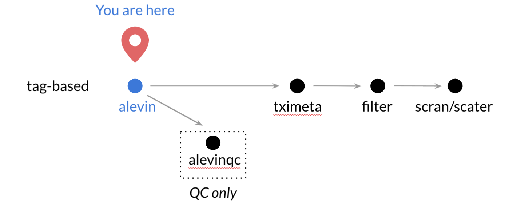

**CCDL 2019**

In this notebook, we will be running through the basics of processing raw single-cell RNA-seq data.

We will be using a tag-based scRNA-seq sample from the [*Tabula Muris* project](https://www.nature.com/articles/s41586-018-0590-4).
This dataset is made of 20 mouse organs that were sequenced using 10X Genomics Chromium single cell sequencing methods.
For 10X Genomics scRNA-seq data, cells are separated by emulsion/droplets, and individual  cells are given barcodes (often abbreviated 'CB' in documentation).
These data also have [Unique Molecular Identifiers (UMIs)](http://www.nature.com/doifinder/10.1038/nmeth.2772) which allow us to examine PCR amplification errors and biases.

**Relative workflow for tag-based data**


## Step 0: About the data

We obtained these data from Tabula Muris project's [Figshare](https://figshare.com/projects/Tabula_Muris_Transcriptomic_characterization_of_20_organs_and_tissues_from_Mus_musculus_at_single_cell_resolution/27733).
The bam files that were on Figshare were converted to `fastq` files using
[`bamtofastq`](https://support.10xgenomics.com/docs/bamtofastq) from 10X Genomics.
We will process a `fastq` file from mouse bladder for this as an example.  
To limit the amount of time this takes to run in the context of this workshop,
we are only running part of the sample's reads.

*Note*: depending on the state of the data you are working with, ie. if you have
a `.bcl` file, you will need to use [`cellranger mkfastq`](https://support.10xgenomics.com/single-cell-gene-expression/software/pipelines/latest/using/mkfastq) to make fastq files from this.
However, most public data is available in `fastq` format, so that is where we will start.


## Step 1: Checking your directories

If you have opened the `scRNA-seq.Rproj` file, your Terminal should already be set to the `scRNA-seq` directory, but it is worth checking with the `pwd` command in the Terminal 
(or by looking at the path shown in the command prompt or at the top of the Terminal pane). 
If you are in a different directory, we will want to use `cd` to change to the correct directory. 

Once you are there, you should be able to run the following command in the Terminal to look at the contents of the `data/tabula-muris` directory:

```
ls data/tabula-muris
```

Here you will see the `fastq-raw` directory, which is a actually link to a shared folder with the raw fastq files, split by sample.
We will use these files, but we will not write to this directory. 

You will also see the file `TM_droplet_metadata.csv`, which contains metadata for the *Tabula Muris* experiments.

## Step 2: Set up your output directory

Now that we are in `scRNA-seq`, we'll make a directory for us to store our quantification files in.
In `Terminal`, run the following command:

```
mkdir -p data/tabula-muris/alevin-quant/10X_P4_3
```

In this scenario, `10X_P4_3` refers to the sample name that we will be processing this time.

## Step 3: Index the mouse transcriptome with Salmon

Before you can quantify with Salmon and [Alevin](https://genomebiology.biomedcentral.com/articles/10.1186/s13059-019-1670-y) we need our species' [transcriptome to be indexed](https://github.com/AlexsLemonade/training-txome-prep), just was we did with bulk RNA-seq. 

You can use the same transcriptome indexes as bulk RNA-seq, however, due to the shorter read lengths in the 10X sequencing, we will want to use shorter kmers than the default.
In this instance, we used a `-k` of 23.

In the interest of time, we have already run the command below and have the index built and ready for you in a shared directory.

But for your own reference, here is how you might do it yourself:
```
# salmon --threads=16 --no-version-check index \
#  -t Mus_musculus.GRCm38.cdna.all.fa.gz \
#  -i index/Mus_musculus/short_index \
#  -k 23
```

## Step 4: For each sample, run [Alevin](https://genomebiology.biomedcentral.com/articles/10.1186/s13059-019-1670-y) for quantification

From the command line, running Alevin is not too much different from running
Salmon for bulk RNA-seq.

### Running Salmon Alevin

Copy and paste this in your `Terminal` to run the Alevin quantification.
This will take about 20 minutes to run, so we will start now, then talk about the options.

```
salmon alevin -l ISR \
  -i /shared/data/reference/refgenie/mm10_cdna/salmon_index/short/short/ \
  -1 data/tabula-muris/fastq-raw/10X_P4_3/10X_P4_3_L001_R1_001.fastq.gz \
  -2 data/tabula-muris/fastq-raw/10X_P4_3/10X_P4_3_L001_R2_001.fastq.gz \
  --chromium  \
  -p 5 \
  -o data/tabula-muris/alevin-quant/10X_P4_3 \
  --tgMap data/tabula-muris/mm_ensdb95_tx2gene.tsv \
  --dumpFeatures
```

### Salmon/Alevin Options

You'll recognize a lot of these options as the same as regular `Salmon` such as
- `-l` to designate library type
- `-1` and `-2` for file input
- `-o` to designate a folder for output

Notation for these 10X files is:
- `R1` files contain the barcodes for cells as well as the UMIs
- `R2` files contain the full reads for that sample.  

#### `-l`
As mentioned, `-l` is for designating library type. For all single-cell quant,
you will want to use the `ISR` library type.
See [Salmon's documentation](https://salmon.readthedocs.io/en/latest/library_type.html) for more information on fragment library types.

#### `--chromium`
Because we are using 10X chromium data, we have to use this flag. 
However, Drop-seq data is also supported, and in this case you would use a `--dropseq` flag instead of this.

#### `--tgMap`
This is needed to supply a transcript to gene key that Alevin will use to quantify the genes.
For our example, we've pre-made the file `Mus_musculus.GRCm38_tx2gene.tsv` from the Ensembl transcriptome that we indexed above. 
The file has to be a tsv file.


#### `--dumpFeatures`
This option will print out information that we will need for quality checks
later on, including files with information on the UMIs and cell barcodes.

See the [Alevin documentation](https://salmon.readthedocs.io/en/latest/alevin.html) for a complete list of the Alevin options.
There are also a number of example analyses at the [Alevin tutorial](https://combine-lab.github.io/alevin-tutorial/#blog) website.


### Note: Running the FULL sample.

Sequencing runs are often split into multiple `fastq` files, both when a sample was run across multiple lanes and to keep the individual file sizes down. 
This was the case for the *Tabula Muris* data we used here as well. If you look in the `data/tabula-muris/fastq-raw/10X_P4_3` directory, you will see the following files, representing 2 lanes, with three R1 and three R2 files per lane:

```
10X_P4_3_L001_R1_001.fastq.gz  10X_P4_3_L002_R1_001.fastq.gz
10X_P4_3_L001_R1_002.fastq.gz  10X_P4_3_L002_R1_002.fastq.gz
10X_P4_3_L001_R1_003.fastq.gz  10X_P4_3_L002_R1_003.fastq.gz
10X_P4_3_L001_R2_001.fastq.gz  10X_P4_3_L002_R2_001.fastq.gz
10X_P4_3_L001_R2_002.fastq.gz  10X_P4_3_L002_R2_002.fastq.gz
10X_P4_3_L001_R2_003.fastq.gz  10X_P4_3_L002_R2_003.fastq.gz
```

We should really run all of these through Salmon, though that will take ~six times as long as the single pair of reads we used. 
To do this, we could list each R1 and R2 file (space separated) after the `-1` and `-2` arguments, respectively.
But that is a lot of typing, so a nice shortcut is to use a `*` character to represent a wildcard that will be filled in with whatever characters are present in the files at the given path.
In the pattern `10X_P4_3_L*_R1_*.fastq.gz`, this would allow any lane number and any subset, so would match all of the following files (all the R1 files in this case):

```
10X_P4_3_L001_R1_001.fastq.gz  10X_P4_3_L002_R1_001.fastq.gz
10X_P4_3_L001_R1_002.fastq.gz  10X_P4_3_L002_R1_002.fastq.gz
10X_P4_3_L001_R1_003.fastq.gz  10X_P4_3_L002_R1_003.fastq.gz
```

For this directory, that would look make our full `salmon alevin` command look like this (don't run this now!):

```
salmon alevin -l ISR \
  -i /shared/data/reference/refgenie/mm10_cdna/salmon_index/short/short/ \
  -1 data/tabula-muris/fastq-raw/10X_P4_3/10X_P4_3_L*_R1_*.fastq.gz \
  -2 data/tabula-muris/fastq-raw/10X_P4_3/10X_P4_3_L*_R2_*.fastq.gz \
  --chromium  \
  -p 4 \
  -o data/tabula-muris/alevin-quant/10X_P4_3_full \
  --tgMap data/tabula-muris/mm_ensdb95_tx2gene.tsv \
  --dumpFeatures
```

In general, you will want to run all lanes and all files for a given sample together.
But DO NOT want to combine multiple samples into a single `alevin` quantification!

## Step 6: Perform QC checks with `alevinQC`

Now that we have quantified our data with Alevin, we are ready to perform
quality control checks.


In order to perform quality control checks, we'll use the `alevinQC` R package.
Note that `alevinQC` depends on files that we get using the`--dumpFeatures`
option in Alevin.

About the `alevinQCReport` function:
The first argument needs to be where the sample's output data was put when
Alevin was run (as a character string, aka using quotes)
The rest of `alevinQCReport`'s arguments tell R where to put the output QC
report also using `characters`.

```{r}
# Produce a QC report
alevinQC::alevinQCReport("data/tabula-muris/alevin-quant/10X_P4_3",
                         sampleId = "10X_P4_3",
                         outputFile = "10X_P4_3_qc_report.html",
                         outputDir = "qc-reports")
```

Check out `data/tabula_muris/qc_reports/10X_P4_3_subset_qc_report.html`
in order to examine the quality of your data and performance of Alevin.


This is an example of [a poor quality sample alevinQC report](https://alexslemonade.github.io/training-modules/scRNA-seq/data/tabula_muris/qc_reports/Bad_Example_10X_P4_2_qc_report.html).

## Step 7: Loading Alevin output into R

After we have successfully quantified our tag-based scRNA-seq data (and optionally done some QC), we will want to read it into R to start to analyze it.

Doing this is similar to what we have done before, using our old friend `tximport`. 
First we will set up the paths to the directory we created, and to the relevant file that `tximport` needs within that directory, which is called `quants_mat.gz`.
It is located in the `alevin` subdirectory of the output directory.

```{r files}
# the directory we created for alevin output
quant_dir <- file.path("data", "tabula-muris","alevin-quant", "10X_P4_3")
# the quant matrix file
quant_file <- file.path(quant_dir, "alevin", "quants_mat.gz")
```

Now we can read in the data with `tximport`, specifying the type as `"alevin"`.

```{r tximport}
txi <- tximport::tximport(quant_file, type = "alevin")
```

Now we can make the imported count matrix into a SingleCellExperiment for downstream processing, if we like.

```{r SingleCell}
sce <- SingleCellExperiment::SingleCellExperiment(list(counts = txi$counts))
```


## Session Info

```{r sessioninfo}
sessionInfo()
```


