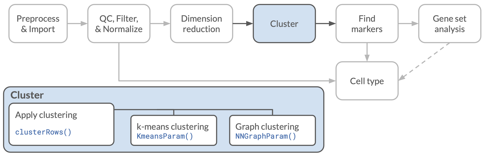
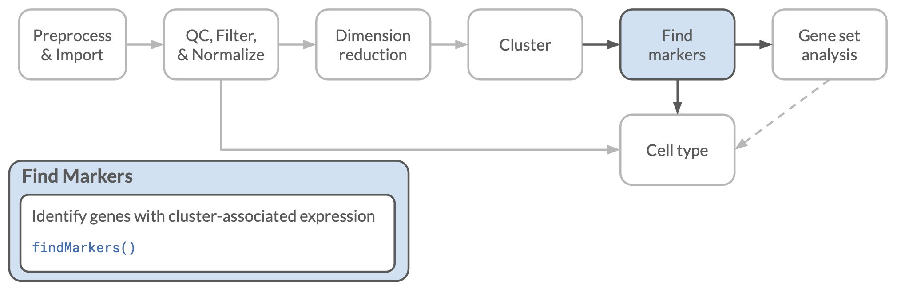

## Objectives

This notebook will demonstrate how to:

- Identify clusters of cells in single-cell data
- Compare results from different clustering methods
- Select putative marker genes that can be used to differentiate clusters

---

## Set Up

### Load libraries
```{r setup}
# Load libraries
library(ggplot2)
library(scater)
library(scran)

# clustering tools
library(bluster)

# Setting the seed for reproducibility
set.seed(12345)
```

```{r filepaths}
# main data directory
data_dir <- file.path("data", "hodgkins")

# normalized data file
normalized_rds <- file.path(data_dir, "normalized", "normalized_hodgkins_sce.rds")

# Output directory for markers
marker_dir <- file.path("analysis", "hodgkins", "markers")
fs::dir_create(marker_dir)
```

```{r read_data, live = TRUE}
hodgkins_sce <- readr::read_rds(normalized_rds)
```


## Assigning cell clusters



When we performed dimensionality reduction on our single cell data, we could see visually that the cells tended cluster together into groups.
To the extent that such clustering is a real biological phenomenon, representing cells with similar patterns of gene expression, we might like to identify distinct groups that we can name and assign a label to.
Ultimately, we would hope that these labels correspond to previously identified (or newly identified!) cell types, and that we can use that information to provide more insight into the results of our experiment.

There are a number of methods to identify clusters and assign cells to those in multidimensional data like the single cell data we have.
We will explore a couple of the more common methods here.

### k-means clustering

The first method we will try is k-means clustering.
The `k` here refers to the number of clusters that we will create, and must be chosen before we start.
This clustering method seeks to find a way to divide the cells into `k` clusters such that the cells within each cluster are as similar as possible and the differences among clusters is as large as possible.

It turns out that is a pretty hard problem to solve exactly, but we can do pretty well with an algorithm that starts with a random guess at where the clusters will be:

1. We start by picking random center locations (how we do this can vary)
2. Then, we assign cells to clusters by finding which center is closest to each cell.
3. Next we find the centers of these new clusters
4. Go back to step 2 with these new centers, repeating until the cluster assignments stop changing.

You might wonder: How many clusters should we use?
That is a hard question!
There are some heuristics we can use for deciding the "correct" number of clusters, but we will not be exploring those right now.

For an intuitive visualization of the general k-means method, you might find [this StatQuest video](https://www.youtube.com/watch?v=4b5d3muPQmA) useful, and for more discussion of the method in a single-cell context, the [Orchestrating Single-Cell Analysis book section on k-means](https://bioconductor.org/books/3.16/OSCA.basic/clustering.html#vector-quantization-with-k-means) is a good reference.

We are going to use the function `clusterRows()` from the  Bioconductor `bluster` package for our clustering.
This function takes a matrix where each sample (cell in our case) is a row and each column is a feature.
The matrix of counts (or normalized counts) by cells in our `SingleCellExperiment` object is the wrong orientation, so at a minimum we would have to transpose that matrix before proceeding.

However, clustering algorithms like k-means can be a bit slow with as many features as the number of genes that we have in our data set, so we would rather not use the raw data.
There is also a potential concern that noise in the raw data might disrupt the clustering algorithm, so it would be best to use some kind of dimensionality reduction algorithm first.
We still want to maintain a good number of dimensions, so our old friend PCA is a good (and very standard) choice.

Thankfully, we already computed *and stored* a matrix with reduced dimensions with the `runPCA()` function.
We will extract that from the `SingleCellExperiment` object with the `reducedDim()` function, which conveniently returns a matrix with the cells as rows, so we can use that directly!

The other argument we need for `clusterRows()` will tell it which clustering algorithm to use, and any additional parameters associated with that algorithm.
This has to be made with a special kind of function from the `bluster` package.
In this case, we will use `KmeansParam()` to specify that we want k-means clustering, with the `centers` parameter to set how many clusters we will assign (`k`).

```{r kmeans_7, live = TRUE}
# set the number of clusters
k <- 7

# extract the principal components matrix
hodgkins_pca <- reducedDim(hodgkins_sce, "PCA")

# perform the clustering
kclusters <- clusterRows(hodgkins_pca, KmeansParam(centers = k))
```

The `clusterRows()` function returned a vector of cluster assignments as integers, but the numerical values have no inherent meaning.
For plotting we will want to convert those to a factor, so R is not tempted to treat them as a continuous variable.

We can also store them back into the column (cell) information table of the original object for convenient storage and later use.

```{r store_kclusters, live = TRUE}
# save clusters in the SCE object as a factor
hodgkins_sce$kcluster <- factor(kclusters)
```

Now we can plot the results and see how the clustering looks, using the `scater` function `plotReducedDim()` that we have used before, coloring the points by our clustering results.
We will start by using the UMAP coordinates for the plot.
Note that this does require that the cluster identities were stored in the `SingleCellExperiment` object, as we just did.

```{r plot_k, live = TRUE}
# plot clustering results
plotReducedDim(hodgkins_sce, "UMAP", colour_by = "kcluster")
```

- Do those clusters line up with what you might have expected if you were doing this by eye?
- If we repeat this, do we get the same cluster assignments?
- What happens if we change the number of clusters?
- What do the results look like if you plot with the `PCA` or `TSNE` coordinates?

You will have time to explore questions like these in the exercise notebooks.
One thing worth noting right away though is that cluster numbers here and in the future are assigned arbitrarily.
Even if we got exactly the same logical clusters across runs (unlikely!), we wouldn't expect the label numbers to be the same or stable.

### Graph-based clustering

Another common type of clustering method for single cell data is graph-based clustering.
This algorithm follows the following general steps:

1. Identifying a set of nearest neighbors for each cell that have similar expression profiles to that cell.
2. Connect each cell to its neighbors in a network graph, weighting the connections by how similar the connected cells are.
3. Break the network up by identifying clusters of cells that are more connected to each other than they are to cells outside the clusters.

There is a lot of hidden detail in those three steps!

To apply this clustering algorithm, we will use the same `bluster::clusterRows()` function as before, but we will change the second argument from `KmeansParam()` to `NNGraphParam()` to tell it that we want to use a nearest-neighbor graph-based method.
We can then supply additional parameters to `NNGraphParam()` to adjust the details of the algorithm.
Here we will use `k` to specify the number of neighbors to use when building the graph and `cluster.fun` to specify the algorithm for identifying the clusters within the graph.

- Despite sharing a letter, `k` here and the one from k-means clustering are not the same thing!
In this case, we are telling the algorithm how many neighbor connections to make for each cell, not the final number of clusters, which will be determined by the algorithm we use for the cluster building step.

- The options for `cluster.fun` describe the algorithm for the cluster building step described above. These include the default `walktrap` and `louvain`, which is used by default in [`Seurat`](https://satijalab.org/seurat/), another common package for single cell analysis that you may have seen.

In the example below, we will use the default values for these two arguments.

```{r nnclust, live = TRUE}
# run the clustering algorithm
nnclusters <- clusterRows(
  hodgkins_pca,
  NNGraphParam(k = 10,
               cluster.fun = "walktrap")
  )
# store cluster results in the SCE object
hodgkins_sce$nncluster <- factor(nnclusters)
```

Now we can plot the results of our graph-based clustering.
This time we will also use the `text_by` argument to include the cluster ids directly on the plot.

```{r plot_nnclust, live = TRUE}
plotReducedDim(hodgkins_sce,
               "UMAP",
               colour_by = "nncluster",
               text_by = "nncluster")
```

- How do these results compare to the k-means clustering result?
- How sensitive is this to the parameters we choose?
- How do the numbers of clusters change with different parameters?

Again, you will have time to explore these more in the exercise notebook, and of course with your own data!
Sadly, there are not always good answers to which set of inferred clusters is best!
Which method and parameters you use may depend on the kind of question you are trying to answer.

For more detailed information about the methods presented here, including some ways to assess the "quality" of the clustering, I encourage you to explore at the relevant chapter of the [Orchestrating Single-Cell Analysis book](https://bioconductor.org/books/3.16/OSCA.basic/clustering.html#clustering-graph).
A recent review by [Kislev *et al.* (2019)](https://doi.org/10.1038/s41576-018-0088-9) also goes into some depth about the differences among algorithms and the general challenges associated with clustering single cell data.

## Identifying marker genes



Assigning clusters is nice for visualization, but we would also like to be able to move toward a biological interpretation of the clusters and identifying the cell types in each cluster.
To that end, we can identify marker genes that are differentially expressed among clusters.

It is worth noting here that the statistical calculations here are more than a bit circular: we identified clusters first based on gene expression, then we are using those same clusters to find differences in gene expression.
The result is that even if there were no *true* clusters, we would always find marker genes!
For a much more technical exploration of this circularity (and a method to correct for it), see a preprint by [Gao et al. (2020)](https://arxiv.org/abs/2012.02936).
In light of this, it is better to think about marker gene identification as an aid in interpreting the clustering results (and possibly extending insights to new data sets), rather than results that should be interpreted on their own, and we should be extremely wary of justifying cluster assignments solely based on these results!
With that caveat, let's proceed.

To identify marker genes, we will use the `scran::findMarkers()` function, which will rank genes by their differential expression by calculating pairwise statistics among clusters.
We have a few options for how to determine the gene rankings and marker gene list for each cluster.
At one end could include genes that are differentially expressed in *any* pairwise comparison against our focal cluster, or at the other we could only include genes that are differentially expressed in *all* comparisons with that cluster.
We could also do something in between, including genes that differentiate the focal cluster from *some* fraction of the other clusters.
For now, we will use the `findMarkers()` function to rank the genes in each cluster by their combined scores against *all* other clusters, using the `pval.type` argument.

`findMarkers()` will return a list (technically a list-like object) of tables, one for each cell type, with statistics for each gene showing how well it differentiates that cell type against other types.


```{r find_markers, live = TRUE}
# use `findMarkers()` to calculate how well each gene
#  differentiates each cluster from *all* other clusters
markers <- scran::findMarkers(hodgkins_sce,
                              groups = hodgkins_sce$nncluster,
                              pval.type = "all")
```

Next we can look at one of those tables.
We will start with the first cluster, which we will select from the list using the R standard double bracket `[[1]]` notation.
We also doing a bit of transformation here to pull the gene name into a column of its own.

```{r marker_table}
markers[[1]] |>
  as.data.frame() |> # convert to a data frame
  tibble::rownames_to_column("gene") # make gene a column
```

You can see that this table includes values for all genes, so we would like to make a shorter list.

Because we tend to like [tidy data](https://r4ds.had.co.nz/tidy-data.html), here we use a `tidyverse` function from the [`purrr` package](https://purrr.tidyverse.org) to apply the same operations as above to every element of the `markers` list.
We will introduce `purrr` briefly here, but if you want more information and background, we recommend the [`purrr` cheatsheet (PDF)](https://github.com/rstudio/cheatsheets/raw/main/purrr.pdf) and Jenny Bryan's great [`purrr` tutorial](https://jennybc.github.io/purrr-tutorial/index.html).


The main functions in `purrr` are the `map()` functions, which take as their main arguments a **list** and a **function** to apply to each element of the list.
The main function is `purrr::map()`; if you are familiar with the base R `lapply()` function, it is very similar, but with some different defaults.
We will use it to get the top rows from each table by applying the `head()` function to each element of the list.
The results are returned as a new list.

```{r head_markers, eval = FALSE}
purrr::map(
  as.list(markers[1:3]), # select the first 3 clusters and convert to a 'regular' list for purrr
  head # the function to apply (note no parenthesis)
  )
```

This returns a list of data frames, which isn't quite what we want.

There is no built-in function that will give us just the first few _row names_, so we will have to define one.
As of version 4.1, R introduced a new approach to defining _anonymous functions_ - that is, functions you can quickly define "on-the-fly" without formally assigning them to a function name.
They are handy when you need to do a very short task that requires a function, but it isn't really a function you need beyond this context.
This new anonymous syntax looks like this: `\(x)...` (or for slightly longer code, use curly braces as in `\(x) {...}`).
This defines a function that takes one argument, `x`, with `...` indicating where you would put the expression to calculate.

`purrr::map()` will then apply the expression in our anonymous function to each element of the list, and return the results as a new list.

```{r head_markernames, live = TRUE}
# Get the first few row names of each table with a purrr function.
purrr::map(
  # convert markers to a 'regular' list for purrr
  as.list(markers),
  # our custom function:
  \(x) head( rownames(x) )
)
```

Another variant is `purrr::imap()`, which allows us to use the names of the list elements in our function.
(Try `names(markers)` to see the names for the list we are working with now.)
We will use that here to name output files where we will print each of the marker tables, one for each cell type.
We are again defining a custom function within the call to `purrr:imap()` using the `\(x)` syntax, but this time we need two variables: we will use `table` for the list elements (each a table of results) and `id` for their names.
So, we'll actually start by defining the function as `\(table, id)`, since there will be two input arguments.
Because we don't know the identities of the clusters we identified, these are just the cluster numbers for now.

Making file names from numbers can be a a bit fraught, as we really want them to sort in numerical order, but many systems will sort by alphabetical order.
Unfortunately, that would tend to sort 10-19 before 2, 20-29 before 3, etc.
To solve this, we are using the `sprintf()` function, which allows us to specify the format of a printed string.
In this case, we are using the formatting syntax of `%02d` to tell it that we will want to insert (`%`) a number (`d`), with two digits and leading zeros.
To see what this does a bit more concretely, let's look at a simple example:

```{r sprintf}
sprintf("%02d", 1:10)
```


In addition to writing the tables out, we are saving the data frames we created as a new list that we can use in the next step.

```{r write_tables}
marker_df_list <- purrr::imap(
  as.list(markers), # convert markers to a 'regular' list for purrr
  # purrr function: x is the list element, y is the element name (number here)
  \(table, id) {
    as.data.frame(table) |> # first convert to a data frame
      tibble::rownames_to_column("gene") |> # make genes a column
      dplyr::arrange(FDR) |> # sort to be sure small FDR genes are first
      readr::write_tsv( # write each data frame to a file
      file.path(marker_dir, # construct the output path
                sprintf("cluster%02d_markers.tsv", as.integer(id)) # format cluster numbers in file names with leading zeros
                )
      )
  }
)
```


### Plotting marker gene expression

One thing we can do with this list of marker genes is to see how they look across the cells and clusters.
The `scater::plotReducedDim()` function makes this easy!
We have earlier colored points by some cell statistic, like the number of expressed genes, but it is just as easy to color by the expression of a single gene by using the gene identifier as the `colour_by` argument.

The first step is to get the gene information for the genes we might be interested in.

```{r marker_info, live = TRUE}
# get gene ids for top 10 cluster 1 markers
gene_ids <- marker_df_list[[1]] |>
  head(n = 10) |>
  dplyr::pull(gene)

# look at the gene info for these
gene_info <- rowData(hodgkins_sce)[gene_ids, ]
data.frame(gene_info)
```

Now we can pick one of the genes for plotting and go!

```{r plot_marker_expression, live = TRUE}
# get gene id and gene symbol for nicer plotting
rank <- 1
gene_id <- gene_info$ID[1]
symbol <- gene_info$Symbol[1]

# Plot UMAP results colored by expression
plotReducedDim(hodgkins_sce, "UMAP",
               colour_by = gene_id) +
  # label the guide with the gene symbol
  guides(color = guide_colourbar(title = symbol))
```


Hopefully that expression pattern aligns at least in part with your expectations!

## Next steps

So far we have identified clusters of cells (if you believe them), and found some genes that are associated with each cluster.
What you might want to know at this point is what *cell types* comprise each cluster.
Setting aside the thorny question of "what is a cell type?", this is still a challenging problem, and we'll explore some approaches to perform cell type annotation in the next notebook!


## Session Info

```{r session}
sessionInfo()
```
