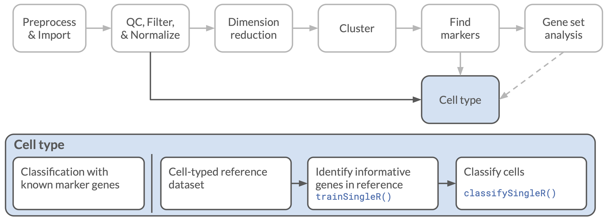

## Objectives

This notebook will demonstrate how to:

- Explore data from antibody-derived tags (CITE-seq)
- Apply simple rule-based classification to identify cell types
- Identify cell types by similarity to reference datasets with `SingleR`
- Apply `SingleR` classification to groups of cells

---

In this notebook, we will attempt to annotate cell types to each of the cells in a dataset, using some of the automated tools that are available within the Bioconductor universe.

Much of the material in this notebook is directly inspired by, and draws heavily on, material presented in the book [_Orchestrating Single Cell Analysis with Bioconductor_](http://bioconductor.org/books/release/OSCA/).

The data we will use for this notebook is derived from a [10x Genomics dataset of human peripheral blood mononuclear cells (PBMCs)](https://software.10xgenomics.com/single-cell-gene-expression/datasets/6.0.0/10k_PBMCs_TotalSeq_B_3p).
These data include both single cell RNA-seq counts and quantification of antibody-derived tags (ADTs) performed by sequencing short DNA barcodes attached to specific antibodies.
This type of ADT sequencing with single cells is commonly known as CITE-seq, after the protocol developed by [Stoeckius _et al._ (2017)](https://doi.org/10.1038/nmeth.4380).
The antibodies used here are the [The TotalSeq™-B Human TBNK Cocktail](https://www.biolegend.com/en-us/products/totalseq-b-human-tbnk-cocktail-19043), a set of antibodies designed to react with immune cell surface markers.



The data here have already been filtered, normalized, and had dimension reductions calculated for the single-cell RNA-seq data.
The ADT data has also been separately filtered and normalized.
For details about how to perform these tasks with data that has been processed with Cell Ranger, you may want to look at the ["Integrating with protein abundance" chapter](http://bioconductor.org/books/3.19/OSCA.advanced/integrating-with-protein-abundance.html#setting-up-the-data) of OSCA.

The processed gene expression and ADT data were saved into a combined `SingleCellExperiment` (SCE) object, and we will start with that object for our exploration here.

## Set up

To start, we will load some of the libraries we will need later, and set a random number seed for reproducibility.

```{r setup}
# Load libraries
library(ggplot2) # plotting functions
library(SingleCellExperiment) # Bioconductor single-cell data class


# Setting the seed for reproducibility
set.seed(12345)
```


### Directories and files

As mentioned, our input file here is a single normalized and processed SCE object, stored as an `rds` file.
That should be all we need to read in!

Our output will be a table of per-cell information, which will include the cell type assignments we have made throughout this notebook.
We aren't planning any significant modifications of the underlying data, so we won't bother re-saving the whole SCE object as a new `.rds` file this time.

```{r filepaths, live=TRUE}
# directory for the input data

# the input file itself

# A directory to store outputs

# Create directory if it doesn't exist

# output table path

```


## Exploring a CITE-seq `SingleCellExperiment`

Now that the preliminary setup is out of the way, we can get started.
First we will read in the `SingleCellExperiment` from the input file we defined earlier.

```{r read SCE, live=TRUE}
# read in the SCE file

# print a summary of the SCE

```

This should look similar to the SCE objects that we have seen before, containing `counts` and `logcounts` assays where each cell is a column and each row is a gene.
We also have some of the `rowData`, `colData` and reduced dimension matrices that we have seen before.

But where are the data from the ADTs?
We wouldn't necessarily want those stored in the main data matrices, as the characteristics of ADT barcode data is going to be quite different from gene expression data.

To keep the ADT data separate from the RNA gene expression data, we have split this data off into an _alternative experiment_ (`altExp`) slot.
You can see the name of this `altExp` on the line `altExpNames` above.
We _could_ have more than one type of alternative experiment (such as spike-in or ATAC-seq), but in this case, just the one.

To access the contents of the `altExp` slot, we can use the `altExp()` function.
Let's look at what we have in that slot:

```{r view altExp, live=TRUE}
# print a summary of the 'ADT' altExp

```

It is another `SingleCellExperiment`!
Inception!
Let's look at that embedded SCE more closely.

The first thing to note is that this `altExp` has the same number of columns as did the main SCE object.
Those corresponded to the individual cells before, and still do!

There are only 10 rows, however, and these correspond to the ADTs that were assayed by this particular experiment.
Just as we did with the full SCE, we can use `rowData()` to view the table containing metadata associated with each of these rows.
We'll add the `altExp()` function to point it to the embedded object we are interested in.
Since there is only one `altExp`, we don't need the second (name) argument (`"ADT"`) that we used above; the default behavior of `altExp()` is to just give us the first `altExp`, and that is the one (and only) that we need.

```{r adt rows, live=TRUE}
# What proteins were assayed?

```

You can see here the names and symbols of the tags used, along with the designation that all have an "Antibody Capture" type (as opposed to "Gene Expression" for the RNA data).
One you might note looks different is the `IgG1` control, which is actually a mouse antibody used as a negative control.


### Clustering redux

While dimension reduction was performed on this data, we have not yet performed any clustering.

Let's assign some clusters to our cells, using graph-based clustering and default parameters, taking as input the PCA matrix that was previously calculated.
Note that this PCA matrix and the UMAP built from it were derived from the gene expression data, so the clustering is going to reflect the gene expression data only.
While we have the ADT data, it is _not_ being used for this stage of the analysis.

```{r cluster cells, live=TRUE}
# perform clustering

  # PCA input

  # graph clustering & parameters

# add clusters to colData

```

Now we can plot the clusters we have identified with `scater::plotUMAP()`.
This is a shortcut for `scater::plotReducedDim(dimred = "UMAP", ...)`, which can save us a lot of typing as we do this repeatedly!

```{r plot clusters}
# plot clusters
scater::plotUMAP(sce, color_by = "nn_cluster") +
  # rename the legend
  guides(color = guide_legend(title = "Cluster"))
```
But what are these clusters, really?
Do they correspond to particular cell types that we are interested in?

Does it bother you that we just used the default nearest-neighbor graph clustering parameters?
Do you know what those were?

## Investigating cell types

### Using ADT data

The first way we will identify cell types of individual cells is to use the ADT normalized counts.
These antibody markers were (hopefully) chosen for their relevance to the sequenced cell population.

The first marker we will look at is `CD3`, which is a protein complex that is found on the surface of T cells.
We can again use the `plotUMAP()` function to color cells by `CD3` ADT levels.

Note that this function can plot data from the `colData` table (as we used it above when plotting clusters), in the main gene expression matrix (as we used it in the previous notebook), *AND* in `altExp` tables and matrices!
So to color by the ADT levels (as normalized in the `logcounts` matrix) we only need to provide the tag name that we want to plot in the `color_by` argument.

```{r plot CD3, live=TRUE}
# plot CD3 expression

```

It appears that we have a number of potential T cells down in the lower left!

Let's look at a couple of other markers to try to break those up more specifically.

Two other markers of relevance to the T cells are `CD4` and `CD8`.
The `CD4` complex is present in helper T cells (hence their other common name, CD4+ T cells).
By contrast, the `CD8` complex is found on killer T cells (CD8+ cells).

Let's plot the ADT results for those two markers as well below:

```{r plot CD4, live=TRUE}
# plot CD4 marker

```

```{r plot CD8, live=TRUE}
# plot CD8 marker

```


### Rule-based classification

Plotting the levels of the ADTs provides a nice visual representation, but what we really want to do is to turn these values into specific cell-type assignments for each cell.
Such classification could be considered as analogous to a cell-sorter assay, where we would set up some rules to look at a few markers for each cell and use those to assign a cell type.
The simplest type of rule might be one where we use a threshold to call a marker as present or absent, and then use the presence of a marker to indicate a specific cell type.

To do this, we will need to make some decisions, such as the thresholds we should use to determine whether a cell is or is not expressing a particular marker.
In general, markers that are useful for this cell-typing approach will have a bimodal distribution of expression levels which can be used to separate the population into two groups of cells.
One group of cells will have only a background level signal for each marker (due to non-specific binding or other factors), while the other group, those that express the protein, will have a much higher level of binding and higher counts.

To assess whether the ADTs we have chosen have a useful distribution of expression values, and to identify thresholds we might use, we would like to plot each ADT tag.
To do this, we will pull out the expression values for these markers from the SCE object and do some data wrangling.

We are interested in the normalized counts for the ADT tags, which are stored in the `logcounts` assay of the `altExp`.
If you recall, this matrix is stored with the columns as cells and rows as markers, but we really want it with each row a cell and each column a marker.
So we will first transpose the data, then convert it to a data frame for our next steps.
Because the SCE object stores the assay data matrices in a specialized format, we have to do one extra step convert it first to a "regular" R matrix or R won't know how to convert it to a data frame.

```{r extract ADT}
# convert logcounts data to a data frame
adt_df <- logcounts(altExp(sce)) |>
  t() |> # transpose
  as.matrix() |> # convert to matrix
  as.data.frame() # convert to data frame

# view the data frame
head(adt_df)
```

If we just wanted to plot one of these tags, we could do so right away, but with a bit more data wrangling, we can convert these results into a "tidier" format, that will allow us to take full advantage of `tidyverse` tools!
In particular, it will let us plot them all at once with `ggplot2` faceting.

Right now the data is in a "wide" format, such that each column is a different tag.
But the data in all of the columns is the same type, and measures something similar: the normalized count of an ADT.
One could even argue that each row contains 10 different observations, where the "tidy" data ideal, as espoused by [Wickham (2014)](https://doi.org/10.18637/jss.v059.i10), requires a single observation per row, a "long" format.
This long format will have one column that tells us which ADT was measured and a second column with the measurement value itself.

We can perform this conversion using the [`tidyr::pivot_longer()`](https://tidyr.tidyverse.org/articles/pivot.html) function,
which allows us to convert our data frame with one column per tag into a data frame with separate columns for the tag id (`ADT`) and the expression value (`logcount`).
Following conversion, we will filter to just the ADTs that we care about.

```{r pivot longer}
adt_df_long <- adt_df |>
  # pivot to long format
  tidyr::pivot_longer(
    everything(), # use all columns
    names_to = "ADT", # convert row names to a column called "ADT"
    values_to = "logcount" # name the value column "logcount"
  ) |>
  # filter to tags we are interested in
  dplyr::filter(ADT %in% c("CD3", "CD4", "CD8"))

# look at the resulting df
head(adt_df_long)
```

Now we can make a density plot with `ggplot2` for all three ADTs we are interested in at once.

```{r plot ADTs, live=TRUE}
# plot logcounts by ADT

```

These look pretty good!
Each of these markers has a bimodal distribution: A lower peak consisting of cells that do not express the protein but which still have a background level of antibody binding, and an upper peak of cells that do express the protein of interest.
The background level does vary by antibody marker, so we will need a different threshold value for each one.

We can now use the values from these plots to construct a set of rules to classify the T cells.
We will do this using the "wide" data frame from earlier.

The thresholds we are using here were identified just "by eye", so this is not a particularly principled method of cell type assignment, but it can be fairly effective.
Here we are assigning only three cell types; cells that do not fit any of these criteria will be set as `NA`.

```{r threshold celltypes}
# add cell type column by thresholding
adt_df <- adt_df |>
  dplyr::mutate(
    celltype = dplyr::case_when(
      CD3 > 6.7 & CD4 > 8 ~ "CD4+ T-cell",
      CD3 > 6.7 & CD8 > 6 ~ "CD8+ T-cell",
      CD3 > 6.7 ~ "T-cell"
    )
  )

adt_df
```

Now we will want to add the cell types we have assigned back to our original SCE object.
We can do that by defining a new column name, `threshold_celltype` that will be added to the `colData` object.
Creating and assigning values to this column can be done with the `$` shortcut, and then we can plot our results with the `plotUMAP()` function as before.

```{r plot thresholds}
sce$threshold_celltype <- adt_df$celltype
scater::plotUMAP(sce,
                 color_by = "threshold_celltype") +
  guides(color = guide_legend(title = "Cell type"))
```

How did we do?

Note that while we applied this technique to assign cell types using the ADT data, we could use the same type of procedure using gene expression data alone, or a combination of gene expression data and tag data.

However, what we did here was very ad-hoc and quite manual!
We didn't calculate any statistics, and we had to look at every tag we were interested in to pick thresholds.
A different dataset might have different background levels, which would require different thresholds.

While this technique might be good for some simple experiments, and can be useful for manual curation, it might not translate well to more complex datasets with multiple samples.
We also looked at each marker separately, which might not be the most efficient or robust method of analysis.

For a more principled approach that allows identification of cell types by looking at the expression of sets of genes that are known to characterize each cell type, you might look at the [`AUCell` package](https://bioconductor.org/packages/release/bioc/html/AUCell.html).
For more on that method, the OSCA section [Assigning cell labels from gene sets](http://bioconductor.org/books/3.19/OSCA.basic/cell-type-annotation.html#assigning-cell-labels-from-gene-sets) is a very good reference.


## Cell type annotation with `SingleR`

An alternative approach to using known marker genes for classification is to instead classify cells by comparing them to a reference expression dataset.
To do this, we will find a well-curated gene expression dataset that contains samples with known cell types.
We can then train a model based on this dataset and look at each of the cells in our new dataset to determine which (if any) of the known cell types has the most similar expression pattern.
The details of how such a model may be constructed and trained will vary by the specific method, but this overall approach is widely applied.

For this section, we will focus on the `SingleR` package and its methods, which are described in detail in [_The SingleR Book_](https://bioconductor.org/books/release/SingleRBook/).

### Reference datasets

Selecting a reference dataset is one of the more critical steps for this enterprise.
At the most basic level, if the reference dataset does not include the types of cells that we expect to see in our sample, it won't be useful.
So we will want a reference dataset that has as many as possible of the cell types that we expect to find in our dataset, at a level of granularity that aligns with our goals.

For `SingleR` that reference data can be from bulk RNA sequencing or from other single-cell experiments.
`SingleR` is also fairly robust to the method used for gene expression quantification, which means that we can use either RNA-seq datasets or microarrays, if those are more readily available.

One convenient source of cell reference data is the `celldex` package, which is what we will use here.
This package includes functions to download a variety of well-annotated reference datasets in a common format.
For more information on the datasets available, you will want to refer to [the `celldex` summary vignette](https://bioconductor.org/packages/release/data/experiment/vignettes/celldex/inst/doc/userguide.html).

We will start by using a reference dataset of sorted immune cells from [GSE107011 (Monaco _et al._ 2019)](https://www.ncbi.nlm.nih.gov/geo/query/acc.cgi?acc=GSE107011).
This particular reference was chosen because it is well-suited to PBMC datasets, with a good level of granularity.

The `celldex` functions also have a convenient option to convert gene symbols to Ensembl ids, which we will use here so that our reference data uses the same gene identifiers as the single-cell data.

```{r get monaco}
# Bioconductor "Hub" packages provide the option to cache
#   downloads, but the interactive prompt can be annoying
#   when working with notebooks.
# These options disable the prompt by giving permission
#   to create the cache automatically
ExperimentHub::setExperimentHubOption("ASK", FALSE)
AnnotationHub::setAnnotationHubOption("ASK", FALSE)

# Get Monaco 2019 data from celldex with Ensembl ids.
monaco_ref <- celldex::MonacoImmuneData(ensembl = TRUE)
```

What is this `monaco_ref` object?

```{r explore ref, live = TRUE}

```

A `SummarizedExperiment` is very similar to a `SingleCellExperiment`, except rather than having one column per cell, each column is a *sample*.
Otherwise, the components are very similar: each row is still a gene, for example, and additional data about the samples are stored in the `colData`.
In fact, the `SingleCellExperiment` object is derived from a `SummarizedExperiment`, with some extra slots that are more relevant to single-cell data.

What information do we have for the samples?

```{r explore reference sample data, live=TRUE}

```

There are three main columns for the sample data:

- `label.main` is a more general cell type assignment.

- `label.fine` is a fine-level cell type with more specific labels.
The exact level of granularity of these `main` and `fine` designations (and indeed the label names themselves) will vary among datasets, so it is important to look at the reference to see whether it is suitable for your application.

- `label.ont` is a standardized [Cell Ontology](https://www.ebi.ac.uk/ols/ontologies/cl) identifier.
Using the cell ontology can allow for more complex representations of the relationships among different cell types, but investigating that is beyond the scope of this workshop.

Another component we would like to explore is how many of each of these cell types we have in the reference dataset.
A bit of quick `dplyr` wrangling can give us the answer.

```{r count cell types}
colData(monaco_ref) |>
  as.data.frame() |>
  dplyr::count(label.main, label.fine)
```

This is pretty good!
Most cell types have 4 replicates, which is more replicates than we often find.

### What does `SingleR` do?

As mentioned earlier, `SingleR` builds a model from a set of training data, and then uses that model to classify cells (or groups of cells) in new datasets.

`SingleR` works by first identifying a set of marker genes that can be used to differentiate among the cell types in the reference dataset.
It does this by performing pairwise comparisons among all of the cell types, and retaining the top set of genes differentiating each pair.
The idea is that this set of genes will be the most informative for differentiating cell types.

Then, for each cell, `SingleR` calculates the Spearman correlation between expression of that cell and each cell type (using the only the genes chosen earlier).
Notably, this is a non-parametric correlation, so the scaling and normalization that we apply (or don't) should not matter!
Note that if you used a single-cell technology that produces full-length transcripts (i.e., SMART-seq), you will probably want to convert your counts to Transcripts per Million (TPM), to allow more consistent ranking among transcripts of different lengths.

The reference cell type with the highest correlation is then chosen as the cell type assignment for that cell.
If there are multiple cell types with high scores, an optional fine-tuning step repeats the process using only the most relevant genes for those cell types.


### Running `SingleR`

For our first run, we will do the marker gene selection (training) and classification in a single step, using the convenience function `SingleR::SingleR()`.
For this we need only supply three main arguments: Our SCE object, a reference matrix (here in `SummarizedExperiment` format), and the labels for each of the samples in the reference that we want to use.
We also need to be sure that our sample and the reference data use the same gene IDs, which is why we requested the Ensembl IDs when getting the reference dataset.

Because this function is doing many repetitive calculations (lots of correlations!), we can speed it up by including the `BPPARAM` argument.
This is a common argument in `Bioconductor` packages where `BP` stands for the `BiocParallel` package, which provides multiprocessing capabilities to many Bioconductor functions.
In this case, we will use the argument `BiocParallel::MulticoreParam(4)` to specify we want to use local multicore processing with 4 "workers".

```{r simple SingleR, live=TRUE}
# calculate SingleR results in one step

```

`SingleR` provides a few nice visualizations for evaluating the statistics it calculated and the assignments it makes.
One is a heatmap of the scores for each cell, arranged by the cell type that was assigned to each.
This is created with the `SingleR::plotScoreHeatmap()` function.

```{r plot SingleR heatmap, live = TRUE}

```
We can also pull out individual components of the results object for plotting in the context of our input SCE object.
Here we will save the pruned labels (where low-quality assignments have been given an `NA` label), storing them back in our SCE object (specifically to a new column of the `colData` table).

```{r save celltypes, live=TRUE}

```

Now we can plot the cell type assignments onto our UMAP to see how they compare to the patterns we saw there before.

```{r plot celltype umap, live=TRUE}

```
Annoyingly, the `NA` and `T cells` labels are quite close in color, and the `scater` and `SingleR` packages don't agree on color choices.
Luckily, since `plotUMAP()` returns a `ggplot` object, we can modify the color palette using `ggplot2` functions.
Still annoyingly, however, when we change the palette, the legend title defaults to the uninformative name `"colour_by"`, so we'll also specify a matching legend title with our new color palette.

```{r plot celltype umap palette}
scater::plotUMAP(sce, color_by = "celltype_main") +
  scale_color_brewer(name = "Cell type", # legend title
                     palette = "Dark2",      # color palette
                     na.value = "gray80")    # use light gray for NA values
```

We seem to have a pretty good set of cell type assignments, with most falling into groupings consistent with what we see in the UMAP plot.

We can thank the fact that this is a PBMC sample and that we have a good reference dataset for these cell types for the cleanliness of this plot.
Quite often with other kinds of samples (especially cancer cells!) things will be much less clean!

We can also look to see how the cell type assignments are distributed using the base R function `table()`.
Since we like to keep track of the cells that ended up as `NA` in the pruned labels, we will include the `useNA = "ifany"` argument.

```{r cell type table}
table(singler_result$pruned.labels, useNA = "ifany")
```

### Exploring finer labels

In the previous cell typing, we used the `label.main` column, but we also had `label.fine`, so let's use that to explore the dataset in a bit more detail.

We will also take this time to dive a bit deeper into the steps that `SingleR` performed.
As mentioned, the first step is training the model, during which we identify the genes that will be used for the correlation analysis later.
While this step is not particularly slow, if we were classifying multiple samples, we would not want to have to repeat it for every sample.

To do the training, we will use the `trainSingleR()` function.
For this we will start with our reference and the labels we want to train the model with.

We can then specify the method used to select the genes that will be used for classification.
The default method is `"de"`, which performs a differential expression analysis for each pair of labels, but we could also use `"sd"` to select the genes which are most variable across labels, or `"all"` to use all genes.
If we want to get really fancy, we could even provide a specific list of genes to use.

We should note here that the reference dataset for `SingleR` does not need to be from a compendium like `celldex`!
If you have any well-classified dataset that you want to use as a reference, you can, as long as you can create a gene by sample expression matrix and a vector of cell types for each sample.
You will want to ensure that the cell types you expect to see in your sample are present in the reference dataset, and data should be normalized, but otherwise the method can be quite flexible.
You can even use a previously-annotated `SingleCellExperiment` as a reference for a new dataset.
For more details about custom references, see the [OSCA chapter on cell type annotation](http://bioconductor.org/books/3.19/OSCA.basic/cell-type-annotation.html#using-custom-references)

We do want to be sure that the genes selected for the model will be among those present in our SCE object, so we will use the `restrict` argument with a vector of the genes in our SCE.
This step would happen automatically with the `SingleR::SingleR()` function, but we need to add it manually for this use case.


```{r train finemodel, live=TRUE}
# build fine model

  # use DE to select genes (default)

  # only use genes in the sce object

  # parallel processing

```

Now we can perform the classification step, using our SCE object and the `SingleR` model that we just created.

```{r classify fine, live=TRUE}
# classify with fine model

  # perform fine tuning (default)

  # parallel processing

```


What labels were assigned, and how many of each?

```{r table fine labels}
table(singler_result_fine$pruned.labels, useNA = "ifany")
```

```{r plot umap fine, live=TRUE}
# add fine labels to SCE

# plot UMAP with fine labels

```

That's a pretty messy plot.
Mostly that is because there are _lots_ of cell types here, and not enough colors to represent them all.
The `NA` cells also got taken off completely, which is not ideal.

One thing we can do is to use some functions from the `tidyverse` package [`forcats`](https://forcats.tidyverse.org), which can be very handy for dealing with categorical variables like these cell types.

We will use two of these functions in the chunk below:
First we will use `fct_collapse` to take some of the finer labels that we might not be as interested in and collapse them into logical groupings (in this case, the `main` label that they were part of).
After that, we will use `fct_relevel` to put the remaining factor levels in the order we would like them to appear for plotting.

```{r collapse labels}
collapsed_labels <- singler_result_fine$pruned.labels |>
  forcats::fct_collapse(
    "Monocytes" = c(
        "Classical monocytes",
        "Intermediate monocytes",
        "Non classical monocytes"),
    "Dendritic cells" = c(
        "Myeloid dendritic cells",
        "Plasmacytoid dendritic cells"),
    "T cells" = c(
        "MAIT cells",
        "Non-Vd2 gd T cells",
        "Vd2 gd T cells"),
    "Helper T cells" = c(
        "Th1 cells",
        "Th1/Th17 cells",
        "Th17 cells",
        "Th2 cells",
        "Follicular helper T cells"),
    "B cells" = c(
        "Naive B cells",
        "Switched memory B cells",
        "Non-switched memory B cells",
        "Exhausted B cells",
        "Plasmablasts"
    )
  ) |>
  # order for plotting
  forcats::fct_relevel(
    "Helper T cells",
    "T regulatory cells",
    "Naive CD4 T cells",
    "Terminal effector CD4 T cells",
    "Naive CD8 T cells",
    "Central memory CD8 T cells",
    "Effector memory CD8 T cells",
    "Terminal effector CD8 T cells",
    "T cells",
    "Natural killer cells",
    "B cells",
    "Monocytes",
    "Dendritic cells",
    "Progenitor cells",
    "Low-density basophils"
  )
```

Now that we have that set up, we can plot using our collapsed and ordered cell type labels.

```{r plot collapsed, live=TRUE}

```


### Heatmap of cell types & clusters

Let's look at how the cell type assignments we obtained using `SingleR` compare to the clusters that we found using the unsupervised clustering at the start of this notebook.

To do this, we will again use the `table()` function, but now with two vectors as input, to build a contingency table of the cell types and clusters that each cell was classified with.

```{r type cluster table}
# create a table of clusters & cell type counts
type_cluster_tab <- table(sce$celltype_fine, sce$nn_cluster, useNA = "ifany")

# look at the top corner of the results
type_cluster_tab[1:5, 1:5]
```

As you can see, this produced a table with rows for each cell type and columns for each cluster number.
The values are the count of cells for each cluster/cell type combination.
However, these raw counts are not quite what we'll want for visualization.
Since the total number of cells differs across clusters, we'd like to convert these counts into the _proportions_ of each cell type in each cluster.

We'll do this by going through the table column by column and dividing each value by the sum for that cluster.
This will give us normalized values where the values in each column now sum to 1.
To do that, we will use the `apply` function, which allows us to operate on a matrix row by row or column by column, applying a function to each "slice".
Since the function we want to apply is very short, we will use R's new (as of  version 4.1) anonymous function shorthand:
`\(x) ...` can be used to define a function that that takes as input values `x` (where the `...` is where you would put the expression to calculate).
Here we will apply the expression `x/sum(x)`, which will divide each element of a vector `x` by the sum of its values.

```{r normalize by column}
# normalize by the number of cells in each cluster (columns)
type_cluster_tab <- apply(
  type_cluster_tab,
  2, # apply function to columns
  \(x) x/sum(x) # function to apply
)
# print the normalized values
type_cluster_tab[1:5, 1:5]
```

Now we can plot these results as a heatmap, using the `pheatmap` package.
There is a lot of customization we could do here, but `pheatmap` (pretty heatmap) has good defaults, so we won't spend too much time on it for now.

```{r cluster heatmap, live=TRUE}
# plot with pheatmap

```

We can see that most of our clusters are indeed defined by a single cell type, though there are some clusters (e.g., 1 & 9) that have a number of (related) cell types within them.
There are also some places where single cell types are spread across a few different clusters (Classical monocytes, for example).

### Classifying by clusters

While most of the time we will want to classify single cells, sometimes the sparseness of the data may mean that individual cells do not provide reliable estimates of cell types.

An alternative approach is to classify the clusters as a whole, assuming that the clusters we have identified represent a single cell state.
If that is the case, then we should be able to combine the data for all cells across each cluster, then apply our cell typing method to this group of cells.
This is similar to an approach we will return to later in the context of differential expression.

The first step here is to create a new matrix where we sum the counts across cells that are from the same type according to our clustering.
Because `SingleR` is a non-parametric approach, we can perform this step with the raw counts matrix.
There are a few different ways to do this, but we will use the function `DelayedArray::colsum()`, which can work directly on the sparse matrices that are often found in SCE objects.
We will provide it with the matrix we need, and then a vector of the cluster assignments for each column of the matrix.
The function will then sum expression values for each gene across all of the columns that have that value.

```{r sum clusters}
# sum count matrix by cluster
cluster_mat <- DelayedArray::colsum(counts(sce), sce$nn_cluster)
# print new dimensions
dim(cluster_mat)
```

You can see that the resulting matrix still has the same number of rows we have seen before, but now only has as many columns as the number of clusters that the cells were assigned to.

Now we can apply the same `SingleR` model to these results, using the new matrix as input along with the previously trained model.
As there are only 20 clusters to classify, this will be very quick, and we don't need to parallelize it!

```{r singler cluster, live=TRUE}
# run SingleR classification with previously trained model

# view results

```

The result is a fairly small table of results, but we are most interested in the labels, which we would like to associate with each cell in our SCE object for visualization.
Since the cluster labels are the row names of that table, we can perform a cute little trick to assign labels back to each cell based on the name of the cluster that it was assigned to.
(In this case the cluster names are all numbers, but that might not always be the case.)
We'll select values repeatedly from the `singler_cluster` table, using the cluster assignment to pick a row, and then always picking the `pruned.labels` column.

```{r assign cell labels}
sce$celltype_cluster <- singler_cluster[sce$nn_cluster, "pruned.labels"]
```

Now we can plot these cluster-based cell type assignments using the now familiar `plotUMAP()` function.

```{r plot cluster celltypes, live=TRUE}

```

This sure looks nice and clean, but what have we really done here?
We are _assuming_ that each cluster has only a single cell type, which is a pretty bold assumption, as we really aren't sure that the clusters we created were correct.
You may recall that clustering algorithms are quite sensitive to parameter choice, so a different parameter choice could quite likely give a different result.

### MetaCell approaches

As a middle ground between the potentially messy single-cell cell type assignment and the almost-certainly overconfident cluster-based assignment above, we can take approach inspired by [Baran _et al._ (2019)](https://doi.org/10.1186/s13059-019-1812-2) using something they called _metacells_.
The idea is that we can perform fine-scaled clustering to identify groups of very similar cells, then sum the counts within those clusters as "metacells" to use for further analysis.
The original paper includes a number of optimizations to make sure that the metacell clusters have desirable properties for downstream analysis.
We won't go into that depth here, but we can apply similar ideas.

To begin, we will perform some fine-scale clustering, using a simpler clustering algorithm: K-means clustering.
We will use the same `bluster` package, clustering based on the PCA results we have from earlier, but this algorithm allows us to specify the number of clusters we want to end up with.
We have about 8000 cells, so let's cluster those into groups of approximately 80 cells, which works out to 100 clusters.
While this is almost certainly more clusters than are "real" in this dataset, our goal here is not to find differences among clusters, just to get homogeneous groups of cells.

```{r kmeans cluster}
# perform k-means clustering
kclusters <- bluster::clusterRows(
  reducedDim(sce, "PCA"),
  bluster::KmeansParam(
    centers = 100, # the number of clusters
    iter.max = 100 # more iterations to be sure of convergence
  )
)
```

Now we can apply exactly the same approach we did when we had the 20 clusters we had identified with the earlier graph-based clustering.

```{r metacell singler}
# create a "metacell" matrix by summing fine-scale clusters
metacell_mat <- DelayedArray::colsum(counts(sce), kclusters)

# apply SingleR model to metacell matrix
metacell_singler <- SingleR::classifySingleR(
  metacell_mat,
  singler_finemodel
)

# apply metacell cell type assignments to individual cells
sce$celltype_metacell <- metacell_singler[kclusters, "pruned.labels"]
```

Now we can plot the results as we have done before.

```{r metacell umap}
scater::plotUMAP(sce, color_by = "celltype_metacell")
```

What do you think of this plot?
Is this more or less useful than the original cell-based clustering?


## Save results

To save disk space (and time), we won't write out the whole SCE object, as we haven't changed any of the core data there.
Instead we will just write out the cell information table (`colData`) as a TSV file.

```{r save cell info, live=TRUE}

```


## Print session info

```{r session info}
sessionInfo()
```

