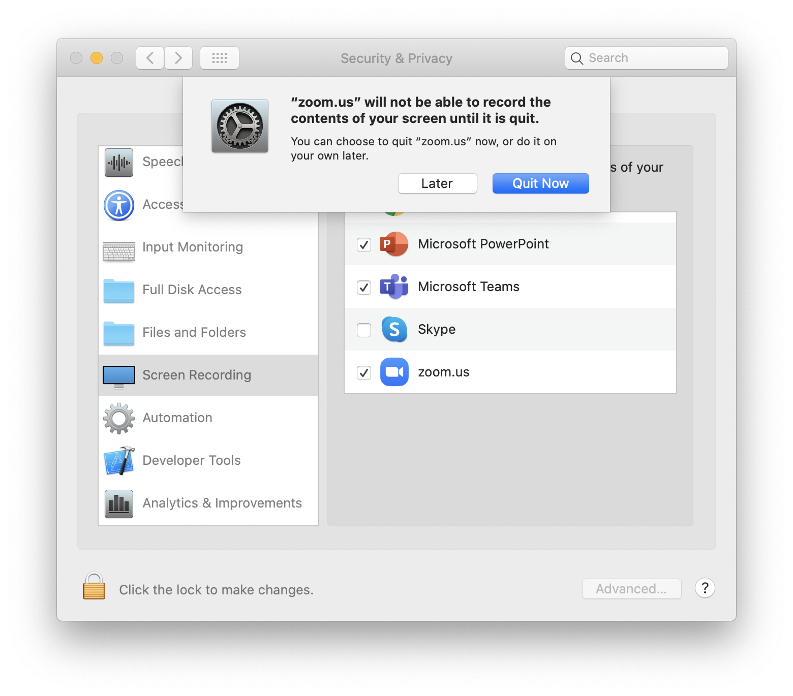

# Mac Setup Instructions for Virtual Workshops

## Table of Contents

  - [Zoom](#zoom)
    - [New Zoom Installation](#new-zoom-installation)
    - [Set Up Preferences](#set-up-preferences)
    - [Screen sharing permissions](#screen-sharing-permissions)
  - [Slack](#slack)
    - [New Slack Installation](#new-slack-installation)
    - [Logging in to the Cancer Data Science workspace](#logging-in-to-the-cancer-data-science-workspace)

## Zoom

### New Zoom Installation
If you do not have Zoom installed yet, you will need to download the client.
To do so, go to https://zoom.us/download and click the button to download the latest version of **Zoom Client for Meetings**

The `Zoom.pkg` installer package will most likely be saved to your Downloads folder.
Open the installer and follow the directions to install Zoom.
You will likely need to enter your (or an administrator) password to allow the installation to proceed.

When the installation is completed, Zoom should automatically open, and you will see the application splash screen.
You do *not* need to login or create a Zoom user.

If you are on Mac OS 10.15 (Catalina), you may also be asked to give Zoom permission to access your downloads folder.
Annoyingly, this window may be blocked by the splash screen, but if you see it flash by, you will want to find it and click **OK**.

### Set Up Preferences

Open the Zoom Preferences window from the **zoom.us** menu.

You may be asked right away to grant Zoom permission to use your microphone, which you should grant (click **OK**).
Again, this window may get hidden behind the Zoom application, so be on the lookout for it.

If it is not selected already, click on the **Audio** panel in the left sidebar.
If you have granted permission for Zoom to use the microphone, you should now see green and/or red bars in the *Input Level* section as you talk.
If you want to further test your microphone and speaker settings, you can click the *Test Speaker* and *Test Mic* buttons.

We recommend that you select the checkbox to "Join audio by computer when joining a meeting" to save you the future annoyance of having to do this every time you join a meeting.

Select **Video** from sidebar to make sure your camera is set up; you will likely have to grant permissions once again.
(Have you noticed a recurring theme?)

### Screen sharing permissions

MacOS has gotten stricter and stricter about security, so you will have to grant a few more permissions from the **System Preferences** application to allow for screen sharing to work.
Open **System Preferences** from the Apple menu or the Dock, and choose **Security & Privacy**, then click on the **Privacy** button at the top.
Click on the lock icon in the lower left and enter your administrator password to allow changes.

In the lect sidebar, select **Accessibility**, and make sure the checkbox next to **zoom.us** in the "Allow the aps below to control your computer" list is selected, as shown.

If the Zoom Application does not appear in the list, click the "**+**" button  below the list and open the application from the dialog box that appears (it should be in your *Applications* folder).

There is one more place where permissions will need to be given to Zoom to allow screen sharing, and that is the **Screen Recording** section of the same preferences pane.  

You will probably have to wait for your first Zoom meeting to enable those permissions, as Zoom may not yet appear in that list, and there is no way to add it on your own.
Our setup meetings are a great place to test this out.
The first time you try to share your screen from Zoom, you will see a popup like the one below.
Click **OK**

You will then get a prompt that the Zoom app needs to be quit before this setting can be applied.
Select **Quit Now**.

Once Zoom has quit, you can click a meeting link to reopen it, rejoining the same meeting you were in, or any other meeting.

You should now be all set to share your screen and fully participate in Zoom meetings and help sessions!
For more information about how we will be using Zoom, please read about our [Zoom Procedures](https://github.com/AlexsLemonade/training-modules/blob/master/virtual-setup/zoom-procedures.md)

### Slack

#### New Slack Installation

If you do not already have Slack, you can download it at https://slack.com/downloads/mac.
You have the option to directly download the app from the Slack website there, or install it via the Mac App Store.
If you download it directly, you will need to open the `.dmg` file and drag the Slack app to your Applications folder, as depicted in the window that appears.

Open Slack from your Applications folder.
If you downloaded directly, there may be a warning about opening a file that was downloaded from the internet, so give the required permission.
You may be prompted to login, but ignore that for the moment.

#### Logging in to the Cancer Data Science workspace

Open http://ccdatalab.org/slack in your browser.
If you have not created an account, follow the prompts to do so.
You will be required to verify your email address first.
Follow the link in the email to set up your account.
Please use your full name in your profile, and don't forget to set a unique password!

After you login, you will see the Slack interface in the browser, but you probably want to open the app for ease of use and the complete feature set.
In the upper left of the window, click on the words **Cancer Data Science** to open the menu, then select "Open the Slack App"

The Slack app you installed should open to the Cancer Data Science Community workspace and you should be all set.
After you have been added to the training-specific channel, say "Hi" and introduce yourself to everyone!

If you are new to Slack, you can get familiar with the interface and features by having a conversation with Slackbot (Slack's resident chatbot) or with yourself.
You can find Slackbot (and yourself) in the left panel, under "Direct Messages".

One more thing: if you end up using the voice or video calling functionality that Slack provides, you may be asked to grant the app permission to use your microphone and videocamera, as you did with Zoom.

For more information about how we will be using Slack, please read about our [Slack Procedures](https://github.com/AlexsLemonade/training-modules/blob/master/virtual-setup/slack-procedures.md)
