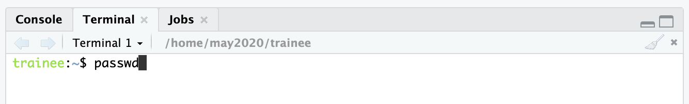
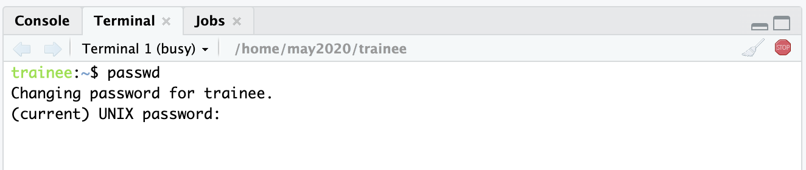
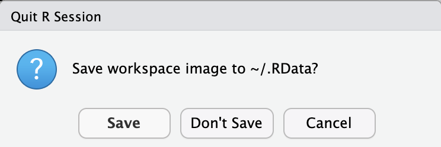
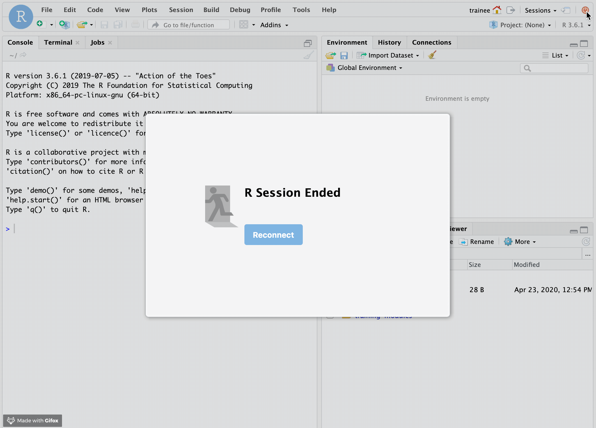
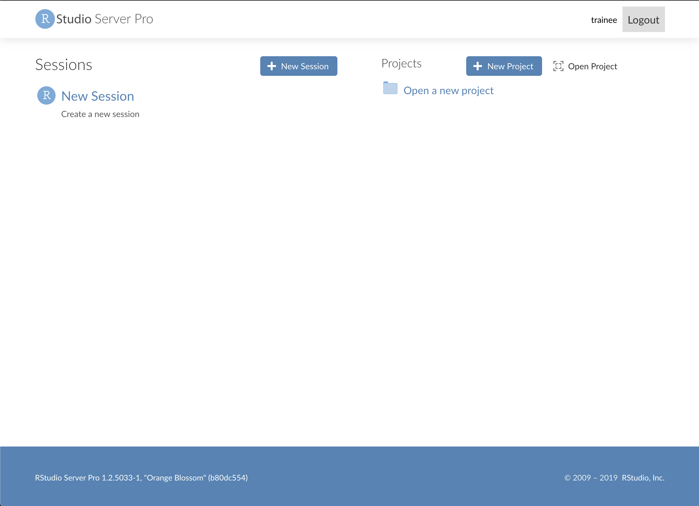
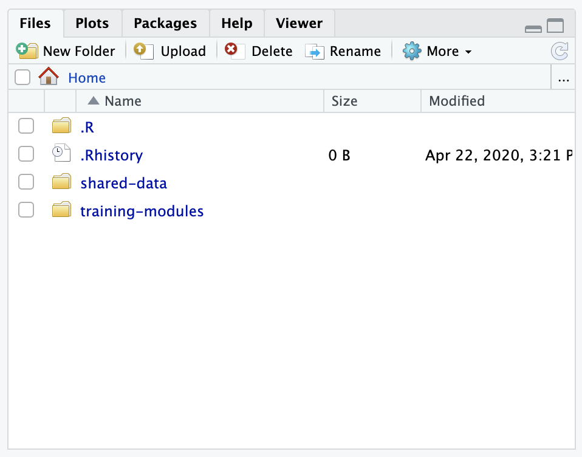
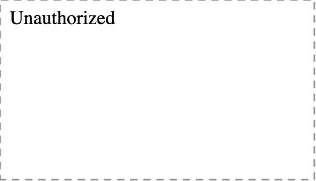
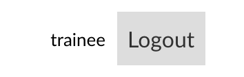

## RStudio Server Set Up

For this training, we've set up a server that hosts RStudio and allows you to run computations more quickly with our machines.

In this tutorial, we will get you set up with our server.
In our [RStudio guide](../intro-to-R-tidyverse/00a-rstudio_guide.md) and our [`intro-to-R-tidyverse` module](../intro-to-R-tidyverse) we will work on becoming more comfortable with R and RStudio for programing.
RStudio by itself is an [integrated development environment](https://en.wikipedia.org/wiki/Integrated_development_environment) or IDE that makes it easier to program in R.

### Logging in

To give you access to our RStudio server, we will send you a username and temporary password by direct message in Slack, after you are logged in on [Cancer Data Science](http://ccdatalab.org/slack).

Go to https://rstudio.ccdatalab.org and type in your username and temporary password, and click `Sign in`.
You may want to bookmark https://rstudio.ccdatalab.org for the duration of the workshop.

 
 

Signing in should bring you to the RStudio session page.
Click on the `Terminal` tab.

 
 

Type in the `passwd` command in the `Terminal` tab.

 
 

Press `Enter`. Then type in the password you were given in Slack.
Keep in mind, as you are typing in your password, it will remain blank, but it is receiving what you are typing.

 
 

Type in the new password you've chosen once, and press `Enter`, then it will ask you to confirm by typing it in again.
Again, no text or dots will show as you are typing your new password.
Also press `Enter`.
If you forget your password at anytime, Slack on of the CCDL team members to assist you.

### RStudio Server workspaces page

While in a session, in the upper right corner, you should see these buttons:

Clicking on the house button will bring you to the workspaces page.
On the workspaces page, you will be able to see and manage all your currently running sessions.

Click on any session to return to it.
Or, you can start a new session with the `+ Session` button.
We kindly ask you shut down any sessions you aren't using so we conserve computing power.
You can do this by clicking the `Quit` button next to any session list.

## Stopping/Starting RStudio sessions

Click on a session in the list to return to it.
If you have no sessions running, use the `+ Sessions` button.

You can stop your current R session with the orange circular on/off button in the upper right corner:

 
 

RStudio may ask you if you would like to save your current workspace?
What it means is that the objects in your current environment will be saved to a file and reloaded on your next session (more on the R environment in the upcoming guides).
In general, we advise saying no to this so you can start fresh in your next session.

 
 

Stopping your R Session with the orange button will briefly show you this screen:

 
 

Then re-route you to the workspaces page, where you will see the session you were using, is no longer listed.

 
 

You will want to do this each time you switch to notebooks.

## Files on the server

Back on the session page, you are able to see the current files in your `home` directory in the `Files` tab in the lower right panel in your session.

 
 

In your `home` directory, you will find the `training-modules` folder that contains our course materials and the `shared-data` that contains the data we will be using in the modules.
The files in these folders are accessible in each R session you start.
Starting and stopping R sessions will refresh what is in your `Environment` tab in the upper right panel.
We go into more detail on the R environment and other RStudio navigating tidbits in our [guide to RStudio](../intro-to-R-tidyverse/00a-rstudio_guide.md) as well as our [first intro to R notebook](../intro-to-R-tidyverse/01-intro_to_base_R.Rmd).

As always, please reach out to our CCDL team through Slack if you have any questions!

## A troubleshooting note:

A not uncommon problem, upon trying to re-login to RStudio Server, is to see this screen:

 
 

What will *usually* remedy this, is quitting your internet browsing application completely and restarting it.

To avoid this problem to begin with, it helps to logout of RStudio Server before leaving for the day.
You can logout by going to the workspaces page (click on the house button) and clicking the `logout` button next to your username in the upper right corner.

 
 

If this problem persists, please contact one of our CCDL staff for assistance.
