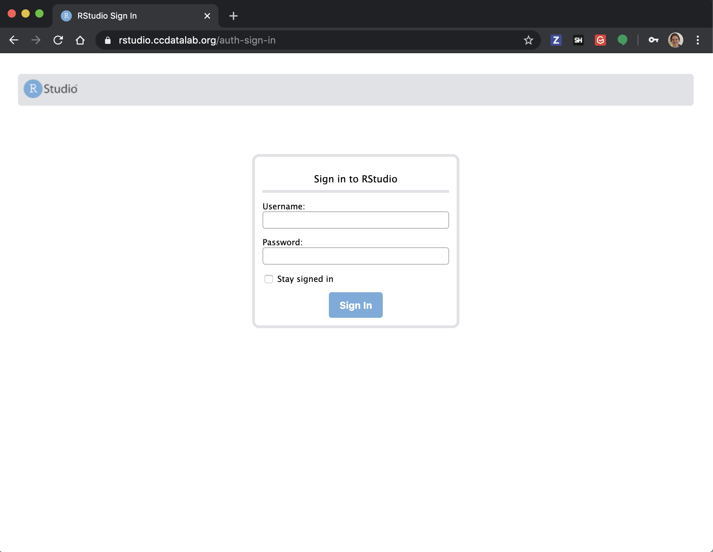
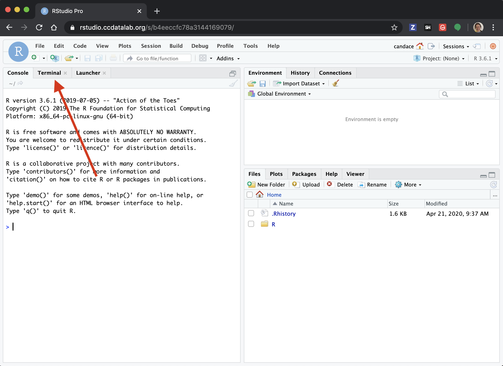
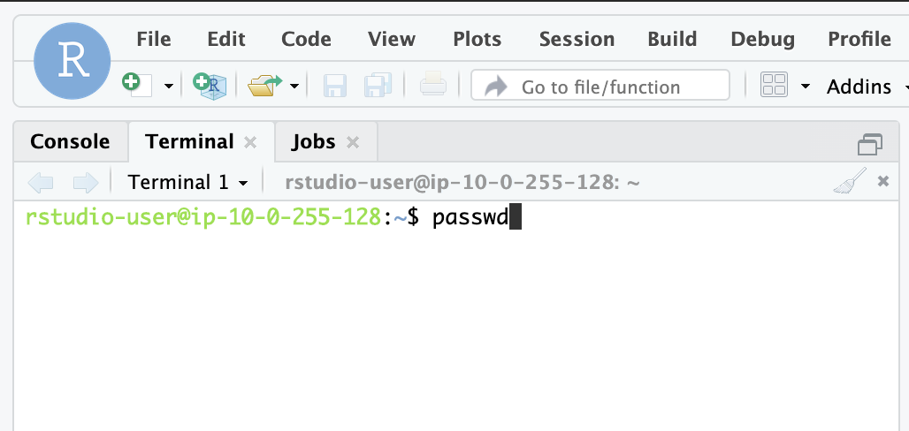
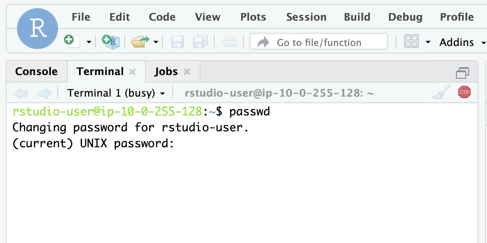
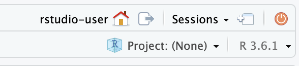
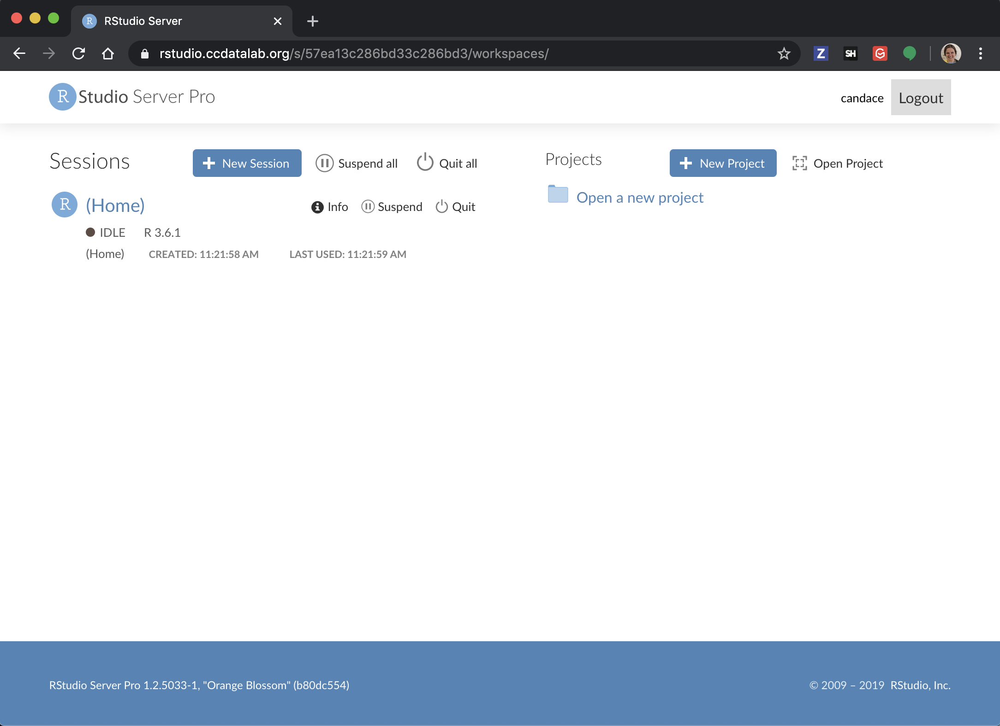

## RStudio Server Set Up

We will send you your Username and temporary password by <HOW WE ARE SENDING THEM THIS>.
Go to https://rstudio.ccdatalab.org (You may want to bookmark this) and type in your username and temporary password, and click `Sign in`.

Signing in should bring you to the RStudio session page.
Click on the `Terminal` tab.

Type in the `passwd` command in the `Terminal` tab.

...and press `Enter`.

Type in your new password once, and press `Enter`, then it will ask you to confirm by typing it in again.
Also press `Enter`.

## Navigating the RStudio Server

In the upper left corner of the session page, you should see these buttons:

You can restart your R session with the orange, circular, on/off button.
You will want to do this each time you switch to notebooks.

For more help on navigating the session page, see these
[RStudio guide instructions](../intro-to-R-tidyverse/00a-rstudio_guide.md)

### Navigating Rstudio Server sessions

Clicking on the house button will bring you to the RStudio server workspaces page.

* How do we handle dependencies – my intention here is to give a bit of context for how messy things _could be_

* Introduction to your home folder – this should be general enough to apply to multiple workshops and workshop configurations (e.g., which modules are combined into a workshop)

* Working with your own data (TBD)
