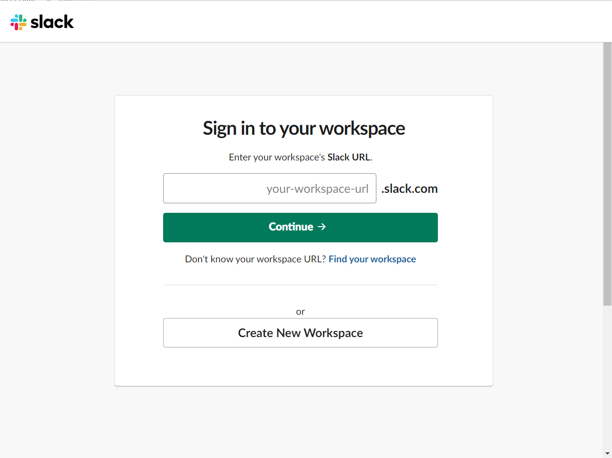

# Windows set up instructions for virtual workshops

<!-- START doctoc generated TOC please keep comment here to allow auto update -->
<!-- DON'T EDIT THIS SECTION, INSTEAD RE-RUN doctoc TO UPDATE -->
**Table of Contents**  *generated with [DocToc](https://github.com/thlorenz/doctoc)*

- [Windows set up instructions for virtual workshops](#windows-set-up-instructions-for-virtual-workshops)
  - [Zoom Installation and Setup](#zoom-installation-and-setup)
    - [New Installation](#new-installation)
    - [Set Up Preferences](#set-up-preferences)
  - [Slack](#slack)

<!-- END doctoc generated TOC please keep comment here to allow auto update -->

## Zoom Installation and Setup

### New Installation

If you do not have Zoom installed yet, you will need to download the client.
To do so, go to https://zoom.us/download and click the button to download the latest version of **Zoom Client for Meetings**

The `Zoominstaller.exe` installer package will most likely be saved to your `Downloads` folder or you can click on it in the lower left corner.
Click `Run` when asked what you would like to do with `Zoominstaller.exe`

Windows will ask you if you would like to allow Zoom to make changes to your device. Click `Yes`.

When the installation is completed, Zoom should automatically open.
Click `Join with Video` if asked.

Login or create a new Zoom account.

### Set Up Preferences

Click on the gear in the corner of the main Zoom page menu.

If it is not selected already, click on the **Audio** panel in the left sidebar.

If you have granted permission for Zoom to use the microphone, you should now see green and/or red bars in the *Input Level* section as you talk.
If you want to further test your microphone and speaker settings, you can click the *Test Speaker* and *Test Mic* buttons.

We recommend that you select the checkbox to "Automatically join audio by computer when joining a meeting." to save you the future annoyance of having to do this every time you join a meeting.

## Slack

Download 64-bit Slack application from:
https://slack.com/downloads/instructions/windows

Click on the `SlackSetUp.exe` file this downloads when it pops up in the lower left corner.
Or find it most likely in the `Downloads` folder and click on it there.

Sign in with your Slack account if you have one, or create a new account.

Join Cancer Data Science Slack by using [this link](https://ccdatalab.org/slack)

Or if you already have a Slack account, when prompted, you can type in `cancer-data-science.slack.com` as your workspace URL.

When you sign in for the first time, Windows may ask `Did you mean to switch apps?`; say `Yes`.

When you create your Slack name, please use your first and last name so we know who you are. 
