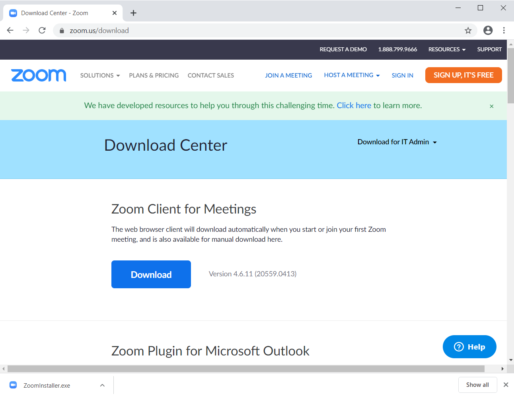
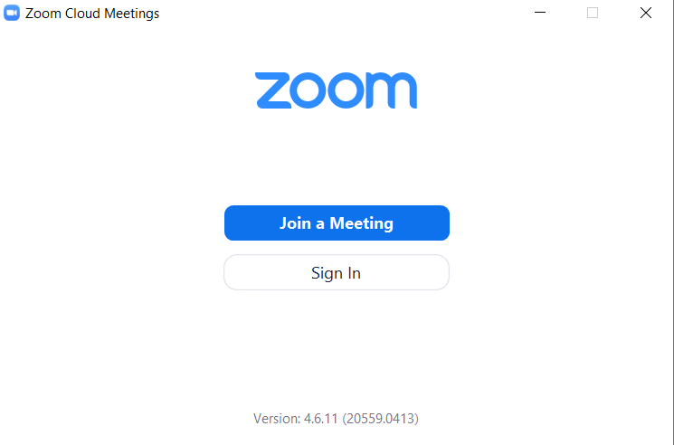
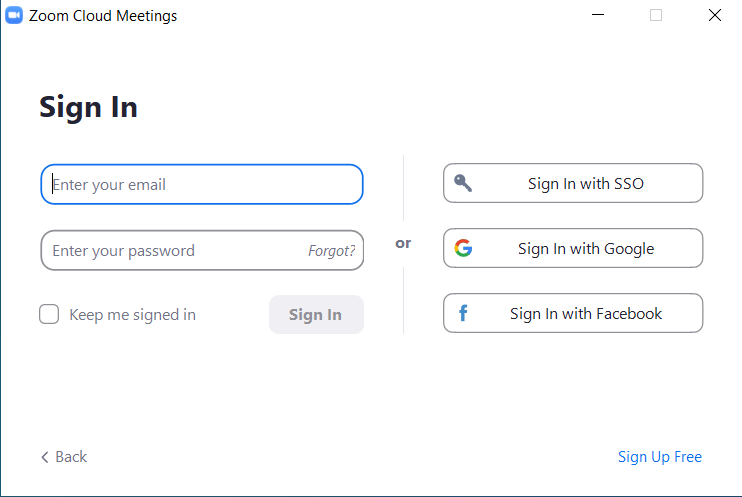
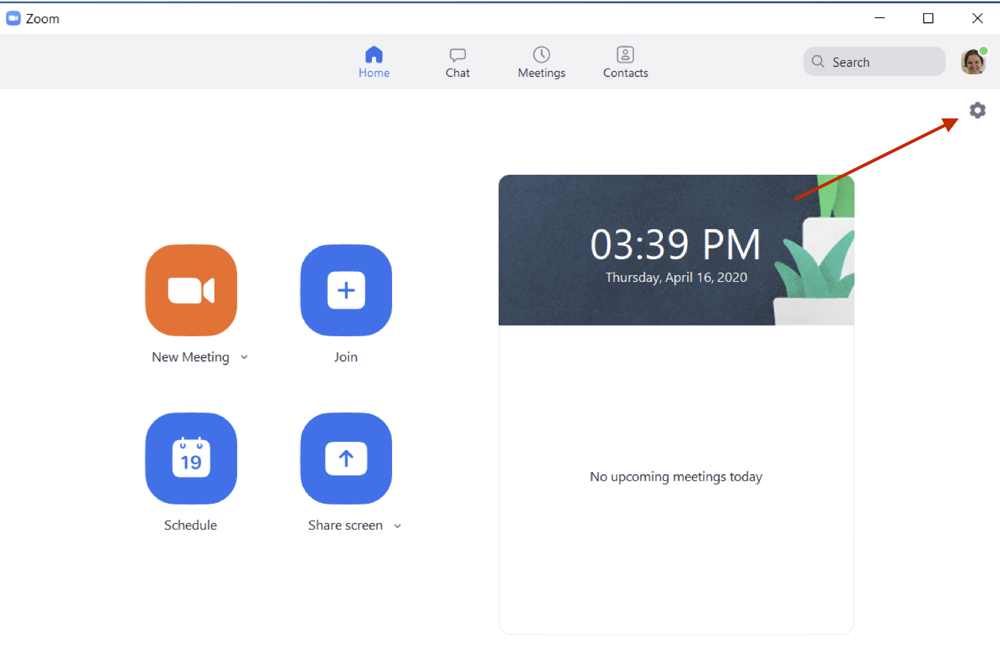
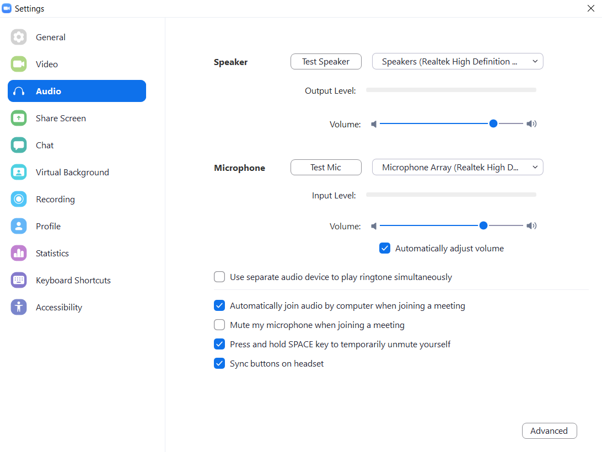
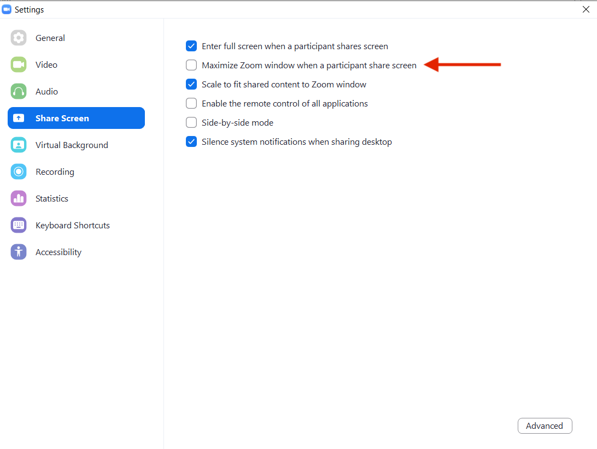
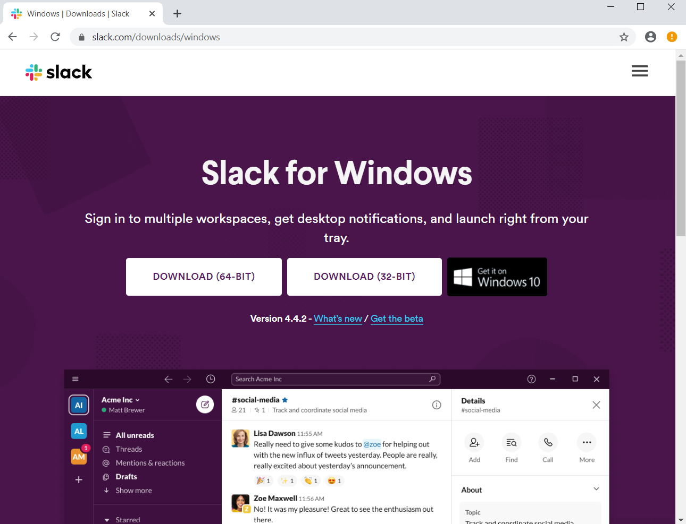
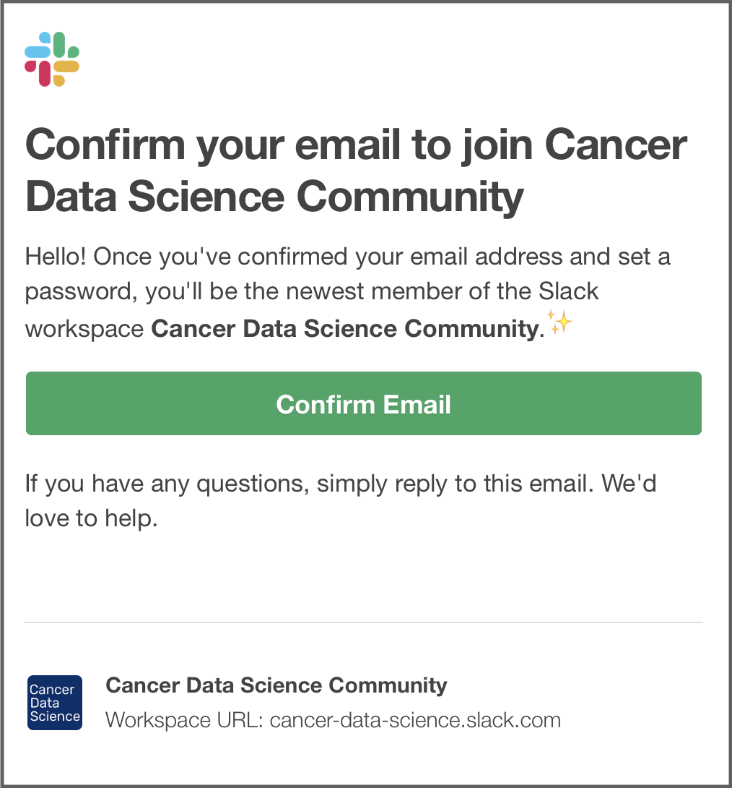
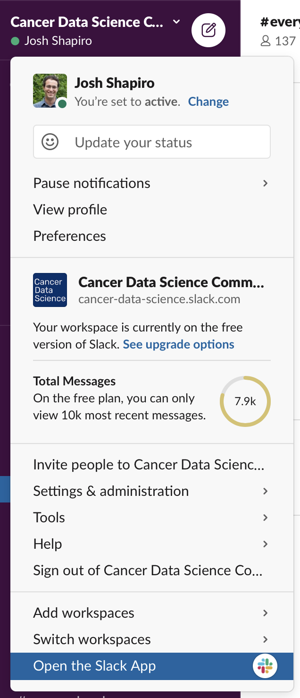
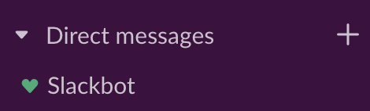

# Windows set up instructions for virtual workshops

<!-- START doctoc generated TOC please keep comment here to allow auto update -->
<!-- DON'T EDIT THIS SECTION, INSTEAD RE-RUN doctoc TO UPDATE -->
**Table of Contents**  *generated with [DocToc](https://github.com/thlorenz/doctoc)*

- [Windows set up instructions for virtual workshops](#windows-set-up-instructions-for-virtual-workshops)
  - [Zoom Installation and Setup](#zoom-installation-and-setup)
    - [New Installation](#new-installation)
    - [Set Up Preferences](#set-up-preferences)
  - [Slack](#slack)

<!-- END doctoc generated TOC please keep comment here to allow auto update -->

## Zoom

If you do not have Zoom installed yet, you will need to download the client.
To do so, go to https://zoom.us/download and click the button to download the latest version of **Zoom Client for Meetings**

The `Zoominstaller.exe` installer package will most likely be saved to your `Downloads` folder or you can click on it in the lower left corner.
Click `Run` when asked what you would like to do with `Zoominstaller.exe`

Windows will ask you if you would like to allow Zoom to make changes to your device. Click `Yes`.

When the installation is completed, Zoom should automatically open.
Click `Join with Video` if asked.

Login or create a new Zoom account.

### Set Up Preferences

Click on the gear in the corner of the main Zoom page menu.

If it is not selected already, click on the **Audio** panel in the left sidebar.

While in settings, go to **Share Screen** in the left sidebar and **uncheck** `Maximize Zoom window when a participant share screen`.

If you have granted permission for Zoom to use the microphone, you should now see green and/or red bars in the *Input Level* section as you talk.
If you want to further test your microphone and speaker settings, you can click the *Test Speaker* and *Test Mic* buttons.

We recommend that you select the checkbox to "Automatically join audio by computer when joining a meeting." to save you the future annoyance of having to do this every time you join a meeting.

## Slack

Download the 64-bit Slack application from:
https://slack.com/downloads/instructions/windows

Click on the `SlackSetUp.exe` file this downloads when it pops up in the lower left corner.
Or find it most likely in the `Downloads` folder and click on it there.

Join Cancer Data Science Slack by using [this link](https://ccdatalab.org/slack)

Please use your full name in your profile, and don't forget to set a unique password!

After you login, you will see the Slack interface in the browser, but you probably want to open the app for ease of use and the complete feature set.
In the upper left of the window, click on the words **Cancer Data Science** to open the menu, then select "Open the Slack App".
Windows may ask `Did you mean to switch apps?`; say `Yes`.

The Slack app you installed should open to the Cancer Data Science Community workspace and you should be all set.
After you have been added to the training-specific channel, say "Hi" and introduce yourself to everyone!

If you are new to Slack, you can get familiar with the interface and features by having a conversation with Slackbot (Slack's resident chatbot) or with yourself.
You can find Slackbot (and yourself) in the left panel, under "Direct Messages".

For more information about how we will be using Slack, please read about our [Slack Procedures](https://github.com/AlexsLemonade/training-modules/blob/master/virtual-setup/slack-procedures.md)
